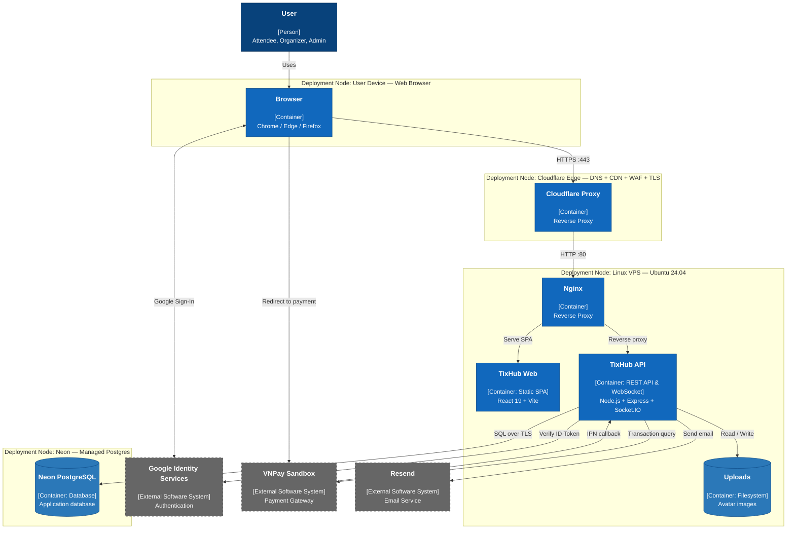

# C4 Deployment Diagram - TixHub

**Version:** 1.0  
**C4 level:** Deployment (complements the System Context and Container views)  
**Status:** As-built, verified against repository source code and configuration on 2026-08-07  
**Scope:** TixHub production environment at `tixhub.fit` and `api.tixhub.fit`

> This document describes the **deployment configuration present in the repository**, rather than a
> proposed hosting design. The operational deployment instructions are in
> [deploy README](../deploy/README.md), and the architectural decision is in
> [ADR 0003](../adr/0003-deployment-topology.md).

## 1. Purpose and scope

The deployment diagram answers where each component runs, which nodes handle each connection, where
data resides, and which external services are involved at runtime. It does not replace the database
schema or the internal module design.

The diagram applies the following C4 notation:

| Notation | Meaning in the diagram |
| --- | --- |
| `Person` | An Attendee, Organizer, or Admin using TixHub through a browser. |
| `Deployment Node` | A user device, Cloudflare, the Linux VPS, or Neon. |
| `Container Instance` | A deployed runtime unit: the React SPA, Nginx, or the Node.js API. |
| `External System` | A system called by TixHub but not owned by it: Google, VNPay, or Resend. |

### Exceptions and important notes

- The diagram reflects **one VPS**. The repository contains no Docker, Kubernetes, Redis, internal
  load balancer, or worker queue.
- The repository's AI integration is selected through the shared `AIProvider` abstraction. The
  configured provider is not represented as a fixed deployment node here because provider details are
  environment-dependent and recorded in ADR-0005.
- The README mentions GitHub Actions, but the repository currently has no `.github/workflows`
  directory. The deployment procedure in this repository is manual: `git pull`, `npm ci`, migration
  and build steps, then a systemd restart.
- Resend and Google Sign-In are environment-dependent features. They remain in the diagram to show
  their integration points when enabled.

## 2. C4 Deployment Diagram

Canonical Mermaid source: [C4_Deployment_Diagram.mmd](./Diagrams/C4_Deployment_Diagram.mmd). GitHub
and Markdown viewers that support Mermaid render the diagram below.

`(*)` This is the currently recorded configuration: Cloudflare terminates TLS at the edge and then
connects to the VPS over HTTP on port 80 (Flexible SSL). This is **not** a secure target state. Migrate
to Full (strict) as documented in [nginx.conf](../deploy/nginx.conf) and ADR 0003.

## 3. Deployment nodes and responsibilities

| Category | Node/container | Location | Responsibility | Evidence in the repository |
| --- | --- | --- | --- | --- |
| Client | Web browser | User device | Runs the SPA; calls REST and Socket.IO; keeps the access token in memory. The refresh token is an `httpOnly` cookie. | `src/services/*.ts` |
| Edge | Cloudflare | Outside the VPS | DNS/proxy, edge TLS, WAF/DDoS; forwards `CF-Connecting-IP` and `X-Forwarded-Proto`. | `docs/deploy/nginx.conf`, ADR 0003 |
| Web | Nginx | VPS, port 80 | The `tixhub.fit` virtual host serves `dist/`; `api.tixhub.fit` proxies all paths to Node. It upgrades WebSocket connections. | `docs/deploy/nginx.conf` |
| Web | React 19 SPA | `VPS:/var/www/tixhub/dist` | User interface, client-side routing, and calls to `https://api.tixhub.fit` after the build. | `package.json`, `src/services/api.ts` |
| App | TixHub API | VPS, `127.0.0.1:4000` | Express REST API, authentication, catalogue, seat holds, wallet, avatars, background sweepers, and Socket.IO. | `server/src/index.ts`, `server/src/app.ts` |
| File | Avatar storage | `VPS:/var/www/tixhub/uploads/avatars` | Stores re-encoded `.webp` avatars. Express serves the files at `/uploads`. | `server/src/app.ts`, `server/src/modules/auth/avatar.ts` |
| Data | Neon PostgreSQL | Neon managed service | Source of truth for business data, sessions, inventory, wallets, and transactions. | `server/src/db/pool.ts`, `.env.example` |
| External | Google Identity Services | Google | The browser obtains a Google ID token; the API verifies its token and claims server-side. Enabled when `GOOGLE_CLIENT_ID` is set. | `src/components/AuthModal.tsx`, `server/src/modules/auth/oauth.google.ts` |
| External | VNPay Sandbox | VNPay | Creates the top-up payment page, redirects the user, sends signed IPN callbacks, and supports `querydr` fallback. | `server/src/modules/payments/vnpay.ts`, `wallet.routes.ts` |
| External | Resend | Resend | Sends password-reset email. The API uses ConsoleMailer when the key is absent. | `server/src/modules/auth/mailer.ts` |
| Service manager | systemd `tixhub-api` | VPS | Runs `npm run start:server`, loads `.env`, restarts on failure, and only permits writes to `uploads/`. | `docs/deploy/tixhub-api.service` |

## 4. Relationships and connection flows

| # | Source -> destination | Protocol/port | Purpose and data |
| --- | --- | --- | --- |
| 1 | Browser -> Cloudflare | HTTPS 443 | Loads the SPA from `tixhub.fit`; calls API and socket endpoints at `api.tixhub.fit`. The hosts are cross-origin but same-site under `tixhub.fit`. |
| 2 | Cloudflare -> Nginx | HTTP 80 in the current Flexible SSL setup | Forwards requests to the VPS. `CF-Connecting-IP` is trusted only after Nginx validates Cloudflare IP ranges. |
| 3 | Nginx -> `dist/` | Local file read | Serves fingerprinted Vite bundles and the SPA fallback `index.html`. |
| 4 | Nginx -> Node | HTTP/1.1 over loopback `127.0.0.1:4000` | Proxies `/api/*`, `/uploads/*`, and `/socket.io/*`; upgrades WebSocket for the live seat map. |
| 5 | Node -> Neon | TLS PostgreSQL | Queries and transactions. The pool is capped at 20 connections; PostgreSQL is the source of truth and Socket.IO only broadcasts advisory updates. |
| 6 | Node -> VPS filesystem | Local I/O | Reads and writes avatars. Files are magic-byte checked and re-encoded before storage. |
| 7 | Browser <-> Google; Node -> Google | HTTPS | The browser performs Google Sign-In; the API verifies the ID token with audience `GOOGLE_CLIENT_ID`. |
| 8 | Browser -> VNPay | HTTPS redirect | The user completes a top-up at VNPay. The browser return URL only displays status and never credits a wallet. |
| 9 | VNPay -> Cloudflare -> Node | HTTPS public IPN -> proxy -> HTTP loopback | `GET`/`POST /api/payments/vnpay/ipn`; the API verifies the HMAC signature before crediting the wallet. |
| 10 | Node -> VNPay | HTTPS | The reconciliation sweeper calls `querydr` for `initiated` top-ups when an IPN is missing. |
| 11 | Node -> Resend | HTTPS | Sends password-reset email when `RESEND_API_KEY` is set. |

### Routes served on each hostname

| Public hostname | Path | Served component |
| --- | --- | --- |
| `https://tixhub.fit` | `/*` | Nginx static SPA from `/var/www/tixhub/dist`, with a client-side routing fallback to `index.html`. |
| `https://api.tixhub.fit` | `/api/*` | Express REST API. |
| `https://api.tixhub.fit` | `/socket.io/*` | Socket.IO long-polling/WebSocket for the live seat map. |
| `https://api.tixhub.fit` | `/uploads/*` | Express static files from the local VPS disk, with `X-Content-Type-Options: nosniff`. |

## 5. Runtime and lifecycle

1. Source code is checked out at `/var/www/tixhub`; `npm ci` installs dependencies and `npm run build`
   produces the SPA in `dist/`. `VITE_API_URL` is inlined at build time, so changing the API origin
   requires another build.
2. systemd starts `npm run start:server` from the repository root. The API creates an HTTP server,
   attaches Express and Socket.IO to the same port 4000, then starts the hold-expiry and VNPay
   reconciliation sweepers.
3. Nginx reads `dist/` when a frontend request arrives. On the API hostname, it proxies every request
   to loopback, so the API, Socket.IO, and avatars all share `api.tixhub.fit`.
4. The API reads environment variables from `.env`; secrets such as `DATABASE_URL`, `JWT_SECRET`,
   `AUTH_EVENT_HASH_KEY`, and the VNPay hash secret must never be committed. This file must use mode
   `600`.
5. Run migrations before restarting the service when the schema changes: `npm run db:migrate`.

The first-deployment and redeployment commands are documented in [docs/deploy/README.md](../deploy/README.md).

## 6. Security, network, and operations

### 6.1 Trust boundaries

| Boundary | Current control | Rationale |
| --- | --- | --- |
| Internet -> Cloudflare | Proxied DNS, edge TLS, WAF/DDoS | Public traffic should not reach the VPS directly. |
| Cloudflare -> VPS | `real_ip_header CF-Connecting-IP` with `set_real_ip_from` Cloudflare ranges | The application trusts the user IP only when the header comes from Cloudflare, preserving source-based throttling. |
| Nginx -> Node | `127.0.0.1:4000` | The API does not need a public port 4000. Nginx is the VPS reverse proxy. |
| Node -> PostgreSQL | Neon TLS (`rejectUnauthorized: false`) | The database connection uses the secret environment URL. |
| Browser SPA -> API | Explicit credentialed CORS | Production should allow only `https://tixhub.fit`, not `http://localhost:3000`, in `CORS_ORIGINS`. |
| VNPay -> IPN endpoint | HMAC signature verification | IPN does not use cookie authentication; a wallet is credited only after valid signature verification and a transaction row lock. |

### 6.2 Sessions and sensitive data

- The refresh token is an `httpOnly; Secure; SameSite=Lax; Path=/` cookie. The access JWT remains in
  memory and has a short TTL. Session state and revocation status live in PostgreSQL, rather than in
  Node process memory.
- `NODE_ENV=production` is mandatory for the refresh cookie `Secure` attribute. The systemd unit sets
  it even if `.env` contains another value.
- Avatars do not use a user-supplied filename. The application accepts only raster images, checks magic
  bytes, re-encodes with `sharp`, stores a UUID name, and serves files with `nosniff`.
- Socket.IO never changes a reservation. Hold and release operations go through REST and database
  transactions.

### 6.3 Outstanding risks and required actions

| Item | Severity | Current state | Required action |
| --- | --- | --- | --- |
| Cloudflare Flexible SSL | High | Cloudflare -> VPS is plaintext HTTP | Install a Cloudflare Origin Certificate, switch to Full (strict), configure Nginx TLS on 443, and firewall the origin to Cloudflare ranges only. |
| Origin bypass | High | The VPS IP can bypass edge protections if the firewall is open | Allow Cloudflare CIDRs only on ports 80/443, deny public direct access, and keep port 4000 bound to loopback. |
| Cloudflare challenge on VNPay IPN | Medium | A callback may fail to settle a top-up | Create a WAF rule for `/api/payments/vnpay/ipn` that bypasses Bot Protection/challenges. The application HMAC remains the authentication control. |
| Local avatar disk | Medium | Avatars are lost if the VPS disk is lost | Back up `uploads/` when avatar retention is needed; this cosmetic asset can be uploaded again. |
| Single VPS | Medium | The web/application tier has a single point of failure | Monitor service and disk health, retain backups, and add Node workers behind the reverse proxy when demand requires it. |

While Flexible mode remains active, do not add an origin `return 301 https://...` on port 80 because
it creates a redirect loop. HTTP-to-HTTPS redirection must occur at the Cloudflare edge until the
deployment uses Full (strict).

## 7. Required deployment configuration

| Setting | Expected production value | Failure mode |
| --- | --- | --- |
| `NODE_ENV` | `production` | The refresh cookie loses its `Secure` attribute. |
| `APP_URL` | `https://tixhub.fit` | Frontend links such as password reset return to localhost or the wrong host. |
| `VITE_API_URL` | `https://api.tixhub.fit` before `npm run build` | The SPA bundle calls the wrong API origin. |
| `CORS_ORIGINS` | `https://tixhub.fit` | Credentialed CORS fails, or localhost remains allowed in production. |
| `DATABASE_URL` | Neon main production branch | The application or migrations use the wrong data branch. |
| `VNPAY_RETURN_URL` | `https://tixhub.fit/vnpay-return` | The browser returns to localhost after payment. |
| `PORT` | `4000` (default) | It no longer matches `proxy_pass http://127.0.0.1:4000`. |
| Nginx `client_max_body_size` | At least `3m` | Nginx returns 413 for a 1-2 MB avatar before application validation. |

## 8. Post-deployment verification

1. Open `https://tixhub.fit`, refresh on a client-side route, and verify that Nginx returns `index.html`.
2. Verify that browser requests to `https://api.tixhub.fit/api/...` receive the allowed CORS origin and
   that the refresh cookie has `HttpOnly`, `Secure`, and `SameSite=Lax` attributes.
3. Open the same seat map in two browsers. Hold or release a seat in one, then confirm a `seat:update`
   reaches the other through `/socket.io/` without a continuous polling fallback.
4. Upload a valid JPEG, PNG, or WebP and confirm that
   `https://api.tixhub.fit/uploads/avatars/<uuid>.webp` is readable. Confirm that an SVG is rejected.
5. After a restart, inspect `journalctl -u tixhub-api -f`; verify API/database connectivity and that
   the sweepers started.
6. Perform a sandbox top-up and verify that the VNPay IPN reaches `/api/payments/vnpay/ipn` and credits
   the wallet only after the signed callback.
7. Verify that the VPS firewall accepts only Cloudflare IP ranges on ports 80/443 and that port 4000
   is loopback-only.

## 9. Traceability

| Topic | Source in the repository |
| --- | --- |
| Topology, cookies, Cloudflare, and origin security | [ADR 0003](../adr/0003-deployment-topology.md) |
| Local avatar disk | [ADR 0004](../adr/0004-avatar-upload-vps-disk.md) |
| Nginx, first deployment, and redeployment | [docs/deploy](../deploy/README.md), [nginx.conf](../deploy/nginx.conf) |
| systemd service | [tixhub-api.service](../deploy/tixhub-api.service) |
| API bootstrap and routes | `server/src/app.ts`, `server/src/index.ts`, `server/src/realtime/io.ts` |
| Database connection | `server/src/db/pool.ts`, `.env.example` |
| Payment callback and reconciliation | `server/src/modules/payments/wallet.routes.ts`, `server/src/modules/payments/reconcile.ts` |

When a hostname, proxy, port, database provider, storage implementation, or worker/cache is changed,
update this diagram together with `docs/deploy/`, the relevant ADR, and the deployment environment
variables.
