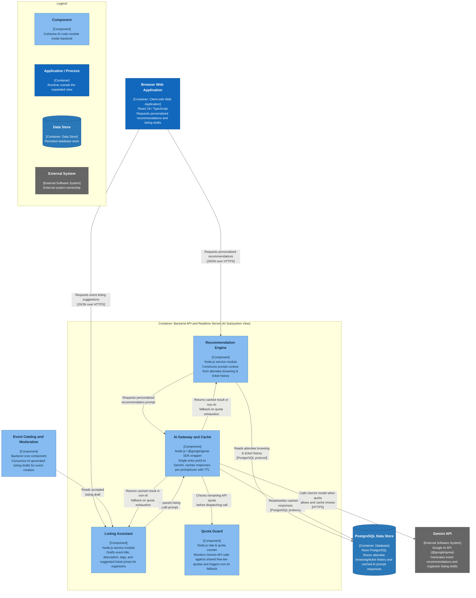

# Container and Component Diagram

## TixHub: Event Ticket Sales Web Application

**Introduction to Software Engineering, 24C11**

Group 02 · SoE

---

> **Performed by:** Nguyễn Thành Đạt (24127021), Lương Hưng Phát (24127298)
>
> **Reviewed by:** All Members
>
> **Edited by:** Nguyễn Tấn Hiệu (24127373), Nguyễn Minh Khoa (24127188), Nguyễn Anh Khôi (24127430)

---

### Table of Contents

1. [C4 Model Level 2: Container Diagram](#1-c4-model-level-2-container-diagram)
    - [1.1 Main Flow](#11-main-flow)
    - [1.2 Container Descriptions](#12-container-descriptions)
    - [1.3 External System Descriptions](#13-external-system-descriptions)
2. [C4 Model Level 3: Frontend Component Diagram](#2-c4-model-level-3-frontend-component-diagram)
    - [2.1 Main Flow](#21-main-flow)
    - [2.2 Frontend Component Descriptions](#22-frontend-component-descriptions)
3. [C4 Model Level 3: Backend Core Business Component Diagram](#3-c4-model-level-3-backend-core-business-component-diagram)
    - [3.1 Main Flow](#31-main-flow)
    - [3.2 Backend Core Component Descriptions](#32-backend-core-component-descriptions)
4. [C4 Model Level 3: AI Subsystem Component Diagram](#4-c4-model-level-3-ai-subsystem-component-diagram)
    - [4.1 Main Flow](#41-main-flow)
    - [4.2 AI Subsystem Component Descriptions](#42-ai-subsystem-component-descriptions)
5. [Appendix: AI Usage Notes](#5-appendix-ai-usage-notes)
    - [Tool](#tool)
    - [Summary of prompts used](#summary-of-prompts-used)
    - [Content generated with AI vs. done independently](#content-generated-with-ai-vs-done-independently)

---

### 1. C4 Model Level 2: Container Diagram

```mermaid
%%{init: {'flowchart': {'nodeSpacing': 160, 'rankSpacing': 360, 'padding': 20}}}%%
flowchart LR
    attendee["<span style='font-size:18px'><b>Attendee</b></span><br/><br/>[Person]<br/>Browses events, holds seats/GA quantity, pays via store-credit wallet, holds digital QR tickets"]
    organizer["<span style='font-size:18px'><b>Organizer</b></span><br/><br/>[Person]<br/>Creates physical events/venues/layouts, scans QR tickets at door, views live sales analytics"]
    admin["<span style='font-size:18px'><b>Admin</b></span><br/><br/>[Person]<br/>Reviews organizer applications, approves events pre-publish, moderates platform content"]

    subgraph tixhub["Software System: TixHub"]
        direction LR

        webServer["<span style='font-size:18px'><b>Nginx Static &amp; Reverse Proxy</b></span><br/><br/>[Container: Web Server]<br/>Nginx (tixhub.fit + api.tixhub.fit vhosts)<br/>Serves compiled React SPA bundle on one origin and reverse-proxies every path (incl. /socket.io/ and /uploads/) to Express on the other (split origin, trust proxy = 1)"]
        browserApp["<span style='font-size:18px'><b>Browser Web Application</b></span><br/><br/>[Container: Client-side Web Application]<br/>React 19 / TypeScript / Vite / Tailwind CSS<br/>Renders role-based UI (Attendee, Organizer, Admin) and handles interactive seat map canvas"]
        api["<span style='font-size:18px'><b>Backend API and Realtime Server</b></span><br/><br/>[Container: Server-side Application]<br/>Node.js / Express / Socket.IO<br/>Provides REST APIs, JWT/cookie session rotation, realtime seat/analytics events, and TTL background sweepers"]
        postgres[("<span style='font-size:18px'><b>PostgreSQL Data Store</b></span><br/><br/>[Container: Database]<br/>Neon PostgreSQL<br/>Stores users, refresh tokens, events, venue layouts, seats, holds, wallet ledger, tickets, moderation and audit logs")]
    end

    cloudflare["<span style='font-size:18px'><b>Cloudflare</b></span><br/><br/>[External Software System]<br/>CDN / Edge Proxy<br/>Terminates public TLS, provides WAF and DDoS protection, and forwards the real visitor IP to the origin"]
    google["<span style='font-size:18px'><b>Google Identity</b></span><br/><br/>[External Software System]<br/>OAuth 2.0 (google-auth-library)<br/>Authenticates Google sign-in credentials"]
    vnpay["<span style='font-size:18px'><b>VNPay Sandbox</b></span><br/><br/>[External Software System]<br/>Payment Gateway API<br/>Processes store-credit wallet top-ups (signed IPN + querydr reconciliation sweep)"]
    gemini["<span style='font-size:18px'><b>Gemini API</b></span><br/><br/>[External Software System]<br/>Google AI API (@google/genai)<br/>Powers personalized event recommendations and organizer listing assistant"]
    resend["<span style='font-size:18px'><b>Resend</b></span><br/><br/>[External Software System]<br/>Email API (resend SDK)<br/>Delivers password reset emails and ticket transaction notifications"]

    attendee -->|"Uses attendee UI [HTTPS]"| browserApp
    organizer -->|"Uses organizer UI [HTTPS]"| browserApp
    admin -->|"Uses admin UI [HTTPS]"| browserApp

    browserApp -->|"Requests SPA bundle and static assets<br/>[HTTPS, tixhub.fit]"| cloudflare
    browserApp -->|"Calls JSON REST APIs with<br/>Bearer JWT / cookies and opens<br/>the seat-hold and analytics channel<br/>[HTTPS + WSS, api.tixhub.fit]"| cloudflare
    cloudflare -->|"Forwards both origins to the VPS<br/>after TLS termination<br/>[HTTP]"| webServer
    webServer -->|"Reverse-proxies every path,<br/>including /socket.io/ upgrades<br/>[HTTP, 127.0.0.1:4000]"| api

    api -->|"Reads and writes operational tables<br/>[PostgreSQL protocol via pg]"| postgres

    api -->|"Verifies sign-in and<br/>reads Google profile<br/>[HTTPS/OAuth 2.0]"| google
    api -->|"Initiates top-up,<br/>receives signed IPN callback,<br/>reconciles via querydr<br/>[HTTPS]"| vnpay
    api -->|"Requests recommendations<br/>and listing suggestions<br/>[HTTPS/@google/genai]"| gemini
    api -->|"Sends transactional emails<br/>(fallback to ConsoleMailer<br/>if no key)<br/>[HTTPS]"| resend

    subgraph keyL2["Legend"]
        keyPerson["<span style='font-size:18px'><b>Person</b></span><br/><br/>[Person]<br/>Human actor"]
        keyContainer["<span style='font-size:18px'><b>Application / Process</b></span><br/><br/>[Container]<br/>Executable runtime boundary"]
        keyData[("<span style='font-size:18px'><b>Data Store</b></span><br/><br/>[Container: Data Store]<br/>Owned persisted data")]
        keyExternal["<span style='font-size:18px'><b>External System</b></span><br/><br/>[External Software System]<br/>Outside TixHub ownership"]
    end

    classDef person fill:#08427b,stroke:#052e56,color:#fff;
    classDef container fill:#1168bd,stroke:#0b4884,color:#fff;
    classDef database fill:#2b78b8,stroke:#0b4884,color:#fff;
    classDef external fill:#666,stroke:#333,color:#fff,stroke-dasharray:5 5;
    class attendee,organizer,admin,keyPerson person;
    class webServer,browserApp,api,keyContainer container;
    class postgres,keyData database;
    class cloudflare,google,vnpay,gemini,resend,keyExternal external;
```

#### 1.1 Main Flow

A user reaches TixHub through Cloudflare, which terminates public TLS in front of two origins on one registrable domain: `tixhub.fit`, where Nginx serves the compiled React SPA bundle, and `api.tixhub.fit`, where Nginx reverse proxies **every** path: REST, `/socket.io/` upgrades, and `/uploads/` avatar assets alike to the Express process on `127.0.0.1:4000`. The two hosts are cross origin but same site, so the httpOnly refresh cookie still crosses the subdomain boundary under `SameSite=Lax`. The browser calls JSON REST endpoints for core domain operations (auth, catalog discovery, venue seat-map building, seat holds, closed-loop wallet checkout, admin moderation) and subscribes to Socket.IO channels for real-time seat availability (`showtime:{id}`).

The backend is the single source of truth: it executes ACID transactions against Neon PostgreSQL across 26 tables. Several glossary terms do not map 1-1 onto table names: a **Session** (CONTEXT.md) is a refresh token *family* and has no table of its own, and an **Organizer Application** is a row in `organizers`. External communications interface with the systems listed in §1.3 (Vision Document §4.1, §4.3): Cloudflare at the edge, Google Identity for OAuth 2.0 sign-in, VNPay Sandbox for web credit wallet top up, and Resend for transactional email delivery.

#### 1.2 Container Descriptions

| Container | Responsibility and services provided | Technology/framework | Communication |
|---|---|---|---|
| Nginx Static & Reverse Proxy | Serves the static React SPA build on `tixhub.fit`, and on `api.tixhub.fit` reverse-proxies **every** path to Express on `127.0.0.1:4000`, not only `/api`, because the SPA also fetches `/uploads/avatars/*` and upgrades `/socket.io/` on that origin. Overwrites `X-Forwarded-For` with the real visitor IP so the auth throttle cannot be spoofed (Express runs with `trust proxy = 1`, exactly one hop). | Nginx (`tixhub.fit` + `api.tixhub.fit` vhosts, `listen 80` behind Cloudflare) | HTTP from Cloudflare; HTTP to the backend Node process on loopback. |
| Browser Web Application | Renders role-based UI (Attendee, Organizer, Admin), manages client auth/session state, handles interactive seat map canvas, calls REST APIs, and processes live Socket.IO events. | React 19, TypeScript 5.8, Vite, Tailwind CSS v4, Motion, Lucide React, Socket.IO Client | HTTPS to Nginx & API; Socket.IO (WebSocket/HTTP fallback) to backend. |
| Backend API and Realtime Server | Provides REST APIs, JWT & cookie-based access control, session refresh rotation, seat hold concurrency logic (`SELECT FOR UPDATE`), closed-loop wallet transactions (VND đồng integers), Socket.IO server, and background sweepers (7-min seat hold sweep, VNPay top-up reconciliation sweep). | Node.js, Express 4.21, Socket.IO 4.8, `pg` driver, `tsx` | HTTPS, Socket.IO, PostgreSQL protocol (`pg`), HTTPS to external APIs. |
| PostgreSQL Data Store | Persists relational core data across 26 schema tables, grouped as identity | Neon PostgreSQL | PostgreSQL protocol from the backend process only. |

#### 1.3 External System Descriptions

| External system | Purpose | Integration and evidence |
|---|---|---|
| Cloudflare | Public TLS termination, WAF/DDoS protection, and "Always Use HTTPS" redirect for both origins. | Proxies `tixhub.fit` and `api.tixhub.fit`; Nginx listens on port 80 only and reads the real client IP via `real_ip` plus the `$cf_proto` map (`docs/deploy/nginx.conf`). |
| Google Identity | Google OAuth 2.0 sign-in and profile synchronization. | `google-auth-library` in backend auth routes (`/api/auth/google`), gated via `GOOGLE_CLIENT_ID` (Vision Document §3.3, SEC-02). |
| VNPay Sandbox | Funds the closed-loop store-credit wallet (`wallets` & `topups` tables); no direct order payment (Vision Document §5 Feature 2, decision D2). | Signed IPN callback (`/api/payments/vnpay/ipn`) plus `querydr` background reconciliation sweep for stale `initiated` top-ups (`reconcile.ts`, REL-03, SEC-06). |
| Gemini API | Powers attendee event recommendations and organizer event listing assistant. | `@google/genai` SDK called via backend AI service, guarded by caching (SCAL-02) and free-tier quota guards (SCAL-03, SEC-08). |
| Resend | Delivers transactional email (password reset links and ticket purchase receipts). | `resend` SDK in `mailer.ts`, falling back to `ConsoleMailer` when `RESEND_API_KEY` is not set. |

---

### 2. C4 Model Level 3: Frontend Component Diagram

```mermaid
%%{init: {'flowchart': {'nodeSpacing': 100, 'rankSpacing': 320, 'padding': 20}}}%%
flowchart LR
    attendeeF["<span style='font-size:18px'><b>Attendee</b></span><br/><br/>[Person]<br/>Browses, books seats/GA, pays via store-credit wallet, manages digital QR tickets"]
    organizerF["<span style='font-size:18px'><b>Organizer</b></span><br/><br/>[Person]<br/>Manages events/layouts, uses AI listing assistant, scans QR tickets at door"]
    adminF["<span style='font-size:18px'><b>Admin</b></span><br/><br/>[Person]<br/>Approves organizers, pre-publish moderates events, monitors platform audit log"]
    backendF["<span style='font-size:18px'><b>Backend API and Realtime Server</b></span><br/><br/>[Container: Server-side Application]<br/>Express / Socket.IO<br/>Provides REST endpoints and Socket.IO channels"]

    subgraph browser["Container: Browser Web Application (React 19 / TypeScript)"]
        direction TB

        authUI["<span style='font-size:18px'><b>Authentication and Profile</b></span><br/><br/>[Component]<br/>AuthModal, AccountPage, ProfileSection, SecuritySection, ResetPassword, authClient<br/>Google OAuth, email/password, session refresh rotation, profile editing, password reset"]
        discoveryUI["<span style='font-size:18px'><b>Event Discovery and Catalog</b></span><br/><br/>[Component]<br/>EventGrid, EventFilters, EventDetail, HeroVideo, catalogClient, catalogAdapter, seo<br/>Browse, search, category/location/date/price filters, custom slug event pages, SEO metadata, AI recommendation carousel"]
        seatMapUI["<span style='font-size:18px'><b>Real-time Seat Map and Reservation</b></span><br/><br/>[Component]<br/>SeatLayout, SeatMapView, ShowtimeMapPanel, SeatCanvas, holdSession, holdsClient, seatSocket<br/>Interactive SVG/Canvas seat map, GA quantity selector, hold-on-click, 7-min countdown timer, Socket.IO live availability"]
        walletUI["<span style='font-size:18px'><b>Wallet and Checkout</b></span><br/><br/>[Component]<br/>WalletPanel, TopUpSheet, VnpayReturn, CheckoutForm, walletClient<br/>Store-credit balance, top-up via VNPay redirect, return polling, closed-loop wallet checkout"]
        ticketUI["<span style='font-size:18px'><b>Ticketing and QR Display</b></span><br/><br/>[Component]<br/>TicketTicket, BookingHistory<br/>Digital QR ticket display, self-service cancellation (T-24h cutoff, refundable amount), purchase history"]
        organizerUI["<span style='font-size:18px'><b>Organizer Console</b></span><br/><br/>[Component]<br/>OrganizerPanel, SeatMapBuilder, LayoutEditor, FloorPlanPanel, ElementPalette, ValidationPanel<br/>Event CRUD (draft → on_sale → finished/cancelled), venue layout designer, geometry validation, AI listing assistant, phone QR scanner"]
        adminUI["<span style='font-size:18px'><b>Admin Console</b></span><br/><br/>[Component]<br/>AdminPanel, AdminModeration, adminClient<br/>Organizer application approval queue (pending → approved/rejected), pre-publish event approval gate, content moderation, audit log viewer"]
        engagementUI["<span style='font-size:18px'><b>Ratings, Reviews and Feedback</b></span><br/><br/>[Component]<br/>EventDetail rating & review section, ToastStack<br/>1–5 star event ratings, attendee comments, contextual toast notifications"]
    end

    attendeeF -->|"Signs in and manages profile"| authUI
    attendeeF -->|"Browses catalog and reads event detail"| discoveryUI
    attendeeF -->|"Selects seats or GA quantity"| seatMapUI
    attendeeF -->|"Tops up wallet and checks out"| walletUI
    attendeeF -->|"Views QR tickets and manages bookings"| ticketUI
    attendeeF -->|"Submits ratings and reviews"| engagementUI
    organizerF -->|"Signs in and manages profile"| authUI
    organizerF -->|"Designs layouts, manages<br/>events, scans tickets"| organizerUI
    adminF -->|"Signs in and manages<br/>admin profile"| authUI
    adminF -->|"Runs moderation and<br/>approval workflows"| adminUI

    discoveryUI -->|"Navigates to seat<br/>reservation on booking"| seatMapUI
    seatMapUI -->|"Hands off held seats<br/>to wallet checkout"| walletUI
    walletUI -->|"Displays issued QR ticket<br/>on successful purchase"| ticketUI

    authUI -->|"Calls auth & profile APIs<br/>[JSON over HTTPS / Cookies]"| backendF
    discoveryUI -->|"Calls catalog & recommendation APIs<br/>[JSON over HTTPS]"| backendF
    seatMapUI -->|"Calls hold APIs & subscribes<br/>to seat events<br/>[HTTPS / Socket.IO]"| backendF
    walletUI -->|"Calls wallet & checkout APIs<br/>[JSON over HTTPS]"| backendF
    ticketUI -->|"Calls ticketing & cancellation APIs<br/>[JSON over HTTPS]"| backendF
    organizerUI -->|"Calls catalog, layout, scanner,<br/>& analytics APIs<br/>[HTTPS / Socket.IO]"| backendF
    adminUI -->|"Calls admin approval<br/>& moderation APIs<br/>[JSON over HTTPS]"| backendF
    engagementUI -->|"Calls review & rating APIs<br/>[JSON over HTTPS]"| backendF
    backendF ---->|"Publishes live seat updates<br/>[Socket.IO over WebSocket/HTTP]"| seatMapUI
    backendF ---->|"Pushes live sales/check-in updates<br/>[Socket.IO over WebSocket/HTTP]"| organizerUI

    subgraph keyL3F["Legend"]
        keyComponentF["<span style='font-size:18px'><b>Component</b></span><br/><br/>[Component]<br/>Cohesive code module inside the browser container"]
        keyContainerF["<span style='font-size:18px'><b>Application / Process</b></span><br/><br/>[Container]<br/>Runtime outside the expanded container"]
    end

    classDef component fill:#85bbf0,stroke:#2f6fa6,color:#102a43;
    classDef container fill:#1168bd,stroke:#0b4884,color:#fff;
    classDef person fill:#08427b,stroke:#052e56,color:#fff;
    class authUI,discoveryUI,seatMapUI,walletUI,ticketUI,organizerUI,adminUI,engagementUI,keyComponentF component;
    class backendF,keyContainerF container;
    class attendeeF,organizerF,adminF person;
```

#### 2.1 Main Flow

An attendee discovers events via `Event Discovery and Catalog` (`EventGrid.tsx`, `EventDetail.tsx`), which surfaces AI-driven event recommendations (Vision Document §5 Feature 5). Selecting a showtime transitions to `Real-time Seat Map and Reservation` (`SeatLayout.tsx`, `ShowtimeMapPanel.tsx`), which initiates a concurrency-safe 7-minute seat/GA hold over Socket.IO (`seatSocket.ts`, Feature 11, REL-02). Proceeding to checkout engages `Wallet and Checkout` (`CheckoutForm.tsx`, `WalletPanel.tsx`), which verifies sufficient store-credit balance (prompting VNPay top-up via `TopUpSheet.tsx` if needed, Feature 2) and executes atomic wallet checkout in ≤ 5 clicks (USE-01, DATA-01). Upon completion, `Ticketing and QR Display` (`TicketTicket.tsx`) displays the issued QR digital ticket (Feature 3). Organizers utilize `Organizer Console` (`OrganizerPanel.tsx`, `SeatMapBuilder.tsx`) for event CRUD, venue layout design, AI listing generation (Feature 6), and door check-in scanning (`html5-qrcode`, PLAT-03). Admins access `Admin Console` (`AdminPanel.tsx`, `AdminModeration.tsx`) to review organizer applications, approve pending events pre-publish (Feature 10), and view audit logs (SEC-09).

#### 2.2 Frontend Component Descriptions

| Component | Responsibility | Representative modules (`src/`) | Relationships |
|---|---|---|---|
| Authentication and Profile | Handles Google OAuth sign-in, email/password registration, session refresh token rotation, profile updating, avatar upload, and password reset. | `AuthModal.tsx`, `AccountPage.tsx`, `ProfileSection.tsx`, `SecuritySection.tsx`, `ResetPassword.tsx`, `services/authClient.ts` | Calls `/api/auth/*` endpoints; stores JWT in memory and refresh token in httpOnly cookie. |
| Event Discovery and Catalog | Renders public marketplace catalog, keyword/category/location/date/price filtering, event detail pages with custom slugs, SEO meta tags, and AI recommendation carousel. | `EventGrid.tsx`, `EventFilters.tsx`, `EventDetail.tsx`, `HeroVideo.tsx`, `services/catalogClient.ts`, `services/seo.ts` | Calls `/api/events`, `/api/categories`, `/api/recommendations`; hands off to Seat Map. |
| Real-time Seat Map and Reservation | Renders interactive venue seat maps or GA quantity selector, processes hold-on-click, displays 7-min TTL timer, handles socket resync. | `SeatLayout.tsx`, `SeatMapView.tsx`, `ShowtimeMapPanel.tsx`, `services/holdSession.ts`, `services/seatSocket.ts` | Calls `/api/reservations/*`; subscribes to `showtime:{id}` Socket.IO events; hands off to Wallet Checkout. |
| Wallet and Checkout | Manages store-credit wallet balance, VNPay top-up redirect sheet, top-up status polling, and single-step wallet checkout payment. | `WalletPanel.tsx`, `TopUpSheet.tsx`, `VnpayReturn.tsx`, `CheckoutForm.tsx`, `services/walletClient.ts` | Calls `/api/wallet/*`, `/api/payments/vnpay/*`; opens issued ticket on success. |
| Ticketing and QR Display | Renders unique QR digital tickets, handles self-service ticket cancellation (T-24h cutoff with refundable amount display), lists booking history. | `TicketTicket.tsx`, `BookingHistory.tsx` | Calls `/api/tickets/*`, `/api/orders/*`. |
| Organizer Console | Provides event lifecycle management (`draft → on_sale → finished/cancelled`), venue layout designer, seat geometry validation, AI listing assistant, door scanner, and sales dashboard. | `OrganizerPanel.tsx`, `SeatMapBuilder.tsx`, `components/seatmap/*` (`LayoutEditor.tsx`, `FloorPlanPanel.tsx`) | Calls `/api/organizer/*`, `/api/seatmap/*`; receives realtime sales/check-in socket pushes. |
| Admin Console | Manages organizer application approval queue (`pending → approved/rejected`), pre-publish event moderation (`moderation_status='approved'`), content flagging, and audit log viewing. | `AdminPanel.tsx`, `AdminModeration.tsx`, `services/adminClient.ts` | Calls `/api/admin/*`. |
| Ratings, Reviews and Feedback | Displays aggregated 1–5 star ratings, attendee event reviews, and global notification toasts. | `EventDetail.tsx` (review section), `ToastStack.tsx` | Calls `/api/events/:id/reviews`. |

---

### 3. C4 Model Level 3: Backend Core Business Component Diagram

```mermaid
%%{init: {'flowchart': {'nodeSpacing': 100, 'rankSpacing': 320, 'padding': 20}}}%%
flowchart LR
    browserCore["<span style='font-size:18px'><b>Browser Web Application</b></span><br/><br/>[Container: Client-side Web Application]<br/>React 19 / TypeScript<br/>Calls REST APIs and receives Socket.IO events"]
    postgresCore[("<span style='font-size:18px'><b>PostgreSQL Data Store</b></span><br/><br/>[Container: Database]<br/>Neon PostgreSQL<br/>Stores core operational tables")]
    googleCore["<span style='font-size:18px'><b>Google Identity</b></span><br/><br/>[External Software System]<br/>OAuth 2.0<br/>Authenticates Google credentials"]
    vnpayCore["<span style='font-size:18px'><b>VNPay Sandbox</b></span><br/><br/>[External Software System]<br/>Payment Gateway API<br/>Processes top-up payments"]
    resendCore["<span style='font-size:18px'><b>Resend</b></span><br/><br/>[External Software System]<br/>Email API<br/>Sends password reset & notification emails"]
    aiSubsystem["<span style='font-size:18px'><b>AI Recommendation and Listing Subsystem</b></span><br/><br/>[Component]<br/>See Section 4<br/>Expanded separately"]

    subgraph backendCore["Container: Backend API and Realtime Server (Core Business View)"]
        direction TB

        apiAccess["<span style='font-size:18px'><b>API and Access Control</b></span><br/><br/>[Component]<br/>app.ts, http.ts, error.ts, throttle.ts<br/>Express app setup, CORS, body parsing, error handler, rate limiters, JWT/cookie authentication"]
        identity["<span style='font-size:18px'><b>Identity and Session Service</b></span><br/><br/>[Component]<br/>server/src/modules/auth/*<br/>Email/password auth, Google OAuth verification, session refresh token family rotation, password reset mailer"]
        catalog["<span style='font-size:18px'><b>Event Catalog and Moderation</b></span><br/><br/>[Component]<br/>server/src/modules/catalog/*<br/>Public event discovery, organizer event CRUD, admin pre-publish moderation approval gate"]
        seatMapEngine["<span style='font-size:18px'><b>Venue Layout and Seat Map Engine</b></span><br/><br/>[Component]<br/>server/src/modules/seatmap/*<br/>Venue layout builder, seat geometry validation, background floor-plan upload, layout-to-showtime seat snapshotting"]
        seatHolds["<span style='font-size:18px'><b>Seat Holds and Reservation Service</b></span><br/><br/>[Component]<br/>server/src/modules/holds/*<br/>Concurrency-safe holds (SELECT FOR UPDATE), GA quantity reservation, 8-ticket cap, 7-min TTL hold sweeper"]
        wallet["<span style='font-size:18px'><b>Wallet, Ledger and VNPay Service</b></span><br/><br/>[Component]<br/>server/src/modules/payments/*<br/>VNPay top-up IPN verification, querydr reconciliation sweep, closed-loop wallet ledger (VND đồng integers), atomic wallet checkout"]
        ticketing["<span style='font-size:18px'><b>Ticketing and Door Check-in</b></span><br/><br/>[Component]<br/>wallet.service.ts, tickets table<br/>Unique QR code ticket generation, door scanner validation, self-service refund (T-24h) credit back to wallet"]
        adminService["<span style='font-size:18px'><b>Admin Moderation Service</b></span><br/><br/>[Component]<br/>server/src/modules/admin/*<br/>Organizer application review, pre-publish event approval, content flagging, audit log recorder"]
        realtime["<span style='font-size:18px'><b>Real-time Socket.IO Server</b></span><br/><br/>[Component]<br/>server/src/realtime/io.ts<br/>Socket.IO connection manager, room-based broadcasting (showtime:{id}) for seat holds & sales analytics"]

        apiAccess -->|"Routes auth requests"| identity
        apiAccess -->|"Routes catalog requests"| catalog
        apiAccess -->|"Routes seat-map requests"| seatMapEngine
        apiAccess -->|"Routes reservation requests"| seatHolds
        apiAccess -->|"Routes wallet & payment requests"| wallet
        apiAccess -->|"Routes admin requests"| adminService
        apiAccess -->|"Routes AI requests"| aiSubsystem

        seatMapEngine -->|"Snapshots layout<br/>to showtime seats"| seatHolds
        seatHolds -->|"Verifies active hold<br/>during checkout"| wallet
        wallet -->|"Issues QR tickets inside<br/>atomic purchase transaction"| ticketing
        ticketing -->|"Credits refund back<br/>to store-credit wallet"| wallet
        seatHolds -->|"Emits seat<br/>availability updates"| realtime
        catalog -->|"Reads AI-generated<br/>listing suggestions"| aiSubsystem
    end

    browserCore -->|"Calls REST API endpoints<br/>[JSON over HTTP/HTTPS]"| apiAccess
    browserCore <-->|"Bidirectional realtime messaging<br/>[Socket.IO over WebSocket/HTTP]"| realtime

    identity -->|"Reads/writes accounts, sessions,<br/>refresh_tokens, auth_events"| postgresCore
    catalog -->|"Reads/writes events, event_categories,<br/>ticket_tiers, showtimes"| postgresCore
    seatMapEngine -->|"Reads/writes venues,<br/>venue_layouts, layout_elements"| postgresCore
    seatHolds -->|"Reads/writes reservations,<br/>reservation_items, showtime_seats"| postgresCore
    wallet -->|"Reads/writes wallets, wallet_transactions,<br/>topups, orders"| postgresCore
    ticketing -->|"Reads/writes tickets"| postgresCore
    adminService -->|"Reads/writes organizer_applications,<br/>audit_logs"| postgresCore

    identity -->|"Verifies Google<br/>OAuth token"| googleCore
    identity -->|"Sends reset emails<br/>via Resend"| resendCore
    wallet -->|"Initiates top-up, receives IPN,<br/>reconciles via querydr"| vnpayCore

    subgraph keyCore["Legend"]
        keyCoreComponent["<span style='font-size:18px'><b>Component</b></span><br/><br/>[Component]<br/>Cohesive code module inside the backend container"]
        keyCoreContainer["<span style='font-size:18px'><b>Application / Process</b></span><br/><br/>[Container]<br/>Runtime outside the expanded view"]
        keyCoreData[("<span style='font-size:18px'><b>Data Store</b></span><br/><br/>[Container: Data Store]<br/>Persisted database store")]
        keyCoreExternal["<span style='font-size:18px'><b>External System</b></span><br/><br/>[External Software System]<br/>External system ownership"]
    end

    classDef component fill:#85bbf0,stroke:#2f6fa6,color:#102a43;
    classDef container fill:#1168bd,stroke:#0b4884,color:#fff;
    classDef database fill:#2b78b8,stroke:#0b4884,color:#fff;
    classDef external fill:#666,stroke:#333,color:#fff,stroke-dasharray:5 5;
    class apiAccess,identity,catalog,seatMapEngine,seatHolds,wallet,ticketing,adminService,realtime,aiSubsystem,keyCoreComponent component;
    class browserCore,keyCoreContainer container;
    class postgresCore,keyCoreData database;
    class googleCore,vnpayCore,resendCore,keyCoreExternal external;
```

#### 3.1 Main Flow

API requests land on `API and Access Control` (`app.ts`), which enforces CORS policies, rate limiting, and JWT/cookie authentication. User registration and authentication flow to `Identity and Session Service` (`server/src/modules/auth/`), managing password hashing (bcrypt cost 12, SEC-02), Google OAuth verification, and refresh token family rotation (SEC-03). Venue setup and layout building execute in `Venue Layout and Seat Map Engine` (`server/src/modules/seatmap/`), which validates seat geometry and snapshots layout elements into `showtime_seats`.

When an attendee holds seats, `Seat Holds and Reservation Service` (`server/src/modules/holds/`) locks rows using `SELECT ... FOR UPDATE` (DATA-02), enforces the 8-ticket cap, initializes the 7-minute TTL timer (REL-02), and notifies `Real-time Socket.IO Server` (`realtime/io.ts`) to broadcast updates (`PERF-03 < 1s`). At checkout, `Wallet, Ledger and VNPay Service` (`server/src/modules/payments/`) verifies wallet balance, debits store credit in whole VND đồng integers (D1, STD-03), writes an append-only ledger row (DATA-04), and inside the exact same ACID transaction (DATA-01) invokes `Ticketing and Door Check-in` to issue unique QR tickets. A background sweeper (`sweep.ts`) auto-releases expired holds, while `reconcile.ts` queries VNPay (`querydr`) to settle orphan top-ups (REL-03, SEC-06).

#### 3.2 Backend Core Component Descriptions

| Component | Responsibility | Representative modules (`server/src/`) | Relationships |
|---|---|---|---|
| API and Access Control | Initializes Express app, handles CORS, cookie parsing, global error handling, rate limiting (`throttle.ts`), and route dispatching. | `app.ts`, `http.ts`, `middleware/error.ts`, `modules/auth/throttle.ts` | Dispatches requests to all backend feature modules. |
| Identity and Session Service | Manages email/password authentication, Google OAuth verification, refresh token family rotation, password reset links, and organizer applications. | `modules/auth/auth.routes.ts`, `auth.repo.ts`, `sessions.ts`, `oauth.google.ts`, `mailer.ts` | Reads/writes `accounts`, `sessions`, `refresh_tokens`, `auth_events`, `organizer_applications`; calls Google & Resend. |
| Event Catalog and Moderation | Manages public event discovery, keyword/category/location/date/price filtering, custom event slug generation, organizer event CRUD, and admin pre-publish approval check. | `modules/catalog/catalog.public.routes.ts`, `organizer.routes.ts`, `moderation.routes.ts`, `catalog.repo.ts`, `catalog.write.ts` | Reads/writes `events`, `event_categories`, `ticket_tiers`, `showtimes`; queries AI subsystem for listing assistance. |
| Venue Layout & Seat Map Engine | Manages venue creation, multi-layout design (coordinate space 0–10,000), seat collision validation, floor-plan image uploads, and layout-to-showtime seat snapshotting. | `modules/seatmap/seatmap.routes.ts`, `layouts.service.ts`, `layouts.repo.ts`, `apply.ts`, `floorplan.ts` | Reads/writes `venues`, `venue_layouts`, `layout_elements`; feeds `showtime_seats`. |
| Seat Holds & Reservation Service | Executes concurrency-safe seat holds (`SELECT FOR UPDATE`), general-admission quantity holds, 8-ticket per showtime cap, and 7-min TTL background release sweeper. | `modules/holds/reservations.routes.ts`, `holds.service.ts`, `holds.repo.ts`, `sweep.ts` | Reads/writes `reservations`, `reservation_items`, `showtime_seats`; emits socket events to `realtime/io.ts`; hands off to Wallet. |
| Wallet, Ledger & VNPay Service | Processes VNPay top-up IPN callbacks, runs `querydr` reconciliation sweep, maintains append-only store-credit ledger (integer VND đồng), and executes atomic wallet checkout. | `modules/payments/wallet.routes.ts`, `wallet.service.ts`, `vnpay.ts`, `reconcile.ts` | Reads/writes `wallets`, `wallet_transactions`, `topups`, `orders`; calls VNPay API; triggers Ticketing. |
| Ticketing and Door Check-in | Generates unique QR ticket payloads inside the committed purchase transaction, validates door-scanner check-in requests, and processes self-service refunds (T-24h cutoff). | `wallet.service.ts` (purchase transaction & ticket issuance logic) | Reads/writes `tickets`; credits refund amount back to Wallet. |
| Admin Moderation Service | Manages organizer application review queue (`pending → approved/rejected`), pre-publish event approval gate (`moderation_status='approved'`), and audit logging. | `modules/admin/admin.routes.ts`, `admin.service.ts`, `admin.repo.ts`, `audit.ts` | Reads/writes `organizer_applications`, `audit_logs`, `events`. |
| Real-time Socket.IO Server | Manages Socket.IO websocket/polling connections, joins clients to `showtime:{id}` rooms, and broadcasts live seat availability updates and sales metrics. | `realtime/io.ts` | Triggered by Seat Holds & Ticketing; pushes real-time events to frontend. |

---

### 4. C4 Model Level 3: AI Subsystem Component Diagram

#### 4.1 Main Flow

When an attendee requests recommendations, `Recommendation Engine` extracts their category interest and past ticket purchase history from PostgreSQL and invokes `AI Gateway and Cache`. The gateway first queries `Quota Guard` to verify remaining Google Gemini free-tier quota (Vision Document §6.5 SCAL-03). If a cached response exists or if the quota threshold is reached, it immediately returns the cached payload or a graceful non-AI recommendation fallback without invoking external APIs. On a cache miss with valid quota, it uses `@google/genai` to query Gemini API and caches the response (SCAL-02). Organizers generating event copy follow the identical path through `Listing Assistant`, which provides title, description, category tags, and tier price recommendations (Feature 6).

#### 4.2 AI Subsystem Component Descriptions

| Component | Responsibility | Representative logic | Relationships |
|---|---|---|---|
| Recommendation Engine | Aggregates attendee browsing history and ticket purchases to construct context prompts for personalized event recommendations. | History aggregation, prompt builder | Reads PostgreSQL; calls AI Gateway & Cache. |
| Listing Assistant | Constructs prompts for organizer event copy generation (title, detailed description, search tags, recommended tier pricing). | Listing draft prompt builder | Calls AI Gateway & Cache; output consumed by Event Catalog. |
| AI Gateway and Cache | Serves as the single integration point for `@google/genai`; caches AI responses by user/prompt key with TTL to conserve API quota. | `@google/genai` client, cache lookup & store | Reads/writes PostgreSQL cache; checks Quota Guard; calls Gemini API. |
| Quota Guard | Tracks outbound Gemini API call frequency against platform free-tier limits, enforcing graceful degradation when limits are reached (SEC-08, SCAL-03). | Rolling window counter, threshold gate | Consulted by AI Gateway prior to making external calls. |

---

### 5. Appendix: AI Usage Notes

This document was prepared and verified with the assistance of AI tools in accordance with course guidelines for Intro2SE (24C11). AI tools were used selectively to support formatting, cross-referencing, and consistency checks; all architectural decisions, domain logic, and final content were determined and validated by the team.

#### Tool

| Item | Detail |
|------|--------|
| Tool name & version | Gemini 3.6 Flash |
| Provider / platform | Google |
| Access dates | August 7, 2026 |

#### Summary of prompts used

**Full name:** Nguyễn Thành Đạt | **Student ID**: 24127021

- Gemini 3.6 Flash, Google, accessed August 7, 2026
    - *Prompt*: "Audit C4 Model Level 2 Container Diagram and Level 3 Component Diagrams against the shipped source code in `source/IntroSE`, Vision Document v2.0, ADR 0003 deployment topology, and Database Schema to identify missing components or discrepancies."
    - *Usage*: Used as a cross-check to catch mismatches between the diagrams and the actual repository code.
    - *How the output was used*: The AI produced a candidate alignment matrix mapping frontend components (`src/`) and backend services (`server/src/modules/`) to the C4 diagrams. Each mapping was manually verified against `source/IntroSE` before any change was accepted; entries that did not match the shipped code were discarded.

- Gemini 3.6 Flash, Google, accessed August 7, 2026
    - *Prompt*: "Re-frame all container and component diagrams to represent the target final production system deployment at `https://tixhub.fit` and `https://api.tixhub.fit` (Cloudflare Edge CDN, Nginx reverse proxy, production VNPay Payment Gateway, Resend Email API), removing local testing/dev references like localhost:4000."
    - *Usage*: Used to help standardize production deployment terminology and edge/proxy relationships in the diagram wording.
    - *How the output was used*: The AI drafted updated Mermaid flowchart definitions and narrative descriptions. These drafts were reviewed line by line, and the security-relevant details (trust proxy = 1, CF-Connecting-IP, SameSite=Lax cookies) were checked against ADR 0003 before inclusion.

- Gemini 3.6 Flash, Google, accessed August 7, 2026
    - *Prompt*: "Check the Mermaid diagram syntax for C4 Level 2 and Level 3 diagrams to ensure valid styling, proper node formatting, clear legends, and correct class definitions across dark/light themes."
    - *Usage*: Used as a syntax and rendering check for the Mermaid diagrams.
    - *How the output was used*: The AI flagged formatting edge cases in node labels containing HTML tags and suggested `classDef` styling rules. Each suggestion was tested by rendering the diagrams directly before being kept.

- Gemini 3.6 Flash, Google, accessed August 7, 2026
    - *Prompt*: "Construct a dedicated C4 Level 3 Component Diagram for the AI Subsystem detailing how Recommendation Engine, Listing Assistant, AI Gateway & Cache, and Quota Guard interact with Gemini API and PostgreSQL."
    - *Usage*: Used to help draft an initial layout for Section 4 (AI Subsystem Component Diagram).
    - *How the output was used*: The AI produced a first-pass Mermaid flowchart and component description table. The team rewrote and corrected the draft where needed, and confirmed the non-AI fallback mechanism and prompt caching rules (SCAL-02, SCAL-03) matched the actual system specifications before finalizing Section 4.

#### Content generated with AI vs. done independently

- **AI assisted:** Drafting and syntax cleanup of Mermaid C4 Level 2 and Level 3 diagrams; cross-referencing source code modules (`source/IntroSE`) against architecture diagrams as a verification aid; wording alignment with HCMUS project document standards; drafting flow descriptions for the final production deployment topology (`https://tixhub.fit` / `https://api.tixhub.fit`, Cloudflare Edge, Nginx reverse proxy).
- **Done independently by the team:** All core domain architecture decisions (closed-loop store-credit wallet [D1, D2], 7-minute TTL seat hold release sweeper, `SELECT FOR UPDATE` concurrency locks, pre-publish admin moderation gate `moderation_status='approved'`), database schema design across 18+ tables, external service selection (Google OAuth, VNPay Payment Gateway, Gemini API, Resend Email API), and all final decisions on what to include in this document.
- **Validation:** Every AI suggestion was reviewed, tested, and cross-checked against the shipped source code (`source/IntroSE/server`, `source/IntroSE/src`), ADR 0003, the database schema (`SCHEMA_DATABASE.md`), and the Vision Document before acceptance.

> **Integrity Guarantee:** No fabricated system components, APIs, or database schemas appear in this document. AI tools were used only to support drafting, formatting, and verification of content that reflects the actual, team-designed architecture of the TixHub platform.
