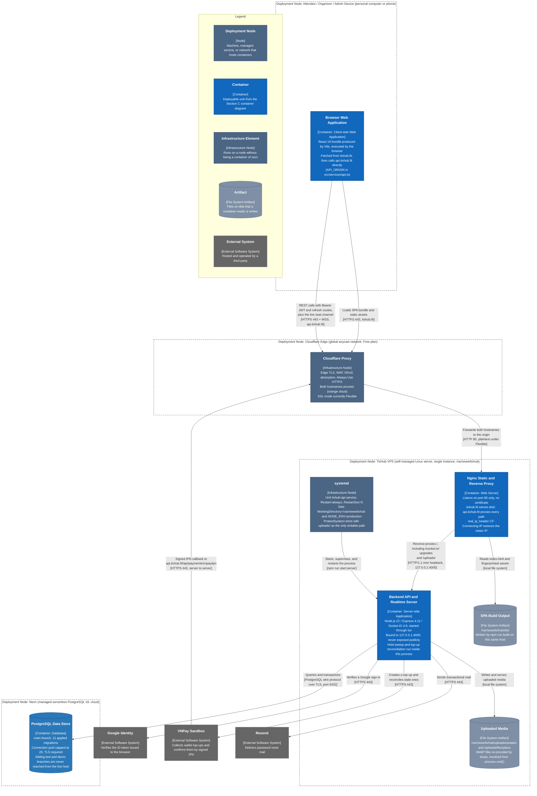

# Deployment Diagram

## TixHub: Event Ticket Sales Web Application

**CS300 – CSC13002 – Introduction to Software Engineering**

Group 02 · SoE

*Assignment: PA4-2026*

---

> **Performed by: Nguyễn Tấn Hiệu (24127373)** | **Reviewed by: All members** | **Edited by: Nguyễn Thành Đạt (24127021)**

---

### Table of Contents

1. [Deployment Diagram](#1-deployment-diagram)
    - [1.1 Main Flow](#11-main-flow)
    - [1.2 Infrastructure Node Descriptions](#12-infrastructure-node-descriptions)
    - [1.3 Container to Node Mapping](#13-container-to-node-mapping)
    - [1.4 Communication Paths](#14-communication-paths)
2. [Deployment Configuration](#2-deployment-configuration)
    - [2.1 Environment Values That Change in Production](#21-environment-values-that-change-in-production)
    - [2.2 Process Supervision and Release Steps](#22-process-supervision-and-release-steps)
3. [Known Deployment Gaps](#3-known-deployment-gaps)
4. [Appendix: AI Usage Notes](#4-appendix-ai-usage-notes)
    - [Tool](#tool)
    - [Summary of prompts used](#summary-of-prompts-used)
    - [Content generated with AI vs. done independently](#content-generated-with-ai-vs-done-independently)

---

### 1. Deployment Diagram

The four containers defined in Section C (Browser Web Application, Nginx Static and Reverse Proxy,
Backend API and Realtime Server, PostgreSQL Data Store) run on four separate infrastructure nodes.
Two of those nodes are the team's to operate: the visitor's browser is not, and Neon is managed.
Everything the team runs itself sits on **one** VPS.

#### 1.1 Main Flow

A visitor's browser resolves `tixhub.fit` to Cloudflare, not to the VPS, because both DNS records are
proxied. Cloudflare terminates TLS at the edge and speaks plain HTTP to Nginx on port 80. Nginx holds
no certificate and does not listen on 443, which is why the HTTP to HTTPS redirect is configured in the
Cloudflare dashboard rather than in a server block: a `return 301 https` at the origin would bounce the
browser back through the edge and loop forever, since the request already arrives as `http` there.

Two hostnames land on the same Nginx process. `tixhub.fit` serves the static build from
`/var/www/tixhub/dist` with a client side routing fallback, and caches `/assets/` for a year while
refusing to cache `index.html`, because that file is what names the current bundle hashes.
`api.tixhub.fit` proxies **every** path to `127.0.0.1:4000`, not only `/api/`. The SPA also fetches
`/uploads/avatars/*.webp` and upgrades `/socket.io/` on that same host, and a `location /api/` block
alone would return 404 for both.

The API process is the only thing that talks to data. It opens a TLS PostgreSQL connection pool to the
Neon `main` branch, capped at 20 connections, and every seat transition happens inside a transaction
holding `SELECT … FOR UPDATE` row locks. Two timers live in the same process and start in
`server/src/index.ts` after `listen`: the seat hold sweep, which releases expired holds on the
database's clock, and the top-up reconciliation sweep, which asks VNPay what happened to any top-up
left `initiated`. Because both timers are in process rather than external cron jobs, a second Node
worker would run both sweeps twice, which is one concrete reason the deployment stays a single
instance.

One inbound path does not come from a browser at all. VNPay posts its signed IPN callback to
`https://api.tixhub.fit/api/payments/vnpay/ipn` server to server, and the wallet balance moves on that
callback rather than on the buyer's return redirect. That callback still crosses Cloudflare, and VNPay
will not solve a bot challenge, so the edge must be configured to let that one path through.

Client IP handling is the reason the topology is written down this precisely. With Cloudflare in front
there are two proxy hops, so at the origin `$remote_addr` is a Cloudflare edge address. Nginx rewrites
it to the true visitor address with `real_ip_header CF-Connecting-IP`, trusting that header only from
the Cloudflare ranges listed in `set_real_ip_from`, then overwrites `X-Forwarded-For` with the result.
Express runs with `trust proxy = 1`, exactly one hop it trusts. Drop the `real_ip` half and every
visitor sharing a Cloudflare colo collapses into one throttle bucket. Append instead of overwrite and a
client can prepend a forged address. The per source rate limit in `throttle.ts` depends on both halves
being right.

#### 1.2 Infrastructure Node Descriptions

| Node | Hardware or cloud service | Containers and components running on it | Protocols it speaks |
|---|---|---|---|
| **Attendee / Organizer / Admin Device** | The visitor's own computer or phone. No team owned hardware. | Browser Web Application: the compiled React 19 bundle, executed inside the browser. `VITE_API_URL` is inlined at build time, so the bundle already knows to call `https://api.tixhub.fit`. | HTTPS to Cloudflare for both origins. WebSocket over TLS for the live seat channel, with Socket.IO falling back to HTTP long polling if the upgrade fails. |
| **Cloudflare Edge** | Cloudflare Free plan, global anycast. No instance the team provisions. | No TixHub container. Edge TLS termination, WAF, DDoS absorption, and the Always Use HTTPS redirect for `tixhub.fit` and `api.tixhub.fit`. | HTTPS inbound from browsers and from VNPay. HTTP outbound to the origin on port 80, because the SSL mode is Flexible. |
| **TixHub VPS** | One self managed Linux server, single instance, application root `/var/www/tixhub`. Not the Vercel and Render pairing the constitution originally listed; ADR 0003 records the swap. | Nginx Static and Reverse Proxy; Backend API and Realtime Server under systemd; the built SPA at `dist/`; uploaded media at `uploads/avatars/` and `uploads/floorplans/`; `.env` at mode 600 holding `JWT_SECRET`, the Neon URL, and the VNPay hash secret. | HTTP on port 80 inbound from Cloudflare. HTTP/1.1 on loopback between Nginx and Node, with `Upgrade` and `Connection` forwarded so WebSockets survive. HTTPS outbound to Google, VNPay, and Resend. PostgreSQL over TLS outbound to Neon. |
| **Neon** | Managed serverless PostgreSQL 18. The team provisions branches, not machines. | PostgreSQL Data Store, `main` branch, 11 applied migrations tracked in `schema_migrations`. The `test` and `demo` branches exist on the same service but are never reached from the live host: `TEST_DATABASE_URL` is read only under vitest, and `server/src/db/guards.ts` refuses destructive jobs pointed at the demo branch. | PostgreSQL wire protocol over TLS on port 5432, from the API process only. Nothing else on the VPS opens a database connection. |
| **Google Identity, VNPay Sandbox, Resend** | Third party SaaS. Listed here because a deployment that cannot reach them loses sign in, wallet funding, and password reset respectively. | No TixHub code runs on them. | HTTPS on 443, outbound from the API process. VNPay is the only one that calls back inbound. |

#### 1.3 Container to Node Mapping

| Container (Section C) | Node it is deployed on | How it gets there | Failure if the mapping is wrong |
|---|---|---|---|
| Browser Web Application | Attendee / Organizer / Admin Device | Downloaded per visit from `tixhub.fit`. Nothing is installed. | A cached `index.html` keeps returning visitors pointed at a bundle hash that no longer exists after a deploy. |
| Nginx Static and Reverse Proxy | TixHub VPS | Two server blocks in `/etc/nginx/sites-available/tixhub`, with the `map` directives and Cloudflare ranges in the `http {}` block, because they are not valid inside a `server`. | Proxying only `/api/` on the API host makes avatars 404 and leaves the seat map on long polling. |
| Backend API and Realtime Server | TixHub VPS | `systemctl enable --now tixhub-api`, which runs `npm run start:server` with `WorkingDirectory=/var/www/tixhub`. | A wrong `WorkingDirectory` writes avatars where Nginx and Express never look for them, silently and with no error, because `uploads/` resolves from `process.cwd()`. |
| PostgreSQL Data Store | Neon | `npm run db:migrate` applies every `.sql` file in filename order and records what it applied, so a second run is a no op. | Running the migration with `DATABASE_URL` pointed at the wrong branch. The demo guard blocks destructive jobs, but nothing blocks a migration. |

#### 1.4 Communication Paths

| From | To | Protocol and port | Notes |
|---|---|---|---|
| Browser | Cloudflare | HTTPS 443, plus WSS for `/socket.io/` | Both hostnames. The refresh cookie rides here as `httpOnly; Secure; SameSite=Lax`. `tixhub.fit` and `api.tixhub.fit` are cross origin but same site, which is why `Lax` still crosses the subdomain boundary and no CSRF token is needed. |
| Cloudflare | Nginx | HTTP 80, plaintext | The consequence of Flexible SSL mode. `X-Forwarded-Proto` is taken from Cloudflare's header through the `$cf_proto` map, never from `$scheme`, which reads `http` at the origin. |
| Nginx | Node API | HTTP/1.1 on `127.0.0.1:4000` | `proxy_http_version 1.1` is required for the Socket.IO upgrade. `proxy_read_timeout` and `proxy_send_timeout` are raised to 3600s because a seat channel is idle between events and the 60s default would force a reconnect loop. `client_max_body_size 3m` sits above multer's own 2 MB avatar cap so the app's validation, not Nginx, produces the error. |
| Node API | Neon | PostgreSQL wire protocol over TLS, port 5432 | `pg.Pool`, `max: 20`, TLS mandatory. No ORM, so transaction boundaries and row locks stay explicit in SQL. |
| Node API | Google Identity | HTTPS 443 | `google-auth-library` verifies the ID token the browser received, against `GOOGLE_CLIENT_ID`. |
| Node API | VNPay | HTTPS 443 | Outbound to build the signed payment URL and to call `querydr` during reconciliation. |
| VNPay | Cloudflare, then Nginx, then Node API | HTTPS 443, server to server | The IPN callback. `hasValidVnpaySignature` is what makes a publicly reachable endpoint safe. An unregistered or challenged IPN leaves top-ups stuck `initiated` until the sweep queries VNPay after `TOPUP_RECONCILE_AFTER_MS`, default 15 minutes. |
| Node API | Resend | HTTPS 443 | Password reset mail. With `RESEND_API_KEY` empty the code falls back to `ConsoleMailer`, which prints to the journal instead of sending. |

---

### 2. Deployment Configuration

#### 2.1 Environment Values That Change in Production

`.env` sits at `/var/www/tixhub/.env`, mode 600, owned by the `tixhub` service user. Five values differ
from the development example, and each has a specific failure attached rather than a stylistic reason.

| Variable | Production value | What breaks if it is left at the default |
|---|---|---|
| `NODE_ENV` | `production` | `secure: config.isProd` reads it. Left at `development`, the refresh cookie ships without the `Secure` flag. The systemd unit sets it explicitly through `Environment=`, which is loaded after `EnvironmentFile=` and therefore wins over `.env`. |
| `CORS_ORIGINS` | `https://tixhub.fit` | The default in `server/src/config.ts` includes `http://localhost:3000`, leaving a plaintext origin permanently allowed to make credentialed calls. |
| `VITE_API_URL` | `https://api.tixhub.fit` | Read at build time and inlined into the bundle. Changing it later needs a rebuild; restarting the API does nothing. |
| `APP_URL` | `https://tixhub.fit` | Password reset links point at localhost. |
| `VNPAY_RETURN_URL` | `https://tixhub.fit/vnpay-return` | The buyer lands on localhost after paying. |

#### 2.2 Process Supervision and Release Steps

The API runs under systemd, not under `npm run dev:server`. That script is `tsx watch`, a development
runner that holds file watches, restarts on source edits, and dies with the SSH session. The unit uses
`start:server`, the same entrypoint without the watcher, with `Restart=always` and `RestartSec=5`.
Hardening is narrow on purpose: `ProtectSystem=strict`, `ProtectHome=true`, `NoNewPrivileges=true`, and
exactly one writable path, `ReadWritePaths=/var/www/tixhub/uploads`. Logs go to the journal under
`SyslogIdentifier=tixhub-api`.

There is no separate build node and no CI runner in this topology. The SPA is built on the VPS itself
with `npm run build`, so a release is `git pull`, `npm ci`, then whichever of the three steps below the
change actually touched:

- `npm run db:migrate` when a migration was added.
- `npm run build` when the frontend changed. Nginx needs no reload, since `dist/` is read per request.
- `systemctl restart tixhub-api` when the backend changed. Nginx needs no reload, since the API port
  is unchanged.

---

### 3. Known Deployment Gaps

Two items are recorded rather than hidden, because both are properties of the deployment and neither is
fixed in the submitted state.

**Cloudflare SSL mode is Flexible.** TLS terminates at the edge and the Cloudflare to VPS leg is plain
HTTP. Session cookies, passwords, and access tokens cross that leg unencrypted, which is the exact
exposure SEC-01 exists to close. The fix is a Cloudflare Origin Certificate, a switch to Full (strict),
and swapping `listen 80` for `listen 443 ssl` in both server blocks. The upgrade steps are written at
the bottom of `docs/deploy/nginx.conf`. Both `map` directives survive the change unedited, because
`$cf_proto` then resolves to `$scheme`, which is `https` under Full (strict).

**The origin firewall is part of the security model, not hardening.** Cloudflare protects only the
requests that pass through Cloudflare. If the VPS accepts ports 80 and 443 from anywhere, the origin IP
is a direct route past the WAF, the rate limiting, the DDoS absorption, and the `real_ip` rewrite the
throttle depends on. Only the Cloudflare ranges listed in `nginx.conf` may reach those ports.

One deliberate simplification is worth naming as well. The deployment is a single Node instance, and it
can stay that way without a redesign because session state lives in Postgres rather than in process
memory (ADR 0001). Scaling out would need one change that is not architectural but operational: the two
in process sweeps would have to be moved out or leader elected, since running them in every worker
would double the work.

---

### 4. Appendix: AI Usage Notes

The team declares its use of AI tools on this document, as the course AI Usage Guidelines require. AI
was used twice on this section, in both directions: once to review a diagram the member had already
drawn, and once to draft prose for a diagram the member had already settled. In both cases the
repository, not the AI, was the authority. Every claim below about ports, hostnames, file paths,
environment variables, and protocols was checked against `docs/deploy/nginx.conf`,
`docs/deploy/tixhub-api.service`, `docs/adr/0003-deployment-topology.md`, `server/src/config.ts`,
`server/src/index.ts`, `server/src/db/pool.ts`, and `vite.config.ts` before it was allowed to stay.

#### Tool

| Item | Detail |
|------|--------|
| Tool name & version | Claude (Claude Opus 5) |
| Provider / platform | Anthropic, Claude Code CLI |
| Access dates | August 8, 2026 |

#### Summary of prompts used

**Full name:** Nguyễn Tấn Hiệu | **Student ID**: 24127373

- Claude Opus 5, Anthropic, Claude Code, accessed on August 2, 2026
    - *Prompt*: "review my diagram"
    - *Usage*: used on the first draft of the deployment diagram in Section 1, after the nodes and edges had already been drawn by hand from the deployment notes.
    - *How the output was used*: The workflow was observe, then validate, then fix. The AI's review was read first as a list of observations rather than as instructions, and nothing was changed on its word alone. Each observation was taken back to the source before it was accepted or dropped. Three of them survived that check and changed the diagram. First, the draft drew Cloudflare as a single hop to Node and omitted Nginx entirely; `docs/deploy/nginx.conf` shows two server blocks and a loopback proxy to `127.0.0.1:4000`, so the node was added. Second, the draft labelled the Cloudflare to VPS leg HTTPS; the config file listens on port 80 with no certificate under Flexible mode, so the label was corrected to plaintext HTTP and the gap was written up in Section 3. Third, the draft showed VNPay only as an outbound call; `server/src/modules/payments` and the deploy README show the IPN arriving inbound through the same edge, so the return edge was added. Observations that did not match the repository were discarded, including a suggested CI build node, which does not exist here because `npm run build` runs on the VPS itself.

- Claude Opus 5, Anthropic, Claude Code, accessed on August 4, 2026
    - *Prompt*: "write the docs for this diagram for me"
    - *Usage*: used to produce a first pass of the written descriptions in Sections 1.2, 1.3, and 1.4 once the diagram itself was final.
    - *How the output was used*: The draft was taken as raw material and then reviewed line by line against the actual codebase, which is where most of the editing happened. Generic infrastructure statements that the repository does not support were cut, and vague ones were replaced with the value in the file. Concrete examples: the draft described the database as "PostgreSQL hosted in the cloud", which became the `main` branch on Neon with a pool capped at 20 and TLS required, from `server/src/db/pool.ts`; the draft omitted that the seat hold sweep and the top-up reconciliation run inside the API process, which `server/src/index.ts` shows starting after `listen`, and that fact is the reason the single instance constraint is stated in Section 1.1; the draft gave no port for the internal hop, which `nginx.conf` pins at `127.0.0.1:4000`. The failure columns in the tables of Sections 1.3 and 1.4 were written by the member from the troubleshooting table in `docs/deploy/README.md`, not by the AI.

#### Content generated with AI vs. done independently

- **AI assisted:** the review pass over the first diagram draft, and the first pass of the prose in Sections 1.2, 1.3, and 1.4.
- **Done independently by the team:** the deployment topology itself and the decisions behind it, which predate this document and are recorded in ADR 0003 and `docs/deploy/`. Also the node inventory, the container to node mapping, the configuration table in Section 2.1, the release steps in Section 2.2, and the two gaps in Section 3.
- **Validation:** every AI observation was checked against the deployment configuration and the server source before being accepted, and the ones that did not match were dropped rather than reworded. The member named above owns this content and can explain any node, edge, or protocol on the diagram.

> The diagram was drawn by the team before any AI was consulted, and no infrastructure claim was accepted from AI output without a file in this repository backing it.
