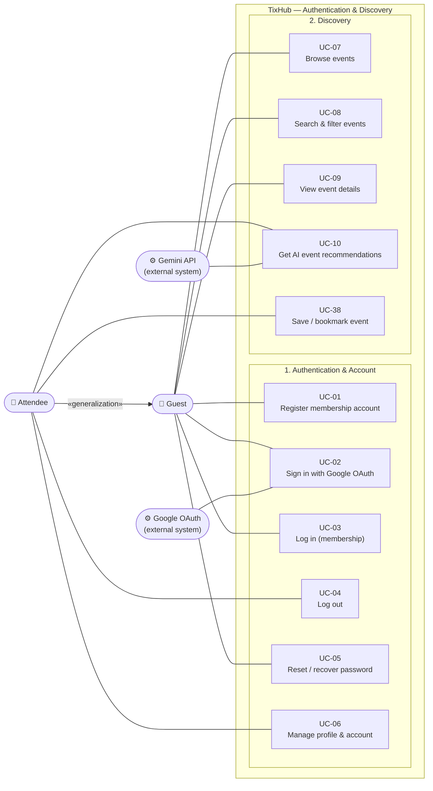
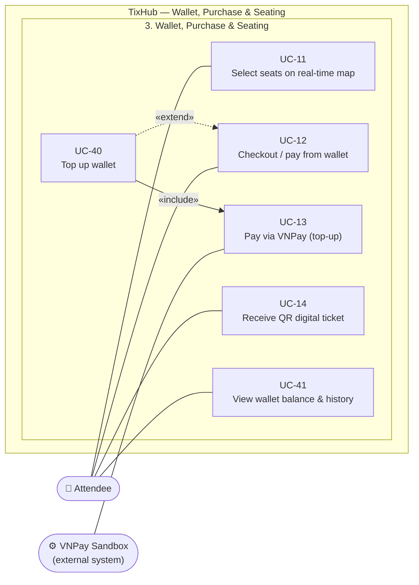
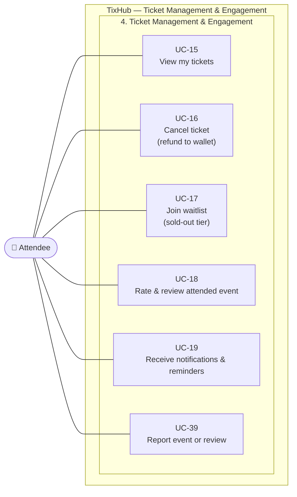
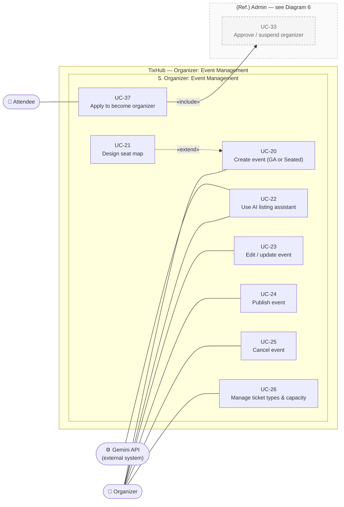
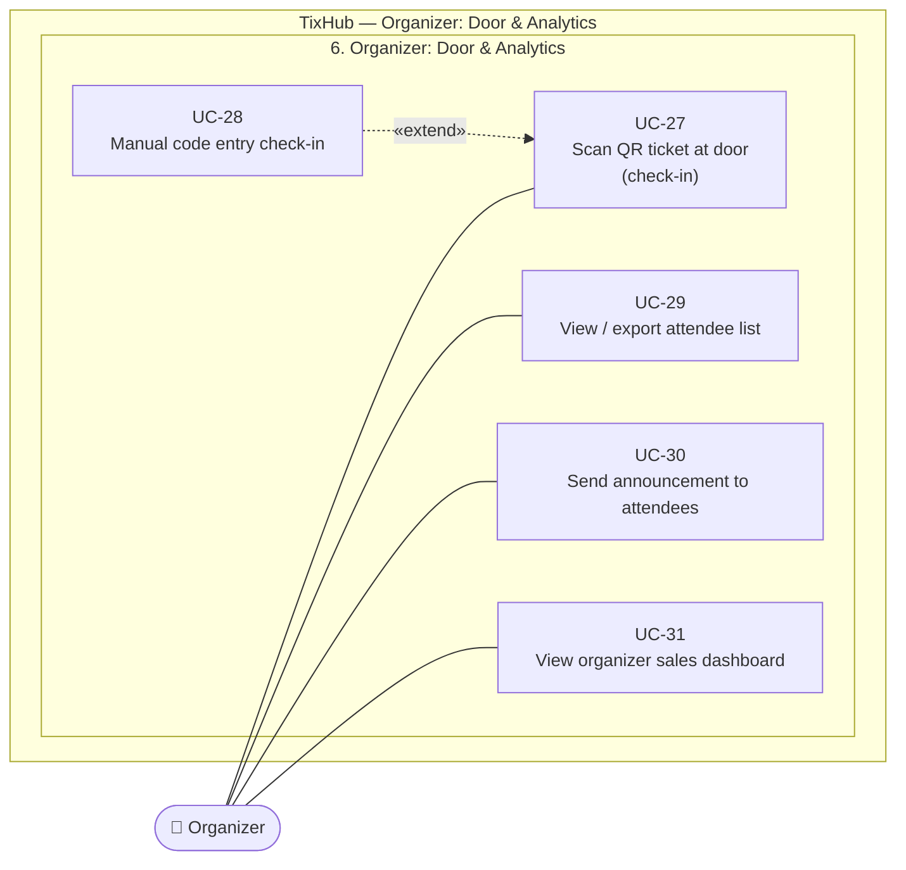
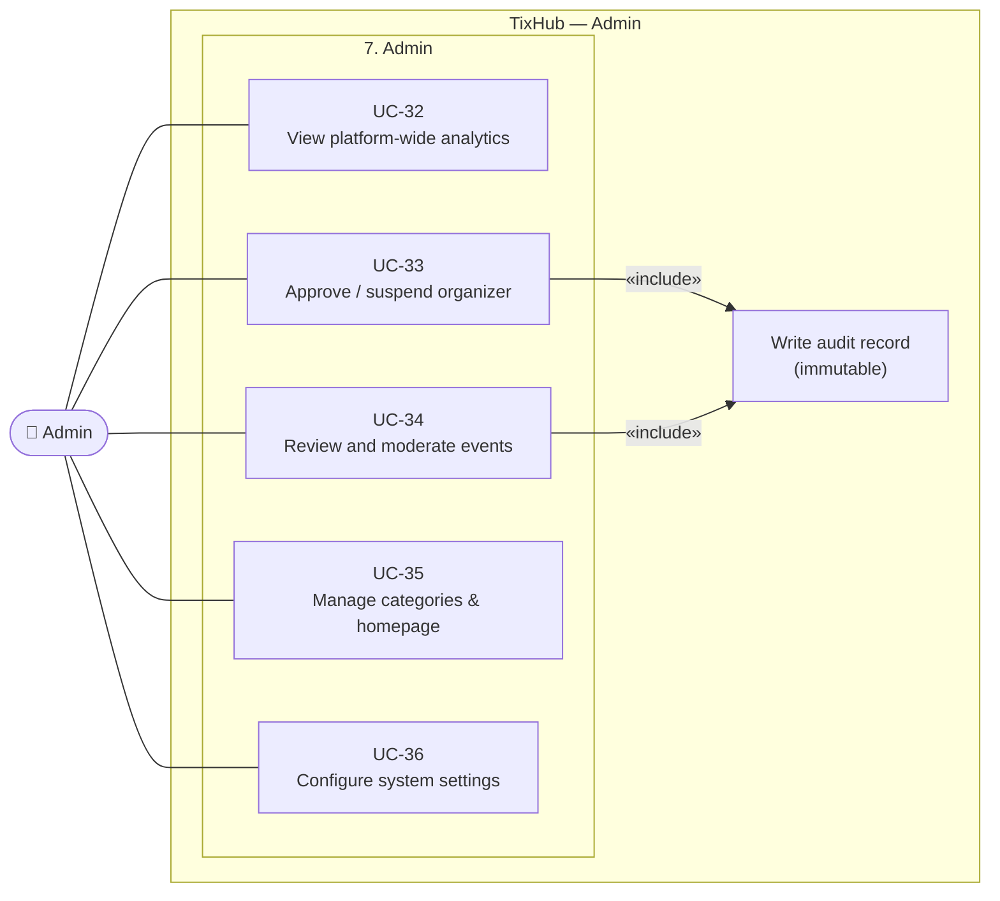
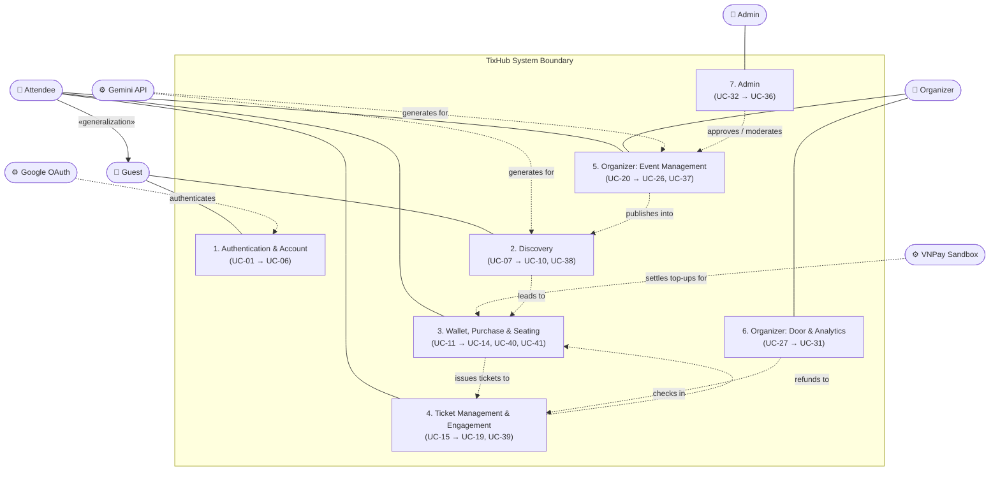

# Use-Case Specification

## TixHub: Event Ticket Sales Web Application

**Introduction to Software Engineering (Intro2SE), 24C11**

Group 02 · SoE

*July, 2026*

---

> **Scope.** All 41 Usecases and their Usecase diagrams. Requirement IDs in brackets (`SEC-10`, `REL-02`, `DATA-03`) trace to the Vision Document, Section 6.
>
> **Prototype.** Each Usecase ends with a **Prototype** block: the screens in flow order, with the matching screenshots from `Usecase/UC-XX/` embedded in ascending order (01, 02, 03, ...).
>

---

## Table of Contents

**Use-Case Model**

- [Diagram 1 — Authentication, Account & Discovery](#diagram-1--authentication-account--discovery)
- [Diagram 2 — Wallet, Purchase & Seating](#diagram-2--wallet-purchase--seating)
- [Diagram 3 — Ticket Management & Engagement](#diagram-3--ticket-management--engagement)
- [Diagram 4 — Organizer: Event Management](#diagram-4--organizer-event-management)
- [Diagram 5 — Organizer: Door & Analytics](#diagram-5--organizer-door--analytics)
- [Diagram 6 — Admin](#diagram-6--admin)
- [Full System Overview Diagram](#full-system-overview-diagram)

**1. Authentication & Account**

- **1.1** [UC-01 Register membership account](#uc-01-register-membership-account)
- **1.2** [UC-02 Sign in with Google OAuth](#uc-02-sign-in-with-google-oauth)
- **1.3** [UC-03 Log in (membership)](#uc-03-log-in-membership)
- **1.4** [UC-04 Log out](#uc-04-log-out)
- **1.5** [UC-05 Reset / recover password](#uc-05-reset--recover-password)
- **1.6** [UC-06 Manage profile & account](#uc-06-manage-profile--account)

**2. Discovery**

- **2.1** [UC-07 Browse events](#uc-07-browse-events)
- **2.2** [UC-08 Search & filter events](#uc-08-search--filter-events)
- **2.3** [UC-09 View event details](#uc-09-view-event-details)
- **2.4** [UC-10 Get AI event recommendations](#uc-10-get-ai-event-recommendations)
- **2.5** [UC-38 Save / bookmark event](#uc-38-save--bookmark-event)

**3. Wallet, Purchase & Seating**

- **3.1** [UC-11 Select seats on real-time map](#uc-11-select-seats-on-real-time-map)
- **3.2** [UC-12 Checkout / pay from wallet](#uc-12-checkout--pay-from-wallet)
- **3.3** [UC-40 Top up wallet](#uc-40-top-up-wallet)
- **3.4** [UC-13 Pay via VNPay (top-up)](#uc-13-pay-via-vnpay)
- **3.5** [UC-14 Receive QR digital ticket](#uc-14-receive-qr-digital-ticket)
- **3.6** [UC-41 View wallet balance & history](#uc-41-view-wallet-balance--history)

**4. Ticket Management & Engagement**

- **4.1** [UC-15 View my tickets](#uc-15-view-my-tickets)
- **4.2** [UC-16 Cancel ticket (refund to wallet)](#uc-16-cancel-ticket)
- **4.3** [UC-17 Join waitlist (sold-out tier)](#uc-17-join-waitlist)
- **4.4** [UC-18 Rate & review attended event](#uc-18-rate--review-attended-event)
- **4.5** [UC-19 Receive notifications & reminders](#uc-19-receive-notifications--reminders)
- **4.6** [UC-39 Report event or review](#uc-39-report-event-or-review)

**5. Organizer: Event Management**

- **5.1** [UC-20 Create event (GA or Seated)](#uc-20-create-event)
- **5.2** [UC-21 Design seat map](#uc-21-design-seat-map)
- **5.3** [UC-22 Use AI listing assistant](#uc-22-use-ai-listing-assistant)
- **5.4** [UC-23 Edit / update event](#uc-23-edit--update-event)
- **5.5** [UC-24 Publish event](#uc-24-publish-event)
- **5.6** [UC-25 Cancel event](#uc-25-cancel-event)
- **5.7** [UC-26 Manage ticket types & capacity](#uc-26-manage-ticket-types--capacity)
- **5.8** [UC-37 Apply to become organizer](#uc-37-apply-to-become-organizer)

**6. Organizer: Door & Analytics**

- **6.1** [UC-27 Scan QR ticket at door (check-in)](#uc-27-scan-qr-ticket-at-door)
- **6.2** [UC-28 Manual code entry check-in](#uc-28-manual-code-entry-check-in)
- **6.3** [UC-29 View / export attendee list](#uc-29-view--export-attendee-list)
- **6.4** [UC-30 Send announcement to attendees](#uc-30-send-announcement-to-attendees)
- **6.5** [UC-31 View organizer sales dashboard](#uc-31-view-organizer-sales-dashboard)

**7. Admin**

- **7.1** [UC-32 View platform-wide analytics](#uc-32-view-platform-wide-analytics)
- **7.2** [UC-33 Approve / suspend organizer](#uc-33-approve--suspend-organizer)
- **7.3** [UC-34 Review and moderate events](#uc-34-review-and-moderate-events)
- **7.4** [UC-35 Manage categories & homepage](#uc-35-manage-categories--homepage)
- **7.5** [UC-36 Configure system settings](#uc-36-configure-system-settings)

---

# Use-Case Model

> *Conducted by Nguyễn Thành Đạt and Nguyễn Tấn Hiệu.*

> **Reading the diagrams.** Mermaid has no standard UML use-case shape, so these diagrams use a flowchart: actors are stadium nodes, use cases are rectangles, and the system boundary is a subgraph. A plain line is an actor association. `«include»` is a solid arrow from the including use case to the included one. `«extend»` is a dashed arrow **from the extending use case to its base**. Grey dashed nodes are reference copies of use cases specified elsewhere in this document.

---

## Diagram 1: Authentication, Account & Discovery

> Covers sections **1. Authentication & Account and 2. Discovery**.

---

## Diagram 2: Wallet, Purchase & Seating

> Covers section **3. Wallet, Purchase & Seating**.

---

## Diagram 3: Ticket Management & Engagement

> Covers section **4. Ticket Management & Engagement**.

---

## Diagram 4: Organizer: Event Management

> Covers section **5. Organizer: Event Management**.

---

## Diagram 5: Organizer: Door & Analytics

> Covers section **6. Organizer: Door & Analytics**.

---

## Diagram 6: Admin

> Covers section **7. Admin**.

---

## Full System Overview Diagram

> High-level view of all actors, the external systems, and the seven functional groups inside the TixHub boundary.

---

# Authentication & Account

> *Conducted by Lương Hưng Phát, Nguyễn Minh Khoa, and Nguyễn Anh Khôi.*

## UC-01 Register membership account

| Field | Value |
|---|---|
| **Use-case ID** | UC-01 |
| **Actor(s)** | Guest (primary) |
| **Description** | Guest creates a TixHub membership account with email, nickname, and password; a phone number is optional but, when supplied, is unique and usable to sign in. |

**Preconditions**
- Guest is not signed in.
- Guest can reach the registration page.

**Basic flow**
1. Guest opens the registration page.
2. Guest enters email, nickname, and password (with confirmation), and optionally a phone number.
3. System validates every field against the schema (type, length, format) `[SEC-07]`; the email is lowercased and trimmed and the phone normalised to one canonical form before any uniqueness check.
4. System checks that the email, and the phone if one was supplied, are not already registered.
5. System hashes the password with bcrypt (cost factor 12) `[SEC-02]`.
6. In one transaction the system creates the account (Attendee capability, `provider='email'`) **and its zero-balance wallet**, so no later flow has to cope with a walletless account.
7. System signs the guest in immediately and shows a success confirmation. **There is no email-verification step** and nothing is gated on proving the address (schema decision D4).

**Alternative flows**
- **A1. Invalid field format:** at step 3 a field fails validation; system highlights the field with an inline error and stays on the form.
- **A2. Email/phone already registered:** at step 4 the identifier exists; system shows "account already exists" and offers a link to log in (UC-03).
- **A3. Password mismatch:** password and confirmation differ; system shows a mismatch error.
- **A4. Weak password:** password fails strength rules; system shows the requirement and rejects.
- **A5. Registration rate limit hit:** too many attempts from one source; the system throttles that source `[SEC-10]`. It never locks an account, because no lockout state exists anywhere (schema decision D6).
- **A6. Guest chooses Google instead:** guest clicks "Sign in with Google"; flow switches to UC-02.
- **A7. Email belongs to a Google account:** registration is refused with an instruction to use the Google button. The two account kinds are **never** linked or merged (D5).
- **A8. Simultaneous registration on one identifier:** two requests race; the database's uniqueness constraint decides, so exactly one account is created and the other is refused.

**Postconditions**
- **Success:** a new Attendee account and its wallet exist, with a salted password hash; guest is authenticated.
- **Failure:** no account and no wallet are created. The form keeps valid input and shows the error.

**Special requirements**
- Plaintext passwords are never stored or logged `[SEC-02]`.
- All traffic over HTTPS/TLS `[SEC-01]`.

**Prototype.**

  
  →
  
  →
  
  →
  

---

## UC-02 Sign in with Google OAuth

| Field | Value |
|---|---|
| **Use-case ID** | UC-02 |
| **Actor(s)** | Guest (primary); Google OAuth (secondary) |
| **Description** | Guest signs in or registers using their Google account; credential handling is delegated to Google, so no password is stored on TixHub. |

**Preconditions**
- Guest is not signed in.
- Guest has a Google account.

**Basic flow**
1. Guest clicks "Sign in with Google".
2. System redirects to the Google OAuth consent screen `«include» Google OAuth`.
3. Guest authenticates with Google and grants consent.
4. Google redirects back with an authorization result.
5. System verifies the credential **with Google** before trusting any claim in it, then reads the verified profile.
6. System looks the account up by Google's **stable subject id**, never by the email address, so a change of address at Google does not orphan the account. If none exists, it creates a new Attendee account and its wallet, with no password stored `[SEC-02]`.
7. System establishes an authenticated session and lands the user on their home page.

**Alternative flows**
- **A1. Guest cancels consent:** guest denies at step 3; Google returns an error; system returns to login with "sign-in cancelled".
- **A2. Google returns an error or is unreachable:** system shows "Google sign-in unavailable, try again or use email".
- **A3. Email already registered as a membership account:** the sign-in is **refused** with an instruction to sign in with the password instead. The system **never** links or merges the two (schema decision D5). With no verified address, auto-linking would let anyone register a password account on a stranger's email and inherit it the moment the real owner used Google.
- **A4. Suspended account:** the matched account is suspended; system refuses sign-in and shows the suspension notice. The check runs only **after** Google has confirmed the identity, so it cannot be used to probe which accounts exist `[SEC-03]`.

**Postconditions**
- **Success:** the user is authenticated via Google; a session exists; no password is stored for this account.
- **Failure:** no session is established.

**Special requirements**
- HTTPS/TLS throughout `[SEC-01]`.

**Prototype.**

  
  →
  
  →
  
  →
  

---

## UC-03 Log in (membership)

| Field | Value |
|---|---|
| **Use-case ID** | UC-03 |
| **Actor(s)** | Guest (primary) |
| **Description** | Registered user signs in with their email/phone and password to reach their role's authenticated area. |

**Preconditions**
- User has a membership account.
- User is not signed in.

**Basic flow**
1. Guest opens the login page.
2. Guest enters identifier (email or phone) and password.
3. System validates the input format `[SEC-07]`.
4. System matches the submitted value as an email if it looks like one and as a phone number otherwise (never across both kinds), then verifies the password against the stored bcrypt hash `[SEC-02]`.
5. System issues a short-lived access token and a stored, rotating refresh token (one family per login) and establishes the session `[SEC-03]`.
6. System redirects the user to the home page for their role (Attendee / Organizer / Admin).

**Alternative flows**
- **A1. Wrong credentials:** verification fails; system shows a generic "invalid email or password" (no account enumeration), in time indistinguishable from A2.
- **A2. Account not found:** treated exactly as A1, with the same message and the same response time.
- **A3. Repeated failures:** the **source** is throttled once its rate is exceeded, and the response to a repeatedly-failing **identifier** is delayed progressively, applied identically to identifiers that match no account. **A correct password is always accepted; no lockout state exists** (schema decision D6) `[SEC-10]`.
- **A4. Suspended or banned account:** login refused with a suspension notice, checked only **after** the password verifies `[SEC-03]`.
- **A5. User has no password (Google account):** system says this account uses Google sign-in (UC-02).
- **A6. User forgot password:** user clicks "forgot password" → UC-05.

**Postconditions**
- **Success:** the user is authenticated; an access token and a refresh-token family are issued.
- **Failure:** no session; a `login_failure` auth event is recorded against a **hashed** form of the attempted identifier, which may match no account. No counter is kept on the account, so there is nothing to lock.

**Special requirements**
- Per-source throttle plus a progressive per-identifier delay, never an account lockout `[SEC-10]`; HTTPS `[SEC-01]`.

**Prototype.**

  
  →
  
  →
  
  →
  

---

## UC-04 Log out

| Field | Value |
|---|---|
| **Use-case ID** | UC-04 |
| **Actor(s)** | Attendee / Organizer / Admin (primary) |
| **Description** | Signed-in user ends their session. |

**Preconditions**
- User is signed in.

**Basic flow**
1. User selects "Log out" (or "Log out everywhere").
2. System revokes the refresh token (the whole family for this login, or every family on the account for "log out everywhere") and clears the session cookie.
3. System redirects to the public landing page.

**Alternative flows**
- **A1. Session already expired:** system clears any client state and redirects to landing without error.
- **A2. Replayed after logout:** the revoked credential is refused on the **very next request**, because session liveness is read from the database per request, not carried inside the token `[SEC-03]`.
- **A3. A superseded credential is presented:** treated as theft evidence, so the whole family descended from that one login is revoked (`reuse_detected`). The account's other logins are untouched.

**Postconditions**
- The refresh token (or family) is revoked with a recorded reason; the user is signed out on the next request.

**Special requirements.** None beyond standard session handling.

**Prototype.**

  
  →
  
  →
  

---

## UC-05 Reset / recover password

| Field | Value |
|---|---|
| **Use-case ID** | UC-05 |
| **Actor(s)** | Guest (primary) |
| **Description** | User who forgot their password requests a reset link and sets a new password. |

**Preconditions**
- User has a membership account with an email on file.

**Basic flow**
1. Guest opens "Forgot password" and enters their email.
2. System validates the email format `[SEC-07]`.
3. System generates a single-use, time-limited reset token and emails a reset link (always shows a neutral "if the email exists, a link was sent" message; no account enumeration).
4. Guest opens the link and enters a new password (with confirmation).
5. System validates the token and the new password strength.
6. System hashes the new password (bcrypt cost 12) and updates the account `[SEC-02]`.
7. System invalidates existing sessions/tokens and confirms success.

**Alternative flows**
- **A1. Email not registered:** step 3 still shows the neutral message; no email is sent.
- **A2. Expired, used, or invalid token:** at step 5 system rejects and offers to request a new link.
- **A3. Weak or mismatched new password:** system shows the rule and stays on the form.
- **A4. Reset requested too often:** the limit applies **per submitted identifier** (keyed on a hash of the identifier plus the source), never per existing account. A limit that could only fire on a real account would itself disclose which addresses are registered `[SEC-10]`.
- **A5. The address belongs to a Google account:** the user still sees the neutral message, but no reset link is issued. Setting a password there would be a back-door link between the two account kinds (schema decision D5).
- **A6. The account is suspended:** the response is identical to every other case; no link is issued and no new session can be obtained by this route.

**Postconditions**
- **Success:** password hash updated; old sessions invalidated.
- **Failure:** password unchanged.

**Special requirements**
- Reset endpoints rate-limited `[SEC-10]`; token is single-use and time-limited; HTTPS `[SEC-01]`.

**Prototype.**

  
  →
  
  →
  
  →
  
  →
  

---

## UC-06 Manage profile & account

| Field | Value |
|---|---|
| **Use-case ID** | UC-06 |
| **Actor(s)** | Attendee / Organizer / Admin (primary) |
| **Description** | Signed-in user views and updates their profile (nickname, phone, avatar) and changes their password. |

**Preconditions**
- User is signed in.

**Basic flow**
1. User opens the account/profile page.
2. System shows current profile fields.
3. User edits one or more fields (nickname, phone, avatar) and/or requests a password change. The avatar is **uploaded as an image file** and stored on the application's own host; arbitrary URL entry is not offered (the one exception is the picture Google supplies at sign-up).
4. System validates the input `[SEC-07]`, accepting **only** the fields this update may change and ignoring anything else in the submission, so an admin flag or a wallet balance sent here changes nothing.
5. For a password change, system re-authenticates (asks current password) and hashes the new one `[SEC-02]`.
6. System saves the changes and confirms.

**Alternative flows**
- **A1. Invalid input:** field-level errors; no save.
- **A2. Phone already in use by another account:** system rejects that field under the same uniqueness rule as registration, so a sign-in identifier cannot be taken over after the fact.
- **A3. Current password wrong (on password change):** system rejects the password change; other edits stay saveable.
- **A4. Google account:** password-change section is hidden or disabled.
- **A5. User cancels:** edits discarded, original values retained.
- **A6. Password changed successfully:** **every other** session on the account ends on its next request, while the device that made the change stays signed in. People change a password because they suspect someone else has access `[SEC-03]`.
- **A7. Uploaded file is not a real image:** the upload is refused on its actual content (magic bytes), not its extension; SVG is refused outright.
- **A8. Email change:** not offered. Changing the address that identifies an account needs its own ownership-proof flow and is deferred.

**Postconditions**
- **Success:** profile / password updated.
- **Failure:** no change persisted.

**Special requirements**
- Only personal data needed for the service is stored `[STD-02]`; role-based access enforced `[SEC-04]`.

**Prototype.**

  
  →
  
  →
  
  →
  
  →
  

---

# Discovery

> *Conducted by Lương Hưng Phát, Nguyễn Minh Khoa, and Nguyễn Anh Khôi.*

## UC-07 Browse events

| Field | Value |
|---|---|
| **Use-case ID** | UC-07 |
| **Actor(s)** | Guest (primary); Attendee (inherited) |
| **Description** | Any visitor browses the public catalog on the homepage or listing page. An event is public only when it is **on sale**, **admin-approved**, and owned by a **currently approved organizer**. All three conditions are evaluated live on every request. |

**Preconditions**
- At least one event meets the visibility predicate (otherwise an empty state is shown).

**Basic flow**
1. Visitor opens the homepage / events listing.
2. System loads publicly-visible events (paginated) with cover image, title, earliest upcoming showtime, city, and price-from. Drafts, events awaiting review, flagged, removed, cancelled, and suspended-organizer events are never included.
3. Visitor scrolls / paginates through the catalog.
4. Visitor selects an event to view details → UC-09.

**Alternative flows**
- **A1. No events available:** system shows an empty state.
- **A2. Visitor applies a search or filter:** flow moves to UC-08.
- **A3. Slow or failed load:** system shows a loading skeleton, then a retry option on failure.

**Postconditions**
- Visitor has viewed a page of published events; no state change.

**Special requirements**
- Initial page load < 2 s on a warm backend `[PERF-01]`; responsive from 360 px to 1920 px `[PLAT-01]`.

**Prototype.**

  
  →
  
  →
  
  →
  

---

## UC-08 Search & filter events

| Field | Value |
|---|---|
| **Use-case ID** | UC-08 |
| **Actor(s)** | Guest (primary); Attendee (inherited) |
| **Description** | Visitor narrows the catalog by keyword, category, date, city, price, and availability. |

**Preconditions**
- The events listing is reachable.

**Basic flow**
1. Visitor enters a keyword and/or selects filters (category, date range, city, price range, availability). Active filters combine conjunctively; a keyword matches title, lineup, and description, ranked title > lineup > description with the soonest showtime breaking ties.
2. System validates and applies the filters against the indexed catalog `[PERF-04]`.
3. System returns the matching published events, paginated.
4. Visitor refines filters or opens a result → UC-09.

**Alternative flows**
- **A1. No matches:** system shows a "no results" state and suggests clearing filters.
- **A2. Invalid filter combination (end date before start, for example):** system corrects or flags the range.
- **A3. Visitor clears all filters:** system returns to the full catalog (UC-07).
- **A4. Large catalog:** results stay < 1 s p95 up to 500 events under normal load `[PERF-04]`.
- **A5. Sold-out events in the result set:** they are **still listed**, labelled "Hết vé" and sorted after events with availability; the availability filter hides them. Sold-out status is derived from the showtimes, never stored on the event.

**Postconditions**
- Visitor sees a filtered result set; no state change.

**Special requirements**
- Searched columns (name, date, category) are indexed `[PERF-04]`.

**Prototype.**

  
  →
  
  →
  
  →
  

---

## UC-09 View event details

| Field | Value |
|---|---|
| **Use-case ID** | UC-09 |
| **Actor(s)** | Guest (primary); Attendee (inherited) |
| **Description** | Visitor opens a single event to see full details: description, date/time, location, ticket types, prices, seat availability, organizer info, and ratings. |

**Preconditions**
- The event is publicly visible: on sale, admin-approved, and owned by a currently approved organizer.

**Basic flow**
1. Visitor selects an event, reached by its **stable slug** (unchanged by later title edits).
2. System loads the event details, ticket tiers with VND prices, upcoming showtimes and their availability, venue guide, refund policy, related events, organizer profile, and aggregated rating `[UC-18]`.
3. Visitor reviews the information.
4. Visitor proceeds to buy (→ UC-11 for seated, or UC-12 for GA) or joins the waitlist (→ UC-17).

**Alternative flows**
- **A1. Event not found, still awaiting review, flagged, removed, or its organizer suspended:** system shows the same "not available" page in every case, so guessing a slug or id discloses nothing about what exists.
- **A2. Tier sold out:** the buy action for that tier is replaced by "Join waitlist" (UC-17); other tiers stay purchasable. The event reads as sold out only when every tier is.
- **A3. Event cancelled by organizer:** system shows a cancelled banner and disables purchase.
- **A4. Guest starts checkout:** system prompts registration or login before checkout `[UC-01/UC-03]`.

**Postconditions**
- Visitor has viewed the full event; no state change.

**Special requirements**
- WCAG 2.1 AA contrast `[USE-02]`; Vietnamese UI `[USE-03]`.

**Prototype.**

  
  →
  
  →
  
  →
  

---

## UC-10 Get AI event recommendations

| Field | Value |
|---|---|
| **Use-case ID** | UC-10 |
| **Actor(s)** | Attendee (primary); Google Gemini API (secondary) |
| **Description** | Signed-in attendee asks a chatbot for event suggestions; Gemini answers using the attendee's tickets, saved events, and browsing history. Assistive and non-blocking. |

**Preconditions**
- Attendee is signed in.

**Basic flow**
1. Attendee opens the recommendation chatbot and/or asks a natural-language question.
2. System checks the per-user rate limit (≤ 10 req/hour) `[SEC-08]` and the cache `[SCAL-02]`.
3. On a cache miss, system builds a prompt from the attendee's tickets/saved/browsing context and calls Gemini `«include» Gemini` `[PERF-05]`.
4. System caches and displays the recommended events, each linking to UC-09.
5. Attendee opens a recommended event → UC-09.

**Alternative flows**
- **A1. Cache hit:** system returns the cached recommendation without calling Gemini `[SCAL-02]`.
- **A2. Per-user rate limit exceeded:** system blocks the call and shows "try again later" `[SEC-08]`.
- **A3. Platform-wide quota threshold reached:** system serves the last cached result or a non-AI fallback such as popular or related events, never an error `[SCAL-03]` `«extend»`.
- **A4. Gemini timeout (~8 s) or error:** system falls back to non-AI suggestions `[PERF-05]` `[SCAL-03]`.
- **A5. New user with no history:** system falls back to popular or curated events.

**Postconditions**
- **Success:** recommendations shown (from AI or cache).
- **Fallback:** non-AI suggestions shown; core browsing unaffected.

**Special requirements**
- AI is non-blocking and off the purchase critical path; UI stays interactive with a loading state `[PERF-05]`; per-user rate limit `[SEC-08]`.

**Prototype.**

  
  →
  
  →
  
  →
  
  →
  
  

---

## UC-38 Save / bookmark event

| Field | Value |
|---|---|
| **Use-case ID** | UC-38 |
| **Actor(s)** | Attendee (primary) |
| **Description** | Signed-in attendee saves (bookmarks) an event for later. Saved events feed the AI recommendation context (UC-10) and appear in a "Saved" list. |

**Preconditions**
- Attendee is signed in.
- The event exists and is published.

**Basic flow**
1. Attendee views an event (UC-09) or an event card (UC-07/UC-08).
2. Attendee taps the "Save" / bookmark control.
3. System adds the event to the attendee's saved list and reflects the saved state on the control.
4. Saved events become part of the attendee's recommendation context (UC-10).

**Alternative flows**
- **A1. Unsave:** attendee taps the control again; system removes the event from the saved list.
- **A2. Guest taps Save:** system prompts registration or login (UC-01/UC-03), then completes the save.
- **A3. Event later removed or cancelled:** the saved entry shows an unavailable or cancelled state.
- **A4. Open saved list:** attendee views all saved events and navigates to any of them (UC-09).

**Postconditions**
- **Success:** the event is in (or removed from) the attendee's saved list.
- **Failure:** saved list unchanged.

**Special requirements**
- Saved data is per-user and role-scoped `[SEC-04]`; used only for the attendee's own recommendations `[STD-02]`.

**Prototype.**

  
  →
  
  →
  
  →
  

---

# Wallet, Purchase & Seating

> *Conducted by Lương Hưng Phát, Nguyễn Minh Khoa, and Nguyễn Anh Khôi.*

## UC-11 Select seats on real-time map

| Field | Value |
|---|---|
| **Use-case ID** | UC-11 |
| **Actor(s)** | Attendee (primary) |
| **Description** | For a reserved-seating event, the attendee picks seats on a live seat map and **each click holds that seat immediately** (hold-on-select). A held seat is theirs for a short window, so no two buyers get the same seat. For a general-admission showtime the same machinery holds a **quantity** in a tier instead of specific seats. This is TixHub's core differentiator. |

**Preconditions**
- The event is publicly visible, on sale, and has available seats (or, for GA, remaining stock).
- **Viewing the map is open to guests** (Feature 002 FR-012). **Placing a hold requires a signed-in
  account**: a hold records its owner (`hold_owner_id`) and there are no anonymous holds, so the first
  click that would hold a seat prompts sign-in (UC-01/UC-03) and resumes afterwards.

**Basic flow**
1. Attendee opens the seat map for a seated event.
2. System loads the authoritative seat map (REST) and subscribes to the showtime's live channel, showing available / held / sold seats `[PERF-03]`.
3. Attendee clicks one or more available seats.
4. System places a concurrency-safe hold on each selected seat (DB row lock) and broadcasts the new status to all viewers `[DATA-02]`. The **first** hold creates the attendee's reservation for that showtime and starts the hold TTL (**7 min, configurable**) `[REL-02]`. Every later seat joins that **same** reservation and shares its one clock, so adding a seat never extends the window.
5. System reflects the held seats in the attendee's selection and shows the running total in VND integers `[STD-03]` and the remaining time.
6. Attendee confirms the selection and proceeds to checkout with that reservation → UC-12.

**Alternative flows**
- **A1. Seat taken concurrently:** the clicked seat was just held or sold by another buyer; system rejects the click, updates the map live, and asks the attendee to pick another `[DATA-02]`.
- **A2. Hold TTL expires before checkout:** the 7-min window lapses, or the client disconnects. A sweep releases **every** seat in the reservation together, marks it expired, and notifies the attendee to reselect, within about a minute of expiry and without the client being connected. This is the **only** timer on a seat; there is no payment window `[REL-02]`, `[DATA-03]`.
- **A3. Attendee deselects a seat:** system releases that hold and broadcasts availability; the rest of the reservation is untouched. Cancelling the whole selection releases every seat at once.
- **A4. WebSocket disconnect or reconnect:** system re-syncs the full map on reconnect and shows the attendee their own still-valid holds; server-side holds persist per TTL. Live updates are advisory, since the database is the source of truth, so a stale click is still correctly refused `[DATA-02]`.
- **A5. Attendee abandons:** holds auto-release on TTL even without action `[REL-02]`.
- **A6. Guest clicks a seat:** the system prompts registration or login (UC-01/UC-03) and, once signed in, places the hold and continues. No hold exists while the visitor is a guest, so nothing is reserved in the meantime and the seat may be taken by someone else first `[SEC-04]`.
- **A7. Per-buyer cap reached:** the attendee already holds the maximum tickets for this showtime (**default 8, configurable** via UC-36). The extra seat is refused with the reason and their existing holds are untouched. The cap counts all their active holds server-side, so a second tab cannot exceed it.
- **A8. General admission (no seat map):** the attendee picks a **quantity** in a tier instead of seats. The system holds that quantity, the tier's remaining stock drops for all viewers, and it is restored on release or expiry. More than the remaining stock is refused, and concurrent reservations are serialized so a tier is never oversold `[DATA-02]`.
- **A9. Re-clicking a seat the attendee already holds:** treated as an idempotent success, with no duplicate hold and no error.
- **A10. Showtime withdrawn while holding** (organizer cancels, admin removes the event, or the showtime starts): new holds are refused and the existing ones release on the next sweep; the attendee is told the showtime is no longer on sale.

**Postconditions**
- **Success:** the selected seats (or GA quantity) are `held` for this attendee inside **one active reservation** for that showtime; checkout can begin.
- **Failure / timeout:** seats return to `available` (GA quantity returns to the tier's remaining).

**Special requirements**
- Seat update round-trip < 1 s p95 `[PERF-03]`; ≥ 60 concurrent users on one map `[PERF-06]`; holds are DB-serialized `[DATA-02]`; at most **one active reservation per (attendee, showtime)**; hold and release requests are rate-limited per attendee to resist hold-spam `[SEC-04]`.
- All actions are authorized server-side against the signed-in identity. The client never asserts who it is `[SEC-04]`.

**Prototype.**

  
  →
  
  →
  
  →
  
  →
  
  →
  
  →
  

---

## UC-12 Checkout / pay from wallet

| Field | Value |
|---|---|
| **Use-case ID** | UC-12 |
| **Actor(s)** | Attendee (primary) |
| **Description** | Attendee reviews their order (GA quantity or held seats) and pays from their wallet balance. The whole sale (debit, order, seats, tickets) commits as one local transaction. No external system is involved. `«extend»` UC-40 when the balance is short. |

**Preconditions**
- Attendee is signed in and has a wallet.
- For seated events, seats are held (UC-11); for GA, tickets are available.

**Basic flow**
1. Attendee reviews the order summary (event, seats/quantity, total in VND integer `[STD-03]`) alongside their current wallet balance.
2. Attendee confirms and selects "Pay from wallet".
3. System locks the wallet row and re-verifies, inside the transaction, that the reservation is still `active` and the seats are still held by this attendee `[DATA-02]`.
4. System verifies the balance covers the total.
5. In one ACID transaction `[DATA-01]` the system: creates the order as `paid`, debits the wallet, appends a `purchase` row to the ledger, transitions the seats to `sold`, and issues the tickets with their `refundable_amount` allocation → UC-14.
6. System shows the confirmation and the updated balance.

**Alternative flows**
- **A1. Guest at checkout:** system prompts registration or login (UC-01/UC-03), then resumes.
- **A2. Insufficient balance:** system rejects with the exact shortfall and offers to top up `«extend» UC-40`. Nothing is created. The hold is **never frozen**; it keeps its ordinary TTL, except that *starting* the top-up spends the **one-time grace** (+7 min once, ceiling 14 min from the reservation's creation, per UC-40 step 4). A second top-up extends nothing, so no one can lock a seat map for free `[REL-02]`, `[DATA-03]`.
- **A3. Hold expired before confirming:** system informs the attendee and returns to seat selection (UC-11) or the availability check. No money moved.
- **A4. GA tier sold out during review:** the tier's remaining quantity reached zero while the attendee reviewed; system rejects the order and offers that tier's waitlist (UC-17).
- **A5. Attendee cancels checkout:** no order is created; holds release on TTL.
- **A6. Concurrent debit on the same wallet:** the row lock serialises them, so the second sees the balance left by the first and may fail with A2. A balance can never go negative `[DATA-04]`.
- **A7. Failure mid-transaction:** everything rolls back. No order, no debit, no ledger row, no ticket. Seats stay `held` `[DATA-01]`.

**Postconditions**
- **Success:** a `paid` order exists, the wallet is debited by exactly the order total, the ledger explains it, seats are `sold`, and tickets exist.
- **Failure:** nothing persists; balance unchanged; seats resolve per their normal lifecycle.

**Special requirements**
- ≤ 5 interactions with sufficient balance, no external hand-off in the path `[USE-01]`; single ACID transaction `[DATA-01]`; wallet row lock serialises concurrent debits `[DATA-02]`; ledger invariants hold `[DATA-04]`; VND integers `[STD-03]`.

**Prototype.**

  
  →
  
  →
  
  →
  
  →
  
  →
  

---

## UC-40 Top up wallet

| Field | Value |
|---|---|
| **Use-case ID** | UC-40 |
| **Actor(s)** | Attendee (primary); VNPay Sandbox (secondary) |
| **Description** | Attendee adds store credit to their wallet through the VNPay sandbox. This is the only way money enters TixHub. `«include»` UC-13. Reached from the wallet page or from a short balance at checkout. |

**Preconditions**
- Attendee is signed in.

**Basic flow**
1. Attendee opens Top up, either from the wallet page or from the shortfall prompt in UC-12 A2, in which case the amount is pre-filled with the shortfall.
2. Attendee picks a preset (100k / 200k / 500k / 1M) or enters a custom amount.
3. System validates `5,000 ≤ amount ≤ 10,000,000` **and** that the resulting balance would not exceed the 20,000,000₫ ceiling. This check runs **before** any hand-off: rejecting after payment would strand money that cannot be returned `[DATA-04]`.
4. System records the top-up as `initiated` with a unique reference (carrying the originating `reservationId`, if any) and hands off to payment `«include» UC-13`. When a `reservationId` is carried, the system also extends that hold **once** by the configurable grace (default +7 min), never past the absolute ceiling of **14 min** from the reservation's creation `[REL-02]`.
5. On the validated IPN, the system credits the wallet and appends a `topup` row to the ledger.
6. System returns the attendee to where they started: the checkout they left, or the wallet page.

**Alternative flows**
- **A1. Amount below the minimum or above the per-transaction maximum:** rejected inline, no hand-off.
- **A2. Balance ceiling would be exceeded:** rejected inline with the maximum they may add right now.
- **A3. Attendee abandons on the VNPay page:** the top-up stays `initiated` and no balance moves. It appears as *Pending* in the wallet history, never as lost money.
- **A4. Payment fails:** top-up marked `failed`; balance unchanged; attendee may retry.
- **A5. IPN never arrives:** the reconciliation sweep queries VNPay (`querydr`) for `initiated` records older than ~15 minutes and settles them `[REL-03]`.
- **A6. Returning to an expired hold:** the one-time grace from step 4 usually carries the hold across the VNPay detour, but it is bounded. If the grace was already spent, or the 14-min ceiling passed, the seats were released while the attendee was paying. System says so plainly and returns them to seat selection. **The money is safely in the wallet**; only the seat was lost `[REL-02]`.
- **A7. Duplicate or replayed IPN:** credits nothing `[REL-03]`, `[SEC-06]`.
- **A8. Second top-up during the same hold:** the window is **not** extended again, so the reservation still expires at its ceiling. A top-up started after the ceiling revives nothing.

**Postconditions**
- **Success:** balance increased by exactly the paid amount; one `topup` ledger row joins 1:1 to a successful gateway transaction `[DATA-04]`.
- **Failure:** balance unchanged; the record is `initiated` or `failed`; no order is affected, and no seat beyond the single bounded grace applied at step 4.

**Special requirements**
- Credit only via signed server-to-server IPN, never the return URL `[SEC-06]`; idempotent `[REL-03]`; no card data stored `[SEC-05]`; VND integers `[STD-03]`; ≤ 3 interactions to hand-off `[USE-01]`.
- Non-negativity is enforced by a schema constraint. The balance ceiling is enforced at top-up time only, so a refund is never blocked by it `[DATA-04]`.
- The IPN is server-to-server, so the backend must be **publicly reachable**: a deployed host or a tunnel. `localhost` cannot receive it.

**Prototype.**

  
  →
  
  →
  
  →
  
  →
  
  →
  
  →
  

---

## UC-13 Pay via VNPay

| Field | Value |
|---|---|
| **Use-case ID** | UC-13 |
| **Actor(s)** | Attendee (primary); VNPay Sandbox (secondary) |
| **Description** | Attendee completes a **top-up** payment on the VNPay sandbox; TixHub credits the wallet only via VNPay's signed server-to-server callback. TixHub never sees card data. This Usecase touches no seat, no order, and no ticket. |

**Preconditions**
- An `initiated` top-up record exists with a unique reference (UC-40).

**Basic flow**
1. System redirects the attendee to the VNPay sandbox with the top-up reference and amount, signed with `vnp_HashSecret`.
2. Attendee completes payment on VNPay `«include» VNPay`.
3. VNPay sends a signed server-to-server callback (IPN) to TixHub.
4. System validates, in order: signature (`97` on failure), reference exists (`01`), amount matches (`04`), record not already terminal (`02`), response code `00` `[SEC-06]`.
5. On a valid `success` callback, system locks the wallet row, marks the top-up `success`, credits the balance, and appends the `topup` ledger row, all in one ACID transaction `[DATA-01]`, `[DATA-04]`.
6. System answers VNPay with `RspCode 00`; VNPay retries otherwise, which is why step 5 must be idempotent `[REL-03]`.

**Alternative flows**
- **A1. Invalid or forged callback:** signature or amount fails; no balance moves; the callback is rejected `[SEC-06]`.
- **A2. Duplicate or replayed callback:** the update is guarded on `status='initiated'` and the reference is unique, so a replay updates zero rows and credits nothing. The same result is returned `[REL-03]`.
- **A3. Payment failure callback:** top-up marked `failed`; balance unchanged.
- **A4. No callback:** the record stays `initiated` and is settled by the `querydr` reconciliation sweep; the attendee sees it as *Pending*. **No seat or inventory is affected either way**, because a top-up holds nothing `[DATA-03]`.
- **A5. Late `success` IPN:** still credited, whenever it lands. There is no expiry window to miss, because no inventory is waiting on it, so the late-callback problem does not arise in this design `[DATA-03]`.
- **A6. Browser return URL only, with no callback:** treated as display-only; state never changes on the return URL. The client polls the top-up status instead `[SEC-06]`.

**Postconditions**
- **Success:** the wallet balance is increased by exactly the paid amount and one ledger row records it.
- **Failure:** balance unchanged; the top-up record is `initiated` or `failed`.

**Special requirements**
- Balance changes only via signed callback `[SEC-06]`; idempotent `[REL-03]`; no card/bank data stored `[SEC-05]`; VND integers `[STD-03]`.

**Prototype.**

  
  →
  
  →
  
  →
  
  →
  

---

## UC-14 Receive QR digital ticket

| Field | Value |
|---|---|
| **Use-case ID** | UC-14 |
| **Actor(s)** | Attendee (primary) |
| **Description** | On the wallet debit committing, the attendee instantly receives a unique QR-code ticket per seat/admission. |

**Preconditions**
- Order is `paid`: the wallet debit committed (UC-12).

**Basic flow**
1. System generates a unique QR code for each ticket in the paid order.
2. System stores the tickets against the attendee's account and links them to the seats/admission.
3. System shows the ticket(s) with QR on-screen and sends a confirmation (in-app/email) `[UC-19]`.
4. Attendee views the QR ticket, ready for door scanning (UC-27).

**Alternative flows**
- **A1. Ticket generation fails mid-transaction:** the whole order and ticket transaction rolls back; nothing partial persists `[DATA-01]`.
- **A2. Confirmation email delivery fails:** the ticket still exists in-app; system retries the email.
- **A3. Attendee closes the page:** tickets remain accessible under "My tickets" (UC-15).

**Postconditions**
- **Success:** unique QR ticket(s) exist and are visible to the attendee.
- **Failure:** no tickets (order rolled back).

**Special requirements**
- Each QR is unique; issuance is atomic with the order `[DATA-01]`.

**Prototype.**

  
  →
  
  →
  
  →
  
  →
  

---

## UC-41 View wallet balance & history

| Field | Value |
|---|---|
| **Use-case ID** | UC-41 |
| **Actor(s)** | Attendee (primary) |
| **Description** | Attendee sees their current balance and the full statement of what moved it: every top-up, purchase, and refund, newest first. Answers the question "why is my balance this number?" |

**Preconditions**
- Attendee is signed in.

**Basic flow**
1. Attendee opens Wallet.
2. System shows the current balance, the per-transaction and ceiling limits, and a Top up action (UC-40).
3. System lists the ledger, newest first: each entry's type (top-up, ticket purchase, or refund), signed amount, resulting balance, timestamp, and a link to the related order or event.
4. Attendee scrolls; the system pages through older entries.
5. Attendee opens an entry to reach the order or event it refers to (UC-15).

**Alternative flows**
- **A1. Empty wallet:** system shows a zero balance and an explanation of how top-ups work, not an empty table.
- **A2. Pending top-up:** shown as *Pending* with its own state, distinct from a completed credit, so an unlanded IPN never reads as lost money.
- **A3. Refund entry:** identifies the ticket and event it reversed, and whether it came from self-cancellation (UC-16) or an event cancellation (UC-25).

**Postconditions**
- **Success:** attendee has seen a balance and a history that fully explains it. Read-only: this Usecase never changes state.

**Special requirements**
- Displayed balance and the sum of listed entries must agree; they are the same invariant asserted in CI `[DATA-04]`.
- Personal financial data is visible only to its owner `[SEC-04]`, `[STD-02]`. There is no admin write path to a balance.
- VND integers `[STD-03]`.

**Prototype.**

  
  →
  
  →
  
  →
  
  →
  
  →
  

---

# Ticket Management & Engagement

> *Conducted by Lương Hưng Phát, Nguyễn Minh Khoa, and Nguyễn Anh Khôi.*

## UC-15 View my tickets

| Field | Value |
|---|---|
| **Use-case ID** | UC-15 |
| **Actor(s)** | Attendee (primary) |
| **Description** | Attendee views all their tickets (upcoming and past) with QR codes and event details. |

**Preconditions**
- Attendee is signed in.

**Basic flow**
1. Attendee opens "My tickets".
2. System lists the attendee's tickets grouped into upcoming and past, with status (valid, used, cancelled).
3. Attendee opens a ticket to see its QR and event info.

**Alternative flows**
- **A1. No tickets:** system shows an empty state linking to browse (UC-07).
- **A2. Ticket already used (checked in):** system marks it "used".
- **A3. Event cancelled by organizer:** ticket shows a cancelled or affected banner.

**Postconditions**
- Attendee has viewed their tickets; no state change.

**Special requirements**
- Role-based access: an attendee sees only their own tickets `[SEC-04]`.

**Prototype.**

  
  →
  
  →
  
  →
  

---

## UC-16 Cancel ticket

| Field | Value |
|---|---|
| **Use-case ID** | UC-16 |
| **Actor(s)** | Attendee (primary) |
| **Description** | Attendee cancels a ticket up to 24 hours before the showtime. The seat returns to inventory and the ticket's refundable amount returns to their wallet, while the service fee is kept. Past the cutoff the action is not offered at all, and the seat stays sold. |

**Preconditions**
- Attendee is signed in and owns a valid, not-yet-used ticket.
- The showtime starts **more than 24 hours** from now (the cancellation cutoff).

**Basic flow**
1. Attendee opens a ticket (UC-15) and selects "Cancel ticket".
2. System shows a confirmation stating the exact amount returning to the wallet and that the service fee is not refunded.
3. Attendee confirms.
4. In one ACID transaction `[DATA-01]` the system: voids the ticket, credits the wallet with the ticket's stored `refundable_amount`, appends a `refund` ledger row, and returns the seat to `available`, broadcasting the change `[DATA-02]`.
5. System notifies that ticket tier's waitlist if one exists (UC-17) and confirms to the attendee, showing the new balance.

**Alternative flows**
- **A1. Attendee cancels the dialog:** no change.
- **A2. Ticket already used (checked in):** cancellation refused.
- **A3. Inside the 24-hour cutoff:** the Cancel action is not offered, and the system explains that cancellation closed 24 hours before the event. The ticket remains **valid**, so the attendee may still attend or pass it on. The seat is never released, and a no-show leaves it empty.
- **A4. Event already cancelled by organizer:** the ticket is already void and already refunded in full (UC-25), so there is no seat action and no second refund.
- **A5. Double-clicked confirmation or concurrent request:** the second attempt refunds nothing. A ticket can be refunded at most once, enforced by a unique index rather than by application logic `[REL-03]`, `[DATA-04]`.
- **A6. One ticket of a multi-ticket order:** only that ticket's stored `refundable_amount` is returned; the order's service fee is untouched and the remaining tickets stay valid.

**Postconditions**
- **Success:** ticket void; seat back in inventory; waitlist notified; wallet credited exactly `refundable_amount`, with a ledger row recording it.
- **Failure:** nothing changes. No void, no credit, no seat release.

**Special requirements**
- The refunded figure is the value **frozen on the ticket at issue time**, never recomputed from the tier price. Refunding face value on a voucher-discounted order would return more than was paid `[DATA-04]`.
- Refund state is derived from the ticket and the ledger; `orders.payment_status` is not rewritten.
- Seat release is consistent with the seat lifecycle `[DATA-03]`; money returns to the wallet only, never to a card. There is no cash-out.

**Prototype.**

  
  →
  
  →
  
  →
  
  →
  

---

## UC-17 Join waitlist

| Field | Value |
|---|---|
| **Use-case ID** | UC-17 |
| **Actor(s)** | Attendee (primary) |
| **Description** | For a sold-out ticket tier, the attendee joins that tier's waitlist and is notified when inventory frees. No inventory is reserved. Notified attendees race to buy. |

**Preconditions**
- Attendee is signed in.
- The chosen ticket tier is sold out (no seat available for a seated tier; no quantity remaining for a GA tier).

**Basic flow**
1. Attendee opens an event with a sold-out tier (UC-09) and selects "Join waitlist" on that tier.
2. System checks the tier's waitlist; it holds fewer than 10 entries, so the system asks the attendee to confirm joining.
3. Attendee confirms; system records the entry with its join time and shows the attendee their position.
4. Inventory later frees for that tier from one of **two** sources only: a self-cancel (UC-16, possible until T-24h) or hold-TTL expiry `[REL-02]`. There is no payment-window timeout, since wallet purchases are atomic and no seat waits on a callback `[DATA-03]`, so waitlist notifications go quiet in the final 24 hours.
5. System notifies the earliest-joined waiters (the first 5 if the list holds more than 5, otherwise everyone on it) with a `waitlist_open` notification `[UC-19]`.
6. Notified attendees follow the notification and buy on a first-come basis (UC-11 seated / UC-12 GA). No seat or quantity is held for any of them.

**Alternative flows**
- **A1. Already on this waitlist:** system shows the current position and creates no duplicate entry.
- **A2. Waitlist full:** the tier already holds 10 entries, so the system refuses the join, explains the cap, and invites the attendee to check back.
- **A3. Inventory frees before joining:** system routes the attendee straight to purchase instead.
- **A4. Attendee leaves the waitlist:** system removes the entry; later entries move up a position.
- **A5. Notified attendee loses the race:** the entry stays on the list and keeps its join-time priority, so it is notified again at the next release.
- **A6. Showtime starts:** remaining entries expire; no further notifications are sent.

**Postconditions**
- **Success:** the attendee holds an entry on that tier's waitlist and will be notified when inventory frees.
- **Failure:** not added. The list was full (A2) or the attendee was already on it (A1).

**Special requirements**
- A waitlist is scoped to one showtime and ticket tier; an any-tier entry is allowed only when every tier of the showtime is sold out.
- Each waitlist holds at most 10 entries; joining is closed at the cap.
- Notification is an invitation to race, not an offer. Nothing is reserved, and there is no offer window.
- Notification delivery via UC-19.

**Prototype.**

  
  →
  
  →
  
  →
  
  →
  

---

## UC-18 Rate & review attended event

| Field | Value |
|---|---|
| **Use-case ID** | UC-18 |
| **Actor(s)** | Attendee (primary) |
| **Description** | After attending, the attendee rates the event from 1 to 5 stars and writes a review. Ratings surface on the organizer profile and on future events. |

**Preconditions**
- Attendee is signed in and has a checked-in (attended) ticket for the event.

**Basic flow**
1. Attendee opens an attended event and selects "Write a review".
2. Attendee picks a star rating from 1 to 5 and optionally writes text.
3. System validates and output-encodes the text (no raw HTML) `[SEC-07]`.
4. System stores the review and updates the aggregated rating on the event and organizer profile.
5. System confirms and displays the review.

**Alternative flows**
- **A1. Attendee did not attend (no check-in):** the review option is unavailable and any submission is rejected.
- **A2. Already reviewed:** system offers to edit the existing review instead of creating a duplicate.
- **A3. Empty rating:** system requires a star value before submit.
- **A4. Review reported or removed later:** admin moderation may remove it (UC-34).

**Postconditions**
- **Success:** review stored; aggregate rating recalculated.
- **Failure:** no review saved.

**Special requirements**
- Output encoding blocks XSS `[SEC-07]`; only attendees who attended can review (social-proof integrity).

**Prototype.**

  
  →
  
  →
  
  →
  
  →
  

---

## UC-19 Receive notifications & reminders

| Field | Value |
|---|---|
| **Use-case ID** | UC-19 |
| **Actor(s)** | Attendee (primary) |
| **Description** | Attendee receives in-app and email alerts: purchase confirmation, event reminders (1 week and 1 day before), event changes or cancellations, and waitlist openings. |

**Preconditions**
- Attendee has an account and a relevant event/ticket or waitlist entry.

**Basic flow**
1. A trigger occurs (purchase confirmed, reminder schedule reached, event changed/cancelled, inventory freed on a waitlisted tier).
2. System composes the notification for the affected attendee(s).
3. System delivers it in-app and by email according to the attendee's settings and the reminder defaults (1 week, 1 day).
4. Attendee opens the notification and follows any action link.

**Alternative flows**
- **A1. Email delivery fails:** system retries; the in-app notification remains.
- **A2. Attendee has muted a channel:** system respects the preference and skips that channel.
- **A3. Event cancelled:** all ticket holders are notified of the cancellation.
- **A4. Duplicate trigger:** system de-duplicates so the attendee is not spammed.

**Postconditions**
- Attendee is informed; delivery is logged.

**Special requirements**
- Reminder defaults match survey demand: 1 week and 1 day `[Vision §3.1]`.
- A `waitlist_open` notification is an invitation to buy, not a reservation. Its action link leads to the ordinary purchase flow (UC-11/UC-12) and the inventory may already be gone on arrival (UC-17).

**Prototype.**

  
  →
  
  →
  
  →
  
  →
  

---

## UC-39 Report event or review

| Field | Value |
|---|---|
| **Use-case ID** | UC-39 |
| **Actor(s)** | Attendee (primary) |
| **Description** | Signed-in user reports an event or a review as inappropriate or policy-violating. The report enters the admin moderation queue (UC-34). |

**Preconditions**
- User is signed in.
- The target event or review exists and is visible.

**Basic flow**
1. User opens the "Report" control on an event (UC-09) or a review (UC-18).
2. User selects a reason (scam, inappropriate content, spam) and adds optional detail.
3. System validates and output-encodes the input `[SEC-07]`.
4. System records the report against the target and adds it to the moderation queue (feeds UC-34).
5. System confirms receipt to the user.

**Alternative flows**
- **A1. No reason selected:** system requires a reason before submit.
- **A2. Already reported by this user:** system shows "already reported" and files no duplicate.
- **A3. User cancels:** no report filed.
- **A4. Target removed before submit:** system informs the user the content is no longer available.

**Postconditions**
- **Success:** a report exists in the moderation queue for admin review (UC-34).
- **Failure:** no report filed.

**Special requirements**
- Output encoding blocks XSS `[SEC-07]`; reports feed the immutable-audit moderation flow `[SEC-09]`.

**Prototype.**

  
  →
  
  →
  
  →
  
  →
  

---

# Organizer: Event Management

> *Conducted by Lương Hưng Phát, Nguyễn Minh Khoa, and Nguyễn Anh Khôi.*

## UC-20 Create event

| Field | Value |
|---|---|
| **Use-case ID** | UC-20 |
| **Actor(s)** | Organizer (primary) |
| **Description** | Approved organizer creates an event through a guided form: title, description, cover image, date and time, venue, category, and type (General Admission or Seated). |

**Preconditions**
- Organizer is signed in and approved by an admin `[UC-33]`.

**Basic flow**
1. Organizer opens "Create event".
2. Organizer fills the guided form (title, description, cover image, date/time, location, category, type).
3. Organizer optionally uses the AI listing assistant → UC-22.
4. System validates all fields `[SEC-07]`.
5. If type = Seated, organizer designs the seat map → UC-21 `«extend»`.
6. Organizer sets ticket types & capacity → UC-26.
7. System saves the event as a draft owned by this organizer, with a **stable slug** derived once from the title (unique across events, unchanged by later title edits). Publishing it for review is UC-24.

**Alternative flows**
- **A1. Validation error:** field-level errors; the draft is not saved until they are fixed.
- **A2. Not yet approved organizer:** creation blocked with an "awaiting approval" notice `[UC-33]`.
- **A3. Organizer saves and exits:** event stays as a draft for later editing (UC-23).
- **A4. Image upload fails:** system flags it and retains the other fields.
- **A5. Another organizer's event or venue:** every management action is scoped to the owning organizer on the server, so acting on someone else's is refused, not merely hidden `[SEC-04]`.
- **A6. Duplicate title:** allowed; the two events receive distinct slugs.

**Postconditions**
- **Success:** a draft event exists (not public, not yet submitted for review).
- **Failure:** no event created.

**Special requirements**
- RBAC restricts creation to approved Organizers `[SEC-04]`; the guided flow supports non-technical users `[UN-09]`.

**Prototype.**

  
  →
  
  →
  
  →
  
  →
  

---

## UC-21 Design seat map

| Field | Value |
|---|---|
| **Use-case ID** | UC-21 |
| **Actor(s)** | Organizer (primary) |
| **Description** | For a Seated event, the organizer designs the seat map (sections, rows, seats). Extends UC-20. |

**Preconditions**
- Organizer is creating/editing a Seated event (UC-20/UC-23).

**Basic flow**
1. Organizer opens the seat-map designer for one of **their own** venues. A venue belongs to the organizer that created it and is used only in that organizer's events.
2. Organizer defines the venue's sections and its seats (row label, number, seat type); each seat is unique within the venue by row and number.
3. System validates the layout (no duplicate seats, non-zero capacity).
4. Organizer generates the **showtime's** seat map, assigning each section a price tier: exactly one bookable seat per physical seat, each starting `available` and carrying its tier's price.

**Alternative flows**
- **A1. Invalid layout (duplicate or overlapping seats):** system flags the problem and blocks the save.
- **A2. Organizer edits an existing map with sold seats:** system restricts changes that would affect already-sold seats.
- **A3. Organizer cancels:** map reverts to the last saved version.
- **A4. Deleting a seat that is part of a live seat map:** refused, to protect inventory integrity.
- **A5. Another organizer's venue:** refused. Venues are not shared, so the same physical place may legitimately be entered by more than one organizer.

**Postconditions**
- **Success:** a valid seat map exists for the showtime, one bookable seat per physical seat.
- **Failure:** map unchanged.

**Special requirements**
- Seat map underpins real-time holds `[DATA-02]`, `[PERF-03]`.

**Prototype.**

  
  →
  
  →
  
  →
  

---

## UC-22 Use AI listing assistant

| Field | Value |
|---|---|
| **Use-case ID** | UC-22 |
| **Actor(s)** | Organizer (primary); Google Gemini API (secondary) |
| **Description** | Gemini drafts a description and suggests titles, tags, and a price from the organizer's rough inputs. The assistant is advisory and its output is always editable. |

**Preconditions**
- Organizer is signed in and creating/editing an event (UC-20/UC-23).

**Basic flow**
1. Organizer enters a few rough inputs (topic, keywords, draft price idea) and clicks "Generate".
2. System checks the per-user rate limit (≤ 10 req/hour) `[SEC-08]` and cache `[SCAL-02]`.
3. On a cache miss, system calls Gemini `«include» Gemini` `[PERF-05]`.
4. System shows the suggested title(s), description, tags, and price.
5. Organizer edits/accepts any field before it goes into the event form.

**Alternative flows**
- **A1. Cache hit:** system returns the cached suggestion `[SCAL-02]`.
- **A2. Per-user rate limit exceeded:** system blocks the call and shows "try again later" `[SEC-08]`.
- **A3. Platform-wide quota reached:** AI is disabled and the organizer fills the fields manually, with no error `[SCAL-03]` `«extend»`.
- **A4. Gemini timeout (~8 s) or error:** system shows a fallback message and manual entry continues `[PERF-05]`.
- **A5. Organizer rejects all suggestions:** nothing is written to the form.

**Postconditions**
- **Success:** suggestions available; only organizer-accepted content enters the event.
- **Fallback:** organizer proceeds manually; core creation unaffected.

**Special requirements**
- AI is assistive, never autonomous; its output is always editable `[Vision §5]` and the call is non-blocking `[PERF-05]`.

**Prototype.**

  
  →
  
  →
  
  →
  

---

## UC-23 Edit / update event

| Field | Value |
|---|---|
| **Use-case ID** | UC-23 |
| **Actor(s)** | Organizer (primary) |
| **Description** | Organizer edits an existing event's details (draft or published). |

**Preconditions**
- Organizer owns the event.

**Basic flow**
1. Organizer opens one of their events and selects "Edit".
2. Organizer changes fields (details, ticket types via UC-26, seat map via UC-21).
3. System validates the changes `[SEC-07]`.
4. System saves; if the event is published, affected attendees are notified of material changes (UC-19).

**Alternative flows**
- **A1. Validation error:** the save is blocked until the error is fixed.
- **A2. Edit conflicts with sold tickets, such as reducing capacity below the sold count:** system restricts the change.
- **A3. Editing a published event's critical fields (date or venue):** system flags it and triggers change notifications.
- **A4. Organizer cancels:** changes discarded.

**Postconditions**
- **Success:** event updated; attendees notified if needed.
- **Failure:** event unchanged.

**Special requirements**
- RBAC limits an organizer to editing their own events `[SEC-04]`.

**Prototype.**

  
  →
  
  →
  

---

## UC-24 Publish event

| Field | Value |
|---|---|
| **Use-case ID** | UC-24 |
| **Actor(s)** | Organizer (primary) |
| **Description** | Organizer publishes a draft event, which **submits it for admin review**. Under pre-publish moderation the event reaches buyers only once an admin approves it (UC-34). |

**Preconditions**
- Organizer owns a complete draft event and is approved `[UC-33]`.

**Basic flow**
1. Organizer opens a draft and selects "Publish".
2. System checks required fields are complete: details, at least one **upcoming** showtime with at least one ticket tier, and a seat map for a Seated event.
3. System sets the event on sale and its moderation state to `pending_review`. **It is not yet visible to buyers.**
4. System confirms submission and tells the organizer it is awaiting review.
5. An admin approves it (UC-34); from the very next request it appears in the public catalog (UC-07/UC-09).

**Alternative flows**
- **A1. Incomplete event:** system lists the missing items and blocks publishing.
- **A2. Organizer not approved or suspended:** publishing is blocked `[UC-33]`, `[SEC-03]`.
- **A3. Admin rejects the submission:** the event never becomes public. The organizer sees the rejection and its reason, and may correct and resubmit (UC-34).
- **A4. Event later flagged or removed by admin moderation:** UC-34 pulls it from the catalog on the next request; it stays visible to its organizer, with the reason.
- **A5. Organizer unpublishes:** the event disappears from the public catalog and is retained as a draft.
- **A6. Material edit after approval:** changing title, description, pricing, or showtimes returns the event to `pending_review` and pulls it from the catalog until re-approved. Without this, moderation could be bypassed by approving an empty shell and then editing it (UC-23).

**Postconditions**
- **Success:** the event is on sale and awaiting review; it becomes public only on admin approval.
- **Failure:** event stays a draft.

**Special requirements**
- Only approved organizers can publish `[SEC-04]`, `[UN-02]`.
- Public visibility requires **all three**: on sale, `moderation_status='approved'`, and a currently approved owning organizer. All three are evaluated live, never cached onto the event.

**Prototype.**

  
  →
  
  →
  
  →
  

---

## UC-25 Cancel event

| Field | Value |
|---|---|
| **Use-case ID** | UC-25 |
| **Actor(s)** | Organizer (primary) |
| **Description** | Organizer cancels a published event. Every buyer is refunded **100%, service fee included**, to their wallet, tickets are voided, and attendees are notified. Only showtimes that have not started can be cancelled. |

**Preconditions**
- Organizer owns a published event with at least one showtime that has **not started**.

**Basic flow**
1. Organizer opens the event and selects "Cancel event".
2. System shows a confirmation stating how many tickets will be voided and the **total amount that will be refunded** to attendees.
3. Organizer confirms.
4. System marks the event (or its future showtimes) cancelled and stops sales.
5. System refunds every affected ticket **one transaction per ticket**: void the ticket, credit the buyer's wallet in full, append a `refund` ledger row, release the seat. Orders are marked `cancelled`.
6. System notifies all ticket holders (`event_changed`, UC-19); each refund is visible in the buyer's wallet history (UC-41).

**Alternative flows**
- **A1. Organizer cancels the dialog:** no change.
- **A2. Showtime already started:** that showtime cannot be cancelled and is skipped, so a multi-showtime event cancels and refunds its **future** showtimes only. An event that collapses after it has begun is announced and settled by the organizer off-platform, and the system takes no position on it.
- **A3. Job interrupted or retried mid-run:** already-refunded tickets are skipped and the remainder completes. A ticket is refundable at most once, so the job is safely resumable `[REL-03]`, `[DATA-04]`.
- **A4. A ticket was already self-cancelled (UC-16):** it is skipped, so the attendee keeps the earlier partial refund and is not refunded twice.
- **A5. A buyer's refund would exceed their balance ceiling:** the credit is applied regardless. A refund reverses money they already paid rather than adding a new deposit, so the cap does not block it.

**Postconditions**
- **Success:** event cancelled; every affected ticket void and refunded exactly once; seats released; orders `cancelled`; attendees notified; ledger fully explains every credit.
- **Failure:** event unchanged; a partially-run job leaves each ticket either fully refunded or untouched, never in between `[DATA-01]`.

**Special requirements**
- The refund is full, **including the service fee**, and **ignores the 24-hour cutoff**. That cutoff governs attendee choice, and a cancellation is not the attendee's choice.
- Per-ticket transactions, not one transaction for the whole event. Locking hundreds of wallet rows at once would deadlock against live purchases `[DATA-02]`.
- Notifications go through UC-19; money returns to wallets only, never to cards.

**Prototype.**

  
  →
  
  →
  
  →
  

---

## UC-26 Manage ticket types & capacity

| Field | Value |
|---|---|
| **Use-case ID** | UC-26 |
| **Actor(s)** | Organizer (primary) |
| **Description** | Organizer defines ticket types (Standard, VIP, and so on), prices as VND integers, and capacity for an event. |

**Preconditions**
- Organizer is creating/editing an event (UC-20/UC-23).

**Basic flow**
1. Organizer opens the ticket-types panel.
2. Organizer adds or edits types with name, price (VND integer `[STD-03]`), and capacity, or maps types to seat-map sections for a Seated event.
3. System validates prices (non-negative integers) and capacities.
4. System saves the ticket types against the event.

**Alternative flows**
- **A1. Invalid price or capacity:** system flags the value and blocks the save.
- **A2. Reducing capacity below the sold count:** system restricts the value to at least the sold count.
- **A3. Deleting a type with sold tickets:** system blocks the deletion or archives the type instead.
- **A4. Seated event:** capacity is derived from the seat map (UC-21) and manual capacity is disabled.

**Postconditions**
- **Success:** ticket types/capacity saved.
- **Failure:** unchanged.

**Special requirements**
- Money as VND integers `[STD-03]`.

**Prototype.**

  
  →
  
  →
  

---

## UC-37 Apply to become organizer

| Field | Value |
|---|---|
| **Use-case ID** | UC-37 |
| **Actor(s)** | Attendee (primary) |
| **Description** | Signed-in attendee applies for the Organizer role by submitting organizer details. The application enters the admin approval queue (UC-33), and until it is approved the applicant cannot create or publish events. |

**Preconditions**
- User is signed in as an Attendee.
- The account has no *live* application, meaning one that is `pending`, `approved`, or `suspended`. A `rejected` application does not block a new one.

**Basic flow**
1. Attendee opens "Become an organizer".
2. Attendee fills the organizer application (organizer/display name, description, contact, and any required verification details).
3. System validates the input `[SEC-07]`.
4. System creates an organizer application in `pending` state and links it to the account.
5. System notifies the admin queue (feeds UC-33) and confirms submission to the attendee.

**Alternative flows**
- **A1. Validation error:** field-level errors; the application is not submitted.
- **A2. Application already pending:** system shows the pending status instead of a new form.
- **A3. Already an approved organizer:** system routes the user to their organizer dashboard.
- **A4. Previously rejected:** re-application is **allowed** with no cooldown. Rejection is usually a fixable mistake, such as a missing description or a wrong display name, and a permanent bar would make an admin's mis-click irreversible. The system shows the recorded reason, creates a new `pending` application, and **keeps the rejected one as history**, since that history is the evidence the next decision rests on.
- **A5. Previously suspended:** re-application is **refused**. A new application must never be a way out of a suspension.
- **A6. Attendee cancels:** no application created.

**Postconditions**
- **Success:** a `pending` organizer application exists and awaits admin review (UC-33); every superseded application is retained.
- **Failure:** no application created.

**Special requirements**
- RBAC permits role elevation only through admin approval `[SEC-04]`, `[UN-02]`; personal and verification data is collected only as needed `[STD-02]`.
- Organizer capability is **derived per request** from the current application status, with no organizer role column, so an approval or suspension takes effect on the very next request `[SEC-03]`.

**Prototype.**

  
  →
  
  →
  
  →
  
  →
  

---

# Organizer: Door & Analytics

> *Conducted by Lương Hưng Phát, Nguyễn Minh Khoa, and Nguyễn Anh Khôi.*

## UC-27 Scan QR ticket at door

| Field | Value |
|---|---|
| **Use-case ID** | UC-27 |
| **Actor(s)** | Organizer (primary; door staff) |
| **Description** | At the venue, the organizer scans each attendee's QR from a phone browser to check them in. The system blocks duplicate and fake tickets. |

**Preconditions**
- Organizer is signed in on a mobile browser with camera access (Android Chrome ≥ 100; iOS Safari ≥ 15 on a best-effort basis) `[PLAT-03]`.
- The event is at or near its start.

**Basic flow**
1. Organizer opens the door scanner and grants camera access `[PLAT-03]`.
2. Organizer points the camera at the attendee's QR.
3. System reads the code and validates the ticket (exists, belongs to this event, not already used) `[SEC-04]`.
4. System marks the ticket `used` and shows a green "checked in" result with the attendee/seat.
5. Organizer scans the next attendee.

**Alternative flows**
- **A1. Duplicate ticket (already checked in):** system shows a red "already used" result and refuses re-entry.
- **A2. Fake or invalid QR:** system shows "invalid ticket" and blocks entry.
- **A3. Ticket for a different event:** system shows "wrong event".
- **A4. Cancelled ticket:** system shows "cancelled, not valid".
- **A5. Camera denied or unavailable:** organizer falls back to manual code entry → UC-28 `«extend»`.
- **A6. Poor lighting or unreadable code:** system prompts to retry or use manual entry (UC-28).

**Postconditions**
- **Success:** ticket marked `used`; attendee admitted once.
- **Failure:** ticket unchanged; entry blocked.

**Special requirements**
- Runs in a mobile browser with no native app `[PLAT-03]`; validation is server-side `[SEC-04]`; duplicates and fakes are blocked `[UN-10]`.

**Prototype.**

  
  →
  
  →
  
  →
  

---

## UC-28 Manual code entry check-in

| Field | Value |
|---|---|
| **Use-case ID** | UC-28 |
| **Actor(s)** | Organizer (primary; door staff) |
| **Description** | When the camera is unavailable, the organizer types the ticket code to check the attendee in. Extends UC-27. |

**Preconditions**
- Organizer is at the door scanner and the camera is denied or unavailable.

**Basic flow**
1. Organizer switches to "Enter code manually".
2. Organizer types the ticket code.
3. System validates it exactly as in UC-27 (exists, this event, not used) `[SEC-04]`.
4. System marks the ticket `used` and shows the check-in result.

**Alternative flows**
- **A1. Code not found:** system shows "invalid code".
- **A2. Already used, cancelled, or wrong event:** the same rejections as UC-27 A1, A3, and A4.
- **A3. Typo:** organizer re-enters the code.

**Postconditions**
- **Success:** ticket `used`; attendee admitted once.
- **Failure:** unchanged.

**Special requirements**
- Same server-side validation as UC-27 `[SEC-04]`.

**Prototype.**

  
  →
  
  →
  

---

## UC-29 View / export attendee list

| Field | Value |
|---|---|
| **Use-case ID** | UC-29 |
| **Actor(s)** | Organizer (primary) |
| **Description** | Organizer views and exports the list of attendees and check-in status for their event. |

**Preconditions**
- Organizer owns the event.

**Basic flow**
1. Organizer opens the event's attendee list.
2. System shows attendees with ticket type or seat and check-in status.
3. Organizer optionally exports the list, for example as CSV.

**Alternative flows**
- **A1. No attendees yet:** system shows an empty state.
- **A2. Export fails:** system shows an error and offers a retry.
- **A3. Large list:** results paginate.

**Postconditions**
- Organizer has viewed/exported the list; no state change.

**Special requirements**
- Only the owning organizer can access; personal data restricted by role `[SEC-04]`, `[STD-02]`.

**Prototype.**

  
  →
  
  →
  

---

## UC-30 Send announcement to attendees

| Field | Value |
|---|---|
| **Use-case ID** | UC-30 |
| **Actor(s)** | Organizer (primary) |
| **Description** | Organizer sends an announcement to all attendees of their event. |

**Preconditions**
- Organizer owns the event and it has attendees.

**Basic flow**
1. Organizer opens "Announce" for the event.
2. Organizer writes the message.
3. System validates and output-encodes the content `[SEC-07]`.
4. System delivers it to all ticket holders via notifications (UC-19) and confirms.

**Alternative flows**
- **A1. No attendees:** system disables sending.
- **A2. Empty message:** system requires content.
- **A3. Delivery partially fails:** system retries the failed recipients.

**Postconditions**
- **Success:** announcement delivered; logged.
- **Failure:** not sent.

**Special requirements**
- Output encoding `[SEC-07]`; delivery via UC-19.

**Prototype.**

  
  →
  
  →
  

---

## UC-31 View organizer sales dashboard

| Field | Value |
|---|---|
| **Use-case ID** | UC-31 |
| **Actor(s)** | Organizer (primary) |
| **Description** | Organizer sees live charts of sales, revenue, tickets remaining, and check-ins for their events. |

**Preconditions**
- Organizer is signed in and owns at least one event.

**Basic flow**
1. Organizer opens the dashboard.
2. System loads live metrics (sales, revenue in VND, remaining inventory, check-ins) as charts.
3. Organizer filters by event or date range.
4. Metrics update live as sales and check-ins occur.

**Alternative flows**
- **A1. No events or data:** system shows an empty state.
- **A2. Live data source lags:** system shows the last-updated timestamp and refreshes.
- **A3. Organizer exports a chart or report:** system generates the export.

**Postconditions**
- Organizer has viewed live metrics; no state change.

**Special requirements**
- Scoped to the organizer's own events `[SEC-04]`; money as VND integers `[STD-03]`.

**Prototype.**

  
  →
  
  →
  

---

# Admin

> *Conducted by Lương Hưng Phát, Nguyễn Minh Khoa, and Nguyễn Anh Khôi.*

## UC-32 View platform-wide analytics

| Field | Value |
|---|---|
| **Use-case ID** | UC-32 |
| **Actor(s)** | Admin (primary) |
| **Description** | Admin sees platform-wide metrics across all organizers and events. Generalizes the organizer dashboard (UC-31). |

**Preconditions**
- Admin is signed in.

**Basic flow**
1. Admin opens the platform analytics view.
2. System aggregates metrics across all events and organizers: total sales, revenue, active events, and check-ins.
3. Admin filters by organizer, category, or date range.
4. Admin optionally drills into a specific organizer or event.

**Alternative flows**
- **A1. No platform data:** system shows an empty state.
- **A2. Export:** system generates a platform report.
- **A3. Data source lag:** the last-updated timestamp is shown.

**Postconditions**
- Admin has viewed platform metrics; no state change.

**Special requirements**
- Admin-only access `[SEC-04]`; VND integers `[STD-03]`.

**Prototype.**

  
  →
  
  →
  

---

## UC-33 Approve / suspend organizer

| Field | Value |
|---|---|
| **Use-case ID** | UC-33 |
| **Actor(s)** | Admin (primary) |
| **Description** | Admin approves an organizer before they can sell, or suspends an organizer. Every action writes an immutable audit record. |

**Preconditions**
- Admin is signed in.
- There is a pending organizer application (from UC-37) or an active organizer to act on.

**Basic flow**
1. Admin opens the organizer queue or an organizer's profile.
2. Admin reviews the application and its details.
3. Admin selects "Approve" or "Suspend".
4. System updates the organizer's status: approved means they can sell, suspended means they cannot.
5. System writes an immutable audit record (admin ID, action, target, timestamp, before/after) `«include» audit log` `[SEC-09]`.
6. System notifies the organizer (UC-19).

**Alternative flows**
- **A1. Admin rejects an application:** status is set to rejected, with an audit record and a notification written.
- **A2. Suspending an organizer with live events:** system also handles their events, hiding or flagging them, and informs affected attendees.
- **A3. Suspended account access:** organizer capability is recomputed from the stored application status on every request, so a suspension bites on the **very next request**, with no wait for a token to expire `[SEC-03]`.
- **A4. Admin cancels the action:** no change and no audit entry.

**Postconditions**
- **Success:** organizer status changed; audit record written; organizer notified.
- **Failure:** no change.

**Special requirements**
- Immutable, admin-only audit log, with UPDATE and DELETE blocked at the database `[SEC-09]`; RBAC applies `[SEC-04]`.

**Prototype.**

  
  →
  
  →
  

---

## UC-34 Review and moderate events

| Field | Value |
|---|---|
| **Use-case ID** | UC-34 |
| **Actor(s)** | Admin (primary) |
| **Description** | Admin works one queue holding two kinds of item. The first is events **awaiting pre-publish review**, where approving one is the gate that makes it visible to buyers and rejecting one keeps it off the catalog. The second is already-approved events or reviews that have been **reported** and may need to be flagged or removed. Every decision writes an immutable audit record. |

**Preconditions**
- Admin is signed in.
- There is an event awaiting review (submitted via UC-24) or a reported event or content item (filed via UC-39).

**Basic flow**
1. Admin opens the moderation queue.
2. Admin opens an item: an event awaiting review, or a reported event or review.
3. Admin decides. For a submission the options are **approve** or **reject with a reason**; for reported content they are keep, **flag**, or **remove with a reason**.
4. On approval the event becomes publicly visible on the very next request (provided it is on sale and its organizer is approved). On flag or removal it is pulled from the public catalog on the very next request and sales stop.
5. System writes an immutable audit record `«include» audit log` `[SEC-09]`.
6. System notifies the affected organizer and attendees (UC-19).

**Alternative flows**
- **A1. Admin dismisses the report:** the content stays and the audit records the decision.
- **A2. Removing an event with sold tickets:** the event-cancellation path runs (UC-25). Tickets are voided, every buyer is refunded **100% to their wallet**, seats are released, and holders are notified. This covers future showtimes only; started ones are skipped.
- **A3. Removing a review (UC-18):** the review is taken down and the aggregate is recalculated.
- **A4. Admin cancels:** no change.
- **A5. Rejected or removed event, seen by its owner:** it stays visible to the owning organizer and to admins, showing its moderation state and the reason. A rejected submission can be corrected and resubmitted (UC-24).
- **A6. Non-admin attempts a moderation action:** refused on the server `[SEC-04]`.

**Postconditions**
- **Success:** the event is approved and now public, or rejected, flagged, or removed; the audit record is written and affected users are notified.
- **Failure:** no change.

**Special requirements**
- Immutable audit log `[SEC-09]`; admin-only access `[SEC-04]`.

**Prototype.**

  
  →
  
  →
  

---

## UC-35 Manage categories & homepage

| Field | Value |
|---|---|
| **Use-case ID** | UC-35 |
| **Actor(s)** | Admin (primary) |
| **Description** | Admin manages event categories and curates the homepage (featured events, ordering). |

**Preconditions**
- Admin is signed in.

**Basic flow**
1. Admin opens category and homepage management.
2. Admin adds, renames, or removes a category, and sets featured events and their order.
3. System validates the input, rejecting duplicate category names.
4. System saves; changes reflect in discovery (UC-07/UC-08) and the homepage.

**Alternative flows**
- **A1. Duplicate or invalid category:** system flags it and blocks the save.
- **A2. Deleting a category in use:** system reassigns the events or blocks deletion until they are moved.
- **A3. Admin cancels:** no change.

**Postconditions**
- **Success:** categories/homepage updated.
- **Failure:** unchanged.

**Special requirements**
- Admin-only `[SEC-04]`.

**Prototype.**

  
  →
  
  →
  

---

## UC-36 Configure system settings

| Field | Value |
|---|---|
| **Use-case ID** | UC-36 |
| **Actor(s)** | Admin (primary) |
| **Description** | Admin configures platform-level settings within allowed bounds: seat-hold TTL and its one-time top-up grace, the per-buyer hold cap, wallet top-up limits, notification defaults, and AI toggles. |

**Preconditions**
- Admin is signed in.

**Basic flow**
1. Admin opens system settings.
2. Admin adjusts the configurable values: seat-hold TTL (default 7 min) with its one-time top-up grace and 14-min absolute ceiling `[REL-02]`; the per-buyer hold cap (default 8 tickets per showtime, see UC-11 A7); wallet top-up minimum, maximum, and balance ceiling `[DATA-04]`; reminder defaults; and the AI on/off toggle.
3. System validates each value against allowed bounds.
4. System saves and applies the settings.

**Alternative flows**
- **A1. Out-of-bounds value:** system rejects it and states the allowed range.
- **A2. Change affecting live holds or orders:** system applies new settings to future holds only, never to in-flight ones.
- **A3. Admin cancels:** settings unchanged.

**Postconditions**
- **Success:** settings updated and applied going forward.
- **Failure:** unchanged.

**Special requirements**
- Admin-only access `[SEC-04]`. Secrets remain in the environment or secret store and are never edited here `[SEC-11]`.

**Prototype.**

  
  →
  
  →
  

---

## Appendix: AI Usage Notes

In accordance with the course AI Usage Guidelines, the team declares the use of AI tools in preparing this document. AI was used as a **structuring, reviewing, and editing assistant only**. Every decision (the Usecase inventory, actor assignment, flow steps, alternative-flow coverage, and requirement tracing) was made by the team, and all AI output was reviewed, edited, and validated by the responsible members before inclusion. No Usecase was auto generated and submitted without revision.

### Tool

| Item | Detail |
|------|--------|
| Tool name & version | Claude (Claude Sonnet 4.6 and Claude Opus 4.8), web interface and **Claude Code** CLI |
| Provider / platform | Anthropic — claude.ai and Claude Code (terminal agent) |
| Access dates | July 8–24, 2026 |

### Summary of prompts used

Only the prompts with a significant impact on the document's content are listed below. Small formatting or tooling prompts (e.g. fixing an image path, renumbering the table of contents) are omitted. Full chat history is retained by the team and available on request.

**Full name:** Lương Hưng Phát | **Student ID**: 24127298

- Claude Opus 4.8, Anthropic, Claude Code CLI, accessed 09:30AM on July 12, 2026
    - *Prompt*: "Given our database schema and the eleven features in the Vision Document, list the Usecases we are missing and tell me which ones overlap so we do not describe the same behaviour twice."
    - *Usage*: used to cross check the draft Usecase inventory against the schema and the Vision Document feature list before the 41 Usecases were fixed.
    - *How the output was used*: the AI flagged gaps (wallet top-up and wallet history were folded into checkout) and two overlaps; I decided which to split, which to merge, and assigned the final IDs myself.

- Claude Opus 4.8, Anthropic, Claude Code CLI, accessed 02:40PM on July 18, 2026
    - *Prompt*: "Review the seat hold and checkout Usecases for race conditions we have not written an alternative flow for."
    - *Usage*: used to test the alternative flows of UC-11, UC-12, and UC-40 for concurrency gaps.
    - *How the output was used*: the AI listed candidate races (hold expiry during payment, two buyers on one seat, double submit), I checked each against the actual schema constraints and hold logic, kept the ones our system can really hit, and wrote the flows myself.

**Full name:** Nguyễn Tấn Hiệu | **Student ID**: 24127373

- Claude Opus 4.8, Anthropic, claude.ai, accessed 08:50PM on July 12, 2026
    - *Prompt*: "Explain how the VNPay return and IPN callbacks normally fail in practice, so I can write realistic alternative flows for the payment Usecases."
    - *Usage*: used to shape the alternative flows of UC-13 (VNPay top-up) and the payment paths in UC-12.
    - *How the output was used*: the AI described common callback failure modes; I verified them against the VNPay integration documentation before writing the flows, and dropped the ones our integration does not expose.

**Full name:** Nguyễn Minh Khoa | **Student ID**: 24127021

- Claude Opus 4.8, Anthropic, Claude Code CLI, accessed 11:00AM on July 22, 2026
    - *Prompt*: "Embed the prototype screenshots from each `Usecase/UC-XX/` folder into the matching Usecase in flow order, and keep the strip layout identical across all entries."
    - *Usage*: used to insert and normalise the Prototype blocks for all 41 Usecases.
    - *How the output was used*: I produced every screen in the design tool and decided the flow order; the AI only wrote the repetitive embed markup and the shared stylesheet, which I checked screen by screen against the rendered document.

### Content generated with AI vs. done independently

- **AI-assisted:** the repeated Usecase template scaffold; consistency and completeness audits across the 41 entries; the prototype embed markup and the document stylesheet; phrasing and formatting fixes.
- **Done independently by the team:** the Usecase inventory and its scope, the actors, every basic-flow step, every alternative flow that was kept, all postconditions, all requirement tags and their tracing to the Vision Document, and every prototype screen. These were decided by the team and only worded, reviewed, or formatted with AI help.
- **Validation:** every AI suggestion was read, edited, and cross-checked against the Vision Document, the database schema, and the prototype screens before being committed. The members listed above are responsible for and can explain their content.

> No fabricated results, analysis, or data were produced by AI. The document was not written end to end by AI.

