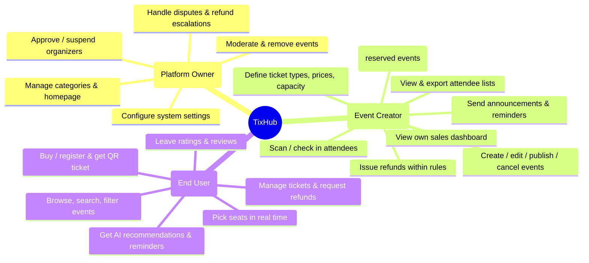
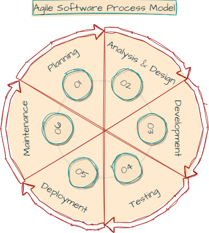
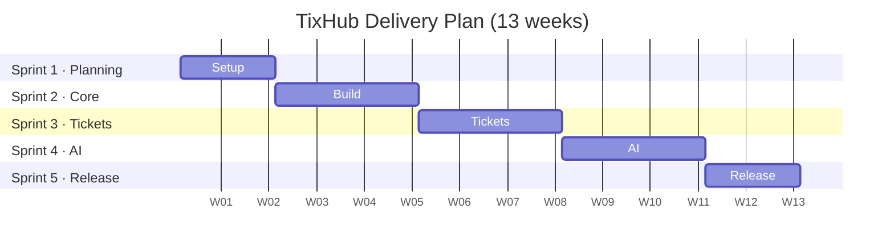
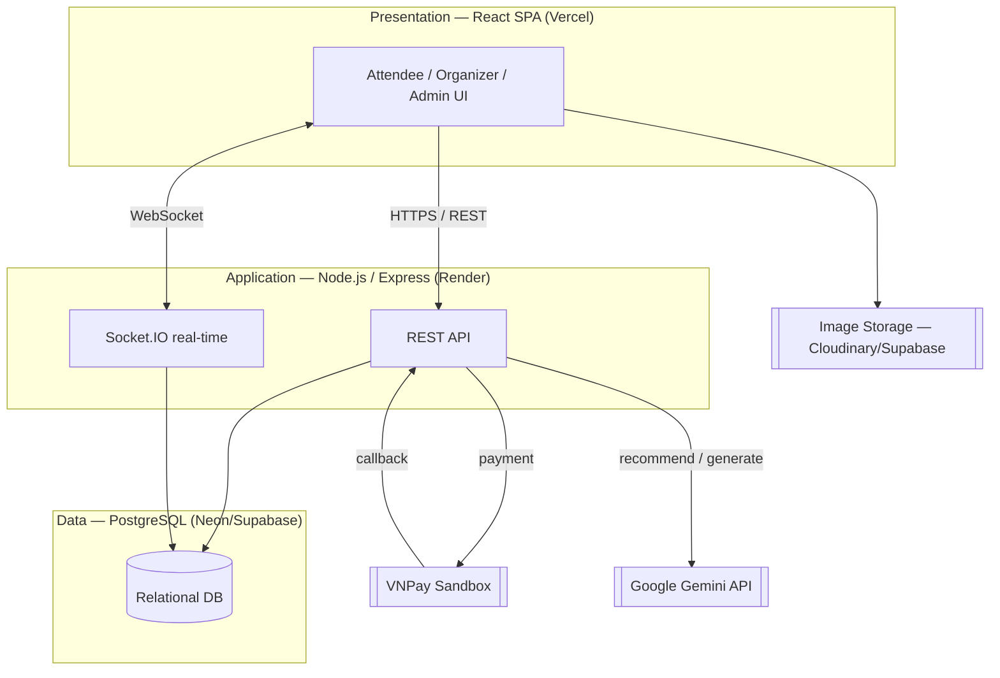
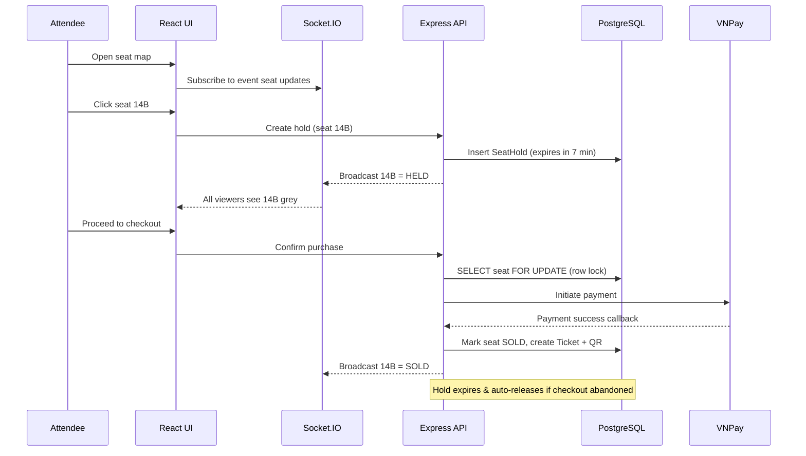

# Project Proposal

## TixHub — Event Ticket Sales Web Application

**Introduction to Software Engineering (Intro2SE) — 24C11**

Group 02 · SoE

*Established: June, 2026*

---

### Table of Contents
1. [Resources](#1-resources)
2. [Executive Summary](#2-executive-summary)
3. [Background](#3-background)
4. [Objectives](#4-objectives)
5. [Scope](#5-scope)
6. [Software Process Model](#6-software-process-model)
7. [Budget](#7-budget)
8. [System Architecture](#8-system-architecture)
9. [Risk Assessment](#9-risk-assessment)
10. [Technical Specifications](#10-technical-specifications)
11. [Timeline and Deliverables](#11-timeline-and-deliverables)
12. [Conclusion](#12-conclusion)

---

### 1. Resources

> *Conducted by Nguyễn Minh Khoa.*

Because the project runs at zero monetary cost, the resources below are contributed **in-kind** (student labour, free services, and members' own equipment).

#### Team — Group 02

  <table>
  <tr>
    <th>Lương Hưng Phát</th>
    <th>Nguyễn Thành Đạt</th>
    <th>Nguyễn Minh Khoa</th>
    <th>Nguyễn Tấn Hiệu</th>
    <th>Nguyễn Anh Khôi</th>
  </tr>
  <tr align="center">
    <td>24127298</td>
    <td>24127021</td>
    <td>24127188</td>
    <td>24127373</td>
    <td>24127430</td>
  </tr>
  <tr align="center">
    <td>PM / Backend Engineer <b>(Team Leader)</b></td>
    <td>Fullstack Dev / Tester</td>
    <td>Backend Developer</td>
    <td>Frontend Dev / DevOps</td>
    <td>Database Management</td>
  </tr>
  </table>

1. **Staff** *(in-kind student labour — VND 0)*
    + **Lương Hưng Phát** (24127298) — PM / Backend Engineer, Team Leader: project management, sprint planning, backend development, final sprint sign-off.
    + **Nguyễn Thành Đạt** (24127021) — Fullstack Dev / Tester: cross-cutting features, QA, testing.
    + **Nguyễn Minh Khoa** (24127188) — Backend Developer: feature development, backend modules.
    + **Nguyễn Tấn Hiệu** (24127373) — Frontend Dev / DevOps: UI/UX implementation, frontend features, CI/CD, hosting infrastructure.
    + **Nguyễn Anh Khôi** (24127430) — Database Management: schema design, migrations, data integrity.

2. **Hosting & Infrastructure** *(free tier — VND 0)*
    + Frontend: **Vercel**
    + Backend: **Render / Railway**
    + Database: **Neon / Supabase** (managed PostgreSQL)
    + Image storage: **Cloudinary / Supabase Storage**

3. **Equipment** *(members' own — VND 0)*
    + Personal laptops for all five members.

4. **Software & Services** *(free — VND 0)*
    + Frontend: **React**, charting (Recharts), QR scanner (`html5-qrcode`)
    + Backend: **Node.js / Express**, **Socket.IO**
    + Database: **PostgreSQL**
    + Payments: **VNPay** sandbox
    + AI: **Google Gemini API**
    + Tooling: **Git / GitHub**, **GitHub Actions**, **VS Code**, **draw.io**

5. **Other** *(VND 0)*
    + Communication: Discord / Google Meet (free)
    + Documentation: Markdown + Mermaid diagrams (free)

 <b>Grand Total: VND 0</b> — all resources are free-tier services, in-kind labour, or members' own equipment.

### 2. Executive Summary

> *Conducted by Nguyễn Minh Khoa.*

This proposal recommends the development of **TixHub**, a web application that manages ticket sales for entertainment events. TixHub connects three groups of users, a platform **Admin**, event **Organizers**, and **Attendees** on a single marketplace where events are created, tickets are sold securely, and attendees are checked in at the door with QR codes.

The platform is designed base on the workflow of established Vietnamese ticketing services such as **Ticketbox** and **CTicket**, while adding two AI-powered capabilities that set it apart.

The key features of TixHub include:

- **Event creation and management** — a guided form for organizers to publish attractive event pages, including both general-admission and **reserved-seating** events with a real-time interactive seat map.
- **Secure checkout** through the **VNPay** payment gateway, issuing every buyer a unique **QR-code digital ticket**.
- **Door check-in** via phone QR scanning, giving organizers live attendance data and blocking duplicate tickets.
- **Event discovery** with keyword, category, date, location, and price filters.
- **Two AI features** powered by the Google Gemini API: personalized event recommendations for attendees, and an AI listing assistant that helps organizers write descriptions, titles, tags, and suggested prices.
- **Real-time analytics**, automated **notifications and waitlists**, **reviews and ratings**, and an **admin moderation** layer that approves organizers and keeps the marketplace safe.

The system is built by a five member team over one academic semester (13 weeks) using the **Agile / Scrum** process model. Because the project is developed entirely on free service tiers and student owned equipment, the **direct monetary cost of the project is zero**, while still delivering a complete software product.

### 3. Background

> *Conducted by Nguyễn Minh Khoa.*

The entertainment and live-events market in Vietnam has grown rapidly, and with it the demand for a reliable way to discover events, buy tickets, and gain entry without fraud. Today attendees rely on platforms like Ticketbox and CTicket, while many smaller organizers university clubs, indie music nights, workshops still sell tickets manually through social media and bank transfers. Manual selling is error-prone: tickets are easy to forge, capacity is hard to track, and there is no live picture of who has actually arrived.

TixHub addresses this gap by giving any organizer the tools a professional ticketing company uses: a polished event page, secure online payment, QR tickets, a real time seat map for reserved seating events, and a sales dashboard. For attendees, it offers a single trustworthy place to browse events, pay safely, store tickets digitally, and receive reminders.

A trust-and-safety dimension is essential: because the platform handles other people's money, it must approve organizers before they can sell, moderate reported content, and process refunds within clear rules. These concerns shape both the feature set and the system architecture described below.

### 4. Objectives

> *Conducted by Nguyễn Minh Khoa.*

The major objective of building TixHub is to deliver a working, production-shaped event ticketing platform while practising the full lifecycle of real software engineering. Specific objectives include:

* **Enable end-to-end ticket sales**
    > Allow organizers to create events and attendees to discover, pay for, and receive tickets entirely online through a secure, integrated checkout.
* **Eliminate ticket fraud at the door**
    > Issue every ticket as a unique QR code and provide a phone-based scanner so each ticket can be checked in exactly once, with live attendance data for organizers.
* **Support real reserved seating**
    > Provide a real-time interactive seat map where attendees select specific seats and concurrent buyers can never be sold the same seat.
* **Apply AI to real product problems**
    > Use the Gemini API to recommend relevant events to attendees and to help organizers produce better event listings, demonstrating practical, non-trivial AI integration.
* **Give organizers actionable data**
    > Provide a real-time analytics dashboard of sales, revenue, remaining inventory, and check-ins so organizers can react to how an event is performing.
* **Keep the marketplace safe and credible**
    > Provide admin moderation and organizer approval so the platform stays trustworthy for a system that handles payments.
* **Practise disciplined Agile delivery**
    > Deliver the product across structured sprints with planning, reviews, testing, and CI/CD, simulating a real engineering team.

Overall, TixHub aims to be a complete, demonstrable ticketing platform that proves the team can take a non-trivial product from proposal to deployment using modern tools and professional process.

### 5. Scope

> *Conducted by Nguyễn Minh Khoa.*

TixHub delivers **ten core features** across three user roles. The scope below is divided into the user roles the system serves, the features it provides, and an explicit list of what is deliberately **out of scope** to protect the 13-week timeline.

#### User Roles

#### Permission Matrix

| Capability | Admin | Organizer | Attendee |
| --- | :---: | :---: | :---: |
| Manage all users | ✅ | | |
| Create / edit events | | ✅ (own) | |
| Sell / scan tickets | | ✅ (own) | |
| Buy tickets | ✅* | ✅* | ✅ |
| Platform analytics | ✅ (all) | ✅ (own only) | |
| Moderate / approve | ✅ | | |

* Admins and organizers may also buy tickets as ordinary attendees.

#### Feature Set

1. **Event Creation & Management:** guided form for title, description, cover image, date/time, location (physical or online), category, and event type (**General Admission** or **Seated**). For seated events the organizer designs a seat map.
2. **Secure Checkout & Payments:** checkout flow through the **VNPay sandbox** gateway; on success the attendee instantly receives confirmation and a digital ticket.
3. **QR-Code Digital Tickets + Door Scanner:** every ticket carries a unique QR code; organizers scan it at the entrance via their phone browser to check attendees in and block duplicates.
4. **Event Discovery, Search & Filters:** public browse page filtering by keyword, category, date, location, and price (free/paid).
5. **AI Personalized Event Recommendations** *(AI #1):* a chatbot powered by Gemini that suggests events from a user's past tickets, saved events, and browsing history.
6. **AI Event-Listing Assistant** *(AI #2):* Gemini helps organizers auto-generate a polished description, suggest catchy titles and tags, and recommend a sensible ticket price.
7. **Real-Time Analytics Dashboard:** live charts of sales over time, revenue, tickets remaining, and check-in counts; scoped per organizer, with a platform-wide view for admins.
8. **Notifications, Reminders & Waitlist:** automated email/in-app alerts for confirmations, reminders (e.g. 24h before), changes/cancellations, and a waitlist for sold-out events.
9. **Reviews, Ratings & Social Proof:** attendees rate events (1–5 stars) and leave reviews after attending; ratings appear on the organizer's profile and future events.
10. **Admin Moderation & Organizer Approval:** admin tools to approve new organizers before they can sell, review reported events, and take down policy-violating content.

#### AI Features

Two AI capabilities, both powered by **Google Gemini**, set TixHub apart from a conventional ticketing platform. They serve the two opposite sides of the marketplace: attendees discovering events, and organizers publishing them.

1. **AI Personalized Event Recommendations** *(AI #1, attendee-facing):* a conversational chatbot that learns each user's taste from their past tickets, saved events, and browsing history, then suggests events worth attending. Instead of forcing users to phrase the perfect search query, the assistant answers natural-language questions ("any live music near me this weekend?") and ranks results against the user's profile. This raises discovery and conversion for the long tail of smaller events that keyword search tends to bury.

2. **AI Event Listing Assistant** *(AI #2, organizer-facing):* a co-author for organizers creating a listing. From a few rough inputs Gemini auto-generates a polished description, proposes catchy titles and relevant tags, and recommends a sensible ticket price benchmarked against comparable events. This lowers the effort of publishing a high-quality, discoverable listing and improves consistency across the catalogue.

Both features are **assistive, not autonomous**: AI output is always editable, the user stays in control, and every recommendation or generated field can be overridden before it goes live. Personalization respects the same privacy and moderation rules as the rest of the platform.

#### Out of Scope

To keep the project deliverable within one semester, the following are explicitly excluded:

- **Multi currency / international sales:** VND only, Vietnam only.
- **Real money settlement:** VNPay **sandbox** only; no real payouts or bank reconciliation.

### 6. Software Process Model

> *Conducted by Lương Hưng Phát.*

TixHub adopts the **Agile / Scrum** software process model. Agile emphasises iterative and incremental delivery, flexibility, and close collaboration which is a strong fit for a 13-week project. Work is organised into fixed two-week **sprints**, each ending in a working, demonstrable increment.

The Agile phases applied to TixHub:

1. **Planning:** the team defines objectives, builds and prioritises the product backlog (the ten features), estimates effort, and agrees the API contract between frontend and backend.
2. **Analysis and Design:** the team designs the system architecture, database schema, and UI; identifies dependencies, risks, and assumptions (notably the real-time seat-locking design).
3. **Development:** features are built incrementally across sprints. The team holds short daily stand-ups and continuously refines the backlog. Frontend and backend are developed independently against a shared API contract, then integrated.
4. **Testing:** testing runs continuously: unit, integration, and acceptance tests are written alongside features rather than left to the end.
5. **Deployment:** each sprint deploys to the hosting environment through CI/CD, so an always-working version is available for review.
6. **Maintenance:** defects are fixed, performance tuned, and feedback from reviewers folded back into the backlog.

#### Sprint Timeline

#### Testing Methodologies

- **Acceptance Testing** — verifies the product meets the requirements of stakeholders (organizers, attendees, course staff) and that features are easy to use.
- **Functional Testing** — ensures every feature works as specified.
- **Regression Testing** — ensures new changes do not break existing features or data.
- **Performance Testing** — verifies the system stays responsive under concurrent load, especially the **real-time seat map** where many users view and hold seats at once.
- **Usability Testing** — verifies the system is easy to navigate for all three roles.

#### Project Management Practices

- **Clear goals** — the ten features and their acceptance criteria are defined up front so every member knows what "done" means.
- **Scrum cadence** — two-week sprints with planning, review, and retrospective; daily stand-ups for blockers.
- **Stakeholder collaboration** — regular check-ins with course staff acting as product owner.
- **Regular communication** — face-to-face plus Discord/Google Meet for distributed work.
- **Risk management** — risks identified and tracked (see §9).
- **Task prioritisation** — backlog ordered by dependency; the event model is built before features that depend on it.
- **Progress monitoring** — sprint boards and burndown to keep delivery on track.

#### Quality Assurance Processes

- Conduct continuous automated and manual testing each sprint.
- Conduct user acceptance testing before release.
- Use **Git** version control with pull-request review for every change.
- Run CI checks on every push via **GitHub Actions** before deploy.

### 7. Budget

> *Conducted by Lương Hưng Phát.*

TixHub is built to mimic real software development **without any monetary investment**. Every service is used on its free tier, all labour is contributed by the student team, and all hardware is equipment the members already own. The **total direct project cost is therefore VND 0**.

The table below itemises a real proposal's cost categories and shows, for each, how TixHub satisfies it at zero cost.

| Category | Provision | Direct Cost |
| --- | --- | :---: |
| **Hosting & Infrastructure** | Vercel (frontend), Render/Railway (backend), Neon/Supabase (PostgreSQL) free tier | **VND 0** |
| **Software & Tools** | VS Code, Git/GitHub, GitHub Actions CI/CD, draw.io — all free | **VND 0** |
| **AI Services** | Google Gemini API free tier | **VND 0** |
| **Payments** | VNPay **sandbox** free test environment | **VND 0** |
| **Personnel** | 5 students, in kind labour (academic project) | **VND 0** |
| **Equipment** | Members' own laptops | **VND 0** |
| **Testing** | Manual + free open source test frameworks (Jest, Vitest) | **VND 0** |
| **Contingency** | Free tier headroom; paid upgrade only if ever needed | **VND 0** |
| **Grand Total** | | **VND 0** |

> **Note on realism:** had this platform been built commercially, the same architecture would incur recurring costs for managed hosting, a production payment gateway contract, AI usage beyond free quotas, and salaried staff. By deliberately staying within free tiers and student labour, TixHub reproduces the *engineering* of a real product while keeping the *budget* at zero, which is consistent with the academic aim of the project.

### 8. System Architecture

> *Conducted by Lương Hưng Phát.*

#### Overview

TixHub uses a modern client–server architecture: a **React** single page front-end, a **Node.js / Express** back-end API, and a **PostgreSQL** database, integrated with the **VNPay** payment gateway and the **Google Gemini** AI API. Real-time features (live seat map, live analytics, notifications) use **WebSockets (Socket.IO)**.

- **Presentation layer** — React SPA (the browser UI for all three roles), deployed on Vercel.
- **Application layer** — Node.js/Express REST API plus a Socket.IO real-time channel; handles requests, business rules, payment callbacks, and AI calls. Deployed on Render/Railway.
- **Data layer** — PostgreSQL (managed by Neon/Supabase) storing users, events, seats, tickets, orders, and reviews with full ACID guarantees.

#### Block Diagram

#### Ticket Purchase & Real-Time Seat Hold

The most concurrency-sensitive flow is buying a seat on a reserved-seating event: two buyers must never be sold the same seat. TixHub solves this with a **temporary seat hold (TTL)** for UX plus a **PostgreSQL row lock** as the source of truth.

### 9. Risk Assessment

> *Conducted by Lương Hưng Phát.*

| Potential Risk | Plan / Strategy |
| --- | --- |
| **Concurrent seat double-booking** — two buyers select the same seat at the same moment, risking an oversold event and refunds. | <ul><li>Use a temporary **SeatHold with TTL** so a clicked seat is reserved during checkout and auto-released if abandoned.</li><li>Enforce correctness with a **PostgreSQL row lock** (`SELECT … FOR UPDATE`) at purchase the database, not the socket, is the source of truth.</li></ul> |
| **Payment integration & failures** — VNPay callbacks may be delayed, duplicated, or fail mid-flow, risking tickets issued without payment (or vice-versa). | <ul><li>Treat the **VNPay callback** as the only trigger to issue a ticket; hold the order as *pending* until confirmed.</li><li>Make callback handling **idempotent** and reconcile pending orders on a timer.</li></ul> |
| **Free-tier limits** — hosting, database, or Gemini free quotas may be exceeded during demos or load testing. | <ul><li>Monitor usage; cache AI responses and rate-limit AI endpoints.</li><li>Keep a documented upgrade path; design so a paid tier is a config change, not a rewrite.</li></ul> |
| **Integration risk from independent development** — frontend and backend are built separately until Sprint 2 and may drift. | <ul><li>Agree a **shared API contract** in Sprint 0 and keep shared types in a `/shared` folder.</li><li>Integrate early (after Sprint 2) and run integration tests each sprint thereafter.</li></ul> |
| **Scope creep** — ten features plus a real-time seat map across 13 weeks. | <ul><li>Maintain a prioritised backlog and the explicit **out-of-scope** list (§4).</li><li>Protect sprint commitments; defer non-essential polish.</li></ul> |
| **Security of payments & user data** — the system handles money and personal data. | <ul><li>Never store card data (delegated to VNPay); use HTTPS, hashed passwords, and role-based access control.</li><li>Validate all input server-side; require admin approval before organizers can sell.</li></ul> |

**Our team is committed to the safe and successful execution of this project. We will take all necessary measures to mitigate these risks and to monitor every aspect of delivery throughout the semester.**

### 10. Technical Specifications

> *Conducted by Lương Hưng Phát.*

| | |
| --- | --- |
| **Data Sources** | <ul><li>Organizer-submitted event and seat-map data</li><li>Attendee accounts, orders, and browsing history</li><li>VNPay payment callbacks</li></ul> |
| **Data Schema** | Relational schema in PostgreSQL: `User`, `Event`, `TicketType`, `Venue → Section → Row → Seat`, `SeatHold`, `Order`, `Ticket`, `Review` (see ERD in §8). |
| **Data Transformation** | Raw sales and check-in events aggregated into real-time analytics; user history transformed into Gemini prompts for recommendations. |
| **Programming Languages** | TypeScript / JavaScript (frontend + backend), SQL |
| **Frameworks & Libraries** | React, Node.js, Express, Socket.IO, Recharts, html5-qrcode, Jest / Vitest |
| **External Services** | VNPay (payments), Google Gemini API (AI), GitHub Actions (CI/CD) |
| **Hardware Requirements** | <ul><li>Development: standard laptop, multi-core CPU, 8GB+ RAM</li><li>Runtime: free-tier cloud instances (no owned servers)</li></ul> |
| **Software Requirements** | <ul><li>OS: Windows / macOS / Linux</li><li>Runtime: Node.js LTS, modern browser</li><li>IDE: Visual Studio Code</li><li>Database: PostgreSQL</li><li>Version control: Git</li></ul> |

### 11. Timeline and Deliverables

> *Conducted by Lương Hưng Phát.*

<table>
    <tr>
        <th>Phase</th>
        <th>Milestone</th>
        <th>Deliverable</th>
    </tr>
    <tr>
        <td><b>Sprint 1 — Planning</b> (Week 1–2)</td>
        <td>
            <ul>
                <li>Define scope and backlog</li>
                <li>Design database schema &amp; domain model</li>
                <li>Set up repository, CI/CD, hosting</li>
                <li>Agree frontend–backend API contract</li>
            </ul>
        </td>
        <td>
            <ul>
                <li>Project proposal (this document)</li>
                <li>ERD &amp; architecture diagrams</li>
                <li>Working CI/CD pipeline</li>
                <li>API contract document</li>
            </ul>
        </td>
    </tr>
    <tr>
        <td><b>Sprint 2 — Core</b> (Week 3–5)</td>
        <td>
            <ul>
                <li>Authentication &amp; roles</li>
                <li>Feature 1: Event creation (incl. seat-map design)</li>
                <li>Feature 2: Checkout via VNPay sandbox</li>
            </ul>
        </td>
        <td>
            <ul>
                <li>Login &amp; role-based access</li>
                <li>Organizers can publish events</li>
                <li>Attendees can pay and receive a ticket</li>
            </ul>
        </td>
    </tr>
    <tr>
        <td><b>Sprint 3 — Tickets &amp; Data</b> (Week 6–8)</td>
        <td>
            <ul>
                <li>Feature 3: QR tickets + door scanner</li>
                <li>Feature 4: Discovery, search &amp; filters</li>
                <li>Feature 7: Real-time analytics</li>
                <li>Frontend ↔ backend integration</li>
            </ul>
        </td>
        <td>
            <ul>
                <li>QR check-in working at the door</li>
                <li>Public browse/search page</li>
                <li>Live organizer dashboard</li>
                <li>Integrated end-to-end build</li>
            </ul>
        </td>
    </tr>
    <tr>
        <td><b>Sprint 4 — AI &amp; Engagement</b> (Week 9–11)</td>
        <td>
            <ul>
                <li>Feature 5: AI recommendations (Gemini)</li>
                <li>Feature 6: AI listing assistant (Gemini)</li>
                <li>Feature 8: Notifications, reminders &amp; waitlist</li>
            </ul>
        </td>
        <td>
            <ul>
                <li>Recommendation chatbot</li>
                <li>AI-assisted event creation</li>
                <li>Automated emails &amp; waitlist</li>
            </ul>
        </td>
    </tr>
    <tr>
        <td><b>Sprint 5 — Trust &amp; Release</b> (Week 12–13)</td>
        <td>
            <ul>
                <li>Feature 9: Reviews &amp; ratings</li>
                <li>Feature 10: Admin moderation &amp; approval</li>
                <li>System &amp; acceptance testing</li>
                <li>Final deployment &amp; sign-off</li>
            </ul>
        </td>
        <td>
            <ul>
                <li>Reviews on events &amp; organizers</li>
                <li>Admin moderation tools</li>
                <li>Test reports</li>
                <li>Deployed production system</li>
            </ul>
        </td>
    </tr>
</table>

#### Quality Assurance and Testing Procedures

- **Unit testing** — each component tested individually against its requirements.
- **Integration testing** — components tested together, with special attention to the payment callback and seat-hold flows.
- **System testing** — the whole system tested against functional and non-functional requirements.
- **User acceptance testing** — all three roles exercise the system to confirm expectations are met.
- **Performance testing** — the real-time seat map and analytics tested under concurrent load.

### 12. Conclusion

> *Conducted by Lương Hưng Phát.*

TixHub is a complete, production shaped event ticketing platform that takes an event from creation to sold out, checked in, and reviewed. It combines the core capabilities of established ticketing services (secure checkout, QR tickets, reserved seating, analytics, moderation) with two genuine AI features that improve both discovery and event creation.

The implementation offers clear benefits: organizers gain professional tools and live data, attendees gain a safe and convenient way to buy and keep tickets, and the platform stays trustworthy through admin approval and moderation.

Potential limitations include: free-tier quotas, integration risk, and the concurrency challenge of reserved seating have been identified and matched with concrete mitigation strategies. The team will work collaboratively and with full commitment to resolve issues as they arise.

