

# Existing App Survey

## TixHub — Event Ticket Sales Web Application

**Introduction to Software Engineering (Intro2SE) — 24C11**

Group 02 · SoE

*Established: June, 2026*

---
### Table of Contents
- [0. Abstract](#0-abstract)
- [1. Cticket.vn](#1-cticketvn)
  - [1.1 Graphical User Interface (GUI)](#11-graphical-user-interface-gui)
  - [1.2 Key Features & Functionality](#12-key-features--functionality)
- [2. Ticketbox.vn](#2-ticketboxvn)
  - [2.1 Graphical User Interface (GUI)](#21-graphical-user-interface-gui)
  - [2.2 Key Features & Functionality](#22-key-features--functionality)
- [3. Eventbrite.com](#3-eventbritecom)
  - [3.1 Graphical User Interface (GUI)](#31-graphical-user-interface-gui)
  - [3.2 Key Features & Functionality](#32-key-features--functionality)
- [4. Comparative Summary](#4-comparative-summary)
  - [4.1 Core Features Comparative Summary](#41-core-features-comparative-summary)
  - [4.2 What TixHub Will Do Differently or Better](#42-what-tixhub-will-do-differently-or-better)
  - [4.3 UI/UX Patterns We Plan to Adopt](#43-uiux-patterns-we-plan-to-adopt)
---

## 0. Abstract

This document presents a comprehensive comparative survey of three established event ticketing platforms: **Cticket.vn**, **Ticketbox.vn**, and **Eventbrite.com**. The primary objective of this analysis is to establish a functional and design benchmark for the development of **TixHub**, a modern event ticketing web application.  

By examining the graphical user interfaces, core workflows—including event discovery, secure ticket purchasing, and QR-code check-in—and organizer management tools across these platforms, this survey identifies essential industry standards and UX/UI best practices. Furthermore, it analyzes the limitations of existing solutions to outline TixHub's strategic roadmap and competitive advantages. 

Specifically, it details how TixHub will differentiate itself by implementing:
* Meaningful dual AI integration for both attendees and organizers.
* A verified post-event review system.
* A unified real-time analytics dashboard.

Ultimately, this research serves as the foundational blueprint for delivering an elevated, secure, and highly interactive experience within the TixHub ecosystem.

---

## 1. Cticket.vn
> *Conducted by Nguyễn Thành Đạt.*
### 1.1 Graphical User Interface (GUI)

#### Homepage & Layout
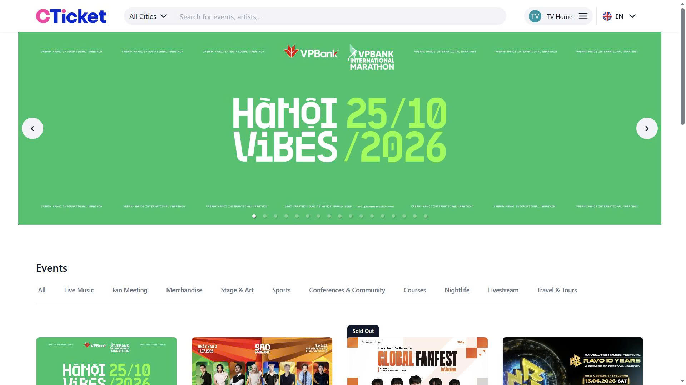
> **Caption:** The homepage opens with a full-width hero banner that rotates through featured or sponsored events, immediately drawing the user's attention to highlighted content. Below the banner, events are arranged in a responsive grid where each card shows the event thumbnail, name, date, venue, and starting ticket price — giving users enough context to decide whether to click through.

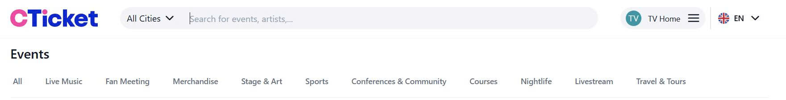
> **Caption:** The sticky top navigation bar contains the platform logo on the left, a prominent search bar in the center, and login/register buttons on the right. Directly beneath it, a horizontal row of category tabs (e.g., Music, Sports, Theater, Exhibition, Others) lets users filter the event feed instantly without navigating away from the homepage.

---

#### Event Detail Page
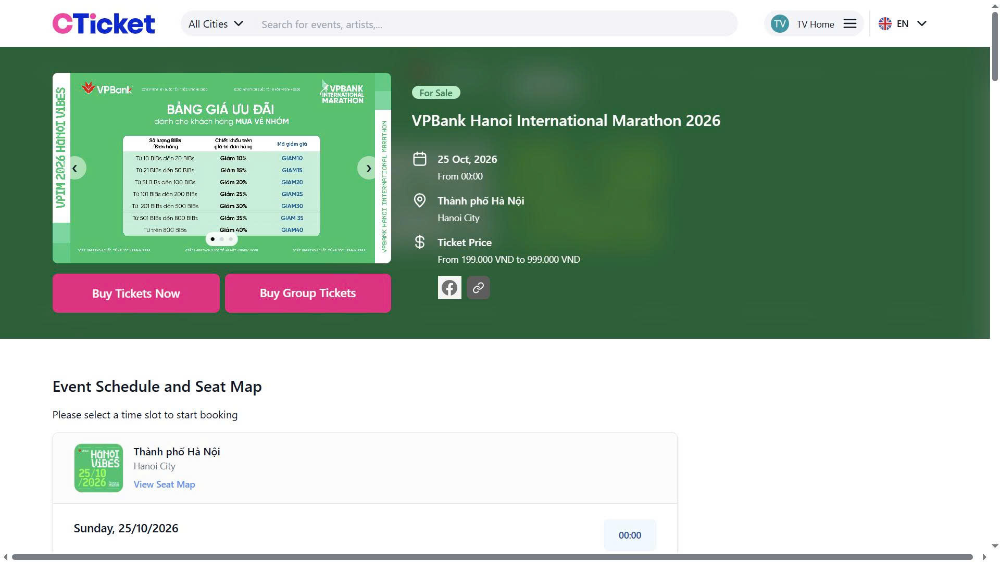
> **Caption:** The event detail page leads with a large cover image spanning the full content width, establishing the visual identity of the event. Directly below it, a structured info block presents the event title, date and time, venue name and address and event category — all at a glance before the user scrolls further.

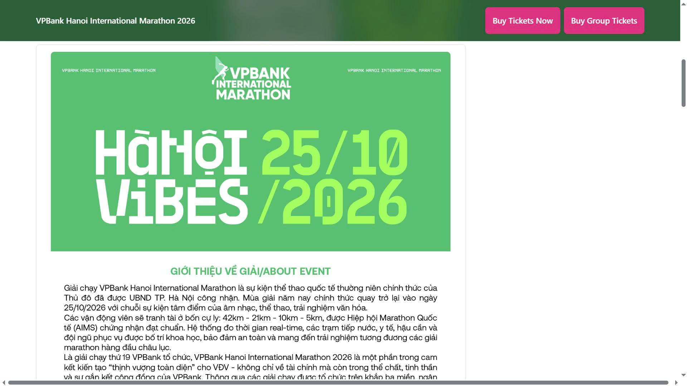 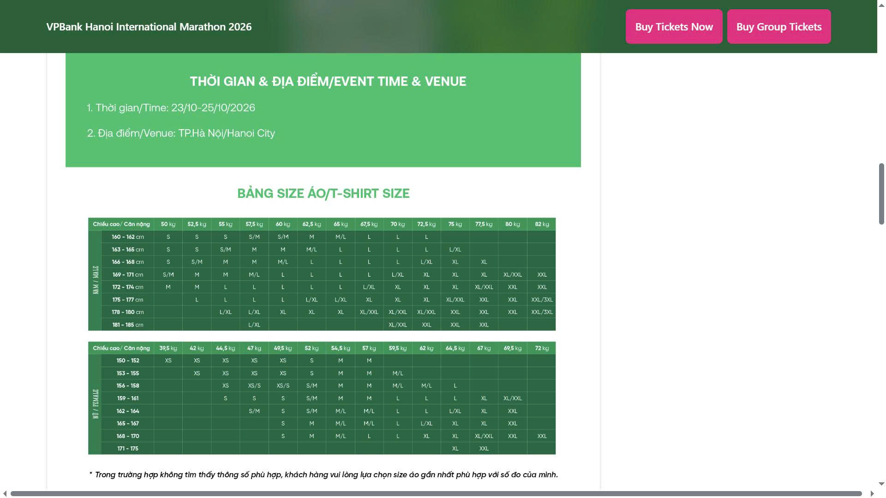 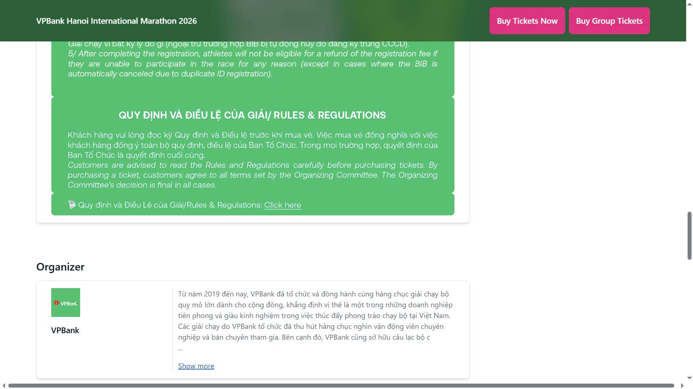
> **Caption:** The lower section of the event page contains the full event description written by the organizer, followed by a ticket selection panel. The panel lists description and organizer name. Users select their desired type and quantity here before proceeding to checkout.

---

#### Register
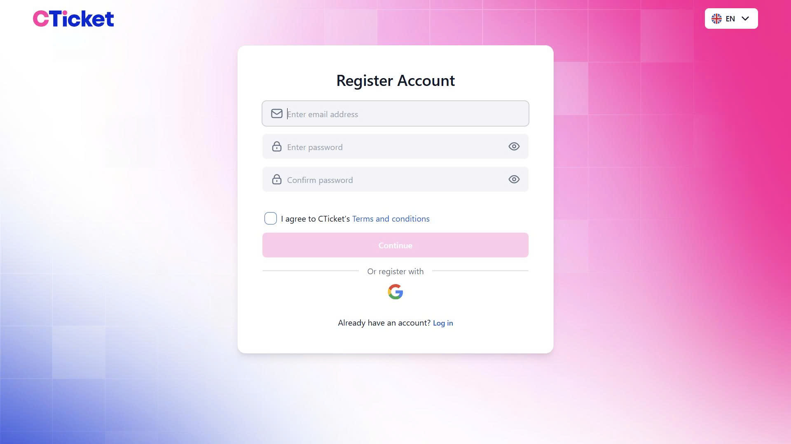
> **Caption:** The register page presents a clean, centered form asking for the email address, password. A confirmation password field and acceptance of terms and conditions are required before submission. Users may also register via a linked Google account using OAuth buttons displayed above the form.

---

#### Log In
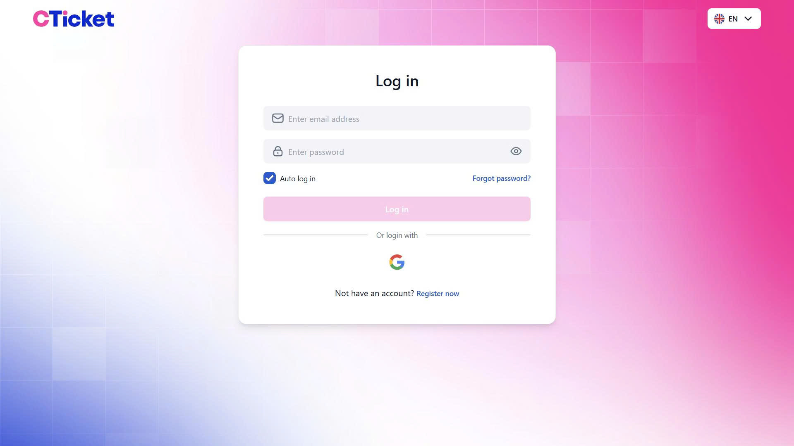
> **Caption:** The log-in page follows a standard layout with email and password input fields, a "Auto log in" checkbox, and a "Forgot password?" link. Below the submit button, a separator leads to social login options (Google), allowing returning users to authenticate without a password. Failed login attempts display an inline error message beneath the relevant field.

---

#### Checkout & Payment UI
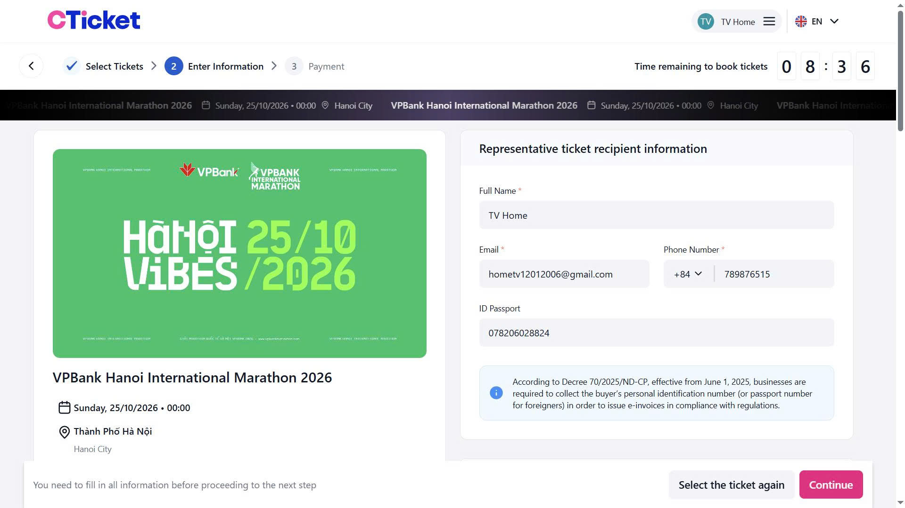
> **Caption:** The checkout page begins by asking the buyer to confirm or fill in their personal details: full name, email address, and phone number etc. These fields are pre-filled if the user is already logged in, reducing friction. A read-only order summary on the left shows the selected ticket type, quantity, unit price, and total amount due.

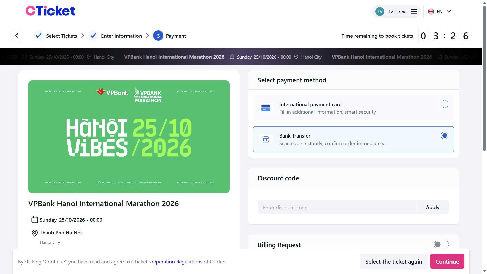
> **Caption:** Users select a payment method from available options including domestic ATM/bank transfer, international credit/debit cards. After selecting a method, the user is either redirected to the payment gateway or shown inline bank details. A countdown timer is visible to indicate how long the ticket reservation is held.

---

#### Ticket Confirmation & QR Code
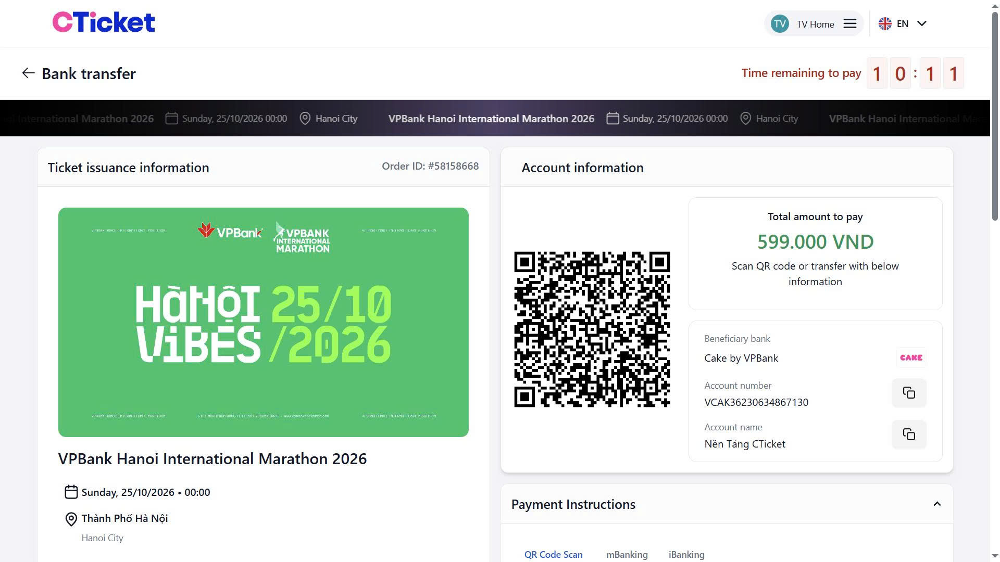
> **Caption:** Upon successful payment, the platform displays a confirmation page showing the order ID, event name, date, venue, ticket tier, and a large unique QR code for each ticket purchased. Users are prompted to save the QR code to their device or download a PDF e-ticket. A copy of the confirmation, including the QR code, is simultaneously sent to the buyer's registered email address.

---

#### User Account Dashboard
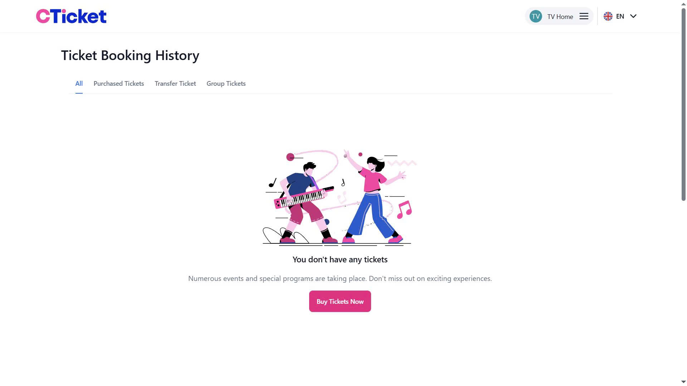
> **Caption:** The user account dashboard defaults to a "My Tickets" view, organized into tabs: Upcoming, Past, and Cancelled. Each ticket entry shows the event thumbnail, event name, date, venue, ticket tier, and a button to view the QR code or download the ticket. The tabbed layout makes it easy for users to find tickets relevant to their current situation without scrolling through an undifferentiated list.

### 1.2 Key Features & Functionality

#### Feature: Language and Location Selection

Users can switch the display language (Vietnamese / English) and select a city or province from the top navigation bar to localize the event feed.

**How it works:** The selected language is handled client-side via an i18n library that swaps string keys without a page reload. The selected city is stored in global state and appended as a filter parameter to every event listing API call. No AI is involved — filtering is purely query-based against the `events` table.

**User workflow:** User clicks the city selector → global location state updates → event listing component re-fetches with the new city filter → UI re-renders with localized results.

---

#### Feature: Event Discovery & Search

Users search for events by keyword and apply filters (category, date range, location, price) to narrow down results.

**How it works:** The search bar triggers a GET request with query parameters for keyword and active filters. On the backend, the keyword is matched against event title and description fields using full-text search, combined with WHERE clauses for each filter. Results are returned as a paginated list sorted by date. No AI or semantic ranking is used.

**User workflow:** User types a keyword → debounced API call fires with current keyword and filter params → results state updates → event cards re-render. Changing a sidebar filter triggers a new API call with all current params merged.

---

#### Feature: Ticket Purchase Flow

Users select a ticket tier and quantity on the event detail page, then complete a timed checkout to receive a confirmed QR ticket.

**How it works:** On "Buy now", the app calls a reserve endpoint that opens a DB transaction — it checks available inventory, decrements the count, creates a `PENDING` order, and sets an expiry timestamp (typically 15 minutes). A background job periodically rolls back expired pending orders and restores inventory. On payment success, the payment gateway sends a webhook; the backend verifies it, marks the order as `CONFIRMED`, generates one ticket record per unit with a unique token, and queues an email job to send the QR codes.

**User workflow:** User selects ticket and clicks "Buy now" → countdown timer starts → user fills checkout form and selects payment method → redirected to payment gateway → on return, app polls order status → on `CONFIRMED`, navigates to confirmation page with QR ticket.

---

#### Feature: QR Code Digital Ticket

Each confirmed ticket is issued as a unique QR code that encodes a server-validated token, displayed on the confirmation page and sent via email.

**How it works:** The backend generates a UUID token per ticket and stores it in the `tickets` table. A QR library encodes the token into an image, which is either stored in object storage or rendered on-demand as a base64 string. The token carries no ticket data — it is only a lookup key, so all validation happens server-side at scan time. PDF export is generated server-side on request.

**User workflow:** User lands on confirmation page → app fetches ticket data including QR code → QR image renders on screen → user saves the image or downloads the PDF.

---

#### Feature: QR Code Check-in (Organizer Side)

Organizers scan attendee QR codes at the venue using a browser-based camera scanner, which validates each ticket against the server in real time.

**How it works:** The check-in page uses a JS QR scanning library (e.g., `html5-qrcode`) that accesses the device camera via the browser's `getUserMedia` API. When a code is detected, the decoded token is sent to a check-in endpoint. The backend looks up the token in the `tickets` table: if unused, it marks it as `CHECKED_IN` and returns success; if already scanned, it returns a conflict error; if not found, it returns not found. No AI is involved — validation is a direct DB lookup.

**User workflow:** Organizer opens check-in page → grants camera access → points camera at QR code → scanner sends token to server → green screen (valid) or red screen (already used / invalid) → scanner resumes for next attendee.

---

#### Feature: Organizer Event Management

Organizers create and manage events through a dashboard that controls the event lifecycle and tracks ticket sales in real time.

**How it works:** Event creation sends a POST request with the event payload; the backend inserts into the `events` table with `status = DRAFT` and creates linked rows in `ticket_types`. Publishing sends a PATCH to update status to `PUBLISHED`, which makes the event visible in public listing queries filtered by status. Dashboard stats are retrieved via aggregate queries (`COUNT`, `SUM`) on the `orders` and `tickets` tables scoped to the event. Cover image upload uses a pre-signed URL to object storage (e.g., S3), with the returned CDN URL stored in the event record.

**User workflow (creating):** Organizer fills multi-step form → submits → event created as draft → organizer previews → clicks Publish → event goes live.

**User workflow (monitoring):** Organizer opens dashboard → selects an event → stats page loads with real-time sales and capacity data from aggregated DB queries.

---

#### Feature: Refunds & Cancellations

Attendees can request a refund from their ticket dashboard; the request is validated against the event's refund policy and processed by the organizer or automatically by the system.

**How it works:** Each event stores a `refund_policy` object (e.g., allowed window, deadline hours). When a refund is submitted, the backend checks the policy rules and creates a `PENDING` refund record. On approval, the backend updates the ticket to `REFUNDED`, restores the inventory counter in `ticket_types`, and triggers a payment reversal via the gateway API. A refunded ticket is blocked from passing the check-in validation.

**User workflow:** User opens ticket detail → if refund-eligible (determined by API response), clicks "Request Refund" → fills reason and bank details → submits → ticket status updates to `REFUND_PENDING` → user receives email notification when organizer approves or rejects.

## 2. Ticketbox.vn
> *Conducted by Nguyễn Anh Khôi.*
### 2.1 Graphical User Interface (GUI)

#### Homepage & Layout
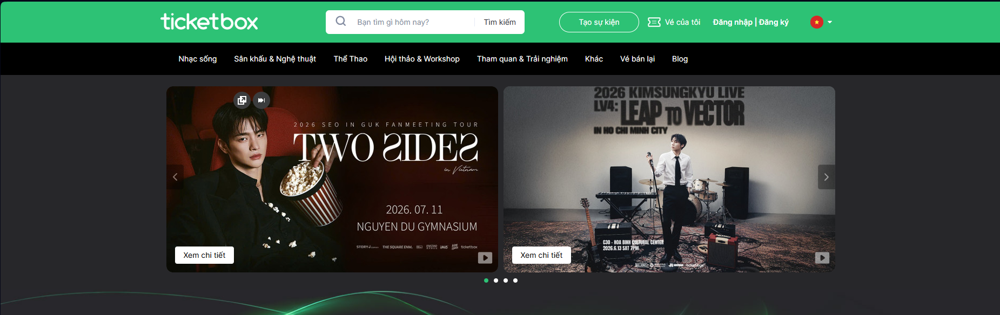
> **Caption:** The homepage opens with a prominent search bar at the top center, allowing users to immediately look up events by keyword. The navigation bar also includes a language switcher (Vietnamese/English), a "My Tickets" shortcut, and an account button — keeping the most-used actions within one click from anywhere on the page.

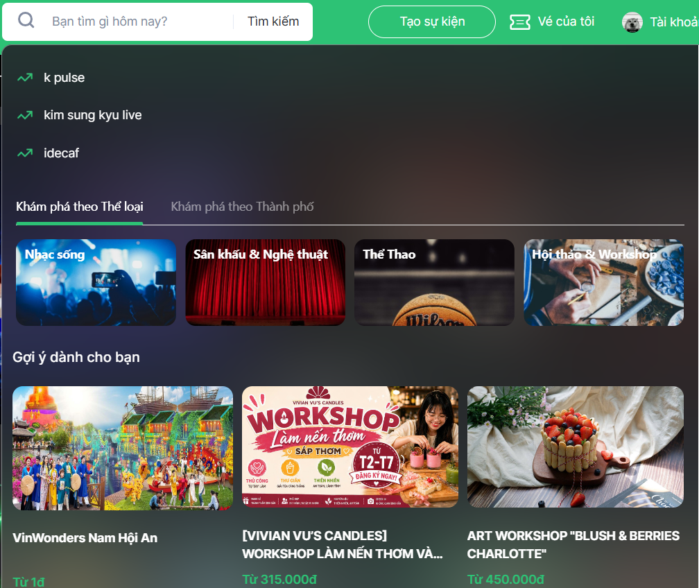
> **Caption:** The search bar expands on focus to reveal trending searches and recommended events, reducing the need for users to know exactly what they are looking for. Below the suggestions, users can also browse directly by category or city — making the search bar serve as both a query tool and a discovery entry point.

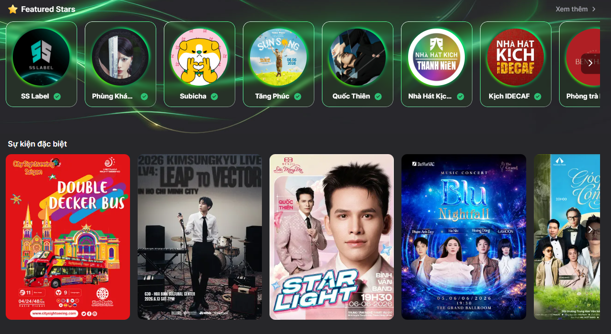
> **Caption:** Below the search bar, the homepage showcases featured organizers and artists through large, visually prominent cards. This section functions as editorial curation, surfacing well-known names and sponsored events to build user trust and encourage early engagement before the user browses by category.

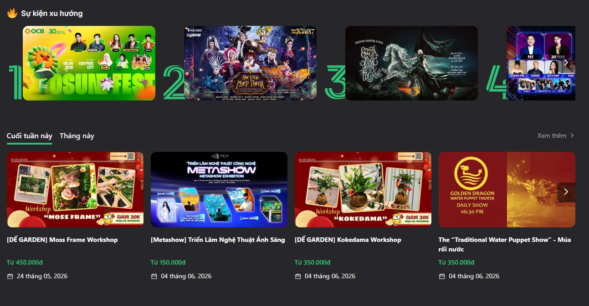
> **Caption:** A ranked "Trending" section highlights events gaining traction on the platform, while a time-aware recommendation row surfaces events happening this weekend or this month. This dual approach serves both impulse-driven users looking for something soon and those planning further ahead.

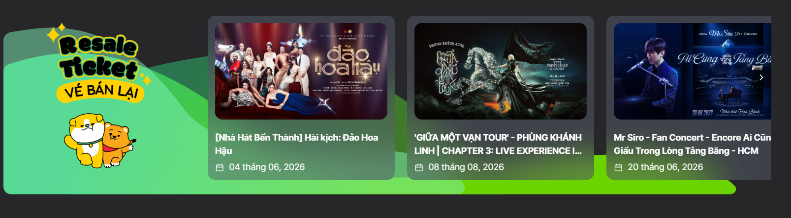
> **Caption:** A dedicated resale section lists shows for which secondary-market tickets are available. Each listing displays the original event details alongside the resale price range, giving buyers transparent pricing context before they click through.

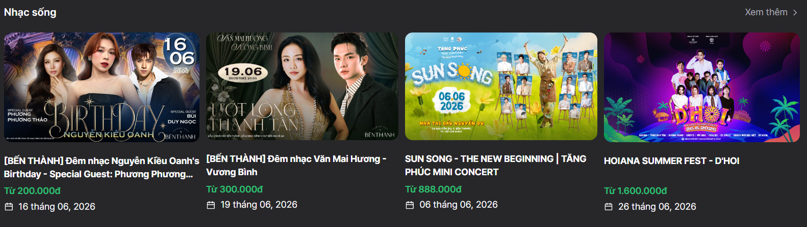 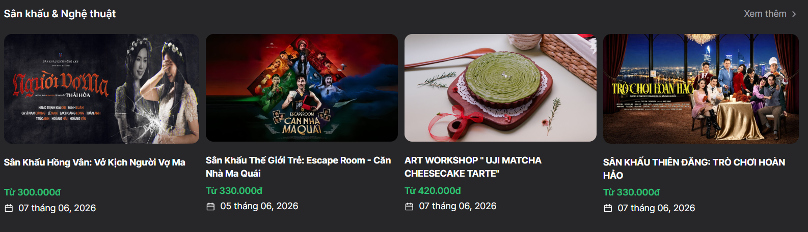
> **Caption:** Events are organized into category rows (e.g., Music, Sports, Theater), each showing upcoming events with their earliest available date and lowest ticket price. This layout lets users scan across multiple categories in a single scroll, without committing to a category-filter page.

> **Caption:** At the bottom of the homepage, Ticketbox surfaces events from other cities and provinces, encouraging users to explore beyond their default location. Each city card links to a pre-filtered event feed for that region.

---

#### Event Detail Page
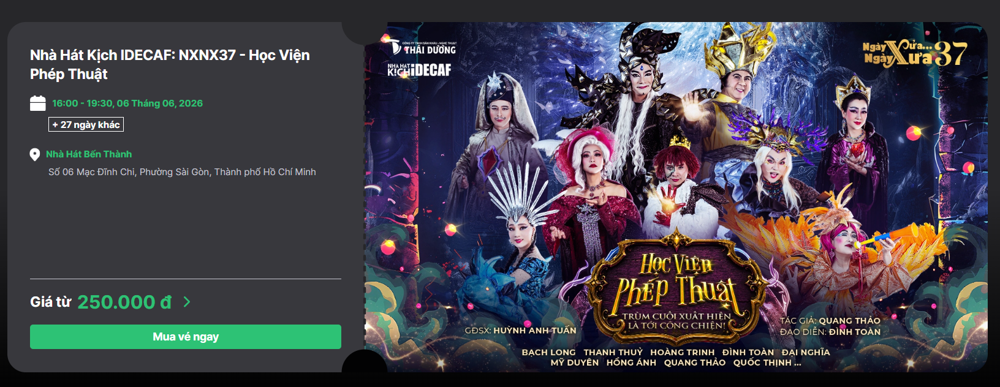
> **Caption:** The event detail page opens with a large full-width cover image that establishes the visual identity of the event. Directly below, the event title, date and time, venue name, and organizer are displayed in a structured block — giving users all decision-critical information before they scroll to the ticket selection or description.

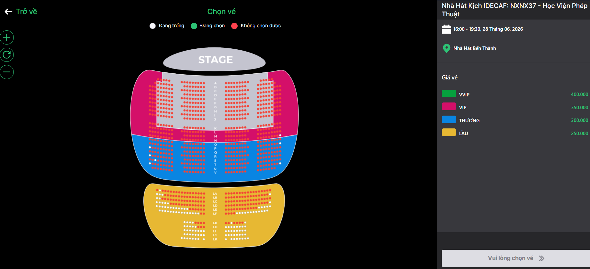
> **Caption:** The ticket selection panel on the event detail page lists all available ticket tiers (e.g., General Admission, VIP) with per-tier pricing and remaining seat counts displayed inline. This gives buyers an at-a-glance view of availability and helps them make faster decisions, especially for high-demand events where inventory is running low.

---

#### Register
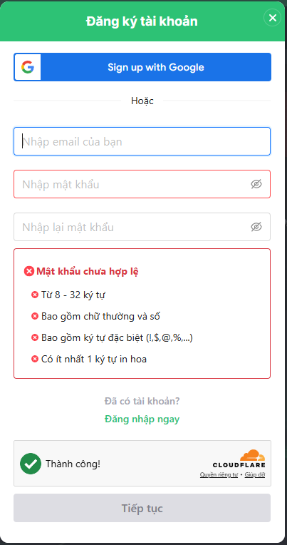
> **Caption:** The registration page presents a centered form asking for the user's full name, email address, and password, along with a password confirmation field and acceptance of terms and conditions before submission. Users may alternatively register via a linked Google or Facebook account through OAuth, bypassing the manual form entirely.

---

#### Log In
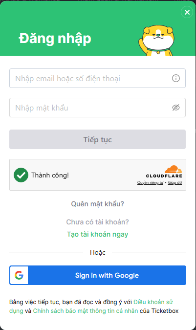
> **Caption:** The log-in page follows a standard layout with email and password input fields and a "Forgot password?" link for account recovery. Below the submit button, social login options (Google, Facebook) are available as one-tap alternatives for users who registered via OAuth. Failed login attempts surface an inline error message directing the user to check their credentials.

---

#### Checkout & Payment UI
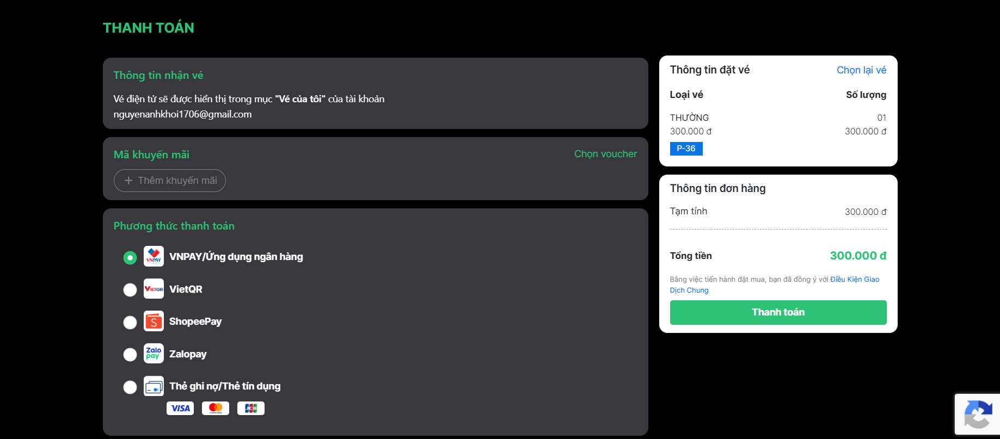
> **Caption:** The checkout flow consolidates buyer information and payment selection into a single page. Users fill in their name, email, and phone number — fields that are pre-populated for logged-in users — and then choose from supported payment methods: domestic bank transfer, MoMo, or ZaloPay. The order summary remains visible throughout, confirming the ticket type, quantity, and total cost before the user confirms payment.

---

#### User Account Dashboard
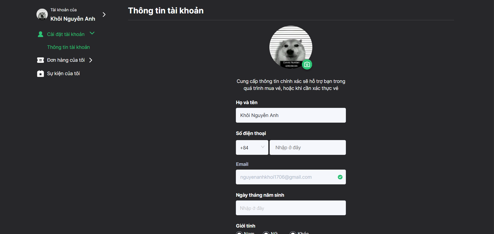
> **Caption:** The account settings page displays the user's profile information — including name, email, and phone number — alongside editable preferences. Users can also manage notification settings and linked payment methods from this view.

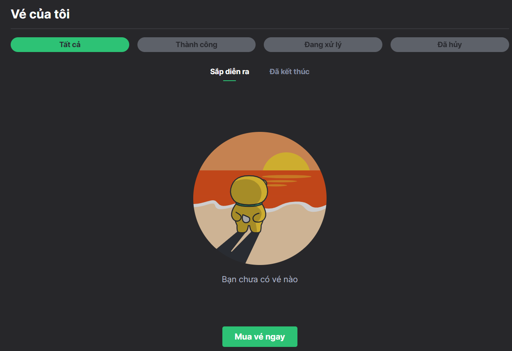
> **Caption:** The "My Tickets" hub lists all tickets the user has purchased, each showing the event name, date, ticket tier, and a status badge (Succeeded, Processing, or Cancelled). Users can tap into any entry to view the QR code or download the e-ticket for check-in.

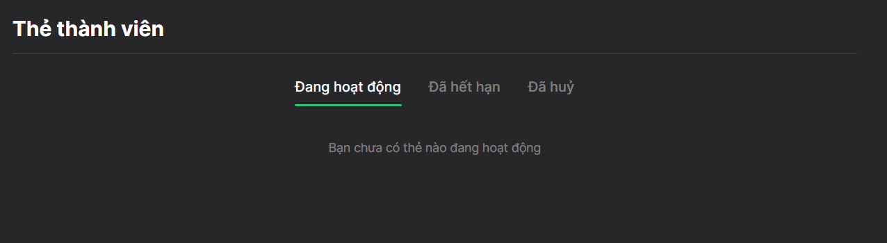
> **Caption:** The membership page displays the user's current membership tier along with its associated benefits, such as early access to tickets or exclusive discounts. Progress toward the next tier may also be shown, incentivizing continued platform engagement.

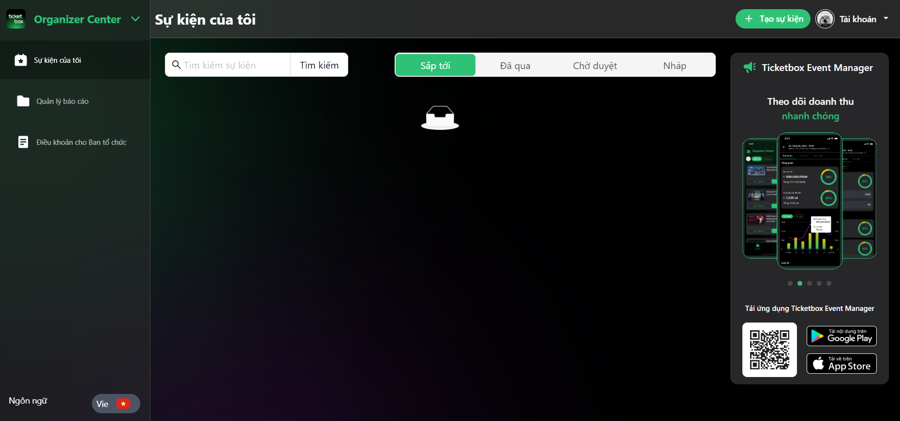
> **Caption:** For users with organizer accounts, "My Events" provides a centralized hub listing all events they have created, categorized by status: Upcoming, Finished, Waiting for Approval, and Drafts. From here, organizers can access event reports, review platform terms and conditions, and manage event settings.

### 2.2 Key Features & Functionality

#### Feature: Authentication & Account Creation
New users can create an account by filling in their full name, email, and password directly on the platform, or skip the form entirely by signing up via Google or Facebook OAuth. The registration flow is intentionally short, asking only for the minimum information needed to create an account — additional profile details can be filled in later from the dashboard. Returning users log in with their email and password, with a "Forgot password?" recovery flow available inline. Social login buttons (Google, Facebook) are shown prominently as faster alternatives. 

**How it works:** Standard email/password accounts are authenticated against a hashed credential store. OAuth sign-ins delegate authentication to the third-party provider (Google/Facebook) and map the returned identity to a Ticketbox account — creating one automatically on first login if no matching account exists. Session tokens are stored client-side and refreshed silently to maintain login state across visits.

**User workflow:** User navigates to the login/register page → chooses to fill out the manual form or clicks an OAuth provider button (Google/Facebook) → upon successful authentication, the backend issues a session token → user is redirected to the homepage or their previous page with an active session.

---

#### Feature: Event Discovery & Search
The search bar expands on focus to reveal trending searches and recommended events, reducing the need for users to know exactly what they are looking for. Below the suggestions, users can also browse directly by category or city — making the search bar serve as both a query tool and a discovery entry point.

**How it works:** Keyword queries are matched against event titles, organizer names, and categories. The trending and recommended results are surfaced based on platform-wide popularity signals. Category and city shortcuts filter the event feed dynamically without requiring a full search query to be submitted.

**User workflow:** User clicks the search bar → trending and recommended suggestions appear → user types a keyword → system fetches matching events → user selects an event or presses enter to view full search results. Alternatively, user clicks a category or city icon to immediately view a pre-filtered list of events.

---

#### Feature: Ticket Purchase Flow
The platform provides a streamlined purchase flow directly from the event detail page. The checkout page consolidates buyer information and payment selection into a single view. Fields are pre-populated for logged-in users, reducing friction, while offering local payment methods such as bank transfers, MoMo, or ZaloPay.

**How it works:** Selected tickets are temporarily soft-reserved while the user completes checkout. Once payment is confirmed via the chosen gateway (bank transfer or e-wallet), the system generates a unique QR code e-ticket and delivers it to the buyer's email and "My Tickets" dashboard simultaneously. If the checkout times out, the tickets are returned to the available inventory pool.

**User workflow:** User selects ticket tier and quantity on the event detail page → clicks to proceed → navigated to the checkout page → fills or confirms attendee information → selects a payment method → completes payment via the third-party gateway → system confirms the order and issues the QR code e-ticket.

---

#### Feature: Organizer Event Management
Organizers access a dedicated dashboard that groups their events by lifecycle status: Upcoming, Finished, Waiting for Approval, and Drafts. Each event has a dedicated reports view displaying ticket sales figures, revenue breakdown by tier, and check-in statistics. Organizers can use this data to evaluate performance and inform decisions for future events.

**How it works:** New events enter a "Draft" state and move to "Waiting for Approval" once submitted for review. Upon platform approval, the event is published and becomes discoverable on the homepage and search. Organizers configure ticket tiers — with individual pricing, capacity limits, and sale windows — during the creation flow. Dashboard metrics are calculated by aggregating sales and scanning data tied to the specific event ID.

**User workflow:** Organizer logs into the dashboard → navigates to "My Events" → creates a new event, configures tickets, and submits it → platform admin approves the event → event goes live → organizer monitors real-time sales, check-ins, and revenue via the reporting tools.

---

#### Feature: Membership Program
Ticketbox offers a membership tier system that rewards frequent buyers with benefits such as priority access to ticket sales, exclusive discount codes, or early-bird notifications. The membership page shows the user's current tier, active perks, and any conditions required to maintain or upgrade their status.

**How it works:** Membership status is calculated automatically based on cumulative purchase activity and spending on the platform. Eligible users are upgraded as they meet predefined tier thresholds, and tier benefits are evaluated and applied at the checkout phase without requiring manual redemption codes.

**User workflow:** User regularly purchases tickets on the platform → backend tracks cumulative spend and activity → user crosses a threshold and is automatically upgraded to a higher membership tier → user views new perks in "My Membership" → benefits automatically apply during their next ticket checkout.

---
## 3. Eventbrite.com
> *Conducted by Nguyễn Anh Khôi.*
### 3.1 Graphical User Interface (GUI)

#### Homepage & Layout

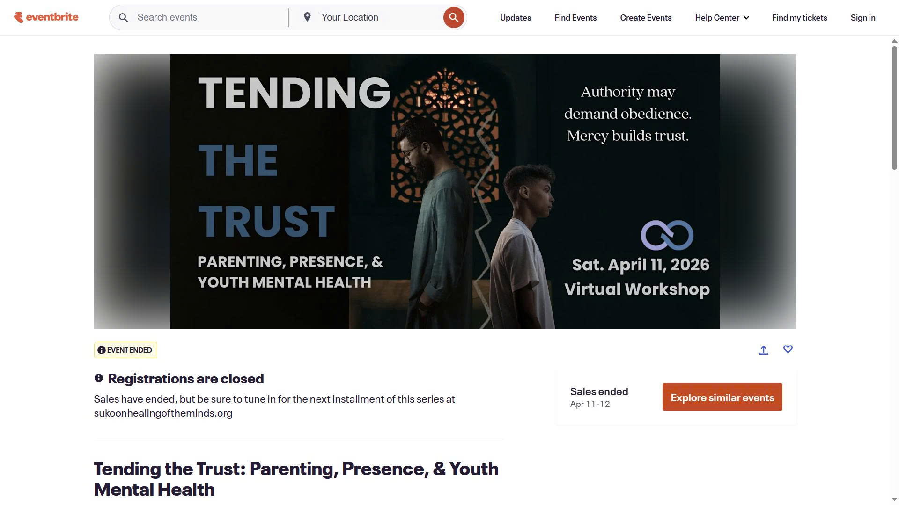
> **Caption:** Eventbrite's homepage can automatically detects the user's location and surfaces a curated feed of nearby events, making the experience feel immediately relevant without any manual input. This layout prioritizes discovery over navigation, encouraging users to browse rather than search.

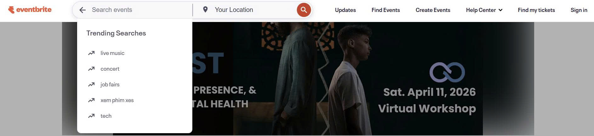
> **Caption:** The navigation bar contains a keyword search field paired with a location input (city or "Online") and trendings searches, allowing users to scope their search geographically from the very first interaction. The right side of the nav holds links for organizers ("Create event"), a notification bell for logged-in users, and a profile avatar menu.

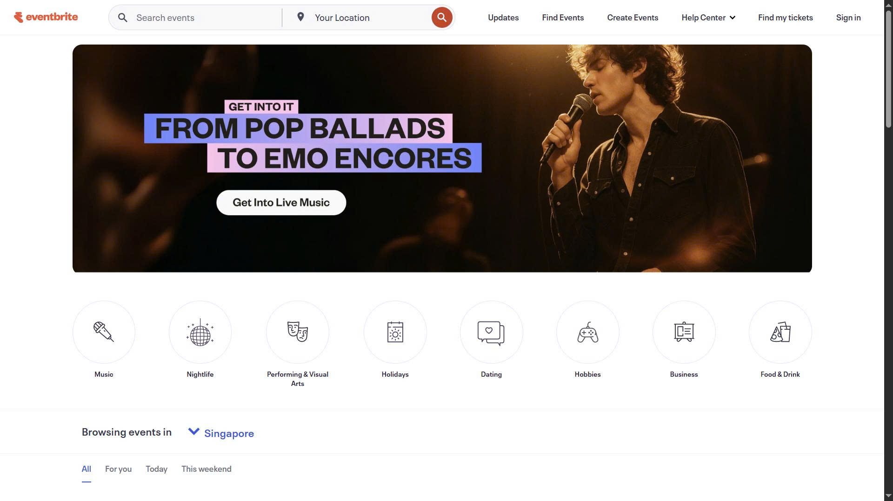
> **Caption:** Clicking a category (e.g., Music, Food & Drink, Sports, Dating) opens a dedicated browse page with a grid of matching events. A row of filter chips at the top lets users further narrow results by date (Today, This weekend, This month). The filter state is reflected in the URL, making filtered views shareable and bookmarkable.

---

#### Sign Up

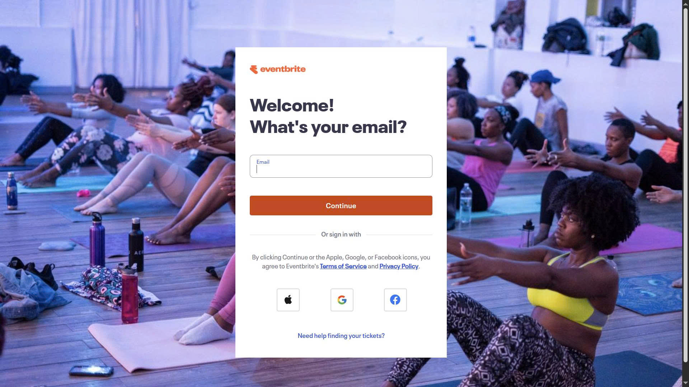 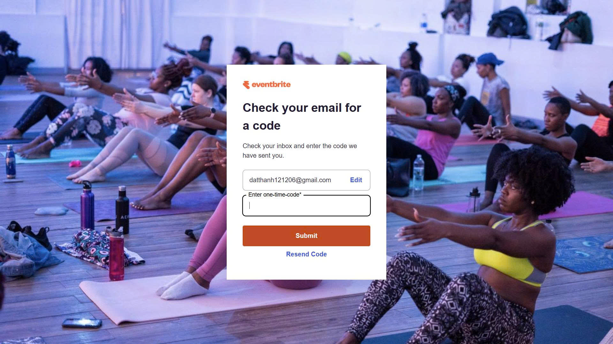
> **Caption:** Eventbrite's sign-up page is intentionally minimal: it asks only for an email address on the first step, then enter the code Evenbrite sent to user's email on the next screen. This two-step approach reduces the perceived effort of registration. Alternatively, users can sign up instantly with a Google or Facebook account via OAuth, bypassing the form entirely. New accounts default to the "Attendee" role; organizer capabilities are activated separately.

---

#### Event Detail Page

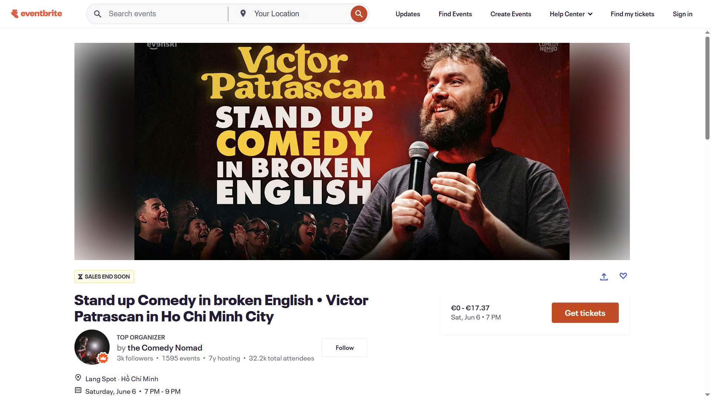
> **Caption:** The event detail page opens with a wide hero image followed by the event title in large typography. Directly beneath the title, a structured metadata row displays the date, time, location (with a small embedded map preview), and organizer name as a clickable link to the organizer's profile. This layout ensures that the most decision-critical information — when, where, and who — is visible before the user scrolls past the fold.

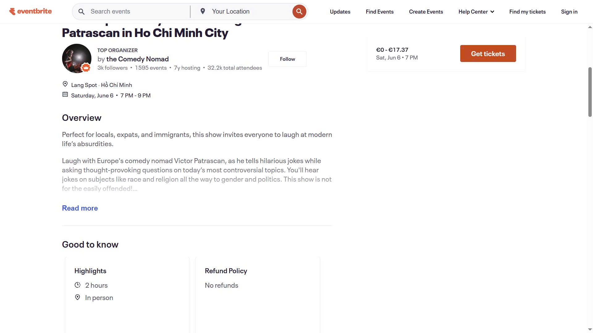
> **Caption:** The page body contains a rich-text "Overview" section where organizers can embed formatted text, images, and links. On the right side the description, a sticky ticket widget displays available ticket tiers with pricing and a prominent "Get tickets" button. The widget stays fixed as the user scrolls, reducing the number of steps needed to initiate a purchase.

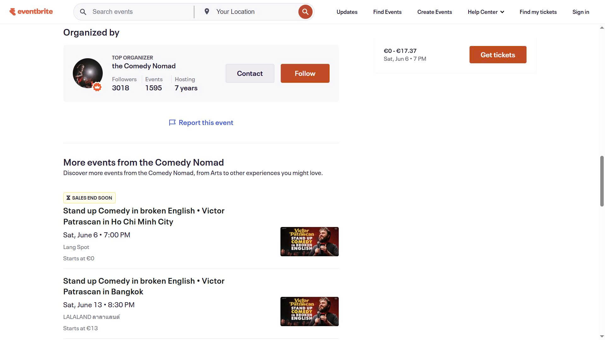
> **Caption:** Below the main content, a panel shows the organizer's name, profile photo, follower count, and a "Follow" button — allowing attendees to subscribe to future events from the same organizer. A "More events by this organizer" section and a "You might also like" row of algorithmically recommended events appear at the bottom, extending the user's session and cross-promoting other listings.

---

#### Checkout & Payment UI

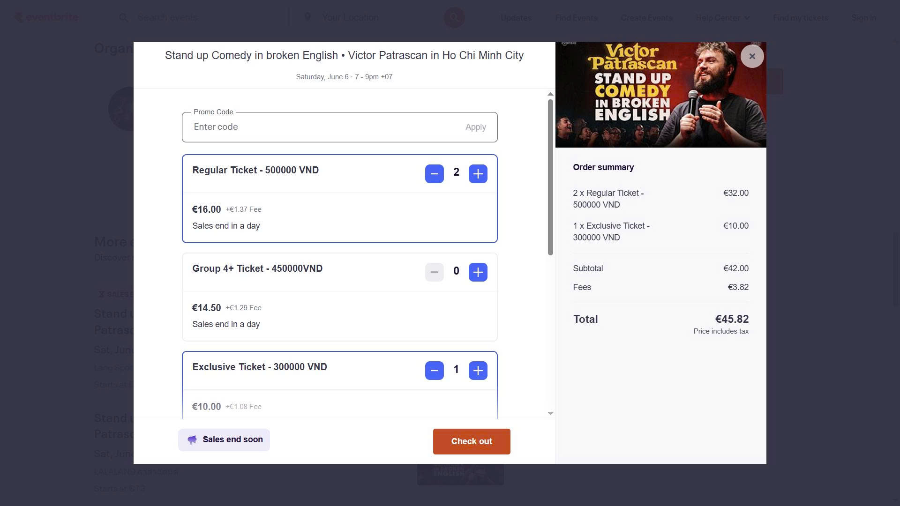
> **Caption:** Clicking "Get tickets" opens an inline modal (rather than a full page redirect) where users select ticket type and quantity. The modal shows tier names, prices, availability status, and a brief description of each tier. A running total updates dynamically as the user adjusts quantities. When ready, the user clicks "Checkout" to proceed to the payment page.

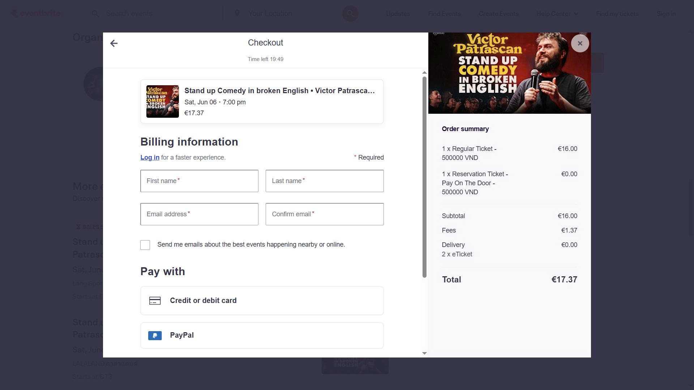
> **Caption:** The checkout page is powered by Stripe and collects the buyer's name, email, and card details in a single clean form. For logged-in users, personal details are pre-populated and the payment step is the only remaining action. Stripe's embedded card input handles number formatting, expiry validation, and CVV entry in a unified field group, minimizing friction. PayPal and Credit card are offered as one-tap alternatives at the top of the payment section on supported devices.
---

#### User Account Dashboard

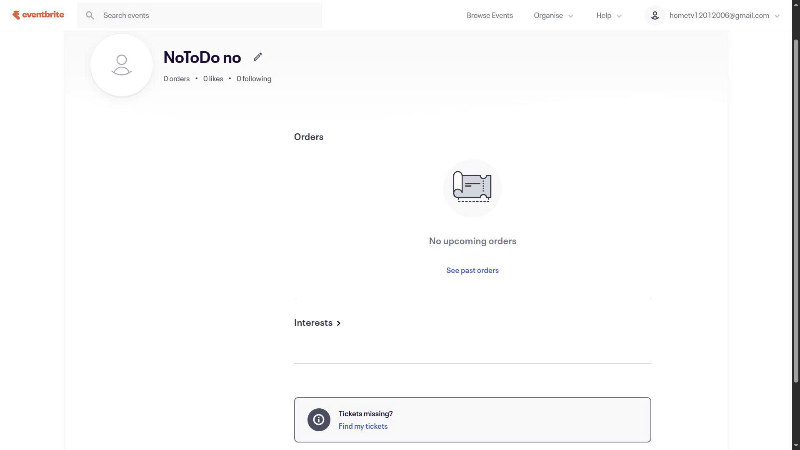
> **Caption:** The user dashboard's "Tickets" section separates orders into "Upcoming events" and "Past events" tabs. Each entry shows the event thumbnail, name, date, and a status badge (e.g., Confirmed, Refund requested). Clicking an entry opens the full ticket with QR code. The clean tabular layout makes it easy for frequent attendees managing multiple bookings to find what they need at a glance.

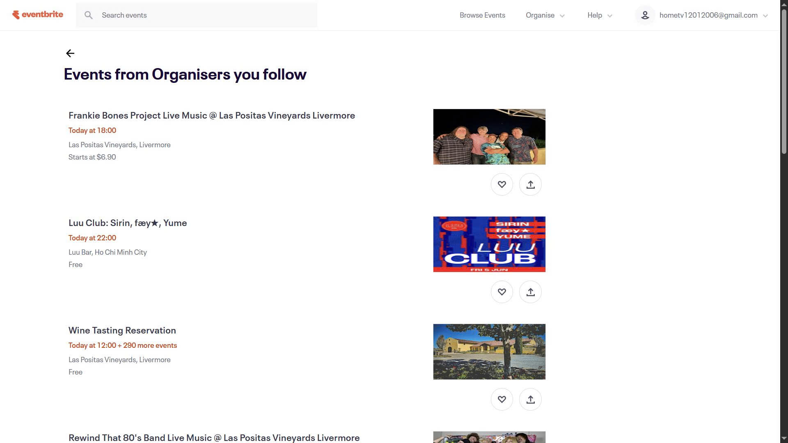
> **Caption:** Beyond the ticket wallet, the dashboard includes a "Following" section listing all organizers the user has subscribed to, and a saved-events list of bookmarked events.

### 3.2 Key Features & Functionality

#### Feature: Authentication & Account Creation

Eventbrite's sign-up flow is intentionally minimal, asking only for an email address on the first screen before sending a one-time verification code to confirm ownership. After verifying the code, the user sets a password to complete registration. Alternatively, Google and Facebook OAuth options are available on both the sign-up and log-in pages as one-tap alternatives that bypass the form entirely. New accounts default to the Attendee role; organizer capabilities are activated separately when the user creates their first event. The log-in page follows a standard layout with email and password fields and a "Forgot password?" recovery link. Social login buttons are displayed prominently beneath the form. Failed login attempts surface an inline error message without reloading the page, keeping the user in context.

**How it works:** Standard accounts authenticate against a hashed credential store. OAuth sign-ins delegate identity verification to Google or Facebook, with the returned identity token mapped to an Eventbrite account — a new account is created automatically on first OAuth login if no matching email exists. Session tokens are stored client-side and silently refreshed to maintain login state across visits.

**User workflow:** New user opens the sign-up page → enters email address → receives a one-time verification code by email → enters the code → sets a password → account created with Attendee role. Returning users enter email and password (or select a social login option) → authenticated → session token issued → user lands on their personalized dashboard.

---

#### Feature: Event Discovery & Personalized Feed

The homepage automatically detects the user's location and surfaces a curated feed of nearby events, making the experience feel immediately relevant without any manual input. A horizontal row of category shortcuts (Music, Food & Drink, Sports, Dating, etc.) sits below the hero section, letting users pivot to a filtered browse view in a single click. The search bar pairs a keyword field with a location input, allowing users to scope discovery geographically from the first interaction. As the user types, a dropdown surfaces trending searches and suggested events — reducing the need to complete a full query for commonly searched terms.

**How it works:** Location detection uses the browser's Geolocation API or IP-based inference to determine the user's city. The homepage feed is populated by querying for events within a configurable radius of that location, sorted by a combination of recency, popularity, and personalization signals for logged-in users. Keyword search matches against event titles, descriptions, tags, and organizer names using full-text search, augmented by trending and suggested results drawn from platform-wide query popularity signals.

**User workflow:** User opens the homepage → location is detected automatically → a feed of nearby events loads → user clicks a category shortcut or types a keyword in the search bar → results page displays matching events with date, location, and price filters available in the sidebar.

---

#### Feature: Ticket Purchase Flow

Users select a ticket tier and quantity through an inline modal on the event detail page, then complete checkout on a single-screen payment form to receive a confirmed QR e-ticket.

**How it works:** When the user opens the ticket modal, selected tickets are soft-reserved on the backend for a limited time window (typically 8 minutes), preventing overselling while the user completes checkout. The reservation is tied to a session token. If the session expires before payment, the tickets are released back to available inventory. On successful payment via Stripe or PayPal, the order is committed, inventory is decremented, and a unique QR code is generated for each ticket purchased.

**User workflow:** User clicks "Get tickets" on the event detail page → inline modal opens with tier options and pricing → user selects ticket type and quantity → clicks "Checkout" → checkout page loads with pre-filled personal details for logged-in users → user completes payment via Stripe or PayPal → order is confirmed → confirmation screen displays the QR e-ticket, which is also sent to the buyer's email.

---

#### Feature: QR Code E-ticket & Check-in

Each confirmed ticket is issued as a unique QR code delivered on the confirmation screen and by email. On event day, organizers use Eventbrite's dedicated Organizer app to scan attendee QR codes and validate them in real time.

**How it works:** Each ticket generates a unique QR code at the point of order confirmation, encoding an order ID and ticket ID into the payload. When scanned, the Organizer app sends the payload to Eventbrite's validation API, which checks three conditions: (1) the order exists and is in a confirmed state, (2) the ticket belongs to the correct event, and (3) the ticket has not been scanned previously. A successful validation marks the ticket as checked-in and returns an approval response in under a second. The app functions offline, queuing scans locally and syncing them to the server when the connection is restored — preventing check-in disruptions in venues with poor connectivity.

**User workflow (attendee):** User completes purchase → confirmation screen displays QR code → QR code is also delivered to the buyer's email → on event day, user presents the QR code on their device or a printed copy at the venue entrance.

**User workflow (organizer):** Organizer opens the Eventbrite Organizer app on event day → activates the QR scanner → points camera at attendee's QR code → app sends the token to the validation API → green screen (valid and checked in) or red screen (already scanned / invalid) → scanner resets automatically for the next attendee.

---

#### Feature: Refunds & Cancellations

Refund availability is determined by the policy the organizer configures when publishing the event. Attendees can view the policy on the event listing and submit refund requests through their "My Tickets" dashboard. Automatic or manual processing follows depending on the organizer's settings and whether the request falls within the configured policy window.

**How it works:** Organizers choose between three refund settings: no refunds, refunds allowed up to N days before the event, or refunds always allowed. The chosen policy is displayed on the event listing and included in the order confirmation email. When an attendee submits a refund request, Eventbrite notifies the organizer and surfaces the request in the organizer's Orders view. If the request falls within the configured policy window and the organizer has enabled automatic refunds, the platform approves and processes the refund without manual intervention — returning the amount to the buyer's original payment method within 5–10 business days. Requests outside the policy window are queued for manual organizer review. If an event is cancelled by the organizer, Eventbrite's Cancelled Event Policy requires full refunds to all attendees; in cases where the organizer fails to issue these, Eventbrite can act as a limited payments agent and process refunds directly from the organizer's account balance.

**User workflow:** User opens the ticket detail in "My Tickets" → if the refund policy permits, a "Request Refund" button is visible → user submits the request → ticket status updates to "Refund requested" → organizer is notified → if within automatic refund window, refund is processed and funds are returned to the original payment method within 5–10 business days; otherwise, the organizer manually approves or rejects the request → user receives an email notification of the outcome.

---

#### Feature: Waitlist Management

When all tickets for an event are sold out or held in pending orders, Eventbrite automatically switches the event listing from a "Get tickets" state to a "Join waitlist" state, allowing interested attendees to register and be notified if a spot becomes available.

**How it works:** The waitlist operates as a FIFO (first-in, first-out) queue ordered by registration timestamp. When a ticket becomes available — through a refund, an order expiry releasing a soft-reserved ticket, or the organizer manually releasing capacity — the platform notifies the first person in the queue by email, giving them a limited window to complete their purchase before the slot is offered to the next person in line. If the notified user does not complete checkout within the allotted time, the system advances to the next entry in the queue. Organizers can also choose to manage waitlist releases manually, deciding when and how many slots to open at a time.

**User workflow:** User visits a sold-out event page → "Join waitlist" button is displayed → user submits their email to register → receives a confirmation email acknowledging their position in the queue → when a ticket becomes available, user receives a time-limited notification email with a direct checkout link → user completes purchase within the allotted window → ticket is confirmed; if the window expires, the slot is offered to the next person in the queue.

---

#### Feature: Organizer Tools (Event Creation, Analytics & Marketing)

Organizers can create a complete event listing using either a manual form or an AI-powered "auto-create" tool that generates a full event draft from a few lines of input. A dedicated analytics dashboard provides real-time visibility into ticket sales, revenue, traffic sources, and live check-in counts, with all data exportable as a CSV for further analysis.

**How it works:** The AI auto-create tool sends the organizer's input to a language model with a structured prompt that enforces Eventbrite's event listing schema — ensuring the generated output maps cleanly to the required fields (title, description, category, format) without requiring post-processing. The analytics dashboard aggregates data from three sources in real time: the payment processing layer for sales data, UTM-tagged referral tracking for traffic attribution, and the check-in API for attendance figures. Traffic source attribution uses last-touch logic by default, crediting the final referrer before the checkout session began. Each event's analytics page breaks down ticket sales by tier, tracks revenue over time, and identifies which traffic sources (direct, social, search) drove the most conversions.

**User workflow (creating with AI):** Organizer navigates to "Create event" → selects the AI auto-create option → enters a short description of the event → the tool generates a complete draft including title, description, and suggested category tags → organizer reviews and edits the draft → publishes the event.

**User workflow (monitoring):** Organizer opens the event dashboard → views the list of events grouped by status (Live, Draft, Ended) → selects an event → analytics page loads with real-time sales, revenue, traffic source breakdown, and live check-in counter → organizer exports a CSV report if needed.

---

#### Feature: Follow Organizer & Saved Events

Logged-in users can follow organizers to receive notifications when new events are published, and bookmark individual events to a personal saved list that persists across sessions.

**How it works:** The Follow action writes a subscription record linking the user's account to the organizer's profile. When the organizer publishes a new event, Eventbrite's notification pipeline queries the subscriber list and dispatches emails in batches. Saved/liked events are stored as user-scoped bookmarks against the event ID and are displayed in the dashboard regardless of the event's current availability status, including sold-out events.

**User workflow:** User views an organizer's profile or event page → clicks "Follow" → subscription record is created → user receives email notifications when the organizer publishes new events. To save an event, user clicks the bookmark icon on any event card or detail page → the event is added to the "Liked events" list in their dashboard → user can revisit saved events at any time from the dashboard.

---

#### Feature: Personalized Recommendation Engine

Eventbrite surfaces personalized event suggestions in three locations: the logged-in homepage feed, the "You might also like" row on event detail pages, and a personalized email digest sent to active users — tailoring recommendations to each user's browsing and purchase history.

**How it works:** The recommendation engine draws on multiple behavioral signals ranked by recency and frequency: categories browsed, events purchased, organizers followed, events saved, and location. For cold-start users with no behavioral history, the system falls back to collaborative filtering — recommending events that users with similar demographic profiles or geographic proximity have attended or saved. The "You might also like" row on event pages uses item-to-item similarity, matching the viewed event's category, tags, price range, and location against the broader catalog to surface contextually relevant suggestions.

**User workflow:** Logged-in user opens the homepage → personalized feed loads based on their behavioral history and location → user browses an event detail page → "You might also like" row displays contextually similar events → active users periodically receive a personalized email digest highlighting recommended upcoming events based on their engagement history.

## 4. Comparative Summary
> *Conducted by Nguyễn Thành Đạt.*
### 4.1 Core Features Comparative Summary

The table below summarizes the support status of key features across the three surveyed platforms (Cticket.vn, Ticketbox.vn, Eventbrite).

| Feature | Cticket.vn | Ticketbox.vn | Eventbrite |
| --- | --- | --- | --- |
| Event creation & management | ✅ | ✅ | ✅ |
| Ticket purchase & checkout | ✅ | ✅ | ✅ |
| QR code e-tickets & Check-in | ✅ | ✅ | ✅ |
| Search & category filters | ✅ | ✅ | ✅ |
| Organizer dashboard | ✅ | ✅ | ✅ |
| Email notifications | ✅ | ✅ | ✅ |
| Refund handling | ✅ | ✅ | ✅ |
| AI-powered features | ❌ | ❌ | Partial |
| Waitlist / Resale | ❌ | ✅ | ✅ |
| Post-event reviews & ratings | ❌ | ❌ | ✅ |
| Real-time check-in analytics | ❌ | Partial | ✅ |

---

### 4.2 What TixHub Will Do Differently or Better
Based on the project development plan, TixHub will address the limitations of current applications through the following four key improvements:

* **Dual AI Integration for Real Value:** While Cticket and Ticketbox have no AI features, and Eventbrite only supports content generation, TixHub will implement two independent AI features. For attendees, TixHub provides an AI Chatbot that offers highly personalized event recommendations based on past tickets, saved events, and browsing history. For organizers, TixHub offers an AI Event-Listing Assistant that automatically generates professional event descriptions, suggests catchy titles and tags, and recommends sensible ticket pricing.

* **Verified Reviews & Social Proof System:** Cticket and Ticketbox skip the post-event phase, whereas TixHub will build a 1-5 star rating and review system similar to the Airbnb model. Attendees can only leave a rating and review after they have actually attended the event. These reviews will be publicly displayed on the organizer's profile and future events, helping to build long-term credibility and drive ticket purchase decisions for new users.

* **Unified Real-Time Analytics & QR Scanning:** TixHub combines the door scanner with a live analytics dashboard into a unified organizer view. Organizers can simultaneously view revenue charts, the number of tickets remaining, and live check-in counts in real-time during the event.

* **Strict Admin Moderation System:** TixHub specifically adds a platform Admin role equipped with dedicated moderation tools. Admins have the authority to approve new organizers before they are allowed to sell tickets, remove violating events, and manage user reports. This lightweight trust-and-safety layer prevents spam and scams, which is absolutely essential for a marketplace platform handling financial transactions.

---

### 4.3 UI/UX Patterns We Plan to Adopt
The team will distill and apply the best user interface and user experience patterns from the surveyed applications to build TixHub:

| Pattern | Source | How TixHub Will Use It |
| --- | --- | --- |
| **Card-based event grid** | Ticketbox, Eventbrite | Designing a clean, scannable grid layout for the homepage; each card immediately displays a thumbnail, event name, date, and lowest ticket price so users can easily digest information. |
| **Dynamic search bar & Location-based discovery** | Ticketbox, Eventbrite | Building an expandable search bar that reveals trending keywords and automatically filters events based on the user's current location to prioritize discovery. |
| **Seamless Checkout (Modal/Single-screen)** | Eventbrite | Using an inline modal to select ticket types and consolidating attendee information and payment method selection into a single screen to reduce the drop-off rate. |
| **Prominent QR code display** | Cticket, Eventbrite | Displaying a large, clear QR code directly on the payment confirmation screen and allowing users to download it as a PDF or save it to their device to make check-in frictionless.|
| **Clear status grouping on Organizer Dashboard** | All three platforms| Grouping the event management interface into a single view with clear status tabs: Draft, Waiting for Approval, Upcoming, and Finished. |
| **One-tap Sign Up / Log In (OAuth)** | Ticketbox, Eventbrite | Prioritizing Google/Facebook login buttons and minimizing the manual registration form (only requiring an email address initially) so new attendees can bypass the form and buy tickets as quickly as possible. |
---
