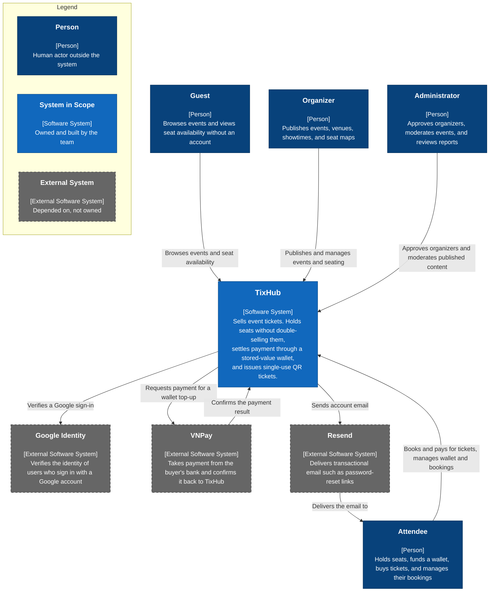

e:\PA3-Group02\Image

# Software Architecture: System Context

## TixHub: Event Ticket Sales Web Application

**CS300 – CSC13002 – Introduction to Software Engineering**

Group 02 · SoE

*Assignment: PA4-2026*

---

> **Performed by: Lương Hưng Phát (24127298)** | **Reviewed by: All member** | **Edited by: Nguyễn Minh Khoa (24127188)**

---

### Table of Contents

1. [Tech Stack](#1-tech-stack)
    - [1.1 Frontend](#11-frontend)
    - [1.2 Backend](#12-backend)
    - [1.3 Database](#13-database)
    - [1.4 External Services and APIs](#14-external-services-and-apis)
    - [1.5 Infrastructure and Delivery](#15-infrastructure-and-delivery)
    - [1.6 Build, Test, and Quality Tooling](#16-build-test-and-quality-tooling)
    - [1.7 Feature Coverage](#17-feature-coverage)
2. [C4 Model Level 1: System Context Diagram](#2-c4-model-level-1-system-context-diagram)
    - [2.1 Main Flow](#21-main-flow)
    - [2.2 Actor Descriptions](#22-actor-descriptions)
    - [2.3 External System Descriptions](#23-external-system-descriptions)
    - [2.4 Scope Boundaries](#24-scope-boundaries)
3. [Appendix: AI Usage Notes](#3-appendix-ai-usage-notes)
    - [Tool](#tool)
    - [Summary of prompts used](#summary-of-prompts-used)
    - [Content generated with AI vs. done independently](#content-generated-with-ai-vs-done-independently)

---

### 1. Tech Stack

TixHub is one TypeScript monorepo. `src/` is the browser application. `server/` is the API.
`shared/` holds the request and response contracts that both sides compile against, so changing a
payload shape breaks the build on whichever side has not caught up yet.

#### 1.1 Frontend

| Technology | Version | Role |
|---|---|---|
| React | 19.0 | UI runtime. Function components and hooks only; no class components. |
| TypeScript | 5.8 | Type checking across UI, services, and shared contracts. |
| Vite | 6.2 | Dev server and production bundler. Dev proxies `/api`, `/socket.io`, and `/uploads` to the API so the refresh cookie stays first-party. |
| React Router | 7.18 | URL ↔ screen mapping. Every screen is addressable; `src/routes.ts` is the single translation layer. |
| Tailwind CSS | 4.1 | Styling. Design tokens are CSS custom properties, so light and dark repaint at runtime without a rebuild. |
| Socket.IO client | 4.8 | Subscribes to live seat-status updates for the showtime being viewed. |
| lucide-react | 1.17 | Icon set. |
| react-markdown | 10.1 | Renders the static legal and information pages from Markdown source. |
| motion | 12.23 | Animation primitives. |

**VNM Sans** (Std and Display) ships as WOFF2 inside the bundle. Only JetBrains Mono is fetched
from Google Fonts.

#### 1.2 Backend

| Technology | Version | Role |
|---|---|---|
| Node.js | 22 | Runtime. |
| Express | 4.21 | HTTP layer. Routers are mounted per module under `/api`. |
| TypeScript | 5.8 | Compiled through `tsx` in development. |
| Socket.IO | 4.8 | One room per showtime. Broadcasts seat transitions after commit; the channel never mutates state. |
| `pg` | 8.13 | PostgreSQL driver and connection pool. No ORM. SQL is written directly, so row locks and transaction boundaries stay explicit. |
| Zod | 3.24 | Request validation at the router boundary. Unknown fields are stripped, which is what keeps privilege fields out of profile updates. |
| jsonwebtoken | 9.0 | Signs short-lived access tokens (15 min). |
| bcrypt | 6.0 | Password hashing, cost 12. |
| multer + sharp | 2.0 / 0.35 | Avatar upload: size and type validation, then re-encode to WebP before it touches disk. |
| cookie-parser | 1.4 | Reads the httpOnly refresh cookie. |
| uuid | 11.0 | Idempotency keys for refresh rotation. |

#### 1.3 Database

**PostgreSQL 18** on **Neon**. Three branch roles are configured, each read from its own environment
variable: application (`DATABASE_URL`), test (`TEST_DATABASE_URL`, truncated between every test
case), and demo (`DEMO_DATABASE_URL`, loaded by hand, rebuildable by no script). The test URL never
falls back to the application URL. A missing `TEST_DATABASE_URL` fails the run instead. A separate
guard refuses to start any destructive job that resolves to the demo branch.

Schema changes go through a small forward only runner, `server/src/db/migrate.ts`. It applies every
`.sql` file in filename order and records what it applied in `schema_migrations`, so a second run
does nothing. Eleven migrations sit in the repository. They cover auth, catalog, seat holds, wallet
and checkout, refunds, the seat map layout model, and admin moderation.

Money is stored as `BIGINT` in VND minor units. Seat state transitions sit behind
`SELECT … FOR UPDATE` row locks. That lock is why no seat sells twice when buyers arrive at once,
rather than only when a demo happens to run smoothly.

#### 1.4 External Services and APIs

Three outside systems are load bearing at runtime.

| Service | Purpose | Integration |
|---|---|---|
| **Google Identity** | Sign in with a Google account. | Google Identity Services renders the button in the browser and hands back an ID token. The API then verifies that token with `google-auth-library` against the configured client ID. Accounts are keyed on the provider subject, never on email. |
| **VNPay** | Wallet top up. | The API builds a signed redirect URL (HMAC-SHA512, VNPay spec 2.1.0). The balance moves on the signed server to server IPN callback, never on the browser return URL. A reconciliation sweep calls VNPay's `querydr` endpoint for top ups whose IPN never arrived. |
| **Resend** | Transactional email. | HTTPS API. Sends password reset links. |

Two dependencies are left out of the architecture on purpose:

- `@google/genai` sits in `package.json` but is imported nowhere in `src/` or `server/`. Dead
  weight, not a component.
- Unsplash image URLs appear only in `src/data.ts` and `server/src/db/seed-dev.ts`. Those are
  development fixtures, not a production dependency.

#### 1.5 Infrastructure and Delivery

One self managed **VPS** at `tixhub.fit`, split across two origins on a single registrable domain:

- `https://tixhub.fit`: Nginx serves the built SPA out of `dist/`.
- `https://api.tixhub.fit`: Nginx reverse proxies to Express.

**Cloudflare** fronts both origins, handling edge TLS, WAF, and DDoS. Nginx then overwrites
`X-Forwarded-For` with the real peer address, and Express trusts exactly one hop. The per source
rate limit therefore keys on a client address that no header can fake.

The two origins are cross **origin** but same **site**. That is why the refresh cookie can stay
`SameSite=Lax` with no CSRF token. Uploaded avatars land on VPS disk, and Nginx serves them under
`/uploads`.

#### 1.6 Build, Test, and Quality Tooling

Vitest with Supertest drives the API against a real Neon branch. 32 test files, 184 cases. ESLint
and Prettier enforce style. TypeScript runs as two projects, `tsconfig.web.json` and
`tsconfig.server.json`, so a type error on the server cannot hide behind a passing web build.

Feature work runs on **Spec Kit**. Every functional group carries a spec, a plan, tasks, a data
model, and a contract under `src/specs/`.

#### 1.7 Feature Coverage

The context below covers every functional group shipped from PA1 through PA4.

| Spec | Functional group |
|---|---|
| `001-account-auth` | Registration, login, Google sign-in, sessions and refresh rotation, password reset, profile, avatars, organizer application |
| `002-event-catalog` | Public browse and search, event detail, showtimes, organizer event/venue/showtime authoring, pre-publish moderation gate |
| `003-seat-holds` | Seat and general-admission holds, TTL expiry sweep, live seat map |
| `004-admin-organizer-moderation` | Organizer approval, event moderation, content reports, append-only audit log |
| `004-static-info-pages` | About, terms of service, website terms, refund policy |
| `005-seatmap-designer` | Venue layout editor, seat-map generation, showtime map management |
| Wallet & checkout | Wallet balance and statement, VNPay top-up, wallet-funded checkout, ticket issue, refunds |

---

### 2. C4 Model Level 1: System Context Diagram

#### 2.1 Main Flow

Four kinds of user reach one system. A Guest browses the catalog and can watch a seat map fill up in
real time, but cannot hold a seat. Holding needs an identity, because every hold has an owner. An
Attendee signs in, with a password or through Google, holds seats for a fixed window, tops the
wallet up through VNPay, and pays from that balance. An Organizer publishes events and designs the
seating those Attendees pick from. An Administrator gates both: organizer applications and events
are reviewed before either becomes public.

TixHub calls out to three systems and is called back by one. It asks Google to vouch for a sign in,
asks VNPay to collect money, asks Resend to deliver email. Only VNPay talks back. The wallet balance
moves when VNPay's signed server to server callback arrives, not when the buyer's browser returns
from the payment page. That direction matters. A browser redirect sits under the buyer's control, so
it cannot be trusted to move money.

#### 2.2 Actor Descriptions

| Actor | Who they are | What they do with TixHub |
|---|---|---|
| **Guest** | Anyone with the URL, not signed in. | Browses and searches the catalog, opens event details, views showtimes, watches live seat availability. Cannot hold a seat or see any account data. |
| **Attendee** | A registered account. The default role on registration. | Everything a Guest can do, plus: holds seats or general admission quantities, funds a wallet, pays from that balance, receives QR tickets, views booking history, and may apply to become an Organizer. |
| **Organizer** | An Attendee whose application an Administrator approved. | Creates venues and events, schedules showtimes with ticket tiers, designs venue layouts and generates seat maps, submits events for review. Cannot publish without approval. |
| **Administrator** | Staff account, flagged in the database. | Approves, rejects, or suspends organizer applications; approves, rejects, flags, or removes events; resolves reported content; reads the append only audit log. |

Roles stack, they do not replace. An Organizer is still an Attendee and can buy tickets.

#### 2.3 External System Descriptions

| External system | Why TixHub depends on it | Direction and trust |
|---|---|---|
| **Google Identity** | Lets users sign in without creating another password. | Outbound only. TixHub sends the ID token the browser received, and Google confirms who it belongs to. The account is keyed on Google's stable subject identifier, so changing a Google email does not spawn a second account. A Google email matching an existing password account is refused, not silently linked. |
| **VNPay** | Collects real money. TixHub holds no card data and is not a payment processor. | Outbound to start a payment, inbound to confirm it. The confirmation is a signed server to server callback. The browser redirect counts as display only. Top ups left unconfirmed are reconciled by querying VNPay directly, never guessed at. |
| **Resend** | Delivers email TixHub must not send itself. | Outbound only. Used for password reset links. A delivery failure does not change the API's response, so watching for an error tells an attacker nothing about whether an address exists. |

#### 2.4 Scope Boundaries

A Level 1 diagram answers three questions. What is this system, who uses it, what does it depend on.
The items below are real parts of the deployment, yet they are deliberately **not** drawn here.
Putting them on the page would answer a question this level never asked.

- **Neon PostgreSQL.** TixHub's own data store, not a third party it integrates with. It sits
  inside the system boundary as a container, and shows up at Level 2.
- **Cloudflare and Nginx.** Network infrastructure the traffic passes through. Neither one changes
  who uses the system or what it functionally depends on. The deployment diagram in Section D
  covers them.
- **The split between the browser application and the API.** An internal decomposition. Level 2
  opens with it.
- **Protocols, frameworks, and versions.** Section 1 lists them all. Leaving them off keeps the
  diagram readable for someone without a technical background.

---

### 3. Appendix: AI Usage Notes

The team declares its use of AI tools on this document, as the course AI Usage Guidelines require. AI asked questions and tidied formatting. It was never asked to write the architecture. Everything factual in Sections 1 and 2 was settled by the team against the actual repository: the tech stack, the Level 1 diagram, the actor and external system descriptions, and the list of things deliberately left off that diagram. When the AI raised a question, the member answered it. When it offered options, the member picked. Nothing here was generated and handed in unrevised.

#### Tool

| Item | Detail |
|------|--------|
| Tool name & version | Claude (Claude Opus 5) |
| Provider / platform | Anthropic, Claude Code CLI |
| Access dates | August 8, 2026 |

#### Summary of prompts used

Listed below are the prompts that actually shaped the document. Small formatting and tutorial prompts are left out.

**Full name:** Lương Hưng Phát | **Student ID**: 24127298

- Claude Opus 5, Anthropic, Claude Code, accessed on August 8, 2026
    - *Prompt*: Interview me about my draft System Context diagram against our actual codebase. Ask me questions that surface anything I have misunderstood or stated wrongly, and where there is a choice to make, give me the options instead of rewriting the document.
    - *Usage*: used to pressure test my draft of Section 1 (Tech Stack) and Section 2 (Level 1 System Context Diagram) against what the repository actually ships.
    - *How the output was used*: The AI came back with a list of questions, each carrying a few options to choose between. Working through them showed me where my draft had drifted from our real work. Two examples: how the external systems are drawn, and what belongs at Level 1 instead of Level 2. I answered every question. I made every call. Then I changed only the parts I judged were worth changing. The AI wrote none of the answers and edited none of the sections.

- Claude Opus 5, Anthropic, Claude Code, accessed on August 8, 2026
    - *Prompt*: Read the vision document format and template, re design both the system context and the container component file to fit that format for better visualize and consistency. Only change format, keep the content the same.
    - *Usage*: used to match this document's presentation to the Vision Document: cover block, shared stylesheet, table of contents, heading hierarchy, section separators.
    - *How the output was used*: Only the presentation changed. I compared the result against the version from before the reformat, checking that no wording, no table cell, and no diagram content had moved, and that every table of contents link still resolved.

#### Content generated with AI vs. done independently

- **AI assisted:** the interview questions, and the options they offered against my draft. Also the presentation layer, meaning the cover block, stylesheet, table of contents, heading levels, and section separators.
- **Done independently by the team:** every factual claim. Tech stack tables and versions, the Level 1 diagram and its relationships, the actor and external system descriptions, the scope boundary calls in Section 2.4. Every answer during the interview was mine, and so was every decision about what to change.
- **Validation:** answers were checked against the repository before the draft was edited. The reformatted file was then diffed against the original, so the content is provably untouched. The member named above owns this content and can explain it.

> AI produced no architectural facts here, no diagrams, no decisions. The document was not written end to end by AI.
