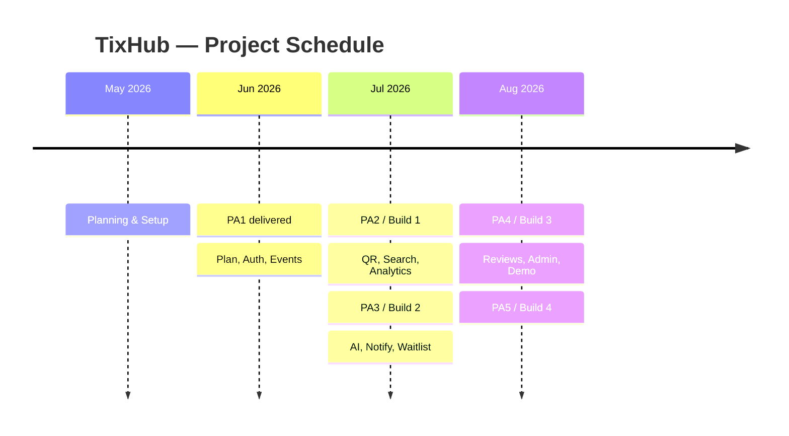

# Project Plan

## TixHub: Event Ticket Sales Web Application

**Introduction to Software Engineering  — 24C11**

Group 02 · SoE

*June, 2026*

---

> **Disclaimer:** The content has since been re adjusted from its version in PA2. The team has added an in platform wallet that allow the payment and refund features.

---

### Table of Contents

1. [Introduction](#1-introduction)
2. [Project Overview](#2-project-overview)
    - [2.1 Goals](#21-goals)
    - [2.2 Scope](#22-scope)
    - [2.3 Deliverables](#23-deliverables)
    - [2.4 Assumptions](#24-assumptions)
3. [Project Organization](#3-project-organization)
4. [Risk Management](#4-risk-management)
5. [Project Plan](#5-project-plan)
6. [Schedule](#6-schedule)
7. [Build Plan](#7-build-plan)
8. [Appendix — AI Usage Notes](#8-appendix--ai-usage-notes)

---

### 1. Introduction

> *Conducted by Nguyễn Minh Khoa.*

TixHub is a web based event ticketing platform developed by Group 02. The platform connects three groups of users, a platform **Admin**, event **Organizers**, and **Attendees** on a single marketplace where events are created, tickets are sold securely, and attendees are checked in at the door with QR codes.

This document is the initial project plan for TixHub. It describes how the team will deliver the product across five Scrum sprints over an academic semester. The plan covers team organization and responsibilities, risk identification and mitigation, a detail task breakdown, the overall project schedule, and the build strategy for testing and final delivery.

---

### 2. Project Overview

> *Conducted by Lương Hưng Phát.*

#### Goals

The goal of TixHub is to deliver a complete, production shaped event ticketing platform while applying disciplined Agile engineering practice. Specific goals include:

*1. **Enable end to end ticket sales:*** Allow organizers to create events and attendees to discover, purchase, and receive tickets entirely online through a secure, integrated sandbox checkout.
*2. **Eliminate ticket fraud at the door:*** Issue every ticket as a unique QR code and provide a web based scanner so each ticket can be checked in exactly once, with live attendance data for organizers.
*3. **Support real reserved seating:*** Provide a real time interactive seat map where attendees select specific seats and different buyers can never be sold the same seat.
*4. **Apply AI to real product problems:*** Use the third party API to recommend relevant events to attendees and to help organizers produce better event listings.
*5. **Give organizers actionable data:*** Provide an analytics dashboard of sales, revenue, remaining inventory, and check ins.
*6. **Keep the marketplace safe and credible:*** Provide admin moderation and organizer approval to maintain trust and transparency in the platform.
*7. **Practise disciplined Agile delivery:*** Complete the product across structured sprints with planning, reviews, testing, and CI/CD.

#### 2.2 Scope

TixHub delivers **eleven core features** across three user roles Admin, Organizer, and Attendee as a single web application. This section defines the boundary of the work.

##### In Scope

- ***Attendee:*** Browse, search, and filter events; hold seats on a live map — or a quantity for general admission — for a **7-minute configurable window, max 8 tickets per showtime**, sign-in required; top up a **store-credit wallet** via the VNPay sandbox; buy tickets by **debiting that wallet in one atomic transaction**; receive QR-code digital tickets; cancel a ticket to free the seat and get its **refundable amount back to the wallet**; AI event recommendations (via third party AI API); submit reviews & ratings; receive notifications and join waitlists.
- ***Organizer:*** Event creation & management; AI listing assistant (via third party AI API); phone browser door QR scanner and check-in; real time analytics dashboard.
- ***Admin:*** Organizer approval workflow; **pre-publish event approval** and content moderation; platform-wide analytics.
- ***Platform wide:*** Authentication — Google OAuth sign in and own membership (email, nickname, password, optional unique phone); single deployment reachable via a public URL for grading.

##### Out of Scope

- Real money / production payment settlement and **payouts to organizers** (VNPay sandbox only; organizers are settled off-platform).
- **Cash-out from the wallet.** The wallet is a closed loop: money enters by top-up and leaves only as tickets. Refunds go **back to the wallet**, never to a card or bank account (schema decision D3, constitution v2.0.0).
- Multi-currency and international payment methods.
- Native mobile applications (iOS/Android).
- Online / streaming events — physical venues only.
- Ongoing post-PA5 maintenance and support.
- Third party AI API hosting or model training; no custom model.

##### Constraints

- Hosting: a single team-managed **VPS** (`tixhub.fit`, Nginx serving the SPA and reverse-proxying the API same-origin) plus free-tier **Neon** PostgreSQL.
- Third-party AI API free-tier quota.
- VNPay **sandbox** only; no real funds are processed.
- External integrations capped at **four** — VNPay, one approved configured AI provider behind `AIProvider`, Google OAuth, Resend (constitution v2.1.0); a fifth needs an amendment.
- Real-time seat updates run over **Socket.IO** on the same Node process and origin (constitution technology stack) — no message broker, no second service; the database stays the source of truth and socket updates are advisory.
- 13 week semester, 5 sprints (PA1–PA5), 5 member team.
- The deployed application will be reachable via a public URL for evaluator grading.

##### Acceptance Criteria

- All eleven features are deployed and demonstrable end to end on the public URL.
- The core flow works: register/login &rarr; create event &rarr; admin approves it &rarr; top up wallet &rarr; buy ticket (GA + reserved) &rarr; receive QR ticket &rarr; check in at the door.
- Concurrent seat **holds** and purchases never double book a seat, and no general-admission tier is oversold (verified under load test; ≥ 60 concurrent viewers on one map, seat update < 1 s p95).
- A hold left alone is auto-released within ~1 minute of its 7-minute window, even with the client disconnected; the only extension is the one-time top-up grace (+7 min, ceiling 14 min).
- Wallet top-ups are credited only through a signed, idempotent VNPay sandbox IPN; the wallet ledger explains every balance (DATA-04).
- All four builds pass the CI quality gates (see §7) with no open P0/P1 defects.
- Each PA deliverable is accepted by the course evaluators.

#### Deliverables

| Sprint | PA | Key Deliverables |
|--------|-----|------------------|
| Sprint 1 | PA1 | Identify problem, project proposal, team contract, and workflow principle |
| Sprint 2 | PA2 | Project Plan, Vision Document, SpecKit setup + project constitution, account & authentication module (feature `001-account-auth`) |
| Sprint 3 | PA3 | Use-Case Specification, event catalog & discovery incl. admin pre-publish approval (`002-event-catalog`), real-time seat map & holds (`003-seat-holds`), wallet top-up + wallet checkout, QR ticketing & door scanner, real time analytics dashboard, fully integrated build; revised project plan |
| Sprint 4 | PA4 | AI recommendations chatbot, AI listing assistant, notifications & waitlist, ticket cancellation with wallet refund |
| Sprint 5 | PA5 | Reviews & ratings, reported-content moderation, admin platform analytics, complete test reports, production deployment, PA5 feature demo |

#### Assumptions

- All five team members remain available and fully commited to the project.
- VNPay sandbox remains accessible and stable throughout the project; no real money will be processed.
- API free tier quotas are sufficient for development and demonstration purposes.
- The single VPS (`tixhub.fit`) plus free-tier Neon PostgreSQL provide adequate capacity for development, testing, and the PA5 demo.
- Course evaluators can access the deployed application via a public URL for grading.
- A shared API contract agreed in Sprint 1 remains valid unless a breaking change is unanimously approved by the team.
- The team's personal laptops meet the minimum requirements: modern multi core CPU, ≥ 8 GB RAM, internet access.

---

### 3. Project Organization

> *Conducted by Nguyễn Minh Khoa.*

#### Group 02

<table>
  <tr>
    <th>Lương Hưng Phát</th>
    <th>Nguyễn Thành Đạt</th>
    <th>Nguyễn Minh Khoa</th>
    <th>Nguyễn Tấn Hiệu</th>
    <th>Nguyễn Anh Khôi</th>
  </tr>
  <tr align="center">
    <td>24127298</td>
    <td>24127021</td>
    <td>24127188</td>
    <td>24127373</td>
    <td>24127430</td>
  </tr>
  <tr align="center">
    <td>PM / Backend Engineer <b>(Team Leader)</b></td>
    <td>Fullstack Dev / Tester</td>
    <td>Backend Developer</td>
    <td>Frontend Dev / DevOps</td>
    <td>Database Management</td>
  </tr>
</table>

#### Roles and Responsibilities

- ***Lương Hưng Phát:*** Team Leader, Project Manager, and Backend Engineer. Owns the sprint planning process, maintains the Jira backlog, conducts the sprint review and retrospective, leads backend development, and signs off on each sprint's deliverables. Acts as the primary point of contact between the team and course instructors.

- ***Nguyễn Thành Đạt:*** Fullstack Developer and Tester. Implements cross features that span both frontend and backend, owns QA strategy, writes and runs test cases (unit, integration, and acceptance), and coordinates the test report deliverables for each PA.

- ***Nguyễn Minh Khoa:*** Backend Developer. Implements core backend modules and REST API endpoints, owns payment integration (VNPay) and AI integration behind the shared provider abstraction, and supports architectural decisions on the server side.

- ***Nguyễn Tấn Hiệu:*** Frontend Developer and DevOps Engineer. Implements and owns the React SPA and all user facing interfaces, configures and maintains the CI/CD pipeline (GitHub Actions), manages deployment to the team-managed VPS (`tixhub.fit`: Nginx TLS, static SPA, reverse-proxied API) and the Neon database, and monitors hosting infrastructure.

- ***Nguyễn Anh Khôi:*** Database Manager. Designs and owns the PostgreSQL schema, writes and runs all database migrations, ensures data integrity, and supports performance tuning for concurrent seat hold queries.

#### Communication and Collaboration

- ***Daily stand ups:*** short async updates posted on Discord each working day (blocker, progress, plan).
- ***Sprint ceremonies:*** sprint planning, review, and retrospective conducted on Google Meet at the start and end of each sprint.
- ***Code review:*** every change is submitted as a GitHub pull request; at least one other member must review and approve before merging.
- ***Documentation:*** all written deliverables authored in Markdown and committed to the shared repository.

---

### 4. Risk Management

> *Conducted by Nguyễn Minh Khoa.*

| # | Risk | Likelihood | Impact | Mitigation Strategy |
|---|------|:----------:|:------:|---------------------|
| 1 | **Member unavailability:** A team member becomes temporarily unavailable due to illness, academic commitments, or personal circumstances, stalling their assigned tasks. | Medium | High | Tasks are documented clearly in Jira so any member can pick them up. The team maintains a shared knowledge of all modules via code review and weekly syncs. If a member is unavailable, the PM redistributes their sprint tasks immediately and make sure that member has to compensate the work they had missed after they return. |
| 2 | **Infrastructure / free tier limits:** The VPS runs out of capacity, or the Neon database or AI API free quotas are exceeded during development, testing, or the PA5 demo, causing service interruptions. TLS certificates and OS patching are now the team's own responsibility. | Medium | Medium | The DevOps member (Hiệu) monitors VPS resources and Neon usage throughout the semester, and automates certificate renewal. Scaling out is a config change (more Node workers behind Nginx, or a bigger VPS), not a rewrite. If no complimentary alternative is available, the team contacts the supervisor for advice. Demo traffic is controlled and pre-staged. |
| 3 | **Scope creep:** Eleven features including a real time concurrent seat map across 13 weeks threatening the sprint schedule. | Medium | High | The eleven features and the explicit out of scope list are locked in the Product Backlog. The PM protects sprint commitments: non-essential polish or new ideas are deferred to later sprints or dropped if they delay PA delivery dates. |
| 4 | **Integration risk from parallel development:** The frontend and backend are developed independently in Sprint 2 and 3 which may diverge, causing integration failures when combined in Sprint 4. | Medium | Medium | A **single shared contract** — request/response shapes declared once as TypeScript types in `shared/` and imported by both sides, plus an OpenAPI file per feature — was agreed in Sprint 2 and is mandated by constitution Principle VI, so a breaking change fails at compile time rather than in the browser. Frontend and backend now live in one monorepo and are integrated per feature as it ships, not in a late big-bang phase. |
| 6 | **Payment integration failures:** VNPay top-up IPNs may be delayed, duplicated, or fail mid flow, risking a wallet credited twice or money paid but not credited. | Low | High | Wallet-only checkout (schema decision D2) keeps the gateway out of the seat and ticket lifecycle entirely — a failed top-up costs a seat at worst, never a ticket issued without payment. IPN handling is **idempotent** (guarded on `status='initiated'` plus a unique reference), so a replay credits nothing. A `querydr` reconciliation sweep settles top-ups still `initiated` after ~15 minutes; until then the attendee sees *Pending*, never lost money. |

---

### 5. Project Plan

> *Conducted by Nguyễn Minh Khoa.*

This project follows the **Scrum** process model, organized into five sprints that correspond to the five PA deliverables (PA1–PA5). Each sprint lasts 2–3 weeks. **Sprint 3 is the current sprint** (PA3); Sprint 2 is closed. Detailed tasks with assigned performers, reviewers, and due dates are provided for Sprints 2 and 3. For Sprints 4–5, planned tasks are listed; detailed assignments will be finalized when each sprint begins.

> **Delivery method.** Each feature is specified with **SpecKit** before it is coded — spec → plan →
> tasks → implement — and lives under `src/specs/<id>-<name>/`. Status as of **July 24, 2026**:
> `001-account-auth` **done** (38 tests), `002-event-catalog` **done** (19 tests),
> `003-seat-holds` **specified and planned, build in progress**. The seat-hold tasks below were
> re-dated accordingly; the slip is inside Sprint 3 and does not move the PA3 date.

> **Task convention:** each task is performed by two member and reviewed by another. All project related activities like coding, report writing, testing, and self-training is counted as valid tasks.

---

#### Sprint 1: Planning 

**Focus:** Identify problem, project proposal, team contract, and workflow principle

**Completed deliverables:** Project Proposal, team contract, working pipeline (Jira, Drive, version control and spec driven techinque), GitHub repository initialization.

---

#### Sprint 2: Core 

**Focus:** project plan, vision document, speckit initialization, and AI, weekly report. For implmenation, the landing page with authentication & role-based access, and event creation (general admission) will be started.

| # | Task | Performer | Reviewer | Due Date |
|---|------|-----------|----------|----------|
| 1 | Write project plan document | Nguyễn Minh Khoa | Lương Hưng Phát | June 29, 2026 |
| 2 | Create first version of Landing page, Google Oauth  | Nguyễn Tấn Hiệu | Lương Hưng Phát | June 29, 2026 |
| 3 | Write stakeholder and user description for Vision document | Lương Hưng Phát | Nguyễn Minh Khoa | June 29, 2026 |
| 4 | Write introducition and positioning for Vision document | Nguyễn Thành Đạt, Nguyễn Anh Khôi | Lương Hưng Phát | June 29, 2026 |
| 5 | Training SpecKit | All members| - | June 29, 2026 |
| 6 | Sprint 2 review, retrospective, and Jira board update | All members | Lương Hưng Phát | July 10, 2026 |

---

#### Sprint 3: Tickets & Data 

**Focus:** event catalog & discovery, wallet top-up and wallet checkout, real-time seat map & holds, QR ticketing & door scanner, real-time analytics, front-end / back-end full integration, and revised project plan.

| # | Task | Performer | Reviewer | Due Date |
|---|------|-----------|----------|----------|
| 0 | Implement event catalog & discovery: public browse/detail/showtimes/**read-only** seat-map, organizer event CRUD, admin **pre-publish approval** queue (**done**, feature `002-event-catalog`, 19 integration tests) | Lương Hưng Phát, Nguyễn Anh Khôi | Nguyễn Thành Đạt | July 24, 2026 |
| 1 | Implement seat holds & reservations backend (feature `003-seat-holds`, migration `0003_holds.sql`): concurrency-safe hold on click (`SELECT … FOR UPDATE`), `reservations` + `reservation_items`, one active reservation per (user, showtime), 8-ticket cap, GA quantity holds, 7-min TTL sweeper with auto-release on disconnect, one-time top-up grace (**spec + plan done Jul 24; build in progress**) | Nguyễn Anh Khôi, Nguyễn Minh Khoa | Lương Hưng Phát | July 26, 2026 *(revised from Jul 16)* |
| 1b | Implement wallet: VNPay sandbox **top-up** (signed IPN, idempotent, `querydr` reconciliation) and **wallet checkout** (single ACID transaction: order, debit, ledger row, seats → sold, tickets) | Nguyễn Minh Khoa, Nguyễn Anh Khôi | Lương Hưng Phát | July 20, 2026 |
| 2 | Generate unique QR code digital tickets inside the committed wallet-purchase transaction | Nguyễn Minh Khoa, Nguyễn Anh Khôi | Lương Hưng Phát | July 18, 2026 |
| 3 | Implement public event browse page with keyword, category, date, location, price, and availability filters | Nguyễn Tấn Hiệu, Nguyễn Anh Khôi | Nguyễn Thành Đạt | July 18, 2026 |
| 4 | Build organizer door scanner UI (phone browser); implement check in validation API | Nguyễn Tấn Hiệu, Nguyễn Minh Khoa | Lương Hưng Phát | July 20, 2026 |
| 5 | Implement the real-time seat map front end (feature `003-seat-holds`): Socket.IO channel per showtime, hold-on-click with countdown, live availability for other viewers, resync on reconnect — replaces the read-only map from task 0 | Nguyễn Tấn Hiệu, Lương Hưng Phát | Nguyễn Minh Khoa | July 26, 2026 *(revised from Jul 21)* |
| 6 | Build real time analytics dashboard: live charts (Recharts) for sales, revenue, remaining inventory, and check-ins | Nguyễn Tấn Hiệu, Lương Hưng Phát | Nguyễn Thành Đạt | July 22, 2026 |
| 7 | Complete frontend &harr; backend integration; resolve any API contract drift | Nguyễn Thành Đạt, Nguyễn Tấn Hiệu | Lương Hưng Phát | July 25, 2026 |
| 8 | Run integration tests across all Sprint 2 and Sprint 3 features | Nguyễn Thành Đạt, Nguyễn Minh Khoa | Lương Hưng Phát | July 26, 2026 |
| 9 | Update and revise project plan (PA3 report) | Nguyễn Minh Khoa, Lương Hưng Phát | Nguyễn Thành Đạt | July 27, 2026 |
| 10 | Sprint 3 review, retrospective, and Jira board update | All members | Lương Hưng Phát | July 28, 2026 |

---

#### Sprint 4: AI & Engagement 

**Focus:** Provider-backed AI features, automated notifications, and waitlist.

**Planned tasks:**
- Implement AI Personalized Event Recommendations chatbot (API, attendee facing)
- Integrate browsing history and past ticket data into the LLM prompt context
- Implement AI Event Listing Assistant for organizers (API, organizer facing): auto-generate description, suggest titles, tags, and pricing
- Build notification system: in web and email alerts for booking confirmation, event reminders (1 week / 1 day before), and cancellations
- Implement ticket cancellation with **wallet refund**: self-cancel up to T-24h voids the ticket, returns the seat to inventory, credits the ticket's stored `refundable_amount` back to the buyer's wallet (service fee kept), and notifies the waitlist; event cancellation refunds 100% including the fee
- Implement waitlist feature: join waitlist for sold out events; auto notify and offer tickets when seats are released
- Implement AI response caching and rate limiting to stay within the configured provider's quota
- Write unit and integration tests for all Sprint 4 features
- Sprint 4 review, retrospective, and Jira board update

---

#### Sprint 5 — Validation & Release 

**Focus:** reviews & ratings, admin moderation & organizer approval, system testing, production deployment, and PA5 demo.

**Planned tasks:**
- Implement reviews and ratings: attendees with a paid, non-void ticket rate events (1–5 stars) and leave written reviews; showtime start and door check-in are not eligibility requirements
- Display aggregated ratings on organizer profiles and event pages
- Implement the remaining admin moderation tools: approve / suspend organizers, review reported events and reviews, remove policy-violating content (pre-publish event approval shipped in Sprint 3)
- Implement admin platform wide analytics view
- Conduct system testing and user acceptance testing across all three roles
- Conduct performance testing on real time seat map and analytics under concurrent load
- Fix defects identified during testing and produce final Build 4 (release / demo build)
- Finalize production deployment; confirm all environment variables and secrets are set
- Prepare and rehearse PA5 demo covering all eleven features
- Write final test report and complete PA5 deliverables
- Sprint 5 review and project retrospective

---

### 6. Schedule

> *Conducted by Nguyễn Minh Khoa.*

The table below summarizes the sprint timeline and key milestones. The sprint boundaries and task assignments are reflected on the team's Jira board.

| Sprint | PA | Dates | Key Milestone | Status |
|--------|----|-------|---------------|--------|
| Sprint 1 — Planning | PA1 | May 25 – Jun 7, 2026 | Problem identified; project proposal, team contract, workflow pipeline, and repository initialized | Done |
| Sprint 2 — Core | PA2 | Jun 9 – Jul 12, 2026 | Project plan, vision document, SpecKit + constitution; landing page with authentication & role-based access | Done |
| Sprint 3 — Tickets & Data | PA3 | Jul 16 – Jul 28, 2026 | Use-case specification, event catalog & discovery with admin approval, wallet top-up & checkout, QR tickets, door scanner, real-time seat map & analytics, full integration; PA3 report | In Progress |
| Sprint 4 — AI & Engagement | PA4 | Jul 29 – Aug 11, 2026 | AI recommendations chatbot, AI listing assistant, notifications, waitlist | Planned |
| Sprint 5 — Validation & Release | PA5 | Aug 12 – Aug 25, 2026 | Reviews & ratings, admin moderation, system testing, production deployment, PA5 demo | Planned |

---

### 7. Build Plan

> *Conducted by Nguyễn Minh Khoa.*

TixHub will produce **four builds** across Sprints 2–5. Sprint 1 produces no deployable build (only design artifacts and tooling), but establishes the CI/CD pipeline so every subsequent commit is auto deployed to the staging environment.

| Build | Sprint | Target Date | Scope | Purpose |
|-------|--------|-------------|-------|---------|
| **Build 1:** Internal Alpha | Sprint 2 | Jul 12, 2026 | Authentication (login / register / RBAC) | First deployable build; validates the core user flow from registration through ticket purchase. Tested manually by the team. |
| **Build 2:** Integration Build | Sprint 3 | Jul 28, 2026 | All Sprint 2 features + event catalog & discovery with admin approval, wallet top-up & wallet checkout, QR ticketing, door scanner, real-time seat map, live analytics dashboard | First fully integrated frontend ↔ backend build. Integration tests executed against this build. Regression-tested to confirm Sprint 2 features remain stable. |
| **Build 3:** Feature-Complete Beta | Sprint 4 | Aug 11, 2026 | All previous features + AI recommendations, AI listing assistant, notifications & waitlist, ticket cancellation with wallet refund | Beta build covering all eleven feature areas. Performance-tested under concurrent load (seat map & analytics). Remaining defects from prior builds resolved. |
| **Build 4:** Release / Demo Build | Sprint 5 | Aug 25, 2026 | All eleven features complete + reviews & ratings, reported-content moderation, admin analytics | Final production build deployed on the VPS (`tixhub.fit`) with Neon PostgreSQL. Full system test and UAT completed against this build. Used for the PA5 demo covering all project features. |

#### Build Quality Gates

Each build must pass the following checks before it is considered ready:

- All GitHub Actions CI checks pass (lint, type-check, unit tests) on the `main` branch.
- No P0 (application crash) or P1 (core feature broken) defects open.
- The deployed URL is reachable and the build can be demonstrated end-to-end.
- The Jira sprint board is updated: all planned tasks are either **Done** or explicitly deferred with a documented reason.

---

### 8. Appendix: AI usage notes

In accordance with the course AI Usage Guidelines, the team declares the use of AI tools in preparing this document. AI was used as a **structuring, and editing assistant only**. Every decision (scope, roles, risks, task assignments, schedule dates, build plan) was made by the team, and all AI output was reviewed, edited, and validated by the responsible members before inclusion. No section was auto generated and submitted without revision.

#### Tool

| Item | Detail |
|------|--------|
| Tool name & version | Claude (Claude Opus 4.8), running in **Claude Code** CLI |
| Provider / platform | Anthropic — Claude Code (terminal agent), with the `grill-me` and `grill-with-docs` interview skills |
| Access dates | June 20, 2026 and June 23, 2026 |

#### Summary of prompts used

Only the prompts with a significant impact on the document's content are listed below. Small formatting or tutorial prompts (e.g. how to number a TOC sub-section, fixing an image path) are omitted. Full chat history is retained by the team and available on request.

**Full name:** Nguyễn Minh Khoa (24127188), Lương Hưng Phát (24127298) 

- Claude Opus 4.8, Anthropic, Claude Code CLI, accessed on June 20, 2026
    - *Prompt*: "How industry often define their products' scope in a technical doc. Reconstruct the scope part that way, group scope by their role for me. The AI should just list as third party API as we are not sure about the API yet."

    - *Usage*: used to restructure the Scope section (Section 2.2) into an industry-style layout grouped by user role, with the AI feature kept as a generic third-party API.

    - *How the output was used*: I supplied every actual feature and constraint and confirmed each item against our agreed product scope; AI only reorganized and worded the section, no new features were invented.

- Claude Opus 4.8, Anthropic, Claude Code CLI, accessed on June 23, 2026
    - *Prompt*: "Fix the entire schedule to base on the section 5, fix the mermaid as well, reallocate figures and text so they dont overlap and misalign with each other."

    - *Usage*: used to align the Schedule table (Section 6), the mermaid timeline, and the Build Plan (Section 7) with the task dates in Section 5.

    - *How the output was used*: I checked the regenerated dates and milestones against our sprint plan and Jira board to confirm they were consistent before committing.

#### Content generated with AI vs. done independently

- **AI-assisted:** initial Markdown structure and table layouts; prose phrasing of the Scope, disclaimer, and build plan descriptions; formatting fixes.
- **Done independently by the team:** all factual and planning content like the eleven features, role assignments, risk register, sprint task ownership, **all due dates**, milestone dates, and acceptance criteria. These were decided by the team (partly via the grill interview sessions) and only worded with AI help.
- **Validation:** every AI suggestion was read, edited, and cross-checked against the team's actual plan, Jira board, and member roles before being committed. The members listed under each section ("*Conducted by …*") are responsible for and can explain their content.

> No fabricated results, analysis, or data were produced by AI. The document was not written end to end by AI.

