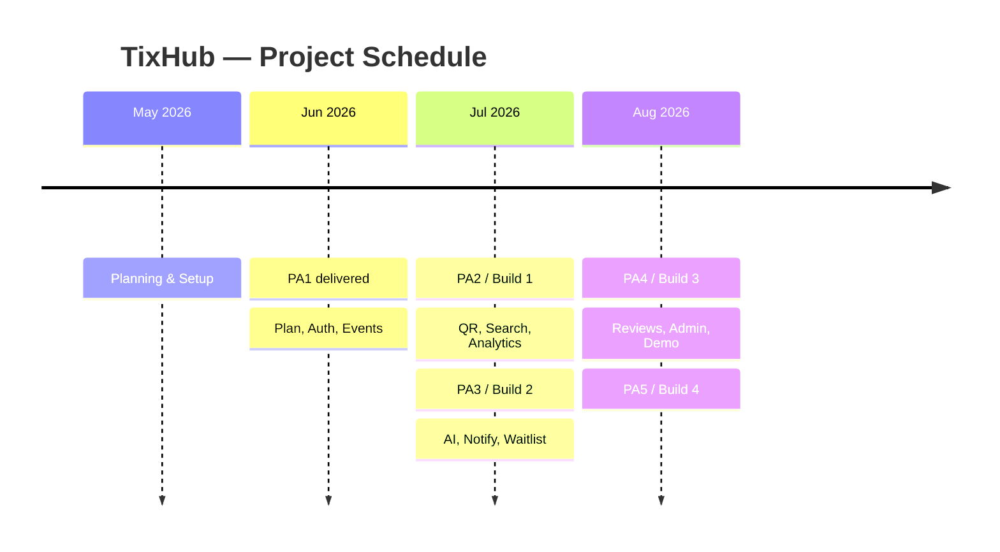

# Project Plan

## TixHub — Event Ticket Sales Web Application

**Introduction to Software Engineering  — 24C11**

Group 02 · SoE

*June, 2026*

---

> **Disclaimer:** Some portions of this document were originally drafted as part of the project proposal. The content has since been re adjusted to reflect the group's current progress and shared understanding of the project. All planning for future sprints represents the team's assumptions at this stage and will be discussed in detail with the supervisor for a clearer and better aligned vision.

---

### Table of Contents
1. [Introduction](#1-introduction)
2. [Project Overview](#2-project-overview)
    - [2.1 Goals](#21-goals)
    - [2.2 Scope](#22-scope)
    - [2.3 Deliverables](#23-deliverables)
    - [2.4 Assumptions](#24-assumptions)
3. [Project Organization](#3-project-organization)
4. [Risk Management](#4-risk-management)
5. [Project Plan](#5-project-plan)
6. [Schedule](#6-schedule)
7. [Build Plan](#7-build-plan)
8. [Appendix — AI Usage Notes](#8-appendix--ai-usage-notes)

---

### 1. Introduction

> *Conducted by Nguyễn Minh Khoa.*

TixHub is a web based event ticketing platform developed by Group 02. The platform connects three groups of users, a platform **Admin**, event **Organizers**, and **Attendees** on a single marketplace where events are created, tickets are sold securely, and attendees are checked in at the door with QR codes.

This document is the initial project plan for TixHub. It describes how the team will deliver the product across five Scrum sprints over an academic semester. The plan covers team organization and responsibilities, risk identification and mitigation, a detail task breakdown, the overall project schedule, and the build strategy for testing and final delivery.

---

### 2. Project Overview

> *Conducted by Lương Hưng Phát.*

#### Goals

The goal of TixHub is to deliver a complete, production shaped event ticketing platform while applying disciplined Agile engineering practice. Specific goals include:

*1. **Enable end to end ticket sales:*** Allow organizers to create events and attendees to discover, purchase, and receive tickets entirely online through a secure, integrated sandbox checkout.
*2. **Eliminate ticket fraud at the door:*** Issue every ticket as a unique QR code and provide a web based scanner so each ticket can be checked in exactly once, with live attendance data for organizers.
*3. **Support real reserved seating:*** Provide a real time interactive seat map where attendees select specific seats and different buyers can never be sold the same seat.
*4. **Apply AI to real product problems:*** Use the third party API to recommend relevant events to attendees and to help organizers produce better event listings.
*5. **Give organizers actionable data:*** Provide an analytics dashboard of sales, revenue, remaining inventory, and check ins.
*6. **Keep the marketplace safe and credible:*** Provide admin moderation and organizer approval to maintain trust and transparency in the platform.
*7. **Practise disciplined Agile delivery:*** Complete the product across structured sprints with planning, reviews, testing, and CI/CD.

#### 2.2 Scope

TixHub delivers **eleven core features** across three user roles Admin, Organizer, and Attendee as a single web application. This section defines the boundary of the work.

##### In Scope

- ***Attendee:*** Browse, search, and filter events; buy tickets; pay via VNPay sandbox; receive QR-code digital tickets; cancel a ticket to free the seat (no monetary refund); AI event recommendations (via third party AI API); submit reviews & ratings; receive notifications and join waitlists.
- ***Organizer:*** Event creation & management; AI listing assistant (via third party AI API); phone browser door QR scanner and check-in; real time analytics dashboard.
- ***Admin:*** Organizer approval workflow; content moderation; platform-wide analytics.
- ***Platform wide:*** Authentication — Google OAuth sign in and own membership (email/Gmail, phone number, nickname, password); single deployment reachable via a public URL for grading.

##### Out of Scope

- Real money / production payment settlement (VNPay sandbox only).
- Ticket refunds (the VNPay sandbox has no real settlement, so no money moves; ticket **cancellation** is in scope, but no monetary refund is issued).
- Multi-currency and international payment methods.
- Native mobile applications (iOS/Android).
- Ongoing post-PA5 maintenance and support.
- Third party AI API hosting or model training; no custom model.

##### Constraints

- Free tier hosting only — frontend on Vercel, backend on Render, database on Neon·Supabase.
- Third-party AI API free-tier quota.
- VNPay **sandbox** only; no real funds are processed.
- 13 week semester, 5 sprints (PA1–PA5), 5 member team.
- The deployed application will be reachable via a public URL for evaluator grading.

##### Acceptance Criteria

- All eleven features are deployed and demonstrable end to end on the public URL.
- The core flow works: register/login &rarr; create event &rarr; buy ticket (GA + reserved) &rarr; receive QR ticket &rarr; check in at the door.
- Concurrent seat purchases never double book a seat (verified under load test).
- Payments are confirmed through a signed, idempotent VNPay sandbox callback.
- All four builds pass the CI quality gates (see §7) with no open P0/P1 defects.
- Each PA deliverable is accepted by the course evaluators.

#### Deliverables

| Sprint | PA | Key Deliverables |
|--------|-----|------------------|
| Sprint 1 | PA1 | Identify problem, project proposal, team contract, and workflow principle |
| Sprint 2 | PA2 | Project Plan, authentication module, and VNPay checkout |
| Sprint 3 | PA3 | QR ticketing & door scanner, event discovery & search, real time analytics dashboard, fully integrated build; revised project plan |
| Sprint 4 | PA4 | AI recommendations chatbot, AI listing assistant, notifications & waitlist |
| Sprint 5 | PA5 | Reviews & ratings, admin moderation, complete test reports, production deployment, PA5 feature demo |

#### Assumptions

- All five team members remain available and fully commited to the project.
- VNPay sandbox remains accessible and stable throughout the project; no real money will be processed.
- API free tier quotas are sufficient for development and demonstration purposes.
- Free hosting tiers (Vercel, Neon/Supabase) provide adequate capacity for development, testing, and the PA5 demo.
- Course evaluators can access the deployed application via a public URL for grading.
- A shared API contract agreed in Sprint 1 remains valid unless a breaking change is unanimously approved by the team.
- The team's personal laptops meet the minimum requirements: modern multi core CPU, ≥ 8 GB RAM, internet access.

---

### 3. Project Organization

> *Conducted by Nguyễn Minh Khoa.*

#### Group 02

<table>
  <tr>
    <th>Lương Hưng Phát</th>
    <th>Nguyễn Thành Đạt</th>
    <th>Nguyễn Minh Khoa</th>
    <th>Nguyễn Tấn Hiệu</th>
    <th>Nguyễn Anh Khôi</th>
  </tr>
  <tr align="center">
    <td>24127298</td>
    <td>24127021</td>
    <td>24127188</td>
    <td>24127373</td>
    <td>24127430</td>
  </tr>
  <tr align="center">
    <td>PM / Backend Engineer <b>(Team Leader)</b></td>
    <td>Fullstack Dev / Tester</td>
    <td>Backend Developer</td>
    <td>Frontend Dev / DevOps</td>
    <td>Database Management</td>
  </tr>
</table>

#### Roles and Responsibilities

- ***Lương Hưng Phát:*** Team Leader, Project Manager, and Backend Engineer. Owns the sprint planning process, maintains the Jira backlog, conducts the sprint review and retrospective, leads backend development, and signs off on each sprint's deliverables. Acts as the primary point of contact between the team and course instructors.

- ***Nguyễn Thành Đạt:*** Fullstack Developer and Tester. Implements cross features that span both frontend and backend, owns QA strategy, writes and runs test cases (unit, integration, and acceptance), and coordinates the test report deliverables for each PA.

- ***Nguyễn Minh Khoa:*** Backend Developer. Implements core backend modules and REST API endpoints, owns payment integration (VNPay) and AI integration (Gemini), and supports architectural decisions on the server side.

- ***Nguyễn Tấn Hiệu:*** Frontend Developer and DevOps Engineer. Implements and owns the React SPA and all user facing interfaces, configures and maintains the CI/CD pipeline (GitHub Actions), manages deployments to Vercel (frontend) and backend, and monitors hosting infrastructure.

- ***Nguyễn Anh Khôi:*** Database Manager. Designs and owns the PostgreSQL schema, writes and runs all database migrations, ensures data integrity, and supports performance tuning for concurrent seat hold queries.

#### Communication and Collaboration

- ***Daily stand ups:*** short async updates posted on Discord each working day (blocker, progress, plan).
- ***Sprint ceremonies:*** sprint planning, review, and retrospective conducted on Google Meet at the start and end of each sprint.
- ***Code review:*** every change is submitted as a GitHub pull request; at least one other member must review and approve before merging.
- ***Documentation:*** all written deliverables authored in Markdown and committed to the shared repository.

---

### 4. Risk Management

> *Conducted by Nguyễn Minh Khoa.*

| # | Risk | Likelihood | Impact | Mitigation Strategy |
|---|------|:----------:|:------:|---------------------|
| 1 | **Member unavailability:** A team member becomes temporarily unavailable due to illness, academic commitments, or personal circumstances, stalling their assigned tasks. | Medium | High | Tasks are documented clearly in Jira so any member can pick them up. The team maintains a shared knowledge of all modules via code review and weekly syncs. If a member is unavailable, the PM redistributes their sprint tasks immediately and make sure that member has to compensate the work they had missed after they return. |
| 2 | **Technology issues / free tier limits:** Hosting, database (Neon/Supabase), or API free quotas are exceeded during development, testing, or the PA5 demo, causing service interruptions. | Medium | Medium | The DevOps member (Hiệu) monitors usage dashboards throughout the semester. If the team can not find other complimentary alternative, must contact the supervisor for advice and guidance. Demo traffic is controlled and pre-staged. |
| 3 | **Scope creep:** Eleven features including a real time concurrent seat map across 13 weeks threatening the sprint schedule. | Medium | High | The eleven features and the explicit out of scope list are locked in the Product Backlog. The PM protects sprint commitments: non-essential polish or new ideas are deferred to later sprints or dropped if they delay PA delivery dates. |
| 4 | **Integration risk from parallel development:** The frontend and backend are developed independently in Sprint 2 and 3 which may diverge, causing integration failures when combined in Sprint 4. | Medium | Medium | A **shared API contract** (OpenAPI/JSON spec) was agreed in Sprint 2. Integration should begin early in Sprint 4 and is carefully validated by integration tests before Sprint 4 ends. |
| 6 | **Payment integration failures:** VNPay callbacks may be delayed, duplicated, or fail mid flow, risking tickets issued without confirmed payment, or payments collected without ticket issuance. | Low | High | The order remains in a *pending* state until a VNPay callback is received and validated. Callback handling is **idempotent**: processing the same callback twice produces the same result with no side effects. A reconciliation job runs on a timer to resolve stale pending orders. Tickets are issued only after confirmed payment. |

---

### 5. Project Plan

> *Conducted by Nguyễn Minh Khoa.*

This project follows the **Scrum** process model, organized into five sprints that correspond to the five PA deliverables (PA1–PA5). Each sprint lasts 2–3 weeks. **Sprint 2 is the current sprint** (PA2), and detailed tasks with assigned performers, reviewers, and due dates are provided below. For Sprints 3–5, planned tasks are listed; detailed assignments will be finalized when each sprint begins.

> **Task convention:** each task is performed by two member and reviewed by another. All project related activities like coding, report writing, testing, and self-training is counted as valid tasks.

---

#### Sprint 1: Planning 

**Focus:** Identify problem, project proposal, team contract, and workflow principle

**Completed deliverables:** Project Proposal, team contract, working pipeline (Jira, Drive, version control and spec driven techinque), GitHub repository initialization.

---

#### Sprint 2: Core 

**Focus:** project plan, vision document, speckit initialization, and AI, weekly report. For implmenation, the landing page with authentication & role-based access, and event creation (general admission) will be started.

| # | Task | Performer | Reviewer | Due Date |
|---|------|-----------|----------|----------|
| 1 | Write project plan document | Nguyễn Minh Khoa | Lương Hưng Phát | June 29, 2026 |
| 2 | Create first version of Landing page, Google Oauth  | Nguyễn Tấn Hiệu | Lương Hưng Phát | June 29, 2026 |
| 3 | Write stakeholder and user description for Vision document | Lương Hưng Phát | Nguyễn Minh Khoa | June 29, 2026 |
| 4 | Write introducition and positioning for Vision document | Nguyễn Thành Đạt, Nguyễn Anh Khôi | Lương Hưng Phát | June 29, 2026 |
| 5 | Training SpecKit | All members| - | June 29, 2026 |
| 6 | Sprint 2 review, retrospective, and Jira board update | All members | Lương Hưng Phát | July 10, 2026 |

---

#### Sprint 3: Tickets & Data 

**Focus:** QR ticketing & door scanner, event discovery & search, real-time analytics, front-end / back-end full integration and VNPay sandbox, and revised project plan.

| # | Task | Performer | Reviewer | Due Date |
|---|------|-----------|----------|----------|
| 1 | Implement SeatHold TTL mechanism and auto-release job on the backend | Nguyễn Anh Khôi, Nguyễn Minh Khoa | Lương Hưng Phát | July 16, 2026 |
| 2 | Generate unique QR code digital tickets upon confirmed payment | Nguyễn Minh Khoa, Nguyễn Anh Khôi | Lương Hưng Phát | July 18, 2026 |
| 3 | Implement public event browse page with keyword, category, date, location, and price filters | Nguyễn Tấn Hiệu, Nguyễn Anh Khôi | Nguyễn Thành Đạt | July 18, 2026 |
| 4 | Build organizer door scanner UI (phone browser); implement check in validation API | Nguyễn Tấn Hiệu, Nguyễn Minh Khoa | Lương Hưng Phát | July 20, 2026 |
| 5 | Implement real time seat map | Nguyễn Tấn Hiệu, Lương Hưng Phát | Nguyễn Minh Khoa | July 21, 2026 |
| 6 | Build real time analytics dashboard: live charts (Recharts) for sales, revenue, remaining inventory, and check-ins | Nguyễn Tấn Hiệu, Lương Hưng Phát | Nguyễn Thành Đạt | July 22, 2026 |
| 7 | Complete frontend &harr; backend integration; resolve any API contract drift | Nguyễn Thành Đạt, Nguyễn Tấn Hiệu | Lương Hưng Phát | July 25, 2026 |
| 8 | Run integration tests across all Sprint 2 and Sprint 3 features | Nguyễn Thành Đạt, Nguyễn Minh Khoa | Lương Hưng Phát | July 26, 2026 |
| 9 | Update and revise project plan (PA3 report) | Nguyễn Minh Khoa, Lương Hưng Phát | Nguyễn Thành Đạt | July 27, 2026 |
| 10 | Sprint 3 review, retrospective, and Jira board update | All members | Lương Hưng Phát | July 28, 2026 |

---

#### Sprint 4: AI & Engagement 

**Focus:** AI-powered features (Gemini), automated notifications, and waitlist.

**Planned tasks:**
- Implement AI Personalized Event Recommendations chatbot (API, attendee facing)
- Integrate browsing history and past ticket data into the LLM prompt context
- Implement AI Event Listing Assistant for organizers (API, organizer facing): auto-generate description, suggest titles, tags, and pricing
- Build notification system: in web and email alerts for booking confirmation, event reminders (1 week / 1 day before), and cancellations
- Implement ticket cancellation: attendee cancels a ticket, the seat is freed and returned to inventory (no monetary refund, VNPay sandbox only), and the waitlist is notified
- Implement waitlist feature: join waitlist for sold out events; auto notify and offer tickets when seats are released
- Implement AI response caching and rate limiting to stay within Gemini free-tier quotas
- Write unit and integration tests for all Sprint 4 features
- Sprint 4 review, retrospective, and Jira board update

---

#### Sprint 5 — Validation & Release 

**Focus:** reviews & ratings, admin moderation & organizer approval, system testing, production deployment, and PA5 demo.

**Planned tasks:**
- Implement reviews and ratings: attendees rate events (1–5 stars) and leave written reviews after attending
- Display aggregated ratings on organizer profiles and event pages
- Implement admin moderation tools: approve / suspend organizers, review reported events, remove policy-violating content
- Implement admin platform wide analytics view
- Conduct system testing and user acceptance testing across all three roles
- Conduct performance testing on real time seat map and analytics under concurrent load
- Fix defects identified during testing and produce final Build 4 (release / demo build)
- Finalize production deployment; confirm all environment variables and secrets are set
- Prepare and rehearse PA5 demo covering all eleven features
- Write final test report and complete PA5 deliverables
- Sprint 5 review and project retrospective

---

### 6. Schedule

> *Conducted by Nguyễn Minh Khoa.*

The table below summarizes the sprint timeline and key milestones. The sprint boundaries and task assignments are reflected on the team's Jira board.

| Sprint | PA | Dates | Key Milestone | Status |
|--------|----|-------|---------------|--------|
| Sprint 1 — Planning | PA1 | May 25 – Jun 7, 2026 | Problem identified; project proposal, team contract, workflow pipeline, and repository initialized | Done |
| Sprint 2 — Core | PA2 | Jun 9 – Jul 12, 2026 | Project plan, vision document, SpecKit; landing page with authentication & role-based access | In Progress |
| Sprint 3 — Tickets & Data | PA3 | Jul 16 – Jul 28, 2026 | QR tickets, door scanner, event discovery & search, real-time seat map & analytics, full integration; PA3 report | Planned |
| Sprint 4 — AI & Engagement | PA4 | Jul 29 – Aug 11, 2026 | AI recommendations chatbot, AI listing assistant, notifications, waitlist | Planned |
| Sprint 5 — Validation & Release | PA5 | Aug 12 – Aug 25, 2026 | Reviews & ratings, admin moderation, system testing, production deployment, PA5 demo | Planned |

---

### 7. Build Plan

> *Conducted by Nguyễn Minh Khoa.*

TixHub will produce **four builds** across Sprints 2–5. Sprint 1 produces no deployable build (only design artifacts and tooling), but establishes the CI/CD pipeline so every subsequent commit is auto deployed to the staging environment.

| Build | Sprint | Target Date | Scope | Purpose |
|-------|--------|-------------|-------|---------|
| **Build 1:** Internal Alpha | Sprint 2 | Jul 12, 2026 | Authentication (login / register / RBAC) | First deployable build; validates the core user flow from registration through ticket purchase. Tested manually by the team. |
| **Build 2:** Integration Build | Sprint 3 | Jul 28, 2026 | All Sprint 2 features + QR ticketing, door scanner, event discovery & search, real-time seat map, live analytics dashboard | First fully integrated frontend ↔ backend build. Integration tests executed against this build. Regression-tested to confirm Sprint 2 features remain stable. |
| **Build 3:** Feature-Complete Beta | Sprint 4 | Aug 11, 2026 | All previous features + AI recommendations, AI listing assistant, notifications & waitlist | Beta build covering all eleven feature areas. Performance-tested under concurrent load (seat map & analytics). Remaining defects from prior builds resolved. |
| **Build 4:** Release / Demo Build | Sprint 5 | Aug 25, 2026 | All eleven features complete + reviews & ratings, admin moderation, admin analytics | Final production build deployed on Vercel / Render / Neon. Full system test and UAT completed against this build. Used for the PA5 demo covering all project features. |

#### Build Quality Gates

Each build must pass the following checks before it is considered ready:

- All GitHub Actions CI checks pass (lint, type-check, unit tests) on the `main` branch.
- No P0 (application crash) or P1 (core feature broken) defects open.
- The deployed URL is reachable and the build can be demonstrated end-to-end.
- The Jira sprint board is updated: all planned tasks are either **Done** or explicitly deferred with a documented reason.

---

### 8. Appendix: AI usage notes

In accordance with the course AI Usage Guidelines, the team declares the use of AI tools in preparing this document. AI was used as a **structuring, and editing assistant only**. Every decision (scope, roles, risks, task assignments, schedule dates, build plan) was made by the team, and all AI output was reviewed, edited, and validated by the responsible members before inclusion. No section was auto generated and submitted without revision.

#### Tool

| Item | Detail |
|------|--------|
| Tool name & version | Claude (Claude Opus 4.8), running in **Claude Code** CLI |
| Provider / platform | Anthropic — Claude Code (terminal agent), with the `grill-me` and `grill-with-docs` interview skills |
| Access dates | June 20, 2026 and June 23, 2026 |

#### Summary of prompts used

Only the prompts with a significant impact on the document's content are listed below. Small formatting or tutorial prompts (e.g. how to number a TOC sub-section, fixing an image path) are omitted. Full chat history is retained by the team and available on request.

**Full name:** Nguyễn Minh Khoa (24127188), Lương Hưng Phát (24127298) 

- Claude Opus 4.8, Anthropic, Claude Code CLI, accessed on June 20, 2026
    - *Prompt*: "How industry often define their products' scope in a technical doc. Reconstruct the scope part that way, group scope by their role for me. The AI should just list as third party API as we are not sure about the API yet."

    - *Usage*: used to restructure the Scope section (Section 2.2) into an industry-style layout grouped by user role, with the AI feature kept as a generic third-party API.

    - *How the output was used*: I supplied every actual feature and constraint and confirmed each item against our agreed product scope; AI only reorganized and worded the section, no new features were invented.

- Claude Opus 4.8, Anthropic, Claude Code CLI, accessed on June 23, 2026
    - *Prompt*: "Fix the entire schedule to base on the section 5, fix the mermaid as well, reallocate figures and text so they dont overlap and misalign with each other."

    - *Usage*: used to align the Schedule table (Section 6), the mermaid timeline, and the Build Plan (Section 7) with the task dates in Section 5.

    - *How the output was used*: I checked the regenerated dates and milestones against our sprint plan and Jira board to confirm they were consistent before committing.

#### Content generated with AI vs. done independently

- **AI-assisted:** initial Markdown structure and table layouts; prose phrasing of the Scope, disclaimer, and build plan descriptions; formatting fixes.
- **Done independently by the team:** all factual and planning content like the eleven features, role assignments, risk register, sprint task ownership, **all due dates**, milestone dates, and acceptance criteria. These were decided by the team (partly via the grill interview sessions) and only worded with AI help.
- **Validation:** every AI suggestion was read, edited, and cross-checked against the team's actual plan, Jira board, and member roles before being committed. The members listed under each section ("*Conducted by …*") are responsible for and can explain their content.

> No fabricated results, analysis, or data were produced by AI. The document was not written end to end by AI.

