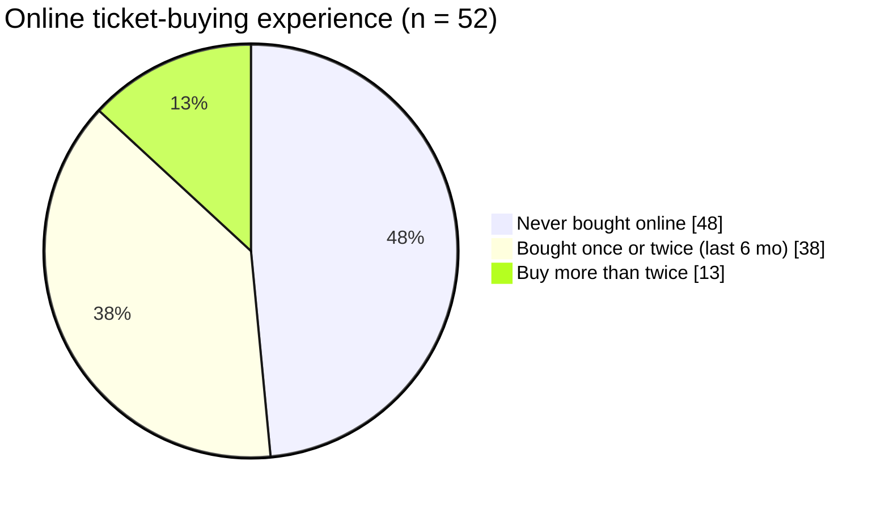
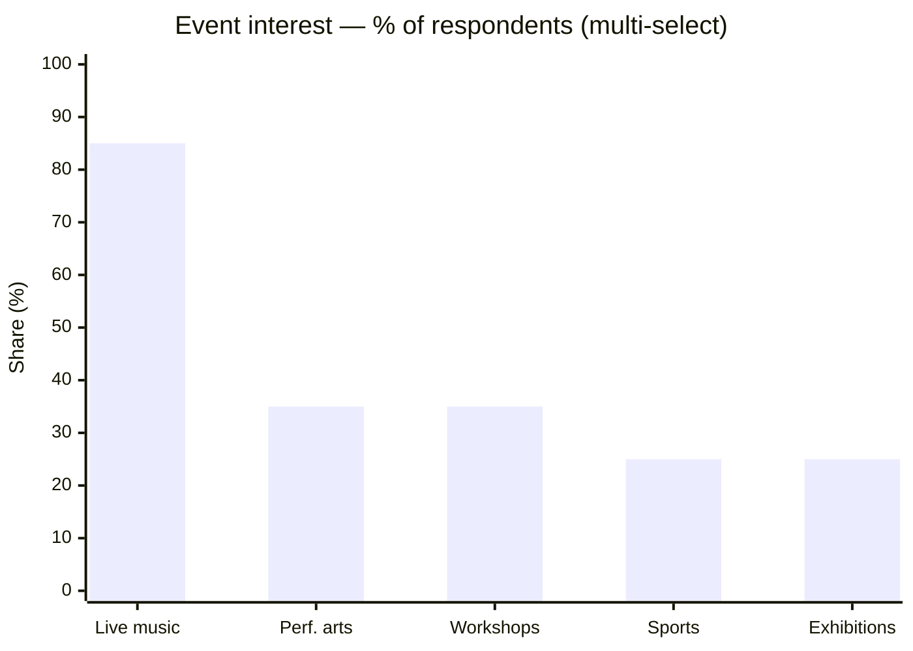
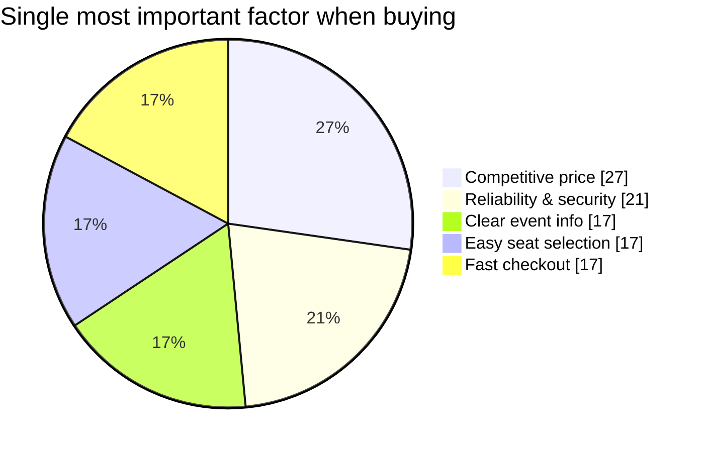
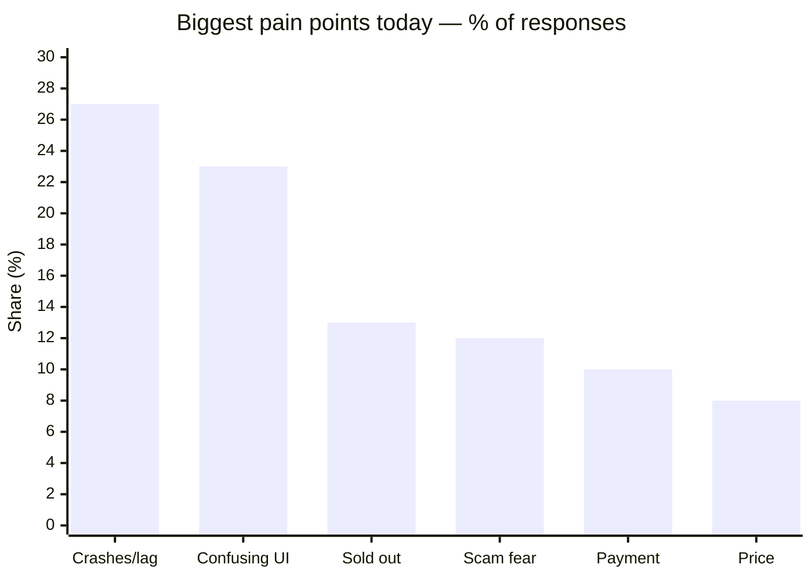
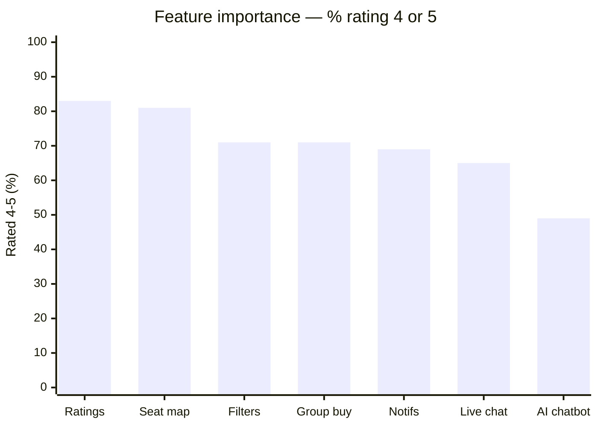
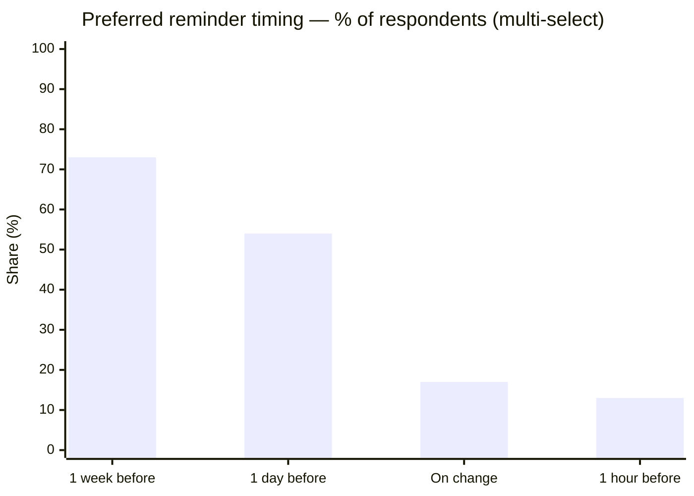
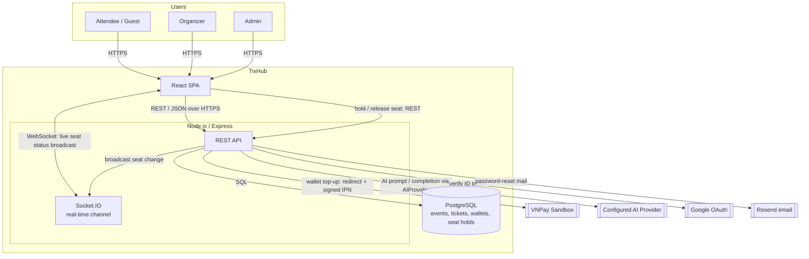

# Vision Document

## TixHub: Event Ticket Sales Web Application

**Introduction to Software Engineering (Intro2SE) — 24C11**

Group 02 · SoE

*Established: June, 2026*

---

> **Disclaimer:** Some portions of this document were originally drafted as part of the project proposal. The content has since been re adjusted to reflect the group's current progress and shared understanding of the project. The product vision represents the team's understanding at this stage and will be discussed in detail with the supervisor for a clearer and better aligned vision.

---

### Table of Contents
1. [Introduction](#1-introduction)
    - [1.1 Purpose of the document](#11-purpose-of-the-document)
    - [1.2 References](#12-references)
2. [Positioning](#2-positioning)
    - [2.1 Problem Statement](#21-problem-statement)
    - [2.2 Product Position Statement](#22-product-position-statement)
3. [Stakeholder and User Descriptions](#3-stakeholder-and-user-descriptions)
    - [3.1 Market Context and User Survey](#31-market-context-and-user-survey)
    - [3.2 Stakeholder Summary](#32-stakeholder-summary)
    - [3.3 User Summary](#33-user-summary)
    - [3.4 Key User Needs](#34-key-user-needs)
4. [Product Overview](#4-product-overview)
    - [4.1 Product Perspective](#41-product-perspective)
    - [4.2 Summary of Capabilities](#42-summary-of-capabilities)
    - [4.3 Assumptions and Dependencies](#43-assumptions-and-dependencies)
    - [4.4 Cost and Licensing](#44-cost-and-licensing)
5. [Product Features](#5-product-features)
6. [Non-Functional Requirements](#6-non-functional-requirements)
    - [6.1 Performance](#61-performance)
    - [6.2 Security](#62-security)
    - [6.3 Platform & Compatibility](#63-platform--compatibility)
    - [6.4 Reliability & Availability](#64-reliability--availability)
    - [6.5 Scalability](#65-scalability)
    - [6.6 Usability & Accessibility](#66-usability--accessibility)
    - [6.7 Maintainability](#67-maintainability)
    - [6.8 Data Integrity & Consistency](#68-data-integrity--consistency)
    - [6.9 Standards & Compliance](#69-standards--compliance)
7. [Appendix: AI Usage Notes](#7-appendix-ai-usage-notes)

---

### 1. Introduction

> *Conducted by Nguyễn Thành Đạt.*

#### 1.1 Purpose of the document

This document describes what TixHub is meant to do and why, before we get into how it will be built. TixHub is a web application for selling event tickets that brings three kinds of users together in one place: a platform admin, event organizers, and attendees.

We wrote it to settle a few things early. First, the problem we are trying to solve and the people it affects. Second, where the product sits in the market: who it is for, what it actually does, and what makes it different from the options people already use. The idea is that everyone on the team and the course staff share the same picture of the product at a business level, so the requirements, design, and code we produce later all line up with it.

#### 1.2 References

This document draws on the materials, standards, and tools below.

**Project materials**

- Group 02, *TixHub — Event Ticket Sales Web Application: Project Proposal*, Introduction to Software Engineering (Intro2SE) 24C11, June 2026.

**Standards and benchmarks**

- Google / DoubleClick, *The Need for Mobile Speed*, Google, 2016. <https://blog.google/products/admanager/the-need-for-mobile-speed/>
- OWASP Foundation, *OWASP Top 10*. <https://owasp.org/www-project-top-ten/>
- W3C, *Web Content Accessibility Guidelines (WCAG) 2.1*, W3C Recommendation, 2018. <https://www.w3.org/TR/WCAG21/>

**Verification tools**

- Grafana Labs, *k6 — load testing tool*. <https://k6.io/>
- Google, *Chrome Lighthouse*. <https://developer.chrome.com/docs/lighthouse/>
- OWASP Foundation, *OWASP ZAP (Zed Attack Proxy)*. <https://www.zaproxy.org/>
- Gitleaks, *gitleaks — secret scanner*. <https://github.com/gitleaks/gitleaks>
- UptimeRobot, *UptimeRobot uptime monitoring*. <https://uptimerobot.com/>

**External services**

- VNPay, *VNPay Payment Gateway (sandbox) — API documentation*. <https://sandbox.vnpayment.vn/apis/>
- Google, *Gemini API*. <https://ai.google.dev/>

---

### 2. Positioning

> *Conducted by Nguyễn Thành Đạt.*

#### 2.1 Problem Statement

Live events have taken off in Vietnam, and so has the need for a dependable way to find events, pay for tickets, and get through the door without running into fraud. Big organizers already use services like Ticketbox and CTicket. But a lot of smaller ones like university clubs, indie gigs, workshops still sell tickets by posting on social media and asking for a bank transfer. That works fine until it doesn't: tickets get faked, nobody really knows how many seats are left, and on the day of the event the organizer has no real idea who has actually shown up. There's also no vetting layer to keep a platform handling real money trustworthy.

| Element | Description |
| :--- | :--- |
| **The problem of** | Selling tickets by hand. Tickets get forged, there's no clear count of seats left, organizers can't see who's actually arrived, reserved events have no way to pick seats live, basic keyword search buries smaller events under the popular ones, and there's no vetting layer to keep buyers' money safe. |
| **Affects** | Small and mid size event organizers (university clubs, indie music nights, workshops); the attendees who buy tickets from them; and the platform admin responsible for keeping the marketplace trustworthy. |
| **The impact of which is** | Organizers are stuck doing everything by hand: slow, error prone, no live attendance numbers, and nothing stopping someone from walking in with a duplicate or fake ticket. Attendees don't have anywhere safe to pay and keep their tickets. Without any approval or moderation step, there's also no way to keep bad actors off a platform that handles real money. |
| **A successful solution would be** | A web platform that gives a small organizer the same tools a professional ticketing company has; a real event page, online payment, a unique QR ticket per buyer, a live seat map for reserved seating, a sales dashboard plus admin approval and moderation to keep the marketplace safe. For attendees: one place to browse, pay, and hold their tickets, with AI help on the side for finding events and for organizers writing listings. |

#### 2.2 Product Position Statement

| Element | Description |
| :--- | :--- |
| **For** | Event organizers, attendees, and the platform operator in Vietnam. |
| **Who** | Need a secure way to list and find events, sell and buy tickets, and keep the marketplace free of fraud including organizers currently running things through social media posts and bank transfers. |
| **The product name** | TixHub |
| **That** | Is a ticket selling web app: guided event creation, wallet checkout funded by VNPay sandbox top-ups, a unique QR ticket per buyer that organizers scan at the door from their phone browser, a live seat map for reserved events, search and filters, sales analytics dashboard, notifications and waitlists, reviews and ratings, and admin approval of organizers before they can sell. |
| **Unlike** | Manual ticket sales over social media and bank transfers, or established platforms like Ticketbox and CTicket, which are to our knowledge, don't offer any comparable AI assisted tools. |
| **Our product** | Uses third party AI for two things: suggesting events to attendees based on what they've browsed and bought, and helping organizers draft a title, description, tags, and a reasonable price. Admin approval and moderation keep the marketplace honest, and the academic build runs entirely on free tier infrastructure, with a documented upgrade path to paid tiers if the platform were ever scaled. |

---

### 3. Stakeholder and User Descriptions

> *Conducted by Lương Hưng Phát.*

#### 3.1 Market Context and User Survey

To make sure TixHub is built around real needs rather than assumptions, the team ran a user survey on demand for an online event-ticketing platform. **52 people responded.** The results below shape the user needs in Section 3.4 and the feature priorities in Section 5.

> **About the data:** The survey was distributed online via a Google Form shared through the team's social and class networks. This is a *convenience sample*, so the respondents skew young and toward students/first time buyers (consistent with the 48% who had never bought online). With **n = 52**, at this sample size the margin of error is roughly ±14% at 95% confidence. We therefore use the results to *prioritise* features and confirm pain points, not to make precise market claims, and we corroborate the headline findings against the competitor analysis in Section 2.

**Respondent profiles:** The audience skews toward casual and first time ticket buyers, not power users: about **48% had never bought an event ticket online** and a further **38% had bought only once or twice in the past six months**. Only ~13% buy more than twice. This matters as a platform aimed at this audience must feel **trustworthy and easy to use for the first time**, because most users have little prior habit to fall back on.

**User interest distribution:** Interest is dominated by **live music and festivals (85%)**, followed by performing arts (35%), workshops/seminars (35%), sports (25%), and community exhibitions (25%). 

Participants were asked to pick the most important factor, price and reliability lead but the field is tight, and reliability/security (21%) plus easy seat selection (17%) together outweigh raw price:

**Biggest pain points:** From open text answers, the dominant complaints were:

*Values: site crashes/overload/lag 27% · confusing UI 23% · can't grab before sold out 13% · scam fear 12% · payment problems 10% · price 8%.*

Headline finding: **the biggest frustration is the platform falling over under load**, not a missing feature. This directly validates TixHub's heavy engineering focus on the real time seat map, concurrency safety, and the reliability targets in Section 6 (Non-Functional Requirements).

**Feature importance (rated 1–5):** Respondents rated each proposed feature; the chart shows the share rating it 4 or 5 ("important" / "very important"), ordered by demand:

*Mean score (1–5): ratings 4.27 · seat map 4.17 · filters 4.06 · group buy 4.00 · notifications 3.92 · live chat 3.85 · AI chatbot 3.41.*

Two honest takeaways:
- **Ratings, the seat map, and filtering are the most wanted features**, all core to TixHub's plan.
- **The AI chatbot scored lowest** (only 49% rated it important). This tempers TixHub's AI positioning: AI is a genuine differentiator, but the survey says it is a *bonus*, not the deciding factor. The product therefore treats AI as **assistive and optional**, and never lets it block the core buying flow (see SCAL-03, PERF-05 in Section 6).

**Reminder timing:** For "when should we remind you about a purchased event," respondents could choose several: **1 week before (73%)** and **1 day before (54%)** dominate, with only-on-change (17%) and 1 hour before (13%) trailing. These map directly to the notification defaults in Feature 8.

**Notable wishlist ideas** (open text): ticket **refunds/cancellation**, **group orders with split payment and per-person ticket transfer**, **quick / random seat assignment**, and **anti-scalping** measures. **Ticket cancellation and refunds to the store-credit wallet are in scope** (constitution v2.0.0): cancelling frees the seat and returns the ticket's amount to the buyer's wallet. **Real-money refunds and payouts stay out of scope** because payments are sandbox-only with no real settlement. Group features are on the roadmap; the rest are recorded as future enhancements.

#### 3.2 Stakeholder Summary

Stakeholders are parties with an interest in TixHub who are not necessarily direct users of the software.

| Stakeholder | Type | Influence | Role / Interest |
|---|---|---|---|
| **Development team (Group 02)** | Steering | High | Five students responsible for delivery; also act as testers and maintainers. They make day to day scope and design trade offs. |
| **Survey respondents / prospective users** | Market proxy | Medium | The 52 people whose needs ground the requirements; an indirect voice. They shape priorities through the survey but do not approve work.|
| **VNPay (payment provider)** | Dependency | Medium | External sandbox gateway that processes payments; TixHub depends on its callback contract and never stores card data. |
| **Configured AI provider behind `AIProvider`** | Dependency | Low | External provider powering the two AI features under a shared quota; AI degrades to non-AI fallbacks if it is unavailable, so its influence on the core flow is low. |
| **Hosting (single VPS `tixhub.fit` + Neon Postgres)** | Dependency | Medium | Self-managed VPS (Nginx: TLS + static SPA + reverse-proxy, same-origin) with Neon for Postgres; TLS and OS patching are the team's responsibility; scale-out is a config change, not a rewrite (Section 4.3). |

#### 3.3 User Summary

TixHub serves **three user roles** on one marketplace. A single person may hold more than one role (an admin or organizer can also buy as an attendee). A **guest** (not signed in) is treated as the logged-out state of the Attendee role: guests can browse, search, filter, and view event details, and are prompted to register only when they start checkout — important because ~48% of surveyed users are first-time buyers who arrive without an account. Registration and sign-in support **Google OAuth** or a TixHub membership account (email, nickname, and password; a phone number is optional but, when supplied, is unique and usable to sign in). The two account kinds are never linked or merged (schema decisions D4, D5).

| Role | Description | Responsibilities |
|---|---|---|
| **Admin** (Platform Owner) | Keeps the marketplace trustworthy. | Approve / suspend organizers, moderate and remove events, manage categories and the homepage, configure system settings. |
| **Organizer** (Event Creator) | A club, business, or individual selling tickets. | Create / edit / publish / cancel events, define ticket types and capacity, design seat maps for reserved events, scan attendees in at the door, view and export attendee lists, send announcements, view a sales dashboard. |
| **Attendee** (End User) | A person discovering and buying tickets. | Browse / search / filter events, buy or register and receive a QR ticket, pick seats in real time, manage and cancel tickets, leave ratings and reviews, receive AI recommendations and reminders. |

#### 3.4 Key User Needs

The table traces each major user need to its evidence and to the feature(s) that address it. "Problem" describes how the need goes unmet on current platforms or manual selling. Attendee needs (UN-01–UN-08) are grounded in the survey (Section 3.1); organizer needs (UN-09–UN-11) are derived from the competitor gap (Section 2) rather than survey percentages.

| ID | User need | Evidence | Problem  | Addressed by |
|---|---|---|---|---|
| **UN-01** | A platform that stays up under demand | Site crash/overload = #1 pain (27%); reliability = #2 buying factor (21%) | Popular on sales crash or lag, costing users the ticket | Section 6 REL/PERF and scalability targets + concurrency safe seat holds |
| **UN-02** | Trustworthy, secure payment | Trust/scam fear (12%); security is a top factor (21%) | Bank transfer selling invites fraud; no buyer protection | Feature 2 (wallet checkout, VNPay top-up), Feature 10 (organizer approval), Section 6 Security |
| **UN-03** | Easy seat / area selection | 81% rate interactive seat map important; "easy seat selection" a top factor (17%) | Manual selling has no live seat view; double-booking risk | Feature 1 (seat map design) + Feature 11 (real-time seat selection & holds) |
| **UN-04** | Find the right event easily | 71% want filtering | Keyword search buries smaller events under popular ones | Feature 4 (discovery, search & filters), Feature 5 (AI recommendations) |
| **UN-05** | Confidence before buying (social proof) | Rating system = most wanted feature (83%) | No reputation signal for new organizers | Feature 9 (reviews & ratings) |
| **UN-06** | Simple, fast checkout | Confusing UI = #2 pain (23%); fast checkout a top factor (17%) | Complex multi-step flows cause abandonment | Feature 2 + usability targets (Section 6 USE-01: ≤ 5 steps) |
| **UN-07** | Timely reminders | 73% want a 1 week reminder, 54% a 1-day reminder | Users forget purchased events | Feature 8 (notifications & reminders) |
| **UN-08** | Optional smart help | AI rated useful but not essential (49%) | Buyers and browsers navigate alone; no guided help on current platforms | Features 5 & 6 (AI), kept assistive and non-blocking |
| **UN-09** | Sell & manage events without technical skill | Competitor gap (§2): small organizers sell via social media + bank transfer | No professional tooling; manual posts and spreadsheets, error-prone | Feature 1 (event creation & management), Feature 6 (AI listing assistant) |
| **UN-10** | Trustworthy door check in | Scam/fraud fear (12%); manual-selling gap (Section 2) | Paper lists / screenshots let duplicates and fake tickets through | Feature 3 (QR scan + duplicate/fake blocking) |
| **UN-11** | See sales & performance live | Competitor gap (§2): organizers lack real-time visibility | No live view of sales or check-ins; manual tally after the fact | Feature 7 (real time analytics dashboard) |

---

### 4. Product Overview

> *Conducted by Lương Hưng Phát.*

#### 4.1 Product Perspective

TixHub is a **self contained web application**. It follows a standard client server architecture. It positions itself alongside Ticketbox and CTicket, but targets a different vision: where competitor target large, established promoters, **TixHub brings professional grade tooling: a real time interactive seat map, QR door checkin, and AI listing help to the small and first time organizers who today sell through social media posts and bank transfers**, with no buyer protection and no live seat view. That underserved segment is the gap TixHub fills (see Section 2).

TixHub integrates with **four** external systems: the **VNPay** sandbox — which funds **wallet top-ups only** (TixHub never sees card data), one approved configured AI provider behind **`AIProvider`** for the two AI features (with non-AI fallbacks), **Google** for OAuth sign-in, and **Resend** for transactional email (password-reset links). The cap was raised from two to four by a constitution amendment (v2.1.0). The concurrency, persistence, and scaling guarantees behind these flows are specified in Section 6 (Non-Functional Requirements).

#### 4.2 Summary of Capabilities

TixHub gives each role an end to end path. **Organizers** create and publish polished event pages, set ticket types and capacity, design seat maps for reserved events, scan QR tickets at the door, and watch sales and check ins on a live dashboard. **Attendees** discover events by keyword, category, date, location, and price, pick seats on a real time map with temporary holds (so two buyers are never sold the same seat), **pay from a store-credit wallet** (topped up via VNPay) in one atomic transaction and instantly receive a unique QR ticket, then get reminders, waitlists, and a place to leave reviews. **Admins** keep the marketplace trustworthy through organizer approval and content moderation. Cutting across all three, **AI assistance** offers attendees personalised recommendations and gives organizers a listing co author.

The detail behind each of these capabilities, including the user need it serves (UN-xx) is in Section 5 (Product Features); this paragraph is the high level map, not a separate feature list.

#### 4.3 Assumptions and Dependencies

Each item is tagged as an **Assumption** (something we take to be true) or a **Dependency** (an external service we rely on), with a rough **Likelihood × Impact** of it changing or breaking, so the riskiest items are visible at a glance.

| # | Type | Assumption / Dependency | Likelihood × Impact | Impact if it changes |
|---|---|---|---|---|
| 1 | Dependency | VNPay's sandbox callback contract stays stable and reachable. | Low × High | Only **wallet top-ups** break — checkout is wallet-only and atomic, so a seat never waits on a gateway callback (schema D2); a slow gateway costs at most the held seats after the one bounded grace (REL-02), never the money. Mitigated by idempotent top-up IPNs (REL-03). |
| 2 | Dependency | The configured provider's quota remains usable. | Medium × Low | AI features degrade gracefully to non-AI fallbacks, so the core flow is unaffected (Section 6 SCAL-03). |
| 3 | Assumption | A single self-managed VPS (`tixhub.fit`, Nginx same-origin) + Neon Postgres provides enough capacity for demos. | Medium × Medium | Performance/availability ceilings apply; scaling out (more Node workers behind Nginx, or a bigger VPS) is a config change, not a rewrite. |
| 4 | Assumption | Users access TixHub on a modern browser; organizers' phones have a working camera for QR scanning. | Low × Medium | QR check-in needs a camera in a mobile browser (PLAT-03), served over HTTPS (SEC-01); if the camera is unavailable, staff fall back to manual code entry (Feature 3). |
| 5 | Assumption | Scope stays at VND-only, Vietnam only, sandbox payments. | Low × Low | Out of scope items (multi-currency, real settlement) remain excluded to protect the 13-week timeline (team-controlled). |
| 6 | Assumption | Concurrency and uptime (UN-01) are validated by **load/stress testing** simulated concurrent buyers contending for the same seats. | n/a × High | If load tests are not run, the seat-hold concurrency guarantee and the Section 6 REL/PERF targets stay unproven; demo success alone would not evidence UN-01. |

#### 4.4 Cost and Licensing

TixHub is an **academic project built at near zero direct monetary cost**. Runtime runs on a single low-cost self-managed **VPS** (`tixhub.fit`) plus a free-tier **Neon** Postgres; all labour is contributed in kind by the team, and all other hardware is members' own equipment. Direct costs are the **domain (~$3/year, ~75,000 VND)** and the small VPS. The domain points to the VPS (Nginx serving the SPA and reverse-proxying the API, same-origin) via DNS. There is a documented upgrade path (bigger VPS / more workers) should the platform ever be scaled beyond the academic build. No licensing revenue or commercial distribution is in scope.

---

### 5. Product Features

> *Conducted by Lương Hưng Phát.*

TixHub delivers **eleven core features** across the three roles. Each is summarized below with the user need (Section 3.4) it serves.

| # | Feature | Priority | Description | Serves (UN) |
|---|---|---|---|---|
| 1 | **Event Creation & Management** | Must | Guided form for title, description, cover image, showtimes, venue (**physical venues only** in this build), category, and type (General Admission or Seated). Seated events include a seat-map designer. Publishing submits the event for admin review; it reaches buyers only once approved (Feature 10). | UN-09 (sell & manage), UN-03 (seat-map design) |
| 2 | **Secure Checkout & Wallet** | Must | Checkout is **wallet-only**: the attendee tops up a store-credit wallet via the VNPay sandbox, then buying a ticket debits the wallet and issues the ticket in one atomic transaction (no gateway leg on the order). VNPay's signed IPN is the sole trigger for crediting a top-up. | UN-02 (secure payment), UN-06 (fast checkout) |
| 3 | **QR-Code Tickets + Door Scanner** | Must | Every ticket carries a unique QR code; organizers scan it from a phone browser to check attendees in and block duplicates. If the camera is denied or unavailable, staff fall back to manual code entry. | UN-10 (trustworthy check-in) |
| 4 | **Event Discovery, Search & Filters** | Must | Public browse page filtering by keyword, category, date, location, and price. | UN-04 (find the right event) |
| 5 | **AI Personalized Recommendations** *(AI #1)* | Could | A provider-backed chatbot that suggests events from a user's tickets, saved events, and browsing history, answering natural-language questions. | UN-04 (long-tail discovery), UN-08 (optional smart help) |
| 6 | **AI Event Listing Assistant** *(AI #2)* | Could | The configured provider drafts a polished description, suggests titles, tags, and a sensible price from a few rough inputs. | UN-09 (sell without skill), UN-08 (optional smart help) |
| 7 | **Real Time Analytics Dashboard** | Should | Live charts of sales, revenue, tickets remaining, and check-ins; per-organizer, with a platform-wide admin view. | UN-11 (see sales live) |
| 8 | **Notifications, Reminders & Waitlist** | Should | Automated email/in-app alerts for confirmations, reminders (1 week / 1 day before), changes, and a waitlist for sold-out events. | UN-07 (timely reminders) |
| 9 | **Reviews, Ratings & Social Proof** | Should | Attendees holding a paid, non-void ticket rate events (1–5 stars) and leave reviews; showtime start and door check-in are not required. Ratings appear on the event, while organizer-profile aggregation remains deferred. | UN-05 (confidence before buying) |
| 10 | **Admin Moderation & Organizer Approval** | Must | Admin tools to approve organizers before they can sell, **approve each event before it is visible to buyers (pre-publish moderation)**, review reported events, and take down policy-violating content. | UN-02 (marketplace trust & safety) |
| 11 | **Real-Time Seat Selection & Holds** | Must | Buyers of seated events pick seats on a live map and each click holds that seat immediately; general-admission buyers hold a **quantity** in a tier the same way. A hold is concurrency-safe (two buyers are never sold the same seat, DATA-02), auto-released on timeout (REL-02), broadcast to every viewer within ~1 s, and capped per buyer (default **8 tickets**, one active selection per showtime) so no one can lock a map. This is TixHub's core differentiator (§4.1). | UN-03 (easy seat selection), UN-01 (stays up under load) |

**On the AI features:** both are **assistive, not autonomous** output is always editable, the user stays in control, and any recommendation or generated field can be overridden before going live. 

**Out of scope** (to protect the 13-week timeline): multi currency / international sales (VND-only, Vietnam-only) and **real-money settlement / payouts** (VNPay sandbox only). **Refunds to the store-credit wallet are in scope** (constitution v2.0.0): cancelling a ticket frees the seat and returns its amount to the buyer's wallet — closed-loop, per ticket, once, no money leaves the platform as cash (schema decision D3, UC-16). Real cash refunds/payouts remain out of scope.

---

### 6. Non Functional Requirements

> *Conducted by Nguyễn Anh Khôi.*

#### 6.1 Performance

**Basis:** TixHub's most technically demanding scenario is the **real time seat map**. Multiple attendees viewing and holding seats simultaneously on a reserved seating event.

If seat map updates too slowly, a user can click a seat that has already been held by someone else, causing a poor user experience and support burden. This motivates the WebSocket latency and concurrent user targets below.

The targets fall into three rationale buckets, stated explicitly:

- **External benchmark:** Google's mobile speed research found that **1 in 2 users expect a page to load in under 2 seconds**, and **53% of mobile visits are abandoned when load exceeds 3 seconds** (Google / DoubleClick — [blog.google](https://blog.google/products/admanager/the-need-for-mobile-speed/)). This figure is general mobile web data, not ticketing specific, but it is sufficient for web performance target check.
- **Team own targets:** these have no clean public benchmark. They are just estimation that our team try to achieve.
- **External dependency derived:** the wider tolerance for AI calls reflects that the API is a third party service with its own latency, outside our control.

**Load profiles.** Latency and concurrency targets are measured against two named load profiles:

- **Normal load** = 25 concurrent virtual users, steady, mixed read/write browsing-and-buying traffic. Baseline for PERF-02 and PERF-04.
- **Peak load** = 60 concurrent VUs on a single event's seat map, simulating an on sale burst. Baseline for PERF-06. This profile also stands in for raw throughput: 60 concurrent purchasing sessions ≈ the on-sale spike we target.

**Verification tooling.** All targets are verified with free, open source tooling: **k6** (HTTP + WebSocket load tests for PERF-02/03/04/06/07) and **Chrome Lighthouse** (page load for PERF-01). Each row below states its verification method.

| ID | Requirement | Target | Verification |
|---|---|---|---|
| PERF-01 | Initial page load time on a **warm (already running) backend**, broadband connection ≥ 10 Mbps. Cold start latency after free tier idle spin down is **excluded** and governed by REL-01. | < 2 seconds | Lighthouse, warm server |
| PERF-02 | REST API response time for standard read/write operations | < 500 ms at 95% of calls under half a second, ignoring the worst 5% outliers, under the **25-VU normal load** profile | k6, 25 VUs, server side timing |
| PERF-03 | Seat map update **round trip** over WebSocket: from a client seat action to the broadcast echo arriving back at a client, measured on a **single client clock**. | < 1 second at the 95th percentile | k6 WebSocket send &rarr; receive timing |
| PERF-04 | Event discovery / search & filter response time for a catalog of up to 500 events, **while under the 25 VU normal load** (concurrent search + browsing + seat hold traffic). Searched columns (name, date, category) are indexed so the target holds as the catalog grows. | < 1 second at the 95th percentile | k6, search queries inside the 25-VU mix |
| PERF-05 | AI feature response time per individual call, **excluding time spent waiting on the shared rate limit / serving from cache**. AI features are **non blocking** and never sit on the critical purchase path: during the call the UI shows a loading state and stays interactive. | < 5 seconds (target); ~8 s hard timeout &rarr; SCAL-03 fallback | k6 + manual UX check |
| PERF-06 | Sustained concurrent users on a single event's live seat map. **Acceptance:** at the 60-VU peak load over a **5-minute** test, the system still meets **PERF-03 (seat update < 1 s)** and **PERF-02 (API < 500 ms p95)**, with **zero dropped WebSocket connections** and a **0% error rate**. | ≥ 60 concurrent users (validated) | k6 WebSocket, 60 VUs, 5 min sustained |
| PERF-07 | **Resource budget.** The backend operates within the small VPS's envelope (≈ 1 GB RAM shared with Nginx). The Node process stays **< ~450 MB** under the 60-VU peak test. | Memory < ~450 MB at peak load | k6 + VPS process metrics (`systemd` / `htop`) |

#### 6.2 Security

**Basis:** Because TixHub handles real money and personal data, the the team decides **payment integrity** and **user data protection** as the system's two highest consequence risks. Every requirement in this section traces back to one of those risks.

Three threads run through the requirements below:

- **Protecting accounts and data at rest and in transit:** Encryption everywhere (SEC-01), strong password hashing (SEC-02), and stored, revocable sessions that can be withdrawn on the next request (SEC-03) keep credentials and personal data safe.
- **Controlling who can do what:** Role based access enforced on the server, not just hidden in the UI (SEC-04), with every privileged admin action recorded for accountability (SEC-09).
- **Securing the money path:** Card data never touches TixHub (SEC-05); a wallet is credited only through VNPay's signed server to server IPN (SEC-06), so a forged or replayed callback cannot create balance; and the ledger keeps every balance explainable and impossible to conjure (DATA-04).

**Verification tooling:** Each requirement below states how it is checked. Two free tools back the automated checks: **OWASP ZAP** (covers injection, XSS, and missing security headers, directly supporting STD-01) and **gitleaks** (scans the repository for accidentally committed secrets, run in the GitHub Actions CI pipeline, MAIN-02). The rest are covered by unit/integration tests.

| ID | Requirement | Verification |
|---|---|---|
| SEC-01 | All client server communication must use HTTPS/TLS. No data is transmitted over plain HTTP. | Browser certificate check + ZAP scan |
| SEC-02 | For TixHub membership accounts, user passwords must be hashed with a salted algorithm (**bcrypt, cost factor 12**). Plaintext passwords are never stored or logged. Google OAuth sign-in delegates credential handling to the provider, so no password is stored for OAuth accounts. | Unit test asserts stored hash format + cost factor |
| SEC-03 | Sessions are **stored and revocable** (schema decision D7): account status and session liveness are read from the database on **every** request, never captured into the access token. Suspension, logout, logout-everywhere, password change, and reset therefore bite **on the very next request**, not when the access token expires. | Suspend/logout an account, then replay the same session on the next request and assert refusal |
| SEC-04 | Role based access control (Admin, Organizer, Attendee) must be enforced on **every API endpoint**, not only in the UI. | Integration test: each role hits each endpoint, asserts 403 where forbidden (role × endpoint matrix) |
| SEC-05 | TixHub never stores payment card or bank account data **no card/bank fields exist in the database schema**. All sensitive payment data is handled exclusively by the VNPay sandbox gateway. | Schema inspection asserts no card/bank columns |
| SEC-06 | VNPay funds **wallet top-ups only** (schema decision D2). A wallet is credited **only via VNPay's server to server IPN**, never the browser return URL (display only). An IPN is accepted only if its signature **and** the amount/top-up reference validate; otherwise no balance moves. Orders have no gateway leg at all: checkout debits the wallet locally (DATA-01), so no ticket ever waits on a callback. | Unit tests with forged, replayed, and late arriving IPNs |
| SEC-07 | Every API input is **validated against a strict schema** and rejected on wrong type/length/format before processing. Database access uses **parameterized queries only** (no raw string concatenation), blocking SQL injection. User-supplied content is **output encoded**, never rendered as raw HTML, blocking XSS. | OWASP ZAP active scan + code review |
| SEC-08 | AI endpoints are rate limited **per authenticated user** to ≤ 10 model-backed requests/hour. This is the per-user fairness layer; it sits on top of the platform-wide quota guard (SCAL-03), which enforces the configured provider's shared ceiling. | Test fires 11 calls, asserts the 11th is blocked |
| SEC-09 | Every privileged admin action (organizer approval/suspension, event removal) writes an **immutable audit record** (acting admin ID, action type, target entity ID, timestamp, before/after values). Records cannot be updated or deleted; read access is Admin only; retained for the project lifetime. | Integration test asserts an audit row per admin action; DB grants block UPDATE/DELETE |
| SEC-10 | Login, registration, and password-reset endpoints are **throttled per source (IP)** and answered with a **progressive per-identifier delay** as failures accumulate — applied equally to unknown identifiers, and **never an account lockout** (a lockout is a DoS anyone can aim at a known email, and it leaks which accounts exist). A correct password is always accepted (schema decision D6). Responses are indistinguishable whether or not the account exists. | Test: 50 failures on one identifier then the correct password succeeds; a source over the rate is throttled while the owner signs in from another source |
| SEC-11 | All secrets (JWT signing key, `AUTH_EVENT_HASH_KEY`, VNPay `vnp_HashSecret`, DB credentials, configured AI-provider + Google + Resend keys) are stored in **environment variables on the VPS host**, never hard-coded or committed. `.env` is git-ignored; a `.env.example` with placeholders is committed instead. Secrets are rotatable without code changes. | gitleaks repository scan in CI |

#### 6.3 Platform & Compatibility

**Basis:** First, the **QR door scanner** (Feature 3) must run in a phone browser with no app install. That requires the browser camera API (`getUserMedia`), which sets the version floors in PLAT-03. Second, web can be used in both mobile and desktop version.

| ID | Requirement | Verification |
|---|---|---|
| PLAT-01 | The web application is fully responsive from **360 px (mobile) to 1920 px (desktop)**: at the 360 / 768 / 1920 px breakpoints there is no horizontal scroll and every interactive element stays reachable. | Manual check at the three breakpoints |
| PLAT-02 | The application is **fully functional** on the two latest stable versions of Chrome, Edge, and Firefox. | Cross browser test (manual): Chrome/Edge/Firefox guaranteed, Safari if available |
| PLAT-03 | The QR check in scanner uses the device camera in a mobile browser (**Android Chrome ≥ 100** guaranteed; **iOS Safari ≥ 15** best-effort where an iOS device is available) with no native app. | Manual device test (Android guaranteed, iOS if available) |

#### 6.4 Reliability & Availability

| ID | Requirement | Verification |
|---|---|---|
| REL-01 | **≥ 99% uptime during demo windows** (excluding maintenance). The VPS runs a persistent Node process behind Nginx, so there is **no serverless cold-start**. Outside demos, availability is best-effort on the single instance. | UptimeRobot / health-check log over the demo window |
| REL-02 | A seat hold is **auto released after a 7 minute (configurable) TTL**, even if the client disconnects. The window runs from the reservation's first hold, **one clock for every seat in it**, and adding or removing a seat never extends it. This is the **only** timer on a seat: checkout is a single local wallet transaction (D2), so there is no payment window and no `pending_payment` state for a seat to wait in (DATA-03). A pending top-up **never freezes** a hold; its single exception is a **one-time bounded grace** — starting a wallet top-up for the held seats extends the window **once** by a configurable +7 min, never past an absolute ceiling of **14 min** from creation (schema D2 amendment, UC-40). Past the ceiling the seats release normally and the money stays in the wallet. | Timer test: hold + disconnect, assert release; grace test: assert the second top-up extends nothing and the window never exceeds 14 min |
| REL-03 | Top-up IPN processing is **idempotent**: the same VNPay IPN received twice must credit the wallet exactly once and write exactly one ledger row. | Unit test replays an IPN, asserts no duplicate credit |

#### 6.5 Scalability

**Basis:** Every requirement here is driven by the **free tier limit**. For **hosting/database**, a small connection pool (SCAL-01) stays under provider ceilings; the stateless request path that would allow scaling out is described in §4.1. For **API**, the tightest quota is only **~10 requests/min and ~100–250/day per key, shared across all users**, so the per user limit (SEC-08) alone can't protect it and SCAL-02 (caching) plus SCAL-03 (global quota guard) defend the shared pool.

| ID | Requirement | Verification |
|---|---|---|
| SCAL-01 | Database access uses a **bounded pool of ≤ 20 connections**, well within the Neon ceiling (104 direct / 10,000 pooled). High concurrency tests use the transaction mode pooled endpoint; session scoped features are avoided so the seat locking guarantee (DATA-02) stays valid. | Assert connections stay ≤ 20 under the 60-VU peak test |
| SCAL-02 | AI responses are **cached** to conserve the quota: recommendations per user, listing-assistant outputs per prompt, each with a TTL. | Repeat an identical AI request, assert a cache hit |
| SCAL-03 | A **platform wide quota guard** tracks total API calls against the shared limit. At the threshold, AI endpoints **degrade gracefully**, last cached result or a non AI fallback. | Force the threshold, assert fallback served (not an error) |

#### 6.6 Usability & Accessibility

**Basis:** TixHub positions itself against **Ticketbox and CTicket**, both with streamlined checkout. To stay credible, the attendee purchase journey must feel more smooth and effortless.

| ID | Requirement | Verification |
|---|---|---|
| USE-01 | With a sufficient wallet balance, the general admission purchase flow is completable in **≤ 5 user interactions**, counted from browsing an event to holding the QR ticket — there is no external hand-off on this path (D2). A wallet top-up, when one is needed, is a separate flow of **≤ 3 interactions** up to the VNPay hand-off. | Manual click-count walkthrough of both flows |
| USE-02 | Text and interactive elements meet **WCAG 2.1 Level AA contrast** (≥ 4.5:1 normal text, ≥ 3:1 large text). | Manual UI review |
| USE-03 | All primary user facing text is in **Vietnamese** for this submission. | Manual UI review |

#### 6.7 Maintainability

**Basis:** The proposal lists good engineering habits like linting, CI on every push, pull-request review, and unit testing. This group turns those habits into rules with numbers, so they can actually be checked

| ID | Requirement | Verification |
|---|---|---|
| MAIN-01 | All TypeScript (frontend and backend) compiles with **`strict` mode enabled**; the build produces **zero type errors**. | CI build step fails on any type error |
| MAIN-02 | **ESLint and Prettier** checks must pass in the GitHub Actions CI pipeline before any PR merges to `main`. | CI status check is required for merge |
| MAIN-03 | The logic modules seat holding, order processing, payment callback handling have to reach **≥ 60% automated test coverage** (Jest/Vitest) by Sprint 5 (PA5). | Coverage report in CI |
| MAIN-04 | Every code change is **reviewed and approved by at least one team member** other than the author before merging. | Branch protection requires 1 approving review |

#### 6.8 Data Integrity & Consistency

**Basis:** The seat map can lag, but the database makes the final call. That gives four rules: financial steps commit all or nothing (DATA-01), a database lock stops two buyers winning the same seat (DATA-02), an explicit seat lifecycle keeps the gateway out of the seat's life entirely (DATA-03), and an append-only ledger keeps the wallet honest (DATA-04).

| ID | Requirement | Verification |
|---|---|---|
| DATA-01 | Creating an order, debiting the wallet, writing the ledger row, flipping the seats, and issuing tickets run in a **single ACID transaction**. A failure at any step rolls back everything. | Inject a mid operation failure, assert no partial state |
| DATA-02 | **Two attendees can never be sold the same seat**: concurrent **hold** attempts (and the purchase that follows) on one seat are serialized at the database so exactly one succeeds and the rest are rejected — the guarantee starts at the hold, not at payment. The same rule keeps a general-admission tier from being oversold (`reserved + sold ≤ capacity`), and the same row lock serialises concurrent debits on one wallet. | Parallel buyers on one seat, assert exactly one wins; concurrent GA reservations, assert no oversell |
| DATA-03 | **The seat lifecycle is `available → held → sold` — there is no payment-pending state.** Because checkout debits the store-credit wallet in one local transaction (D2), no seat ever waits on a gateway callback: a `held` seat is freed only by its TTL (REL-02) or by the holder releasing it, and it becomes `sold` only inside the committed purchase transaction. A gateway can never release a seat; the most a top-up can do is the one bounded grace on the TTL (REL-02), so the late-callback problem does not arise. *(Amended: the earlier `pending_payment` state and 15-minute payment window were removed by constitution v2.0.0.)* | Concurrency + timeout tests: assert no double-sell and no early release |
| DATA-04 | **The wallet ledger is append-only and fully explains every balance.** Per wallet, `SUM(wallet_transactions.amount) = wallets.balance_amount`; platform-wide, `SUM(topup) − SUM(purchase) + SUM(refund) = SUM(all balances)`, and every `topup` row joins 1:1 to a successful gateway transaction. A balance can never go negative (DB `CHECK`); the top-up ceiling is enforced at top-up time only, so a refund is never blocked by it; a ticket is refundable **at most once**, enforced by a unique index; no code path — admin included — can create money. | CI asserts both invariants; tests for negative balance, double refund, and refund past the ceiling |

#### 6.9 Standards & Compliance

**Basis:** Any system handling payments and personal data should align with recognized standards even at prototype stage. STD-01 adopts the **OWASP Top 10** as a practical, free checklist for TixHub's attack surfaces (injection, broken auth, misconfiguration). STD-03 (VND as integer) is a technical necessity: VNPay represents amounts in whole VND, so any floating point money value would introduce rounding errors.

| ID | Requirement | Verification |
|---|---|---|
| STD-01 | A written [**OWASP Top 10**](https://owasp.org/www-project-top-ten/) checklist review is **completed and recorded before submission**, and an **OWASP ZAP baseline scan reports zero High-severity alerts**. | Recorded checklist + ZAP scan report (no High-severity alerts) |
| STD-02 | Personal data (name, email, order history) is **collected only as needed** and its access is **restricted by role**. | Review: each stored personal-data field maps to a functional need; role-based access enforced (SEC-04) |
| STD-03 | All monetary values are stored and displayed in **Vietnamese Đồng (VND) as integers** (no fractional units), consistent with VNPay's format. | Schema check + unit test |

---

### 7. Appendix: AI Usage Notes

In accordance with the course AI Usage Guidelines, the team declares the use of AI tools in preparing this document. AI was used as a **structuring, reviewing, and editing assistant only**. Every decision (problem framing, positioning, user needs, features, and requirements) was made by the team, and all AI output was reviewed, edited, and validated by the responsible members before inclusion. No section was auto generated and submitted without revision.

#### Tool

| Item | Detail |
|------|--------|
| Tool name & version | Claude (Claude Sonnet 4.6 and Claude Opus 4.8) |
| Provider / platform | Anthropic — claude.ai web interface |
| Access dates | June 15–26, 2026 |

#### Summary of prompts used

Only the prompts with a significant impact on the document's content are listed below. Small formatting or tutorial prompts are omitted. 

**Full name:** Nguyễn Thành Đạt | **Student ID**: 24127021

- Claude Sonnet 4.6, Anthropic, claude.ai, accessed 11:05AM on June 16, 2026
    - *Prompt*: Review the draft Positioning section, comprising the Problem Statement and Product Position Statement tables
    - *Usage*: Used to review Positioning section
    - *How the output was used*: The AI ​​identified unclear points and suggested improvements to review and selectively apply, then I use these suggestions to improve my report.

- Claude Sonnet 4.6, Anthropic, claude.ai, accessed 11:47AM on June 16, 2026
    - *Prompt*: Review the Positioning section against the proposal to fix inconsistencies and list necessary updates for consistency
    - *Usage*: used to cross reference the Positioning section with the project Proposal
    - *How the output was used*: The AI provided a list for me to cross-check against multiple sections of the document before incorporating the changes into the final draft.

**Full name:** Lương Hưng Phát | **Student ID**: 24127298

- Claude Opus 4.8, Anthropic, claude.ai, accessed 09:20AM on June 17, 2026
    - *Prompt*: Check my draft data analysis of the user survey for the Market Context section, verify the percentages and takeaways are stated clearly
    - *Usage*: used to review the survey data analysis in Section 3.1
    - *How the output was used*: The AI detected unclear phrasing and a few numbers that needed a clearer explaination, which I checked against the raw survey results before applying.

- Claude Opus 4.8, Anthropic, claude.ai, accessed 02:15PM on June 18, 2026
    - *Prompt*: Suggest how industry standard vision documents frame a Product Perspective section and what evaluators expect to see there
    - *Usage*: used to shape the structure of the Product Perspective in Section 4.1
    - *How the output was used*: The AI outlined common conventions; I selected the points that fit our product and wrote the section myself, no new facts were introduced.

- Claude Opus 4.8, Anthropic, claude.ai, accessed 08:40PM on June 19, 2026
    - *Prompt*: Help me improve the Assumptions and Dependencies part so each item is clearly tagged and its impact if it changes is explicit
    - *Usage*: used to refine the Assumptions and Dependencies table in Section 4.3
    - *How the output was used*: The AI suggested clearer wording and a consistent tagging format; every assumption and impact was decided and confirmed by me before inclusion.

- Claude Opus 4.8, Anthropic, claude.ai, accessed 10:05AM on June 22, 2026
    - *Prompt*: Validate my sections against the parts written by other members to keep terminology and claims consistent across the document
    - *Usage*: used to cross check Sections 3, 4, and 5 against the rest of the document
    - *How the output was used*: The AI listed inconsistencies in wording, content and cross references for me to review, and I validate them with the other members before finalising.

**Full name:** Nguyễn Anh Khôi | **Student ID**: 24127430

- Claude Sonnet 4.6, Anthropic, claude.ai, accessed 6:56PM on June 15, 2026
    - *Prompt*: "Mình đang cần viết nội dung ở phần B - Vision Document mục 6. Non-Functional Requirements. Dựa trên nội dung trong file proposal.md và yêu cầu trong file pdf, bạn viết cho mình 1 file .md với khung sườn phù hợp với một bài báo cáo để mình điền những nội dung cần thiết vào nhé"
    - *Usage*: used to generate a draft of the Non-Functional Requirements section for the student to modify according to the assignment and the project proposal.
    - *How the output was used*: after receiving the draft file, I reviewed the generated requirements to make sure that each requirement is based on actual features and risks, etc., to make sure the AI is not hallucinating or generating random requirements.

- Claude Sonnet 4.6, Anthropic, claude.ai, accessed 9:12PM on June 26, 2026
    - *Prompt*: "Dựa trên nội dung bạn đã soạn ở đây, mình cần bạn giải thích ra thêm mình phải dựa trên những nội dung hay điều gì trong đồ án để xác định được những requirements đó"
    - *Usage*: used to dig deeper into how the LLM generated those requirements in the draft, to understand how requirements are derived from the system and not randomly invented.
    - *How the output was used*: after reading the answer given, I picked and added the reasoning into its section of the draft to complete the report file.

#### Content generated with AI vs. done independently

- **AI-assisted:** the initial Markdown scaffold for the Non-Functional Requirements section; review and phrasing of the Positioning, Market Context, and Product Overview sections; formatting fixes.
- **Done independently by the team:** all factual and analytical content like the survey data and its interpretation, the stakeholder and user roles, the eleven features, and every requirement target and its rationale. These were decided by the team and only worded or reviewed with AI help.
- **Validation:** every AI suggestion was read, edited, and cross-checked against the proposal, the survey results, and the members' own sections before being committed. The members listed under each section ("*Conducted by …*") are responsible for and can explain their content.

> No fabricated results, analysis, or data were produced by AI. The document was not written end to end by AI.
