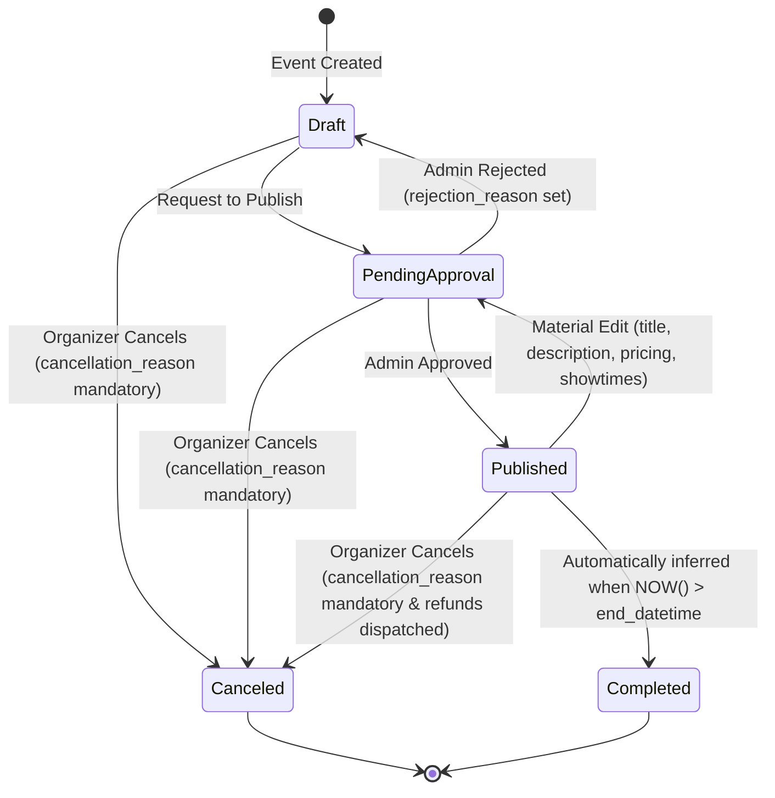

# Phase 1 Data Model: Organizer Event Management

**Feature Branch**: `010-organizer-event-management`  
**Date**: 2026-08-12  
**Spec**: [`spec.md`](file:///D:/HCMUS/NhapMonCongNghePhanMem/Project/source/IntroSE/src/specs/010-organizer-event-management/spec.md)

---

## Entity Schema Definitions

### 1. `OrganizerEvent`

Represents an event owned and managed by an organizer.

| Field Name | Type | Constraints / Attributes | Description |
|---|---|---|---|
| `event_id` | `UUID` / `string` | Primary Key, Required | Unique identifier for the event. |
| `organizer_id` | `UUID` / `string` | Foreign Key, Required, Indexed | ID of the owning organizer (derived from session). |
| `title` | `string` | Length 3–150, Required | Event title (Material Field). |
| `description` | `string` | Required | Detailed description (Material Field). |
| `category` | `string` | Required | Event category code (e.g. `music`, `theatre`, `conference`). |
| `category_label` | `string` | Required | Display label in Vietnamese (e.g. `Âm nhạc`, `Kịch nói`). |
| `banner_url` | `string` | URL, Required | Event poster/banner media asset URL. |
| `venue_name` | `string` | Required | Venue / location name. |
| `venue_address` | `string` | Required | Detailed address. |
| `city` | `string` | Enum (`TP.HCM`, `Hà Nội`, `Đà Nẵng`) | City location. |
| `start_datetime` | `ISO8601 string` | Required | Event start timestamp (Material Field). |
| `end_datetime` | `ISO8601 string` | Required, `> start_datetime` | Event end timestamp (Material Field). |
| `sales_start_datetime`| `ISO8601 string` | Required | Ticket sales opening timestamp. |
| `sales_end_datetime`  | `ISO8601 string` | Required, `<= start_datetime` | Ticket sales closing timestamp. |
| `status` | `enum` | Required | Base DB state: `draft`, `pending_review`, `published`, `canceled`. |
| `computed_status` | `enum` | Read-only / Derived | Computed state: `draft`, `pending_review`, `published`, `canceled`, `completed`. |
| `rejection_reason` | `string` \| `null` | Optional | Explanation if rejected by admin moderation. |
| `cancellation_reason`| `string` \| `null` | Required if status is `canceled` | Reason provided by organizer upon event cancellation. |
| `created_at` | `ISO8601 string` | Required | Timestamp created. |
| `updated_at` | `ISO8601 string` | Required | Timestamp last updated. |

---

### 2. `TicketTier`

Represents inventory and pricing tiers for an event.

| Field Name | Type | Constraints / Attributes | Description |
|---|---|---|---|
| `tier_id` | `UUID` / `string` | Primary Key, Required | Unique identifier for the ticket tier. |
| `event_id` | `UUID` / `string` | Foreign Key, Required, Indexed | Belongs to an `OrganizerEvent`. |
| `name` | `string` | Required | Name of tier (e.g., `Standard`, `VIP`, `Early Bird`). |
| `price_vnd` | `integer` | `>= 0`, Required | Price per ticket in integer VND (No floating point). |
| `capacity` | `integer` | `>= 1`, Required | Total allocated ticket quota for this tier. |
| `sold_count` | `integer` | `>= 0`, Default `0` | Number of tickets sold under this tier. |
| `remaining_count` | `integer` | Computed (`capacity - sold_count`) | Count of remaining buyable tickets. |
| `description` | `string` | Optional | Tier details / perks description. |
| `is_archived` | `boolean` | Default `false` | True if tier was deleted after tickets were sold (UC-26 A3). |

---

### 3. `OrganizerPortfolioSummary` (DTO / View Model)

Aggregated model for the main Organizer Dashboard list view.

| Field Name | Type | Description |
|---|---|---|
| `event_id` | `string` | Event identifier. |
| `organizer_id` | `string` | Owner organizer ID. |
| `title` | `string` | Event title. |
| `banner_url` | `string` | Banner URL. |
| `status` | `string` | Computed status (`draft`, `pending_review`, `published`, `canceled`, `completed`). |
| `start_datetime` | `string` | Event start date. |
| `end_datetime` | `string` | Event end date. |
| `location_name` | `string` | Venue name + city. |
| `total_capacity` | `integer` | Sum of all active tier capacities. |
| `sold_tickets` | `integer` | Total tickets sold across all tiers. |
| `remaining_tickets` | `integer` | Total remaining inventory. |
| `total_revenue_vnd` | `integer` | Sum of `(sold_count * price_vnd)` across tiers. |

---

### 4. `EventCancellationAuditRecord`

Immutable audit log entry created when an event is canceled by an organizer.

| Field Name | Type | Constraints | Description |
|---|---|---|---|
| `cancellation_id` | `UUID` / `string` | Primary Key | Unique audit log ID. |
| `event_id` | `UUID` / `string` | Foreign Key | ID of canceled event. |
| `organizer_id` | `UUID` / `string` | Foreign Key | ID of organizer initiating cancellation. |
| `canceled_at` | `ISO8601 string` | Required | Timestamp of cancellation. |
| `reason` | `string` | Required, Non-empty | Mandatory cancellation reason. |
| `tickets_affected_count` | `integer` | `>= 0` | Total sold tickets voided by cancellation. |
| `total_refund_amount_vnd` | `integer` | `>= 0` | Gross store-credit wallet refund amount dispatched. |

---

## State Transition Diagram

---

## Validation & Business Rules

1. **Identity Scoping**:
   - `organizer_id` MUST be verified against `req.user.id`. Requests targeting events with `organizer_id != req.user.id` MUST return `403 Forbidden` or `404 Not Found`.

2. **Material Field Modification Rule (UC-24 A6)**:
   - If `status == 'published'` and payload modifies `title`, `description`, `start_datetime`, `end_datetime`, or any `TicketTier.price_vnd`, the server MUST set `status = 'pending_review'`.

3. **Tier Quota Constraint**:
   - For any tier update: `new_capacity >= tier.sold_count`. If `new_capacity < tier.sold_count`, return `400 Bad Request`.

4. **Tier Deletion & Archiving (UC-26 A3)**:
   - Request to delete tier with `sold_count == 0` -> `DELETE FROM ticket_tiers WHERE tier_id = :id`.
   - Request to delete tier with `sold_count > 0` -> `UPDATE ticket_tiers SET is_archived = true WHERE tier_id = :id` (returns `200 OK` with `is_archived: true`).

5. **Event Cancellation Safeguard (UC-25)**:
   - Cancellation requires non-empty `cancellation_reason` (min 5 characters).
   - Cancellation of an event where `computed_status == 'completed'` MUST be rejected with `400 Bad Request` ("Cannot cancel a completed event").
