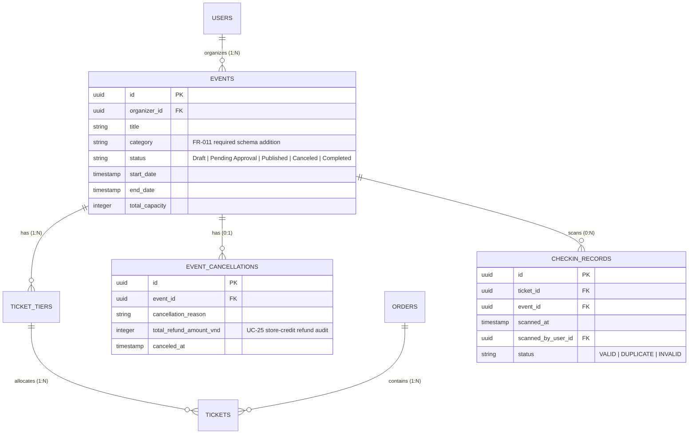

# Data Model: Organizer Business Analytics

**Feature Branch**: `011-organizer-business-analytics`
**Date**: 2026-08-13
**Spec**: [spec.md](file:///D:/HCMUS/NhapMonCongNghePhanMem/Project/source/IntroSE/src/specs/011-organizer-business-analytics/spec.md)

## Entity Relationship & Schema Specifications



---

## Analytical Entities & DTO Definitions

### 1. `OrganizerAnalyticsOverview`
Represents high-level KPI card figures for the selected scope.

```typescript
export interface OrganizerAnalyticsOverview {
  gross_revenue_vnd: number;        // Total VND gross revenue (integer)
  total_refund_amount_vnd: number;  // Total store-credit refund amount (integer)
  net_revenue_vnd: number;          // gross_revenue_vnd - total_refund_amount_vnd (integer)
  total_tickets_sold: number;       // Count of tickets sold
  total_capacity: number;           // Combined allocation capacity
  capacity_fill_rate: number;       // Percentage fill rate (0.0 to 100.0)
  event_counts_by_status: {
    draft: number;
    pending_approval: number;
    published: number;
    canceled: number;
    completed: number;
  };
  period_comparison: {
    gross_revenue_change_pct: number; // e.g. +12.5 or -5.0
    tickets_sold_change_pct: number;
    net_revenue_change_pct: number;
  };
}
```

---

### 2. `TimeSeriesSalesPoint`
Single temporal data point for line/area charts.

```typescript
export interface TimeSeriesSalesPoint {
  date: string;                       // YYYY-MM-DD
  label: string;                      // Display label e.g. "12/08"
  current_revenue_vnd: number;        // Current period revenue (VND integer)
  current_tickets_sold: number;       // Current period tickets sold
  previous_revenue_vnd: number;       // Prior equivalent period revenue (VND integer)
  previous_tickets_sold: number;      // Prior equivalent period tickets sold
}
```

---

### 3. `EventRevenueRankingItem`
Top events ranking item for bar charts.

```typescript
export interface EventRevenueRankingItem {
  event_id: string;
  event_title: string;
  category: string;
  status: "Draft" | "Pending Approval" | "Published" | "Canceled" | "Completed";
  gross_revenue_vnd: number;
  tickets_sold: number;
  total_capacity: number;
  fill_percentage: number;
}
```

---

### 4. `RevenueBreakdown` (Tier & Category)

```typescript
export interface TierRevenueBreakdownItem {
  tier_name: string;          // e.g. "VIP", "Standard", "Early Bird"
  revenue_vnd: number;        // Total VND integer
  tickets_sold: number;
  percentage_share: number;   // 0.0 - 100.0
}

export interface CategoryRevenueBreakdownItem {
  category: string;           // e.g. "Music", "Workshop", "Sports"
  revenue_vnd: number;        // Total VND integer
  tickets_sold: number;
  percentage_share: number;   // 0.0 - 100.0
}
```

---

### 5. `SoonestEventCapacity`
Data payload for the soonest upcoming event gauge chart.

```typescript
export interface SoonestEventCapacity {
  has_upcoming_event: boolean;
  event_id?: string;
  event_title?: string;
  category?: string;
  start_date?: string;         // ISO timestamp
  sold_tickets?: number;
  total_capacity?: number;
  fill_percentage?: number;    // 0.0 - 100.0
}
```

---

### 6. `TransactionAuditRecord`
Recent transaction item for the audit table.

```typescript
export interface TransactionAuditRecord {
  order_id: string;
  ticket_id: string;
  event_name: string;
  tier_name: string;
  amount_vnd: number;          // VND integer
  purchase_timestamp: string;  // ISO timestamp
  payment_status: "COMPLETED" | "REFUNDED" | "CANCELED";
  refund_amount_vnd: number;   // 0 if no refund
}
```

---

## Schema Migration Specifications

### Migration 011_add_event_category_and_checkin_records.sql

```sql
-- 1. Add category field to events table if missing
ALTER TABLE events 
ADD COLUMN IF NOT EXISTS category VARCHAR(50) NOT NULL DEFAULT 'Khác';

-- 2. Add composite index for organizer analytics queries
CREATE INDEX IF NOT EXISTS idx_events_organizer_status_start 
ON events(organizer_id, status, start_date);

-- 3. Optional P3 extension: checkin_records table
CREATE TABLE IF NOT EXISTS checkin_records (
    id UUID PRIMARY KEY DEFAULT gen_random_uuid(),
    ticket_id UUID NOT NULL REFERENCES tickets(id) ON DELETE CASCADE,
    event_id UUID NOT NULL REFERENCES events(id) ON DELETE CASCADE,
    scanned_at TIMESTAMP WITH TIME ZONE DEFAULT CURRENT_TIMESTAMP,
    scanned_by_user_id UUID NOT NULL REFERENCES users(id),
    status VARCHAR(20) NOT NULL DEFAULT 'VALID',
    CONSTRAINT chk_checkin_status CHECK (status IN ('VALID', 'DUPLICATE', 'INVALID'))
);

CREATE INDEX IF NOT EXISTS idx_checkin_records_event_scanned 
ON checkin_records(event_id, scanned_at);
```
