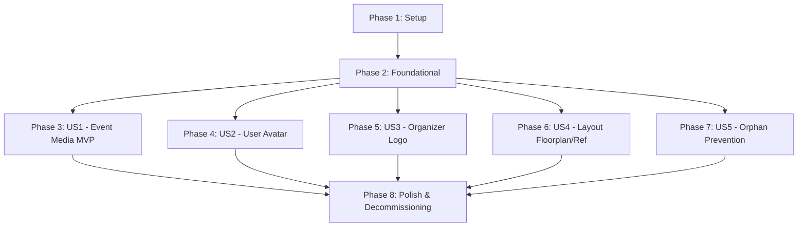

# Tasks: Cloudinary Media Upload Migration & Staged Upload Strategy

**Input**: Design documents from `/specs/012-cloudinary-media-upload/`  
**Prerequisites**: [`plan.md`](file:///D:/HCMUS/NhapMonCongNghePhanMem/Project/source/IntroSE/src/specs/012-cloudinary-media-upload/plan.md), [`spec.md`](file:///D:/HCMUS/NhapMonCongNghePhanMem/Project/source/IntroSE/src/specs/012-cloudinary-media-upload/spec.md), [`research.md`](file:///D:/HCMUS/NhapMonCongNghePhanMem/Project/source/IntroSE/src/specs/012-cloudinary-media-upload/research.md), [`data-model.md`](file:///D:/HCMUS/NhapMonCongNghePhanMem/Project/source/IntroSE/src/specs/012-cloudinary-media-upload/data-model.md), [`contracts/media-upload-api.md`](file:///D:/HCMUS/NhapMonCongNghePhanMem/Project/source/IntroSE/src/specs/012-cloudinary-media-upload/contracts/media-upload-api.md)

## Format: `[ID] [P?] [Story] Description`

- **[P]**: Can run in parallel (different files, no dependencies)
- **[Story]**: Which user story this task belongs to (e.g. US1, US2, US3, US4, US5)
- Exact file paths are specified for every task

---

## Phase 1: Setup (Shared Infrastructure)

**Purpose**: Dependency installation and environment configuration

- [X] T001 Install `cloudinary` SDK dependency in `package.json`
- [X] T002 [P] Document `CLOUDINARY_CLOUD_NAME`, `CLOUDINARY_API_KEY`, and `CLOUDINARY_API_SECRET` in `.env.example`

---

## Phase 2: Foundational (Blocking Prerequisites)

**Purpose**: Core Cloudinary streaming service, media sanitization pipeline, and reusable UI components

**⚠️ CRITICAL**: No user story work can begin until this phase is complete

- [X] T003 [P] Implement Cloudinary client service with streaming upload and deletion helpers in `server/src/services/cloudinary.ts`
- [X] T004 [P] Create unified magic-byte inspection, SVG sanitization, EXIF stripping, and WebP conversion utility in `server/src/modules/media/sanitizer.ts`
- [X] T005 [P] Define `StagedMedia` interfaces and updated entity media types in `src/types.ts`
- [X] T006 [P] Implement reusable staged media upload component with local preview and drag-and-drop in `src/components/common/MediaDropzone.tsx`
- [X] T007 Implement legacy disk asset migration CLI script in `server/src/db/migrate-cloudinary.ts` and register script in `package.json`

**Checkpoint**: Foundation ready — user story implementation can now proceed in parallel.

---

## Phase 3: User Story 1 - Event Banner & Trailer Video Upload (Priority: P1) 🎯 MVP

**Goal**: Enable organizers to stage, preview, and upload event banners (mandatory) and video trailers (optional) directly to Cloudinary (`tixhub/events/{event_id}/...`) on confirmed event creation/update.

**Independent Test**: Create an event with a selected banner and trailer video; verify instant preview, confirm submit uploads to Cloudinary, and check event displays media properly from CDN URL.

### Tests for User Story 1
- [X] T008 [P] [US1] Create integration tests for event banner and trailer upload streaming in `server/tests/media/eventMedia.test.ts`

### Implementation for User Story 1
- [X] T009 [US1] Implement event banner and trailer multipart upload handlers in `server/src/modules/media/eventMedia.ts` and `server/src/modules/studio/studio.routes.ts`
- [X] T010 [US1] Update event client service to support staged media submission and trailer deletion in `src/services/catalogClient.ts` and `src/services/organizerClient.ts`
- [X] T011 [US1] Integrate `MediaDropzone` with instant staging preview into `src/components/organizer/EditEventForm.tsx` and `src/pages/organizer/OrganizerEventsPage.tsx`
- [X] T012 [US1] Update `src/components/organizer/EventCard.tsx` and `src/components/TrailerPanel.tsx` to consume and stream Cloudinary banner/trailer URLs

**Checkpoint**: User Story 1 is fully functional and testable independently.

---

## Phase 4: User Story 2 - User Profile Avatar Upload (Priority: P1)

**Goal**: Migrate user avatar uploads from local VPS disk to Cloudinary (`tixhub/users/{user_id}/avatar/{user_id}`) with deterministic overwrites.

**Independent Test**: Upload an avatar in Account Settings, confirm instant preview, save, and verify avatar renders from Cloudinary CDN across reloads.

### Tests for User Story 2
- [X] T013 [P] [US2] Update avatar integration tests in `server/tests/auth/avatar.test.ts` to assert Cloudinary upload streaming and zero local disk writes

### Implementation for User Story 2
- [X] T014 [US2] Refactor avatar processing in `server/src/modules/auth/avatar.ts` to stream directly to Cloudinary using user ID as public ID
- [X] T015 [US2] Update avatar staging and upload trigger in `src/services/authClient.ts` and `src/components/account/ProfileSection.tsx`

**Checkpoint**: User Stories 1 and 2 work independently without local disk dependencies.

---

## Phase 5: User Story 3 - Organizer Application Logo Upload (Priority: P2)

**Goal**: Replace text URL input in organizer application with direct staged file upload stored in Cloudinary (`tixhub/organizers/{organizer_id}/logo/{organizer_id}`).

**Independent Test**: Submit an organizer application with a local logo file; verify pending application in admin queue displays the logo from Cloudinary CDN.

### Tests for User Story 3
- [X] T016 [P] [US3] Add integration tests for organizer logo upload and streaming in `server/tests/auth/organizerLogo.test.ts`

### Implementation for User Story 3
- [X] T017 [US3] Update organizer application route in `server/src/modules/auth/organizer.ts` and `server/src/modules/auth/auth.routes.ts` to handle multipart logo streaming
- [X] T018 [US3] Replace text URL input with `MediaDropzone` in `src/components/account/OrganizerSection.tsx` and `src/services/authClient.ts`

**Checkpoint**: Organizer application logo upload operates via Cloudinary.

---

## Phase 6: User Story 4 - Venue Seat Map Floor Plan & Reference Chart Upload (Priority: P2)

**Goal**: Migrate seat map floor plans and reference tracing charts to Cloudinary (`tixhub/layouts/{layout_id}/...`) with active cloud deletion on removal.

**Independent Test**: Upload a floor plan and tracing reference image in Seat Map Designer, save layout, confirm rendering from Cloudinary, and verify cloud asset deletion when removed.

### Tests for User Story 4
- [X] T019 [P] [US4] Update floorplan and reference chart integration tests in `server/tests/media/layoutMedia.test.ts` to assert Cloudinary storage and `uploader.destroy` calls

### Implementation for User Story 4
- [X] T020 [US4] Refactor `server/src/modules/seatmap/floorplan.ts` and `server/src/modules/seatmap/seatmap.routes.ts` to stream floor plans and reference charts to Cloudinary and invoke deletion on removal
- [X] T021 [US4] Update `src/components/seatmap/FloorPlanPanel.tsx` and `ReferenceChartPanel.tsx` to stage and render Cloudinary floor plan and reference chart URLs with `MediaDropzone`

**Checkpoint**: Seat Map Designer operates completely on Cloudinary background layers.

---

## Phase 7: User Story 5 - Form Abandonment & Orphan Prevention (Priority: P3)

**Goal**: Guarantee 0 orphaned Cloudinary assets and zero premature uploads when users cancel or navigate away from media forms.

**Independent Test**: Select files in event or layout forms, close the modal/tab, and verify via network inspection that 0 bytes were sent to Cloudinary and object URLs were revoked.

### Tests for User Story 5
- [X] T022 [P] [US5] Add unit/integration tests in `server/tests/media/cleanup.test.ts` verifying safe cleanup and Cloudinary deletion
- [X] T023 [US5] Implement unified cleanup lifecycle and disabled uploading submit button state across all media creation/edit modals

**Checkpoint**: Form abandonment guarantees zero orphaned assets across all 6 upload workflows.

---

## Phase 8: Polish & Decommissioning

**Purpose**: Decommission local disk static serving, update deployment configs, and run full test suites

- [X] T024 [P] Remove Express static `/uploads/` route from `server/src/app.ts`
- [X] T025 [P] Create full Cloudinary documentation in `docs/CLOUDINARY_ARCHITECTURE.md`
- [X] T026 Validation across all 6 upload and streaming workflows

---

## Dependencies & Execution Order

### Phase Dependencies

### Parallel Opportunities

- **Phase 1**: `T002` can run in parallel with `T001`.
- **Phase 2**: `T003`, `T004`, `T005`, and `T006` can be implemented concurrently in parallel files.
- **Phase 3–7**: Once Phase 2 is complete, User Stories 1, 2, 3, 4, and 5 can be implemented and tested concurrently by different developers.
- **Within Each Story**: Test tasks marked `[P]` should be written and confirmed to fail before implementation.

---

## Implementation Strategy

### MVP First (Phase 1 → Phase 2 → User Story 1)

1. Complete **Phase 1** (Setup) & **Phase 2** (Foundational streaming service and `MediaDropzone`).
2. Implement **User Story 1** (Event Banner & Trailer upload).
3. **Validate**: Test creating and editing events with staged file uploads.
4. **Deploy MVP**: Event media management is fully operational on Cloudinary.

### Incremental Rollout

1. **Increment 2**: Add User Story 2 (Avatar migration) & User Story 3 (Organizer Logo).
2. **Increment 3**: Add User Story 4 (Floor plans & reference charts) & User Story 5 (Cleanup validation).
3. **Final Increment**: Run migration script (`npm run db:migrate-cloudinary`), remove `/uploads/` static serving, and update Nginx configs.
