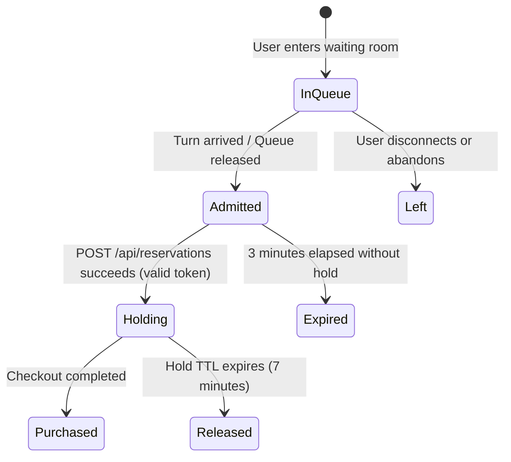
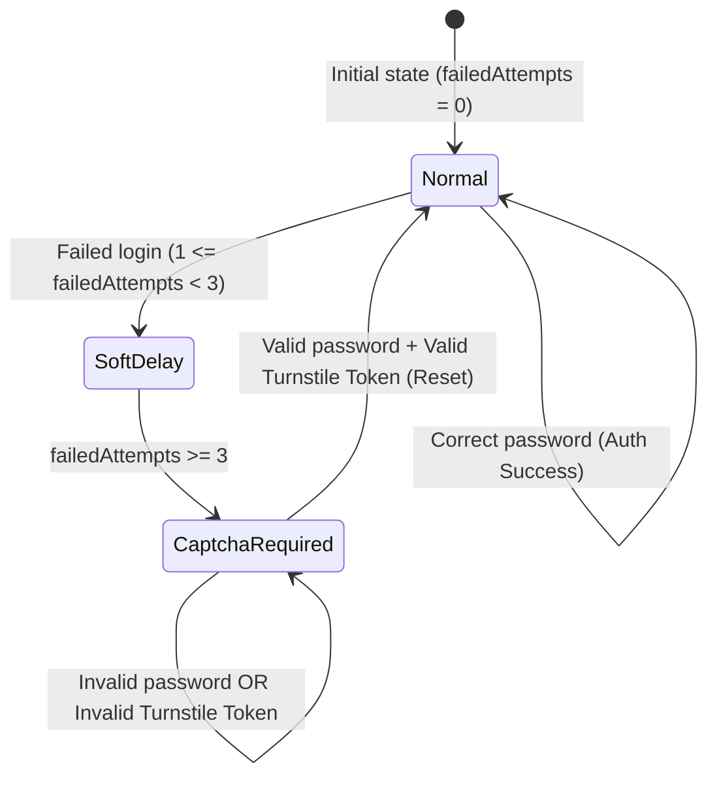

# Phase 1: Data Model & State Transitions

**Feature**: Comprehensive Anti-Bot Protection Suite  
**Branch**: `013-anti-bot-protection`  
**Date**: 2026-08-20  

---

## 1. Database Schema Changes & `InitDB.sql` Synchronization

### 1.1 `events` Table Modification
Add the high-demand flag to enable the Virtual Waiting Room and mandatory reservation CAPTCHA per event.

```sql
-- Schema addition in PostgreSQL & InitDB.sql
ALTER TABLE "public"."events" 
  ADD COLUMN IF NOT EXISTS "is_high_demand" BOOLEAN NOT NULL DEFAULT FALSE;

-- Index for rapid filtering of high-demand events
CREATE INDEX IF NOT EXISTS "idx_events_is_high_demand" 
  ON "public"."events"("is_high_demand") 
  WHERE "is_high_demand" = TRUE;
```

### 1.2 `showtimes` Table Granular Override (Optional / Fallback)
```sql
-- Allows granular activation per specific showtime date/slot if needed
ALTER TABLE "public"."showtimes"
  ADD COLUMN IF NOT EXISTS "is_high_demand" BOOLEAN DEFAULT NULL;
```
*Note*: If `showtimes.is_high_demand IS NULL`, the showtime inherits `events.is_high_demand`.

### 1.3 `InitDB.sql` Update Checklist
- Update `CREATE TABLE "public"."events"` in [`data_base/InitDB.sql`](file:///D:/HCMUS/NhapMonCongNghePhanMem/Project/source/IntroSE/data_base/InitDB.sql) to include `"is_high_demand" bool NOT NULL DEFAULT false`.
- Update Section (6) Indexes to include `"idx_events_is_high_demand"`.
- Verify full execution of `InitDB.sql` runs cleanly without syntax errors.

---

## 2. In-Memory Entities & Security State Models

### 2.1 Interaction Timing Ticket (`InteractionTimingTicket`)
Stateless cryptographic token issued on seat map view and verified on seat hold submission.

```typescript
export interface InteractionTimingPayload {
  showtimeId: number;
  viewTimestamp: number; // Unix timestamp in milliseconds
}

export interface InteractionTimingTicket {
  payload: InteractionTimingPayload;
  signature: string; // HMAC-SHA256 hex string
}
```

**Validation Invariants**:
- `signature === hmacSha256(showtimeId + ":" + viewTimestamp, SECRET)`
- `Date.now() - viewTimestamp >= 1500` (Minimum 1.5s human reaction time)
- `Date.now() - viewTimestamp <= 1800000` (Max 30 minutes ticket validity window)

---

### 2.2 Virtual Waiting Room Queue Token (`QueueToken`)
Token representing an attendee's admitted turn in the queue for a high-demand showtime.

```typescript
export interface QueueTokenPayload {
  tokenId: string;      // UUIDv4
  userId: number;       // Authenticated User ID
  showtimeId: number;   // Target Showtime ID
  issuedAt: number;     // Admission timestamp (ms)
  expiresAt: number;    // Admission expiration timestamp (issuedAt + 3 minutes)
}

export interface QueueToken {
  token: string;        // Signed string or serialized JWT/HMAC token
  expiresAt: number;
  showtimeId: number;
  userId: number;
}
```

**State Transitions**:


---

### 2.3 Login Attempt Tracker (`LoginAttemptRecord`)
In-memory sliding tracker for brute-force and credential stuffing prevention.

```typescript
export interface LoginAttemptRecord {
  identifierKey: string;     // Normalized email or phone hash
  ipKey: string;             // Client IP address
  failedAttempts: number;    // Count of consecutive failed attempts
  lastAttemptAt: number;     // Timestamp of most recent attempt
  requireCaptcha: boolean;   // Set to TRUE when failedAttempts >= 3
}
```

**State Transitions**:


---

### 2.4 Registration Throttle Record (`RegistrationThrottleRecord`)
Tracks IP registration frequency with soft CAPTCHA fallback for shared networks.

```typescript
export interface RegistrationThrottleRecord {
  ipKey: string;
  registrationTimestamps: number[]; // Rolling window of registration timestamps in the last 1 hour
  requireInteractiveCaptcha: boolean; // TRUE if registrations in last hour >= 5
}
```

---

### 2.5 Top-Up Concurrency & Throttle Record (`TopupThrottleRecord`)
Tracks wallet top-up initiation limits to prevent seat hold extension exploitation.

```typescript
export interface TopupThrottleRecord {
  userId: number;
  topupTimestamps: number[]; // Rolling window of topup creation timestamps in the last 10 minutes
}
```

**Validation Invariants**:
- Top-up creations in last 10 minutes $\le 5$.
- `SELECT COUNT(*) FROM wallet_topups WHERE user_id = $1 AND status = 'initiated'` $\le 2$.
