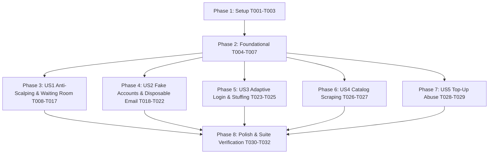

# Tasks: Comprehensive Anti-Bot Protection Suite

**Feature Branch**: `013-anti-bot-protection`  
**Date**: 2026-08-20  
**Spec**: [`specs/013-anti-bot-protection/spec.md`](file:///D:/HCMUS/NhapMonCongNghePhanMem/Project/source/IntroSE/src/specs/013-anti-bot-protection/spec.md)  
**Plan**: [`specs/013-anti-bot-protection/plan.md`](file:///D:/HCMUS/NhapMonCongNghePhanMem/Project/source/IntroSE/src/specs/013-anti-bot-protection/plan.md)  

---

## Phase 1: Setup (Shared Infrastructure)

**Purpose**: Project initialization, environment configuration, and shared types

- [x] T001 Update environment configuration and `.env.example` with `TURNSTILE_SITE_KEY`, `TURNSTILE_SECRET_KEY`, `TURNSTILE_FAIL_OPEN`, and `SERVER_TIMING_SECRET` in `server/src/config.ts` and `.env.example`
- [x] T002 Install dependency `disposable-email-domains` in `package.json`
- [x] T003 [P] Create shared TypeScript anti-bot contracts and token interfaces in `shared/types/botDefense.ts`

---

## Phase 2: Foundational (Blocking Prerequisites)

**Purpose**: Core security services, database schema synchronization, and middleware framework that MUST be complete before user stories

**⚠️ CRITICAL**: All user stories depend on these foundational components

- [x] T004 Update database migration in `server/src/db/migrations/0014_anti_bot_high_demand.sql` and synchronize `data_base/InitDB.sql` with `"is_high_demand"` column and `"idx_events_is_high_demand"` index on `"events"`
- [x] T005 [P] Implement Cloudflare Turnstile token verification service with timeout handling, fail-closed default, and emergency bypass in `server/src/services/turnstile.ts`
- [x] T006 [P] Implement reusable frontend Cloudflare Turnstile widget component with loading and error states in `src/components/common/TurnstileWidget.tsx`
- [x] T007 [P] Implement sliding-window memory rate limiter and security audit logger helpers in `server/src/middleware/rateLimit.ts`

**Checkpoint**: Core verification utilities, DB synchronization, and rate-limiting infrastructure ready.

---

## Phase 3: User Story 1 - Fair Access & Anti-Scalping for High-Demand Drops (Priority: P1) 🎯 MVP

**Goal**: Protect hot ticket drops (Flash Drops) using a Virtual Waiting Room, stateless HMAC behavioral timing verification (≥ 1.5s), and Turnstile CAPTCHA on seat holds.

**Independent Test**: Simulate concurrent rapid hold requests. Verify that requests submitted in < 1.5s or without a verified 3-minute queue token are rejected, while admitted attendees passing timing and CAPTCHA successfully hold seats.

### Tests for User Story 1
- [x] T008 [P] [US1] Write unit and concurrency security tests for HMAC interaction timing verification and waiting room queue admission in `server/tests/security/timingVerification.test.ts` and `server/tests/security/waitingRoom.test.ts`

### Implementation for User Story 1
- [x] T009 [P] [US1] Implement stateless HMAC-SHA256 timing ticket generation and validation service in `server/src/services/timingTicket.ts`
- [x] T010 [P] [US1] Implement in-memory Virtual Waiting Room queue service with randomized priority shuffle and 3-minute admission token management in `server/src/services/waitingRoom.service.ts`
- [x] T011 [US1] Implement Virtual Waiting Room join and status query routes in `server/src/modules/waitingRoom/waitingRoom.routes.ts`
- [x] T012 [US1] Integrate `timingTicket` generation into seat map response in `server/src/modules/catalog/catalog.public.routes.ts`
- [x] T013 [US1] Integrate timing verification (≥ 1.5s), queue token validation, and Turnstile verification into seat hold creation in `server/src/modules/holds/reservations.routes.ts`
- [x] T014 [P] [US1] Implement client-side waiting room polling service and token manager in `src/services/waitingRoomClient.ts`
- [x] T015 [P] [US1] Implement Virtual Waiting Room modal UI component in `src/components/common/WaitingRoomModal.tsx`
- [x] T016 [US1] Integrate timing ticket capturing, waiting room triggers, and Turnstile challenge on hold confirmation in `src/components/seatmap/SeatMapContainer.tsx`
- [x] T017 [P] [US1] Add `is_high_demand` toggle to Organizer Event creation and editing forms in `src/components/organizer/EditEventForm.tsx`

**Checkpoint**: High-demand anti-scalping flow, timing verification, and waiting room are fully testable and operational.

---

## Phase 4: User Story 2 - Automated Fake & Disposable Account Prevention (Priority: P1)

**Goal**: Block automated script registrations, disposable temporary email services, and alias sub-addressing abuse (`+tag`) without requiring SMS OTP.

**Independent Test**: Attempt registering with disposable domains, alias variations of existing emails, missing CAPTCHA tokens, and high-frequency bulk requests. Confirm rejection of abusive requests and successful registration for legitimate users.

### Tests for User Story 2
- [x] T018 [P] [US2] Write unit tests for disposable email blocking, `+tag` alias normalization, and registration soft-challenge rate limits in `server/tests/security/emailSanitization.test.ts`

### Implementation for User Story 2
- [x] T019 [P] [US2] Implement email normalization helper (stripping `+tag` sub-addresses and canonicalizing Gmail/Outlook/Hotmail/Yahoo) in `server/src/modules/auth/identifier.ts`
- [x] T020 [P] [US2] Implement disposable email domain blacklist validation middleware in `server/src/middleware/emailFilter.ts`
- [x] T021 [US2] Update registration route `POST /api/auth/register` to enforce Turnstile verification, disposable email blocking, normalized email uniqueness, and 5–8/hr IP soft challenge in `server/src/modules/auth/auth.routes.ts`
- [x] T022 [US2] Integrate `<TurnstileWidget />` and error handling for disposable email and IP challenge into registration form in `src/components/auth/RegisterModal.tsx`

**Checkpoint**: Mass fake account and disposable email defenses active across registration endpoints and UI.

---

## Phase 5: User Story 3 - Adaptive Defense Against Credential Stuffing (Priority: P2)

**Goal**: Defend against automated credential stuffing and brute-force password guessing via tightened IP limits, progressive delays, and adaptive CAPTCHAs triggered on ≥ 3 failed attempts.

**Independent Test**: Submit 3 consecutive incorrect passwords for an account. Verify that subsequent attempts require solving a Turnstile CAPTCHA and that IP rate limits throttle excessive attempts.

### Tests for User Story 3
- [x] T023 [P] [US3] Write unit tests for login attempt tracking, 15/15min IP rate limits, and 3-failure adaptive CAPTCHA trigger in `server/tests/security/adaptiveLogin.test.ts`

### Implementation for User Story 3
- [x] T024 [US3] Update login route `POST /api/auth/login` to tighten IP rate limit to 15 attempts / 15 min, track consecutive failures, enforce Turnstile CAPTCHA when `failedAttempts >= 3`, and reset counter upon success in `server/src/modules/auth/auth.routes.ts`
- [x] T025 [US3] Update login UI modal in `src/components/auth/LoginModal.tsx` to handle `requireCaptcha: true` response and render `<TurnstileWidget />` dynamically when triggered

**Checkpoint**: Credential stuffing protection active on authentication endpoints.

---

## Phase 6: User Story 4 - Public Inventory & Price Scraping Protection (Priority: P3)

**Goal**: Restrict excessive scraping and polling on public catalog and seat map endpoints via rate limits (30–60 req/min) and short-term caching (5–10s).

**Independent Test**: Send high-frequency concurrent GET requests to catalog and seat map endpoints. Verify rate limit responses beyond thresholds and low-overhead cache serving.

### Tests for User Story 4
- [x] T026 [P] [US4] Write integration tests asserting rate limits (30–60 req/min/IP) and short-term cache headers on catalog endpoints in `server/tests/security/catalogScraping.test.ts`

### Implementation for User Story 4
- [x] T027 [US4] Implement short-term response caching (5–10s TTL) and rate limiting middleware on public catalog routes in `server/src/modules/catalog/catalog.public.routes.ts`

**Checkpoint**: Catalog scraping protection active and caching headers verified.

---

## Phase 7: User Story 5 - Payment Top-Up Abuse & Hold Extension Prevention (Priority: P3)

**Goal**: Prevent malicious bots from spamming top-up requests or creating multiple pending top-up orders to exploit hold grace extensions.

**Independent Test**: Attempt creating more than 2 pending top-up orders simultaneously or generating high-frequency top-up requests. Confirm excess requests are rejected with constraint errors.

### Tests for User Story 5
- [x] T028 [P] [US5] Write unit tests asserting top-up creation rate limiting and max 2 pending top-ups enforcement in `server/tests/security/topupAbuse.test.ts`

### Implementation for User Story 5
- [x] T029 [US5] Update `POST /api/wallet/topups` to enforce 5 top-ups / 10 min rate limit and verify that active `initiated` top-ups $\le 2$ in `server/src/modules/wallet/wallet.routes.ts`

**Checkpoint**: Top-up rate limiting and concurrency cap active.

---

## Phase 8: Polish & Cross-Cutting Concerns

**Purpose**: Database schema verification, end-to-end test suite execution, and security documentation

- [x] T030 Verify database initialization script `data_base/InitDB.sql` executes cleanly and matches current migration schema
- [x] T031 [P] Implement end-to-end security test suite in `server/tests/security/antiBotSuite.test.ts` running all quickstart validation scenarios
- [x] T032 [P] Update system documentation and security configuration guide in `docs/ANTI_BOT_SECURITY.md`

---

## Dependencies & Execution Order

### Story Independence & Parallel Opportunities

1. **Foundational Independence**: Once Phase 2 is completed, **User Story 1 (Anti-Scalping)**, **User Story 2 (Fake Accounts)**, **User Story 3 (Adaptive Login)**, **User Story 4 (Catalog Scraping)**, and **User Story 5 (Top-Up Abuse)** can be implemented and tested completely in parallel by different developers.
2. **Parallel Tasks Within Stories**:
   - In US1: Timing ticket service (`T009`), Waiting room service (`T010`), and Frontend components (`T014`, `T015`, `T017`) can be developed simultaneously.
   - In US2: Email normalization (`T019`), disposable filter (`T020`), and frontend registration modal (`T022`) can be developed simultaneously.
   - In US3: Login backend adaptive gate (`T024`) and frontend login modal (`T025`) can be developed in parallel.

---

## Implementation Strategy & MVP

1. **MVP Scope (Phase 1 to Phase 3)**:
   - Deliver `T001` to `T017` to establish the foundational security infrastructure, Turnstile service, database schema synchronization, and User Story 1 (Anti-Scalping & Virtual Waiting Room).
   - This addresses the single highest-risk vulnerability on ticket release day.
2. **Incremental Delivery (Phases 4 to 7)**:
   - Ship User Story 2 (Fake account prevention) to secure identity registration.
   - Ship User Story 3 (Adaptive credential stuffing defense) to harden logins.
   - Ship User Story 4 & 5 (Scraping and top-up abuse defense).
3. **Verification (Phase 8)**:
   - Execute the unified `data_base/InitDB.sql` verification and end-to-end security test suite.
